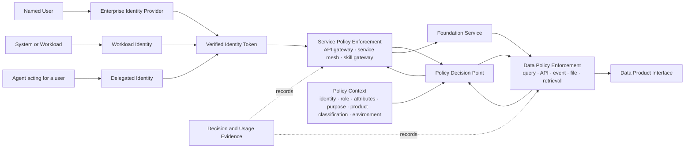
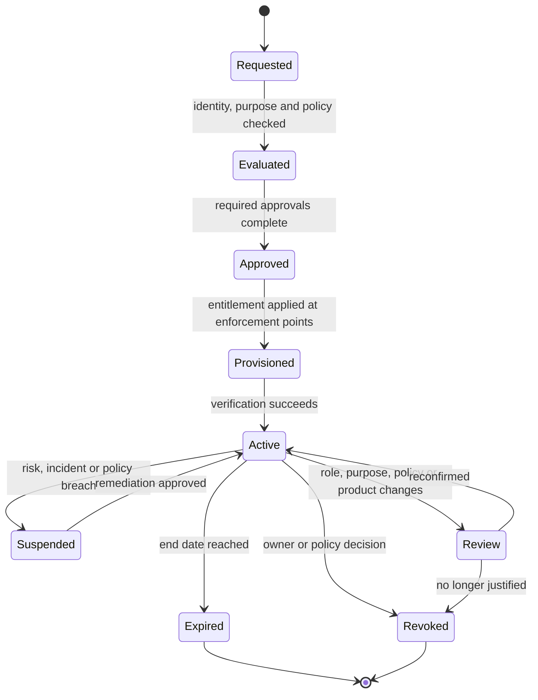

# Access Control Design

Access control protects two different things:

1. **Service access** controls which portal, API, workflow, agent skill, or platform operation an identity may invoke.
2. **Data access** controls which product, interface, rows, columns, records, purposes, and actions that identity may use.

Both controls apply to named users and non-human identities. Passing service authorization never implies data authorization.

## Access Decision Flow

## Identity Types

| Identity | Authentication | Typical Use | Required Rules |
| --- | --- | --- | --- |
| Named user | Enterprise SSO with MFA or step-up authentication. | Portal, CLI, BI, notebooks, approvals, administration. | Personal identity, current employment and team attributes, no shared accounts, user-visible purpose. |
| Workload or system | Short-lived workload credential issued to a registered application, job, service, or model. | Pipelines, APIs, scheduled jobs, applications, platform integrations. | Unique workload identity, owner, environment, allowed services, product purposes, rotation, no embedded secrets. |
| Delegated workload | Workload identity plus verified named-user delegation. | Application or CLI acting for a user. | Preserve both actor and subject; never replace the user with a generic service account. |
| Agent | Registered agent identity plus delegated user or task authority. | Data Service AI Assistant and automated workflows. | Bound agent, skill, user, purpose, autonomy, approval, product scope, and task id. |
| External recipient | Federated user or workload identity from an approved trust domain. | Supplier, customer, partner, or cross-company access. | Trust agreement, recipient mapping, minimized scope, expiry, revocation, and enhanced audit. |

## Two Authorization Layers

### Service Authorization

Service authorization answers: **May this identity invoke this operation?**

| Control | Examples |
| --- | --- |
| Resource | Portal workflow, API route, CLI operation, agent skill, admin function. |
| Action | Read, search, draft, submit, approve, deploy, revoke, administer. |
| Decision inputs | Identity type, role, team, environment, delegated authority, risk, device or workload posture. |
| Enforcement points | Portal backend, API gateway, service mesh, workflow engine, agent or skill gateway. |
| Result | Permit, deny, require step-up, require approval, reduce scope, or apply rate and budget limits. |

### Data Authorization

Data authorization answers: **May this identity use this product data for this purpose and at this level of detail?**

| Control | Examples |
| --- | --- |
| Resource | Product, contract version, table, API, event topic, file package, feature view, retrieval index. |
| Action | Discover metadata, read, query, subscribe, export, share, train, retrieve, update, delete. |
| Decision inputs | Product classification, consumer identity, team, purpose, agreement, geography, time, environment, row and field attributes. |
| Enforcement points | Query gateway, database, semantic layer, API, event broker, object access gateway, feature service, context or retrieval gateway. |
| Obligations | Row filter, column mask, tokenization, aggregation, watermarking, output limit, logging, retention, or expiry. |

## Decision Model

Every decision evaluates this tuple:

`subject + actor + action + resource + purpose + context + policy version`

| Element | Meaning |
| --- | --- |
| Subject | Named user, workload, external recipient, or delegated user receiving access. |
| Actor | Identity actually making the call, such as an application or agent. Same as subject for direct access. |
| Action | Requested service operation and data operation. |
| Resource | Service endpoint plus product and interface identifiers. |
| Purpose | Approved business, analytics, sharing, training, retrieval, or evaluation purpose. |
| Context | Team, role, attributes, environment, region, time, risk, agreement, and classification. |
| Policy version | Exact policy bundle used to make the decision. |

Role-based access may grant a basic service capability. Attribute- and purpose-based policy must narrow access to the applicable data. Roles alone are insufficient for sensitive product data.

## Named User and System Examples

| Scenario | Service Decision | Data Decision |
| --- | --- | --- |
| Analyst opens a dashboard | User may invoke the BI query service. | User's team and approved purpose determine products, rows, and masked columns. |
| Application calls a product API | Registered production workload may invoke the API operation. | Application purpose and product agreement determine fields, rate, and expiry. |
| Pipeline reads source-aligned data | Pipeline identity may execute the approved workload. | Input port contract, environment, and product scope restrict datasets and actions. |
| Assistant explains product health | Agent and `product.explain` skill may call read APIs for the user. | Context is filtered to products and metadata visible to the delegated user. |
| Assistant submits a sharing request | Skill may submit only after explicit confirmation and step-up where required. | Recipient, purpose, minimized fields, duration, and legal basis are independently evaluated. |

## Entitlement Lifecycle

Access is never permanent by default. Every entitlement has an owner, subject, purpose, product or service scope, environment, start time, expiry, review trigger, and revocation path.

## Authority Boundaries

| Component | Owns | Does Not Own |
| --- | --- | --- |
| Identity provider | Authentication, named-user identity, groups, core attributes, MFA. | Product-specific authorization. |
| Workload identity service | Application and runtime identities, credential issuance, trust domains. | Business purpose approval. |
| Policy administration | Versioned policies, tests, approval, publication. | Runtime enforcement or entitlement state. |
| Policy decision point | Consistent decisions and obligations from current context. | Authentication or direct data serving. |
| Service enforcement point | API or operation authorization, rate, step-up, task limits. | Row and field policy unless it serves the data itself. |
| Data enforcement point | Product, row, column, record, purpose, and output controls. | Identity lifecycle. |
| Entitlement service | Approved grants, expiry, review, suspension, revocation, reconciliation. | Canonical product or identity metadata. |
| Data Service Portal | Requests, approvals, status, evidence, and user experience. | Acting as the policy engine or entitlement authority. |

## Done Criteria

- Named users, workloads, delegated applications, agents, and external recipients use distinct identities.
- Every request evaluates service permission and data permission separately.
- Actor and subject are retained when a system or agent acts for a user.
- Data decisions include product, interface, action, purpose, classification, environment, and policy version.
- Obligations such as masking, row filtering, aggregation, output limits, and expiry are enforced at the data boundary.
- Entitlements are time-bound, reviewable, reconcilable, and revocable.
- Deny is the default when identity, purpose, agreement, policy context, or enforcement capability is missing.
- Audit and OpenTelemetry evidence correlate identity, decision, service operation, product, purpose, and outcome.

  <strong>Next:</strong> apply the Access Control Standard to every service and product interface.

