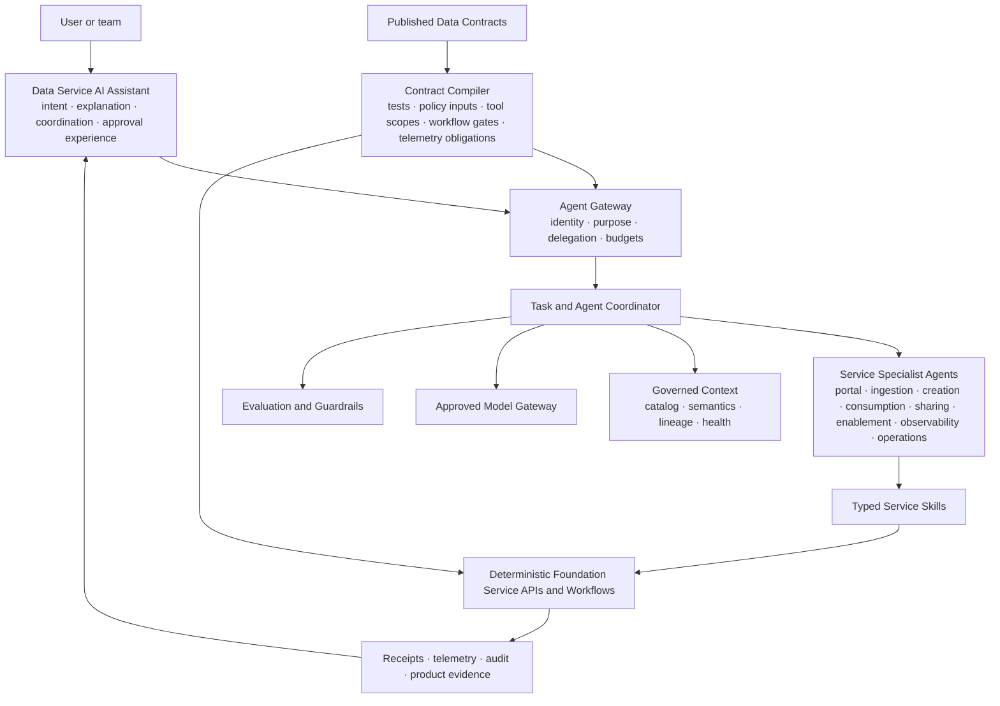
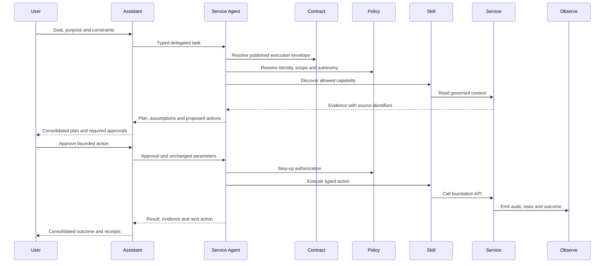

# Agentic Data Service Design

Agentic data service design uses AI to help users understand, plan, and execute governed data work across every foundation service. Agents accelerate service outcomes; they do not bypass contracts, policy, identity, product go-live controls, or audit.

## Design Reasoning

<small>Context</small>
Users need assistance across specialized services, policies, contracts, evidence, and long-running workflows.

<small>Forces</small>
Speed and autonomy must coexist with deterministic authority, safety, explainability, revocation, and human accountability.

<small>Decision</small>
Let one assistant coordinate service-owned specialist agents through typed skills bounded by identity, purpose, contracts, policy, and approval gates.

<small>Consequences</small>
Automation becomes composable, but skill governance, evaluation, traceability, fallback, and suspension become mandatory capabilities.

<small>Verification</small>
Test task scope, tool permissions, delegation, approval, refusal, evidence, recovery, and deterministic fallback for each skill.

## Design Intent

Every foundation service is **agentic by design**:

- The service exposes typed, discoverable skills over its stable APIs and workflows.
- A service-owned specialist agent can interpret goals, gather evidence, plan, and execute within a declared authority boundary.
- The Data Service AI Assistant provides the coherent user experience and coordinates specialist agents.
- Published data contracts declare the allowed outcome, scope, obligations, service levels, lifecycle, and evidence.
- Deterministic policy and service controls decide whether an action may run and whether its result is accepted.

Agentic does not mean autonomous by default. It means each service can support progressively greater autonomy without changing its ownership, contract, control, or operational model.

## Core Concepts

| Concept | Responsibility | Must Not Become |
| --- | --- | --- |
| LLM | Interpret intent, reason over context, generate structured proposals. | Policy authority or system of record. |
| Agent | Pursue a bounded goal through an observable control loop. | Unrestricted autonomous administrator. |
| Skill | Reusable capability with typed input, output, permissions, risk, and tests. | A prompt with hidden side effects. |
| Tool | Executable adapter to a foundation API or approved runtime. | Direct, ungoverned database or infrastructure access. |
| Assistant | User-facing composition of agents, skills, context, and approvals. | A second portal or duplicated control plane. |
| Workflow | Deterministic orchestration for approvals, state, retries, and compensation. | Probabilistic agent reasoning. |

Use deterministic workflows for known business processes. Use an agent where intent, evidence gathering, interpretation, or adaptive planning adds value.

## Multi-Agent Architecture

The assistant coordinates the user goal; service agents remain owned with their services. Agents collaborate through typed tasks and artifacts, while state transitions and side effects occur only through deterministic service interfaces.

## Agent Gateway

The Agent Gateway is the single policy-enforced entry point for assistant and agent execution. It provides:

- Authenticated user and workload identity.
- Purpose, tenant, domain, product, and conversation context.
- Agent and skill discovery.
- Model routing and approved model profiles.
- Tool authorization, rate limits, budgets, and timeouts.
- Human approval and step-up authorization.
- Trace, audit, evaluation, and cost correlation.

Agents call foundation service APIs through the gateway. They do not receive broad platform credentials or unrestricted network access.

## Service Specialist Agents

| Foundation Service | Specialist Agent Responsibility | Declarative Boundary | Suitable Autonomous Work |
| --- | --- | --- | --- |
| Data Service Portal | Compose journeys, explain state, collect intent, and present approvals and evidence. | User task, current journey, identity, and applicable contract. | Read, guide, and maintain user-visible task state. |
| Data Service AI Assistant | Decompose goals, select agents and skills, coordinate tasks, and synthesize results. | Delegated user authority, task budget, agent manifests, and approval policy. | Explain, recommend, draft, and coordinate approved tasks. |
| Data Ingestion | Prepare and operate source onboarding and source-aligned delivery. | Source System Ingestion Contract. | Profile, validate, reconcile, quarantine, replay, and recover within published limits. |
| Data Product Creation | Build, test, release, change, and retire domain-owned products. | Data Product Creation Contract and product workload. | Build, test, evaluate gates, deploy to pre-approved environments, and roll back safely. |
| Data Consumption | Resolve products and fulfill purpose-bound access. | Data Product Consumption Contract. | Select conformant ports and adapters, enforce obligations, issue receipts, renew, and revoke. |
| Data Sharing | Prepare and operate controlled recipient exchange. | Data Product Consumption Contract with sharing clauses. | Minimize packages, test delivery, monitor expiry, and revoke; new external release requires approval. |
| Platform Enablement | Provision and reconcile shared resources and control bindings. | Approved service request, workload, policy, and resource profile. | Provision standard resources, reconcile drift, rotate, recover, and deprovision within policy. |
| Data Observability | Correlate system and product signals and explain impact. | Telemetry profile, product SLOs, evidence policy, and incident thresholds. | Detect, correlate, diagnose, alert, and prepare evidence without changing source records. |
| Data Foundation Operations | Coordinate support, incidents, changes, recovery, and improvement. | Approved runbook, change policy, responder authority, and recovery criteria. | Triage, route, communicate, execute pre-approved recovery, and verify outcomes. |

A cross-service data-contract specialist may help author, compare, and compile data contracts, but the accountable data-contract owners approve them and the target services enforce them.

Start with the Data Service AI Assistant coordinating in-process specialist agents and skills. Use remote agents only when separate ownership, scaling, security boundaries, or long-running work justify an independent runtime.

## Data-Contract-Driven Autonomy

A published data contract is the declarative execution envelope between accountable users, products, consumers, and services. It is compiled into machine-enforceable controls; it is not interpreted freely by an LLM at runtime.

| Contract Declaration | Compiled Runtime Control |
| --- | --- |
| Product, source, consumer, recipient, agent, and workload identities | Resolved resource and subject bindings. |
| Purpose, valid use, prohibited use, scope, and selected port | Policy inputs, field and row scope, tool allowlist, and parameter limits. |
| Schema, semantics, quality, and compatibility | Validation suites, compatibility checks, and release gates. |
| Lifecycle state, approvals, effective time, and expiry | Workflow gates, autonomy ceiling, scheduling, renewal, and revocation. |
| SLOs, support, lineage, observability, and evidence | Telemetry obligations, alerts, receipts, runbook routing, and acceptance checks. |

Runtime permission is always the intersection of **authenticated identity + delegated authority + published contract + current policy + lifecycle state + registered skill**. A contract cannot grant rights that policy denies, and an agent cannot widen a contract through reasoning.

Within that intersection, an agent may execute pre-approved, reversible operations autonomously. A new contract, materially changed purpose, wider data scope, external disclosure, product go-live, privileged change, accepted exception, or irreversible action requires the applicable human or deterministic approval gate.

## Autonomy Levels

| Level | Agent Behavior | Example |
| --- | --- | --- |
| A0 Explain | Read and explain trusted evidence. | Explain why a product is not AI-ready. |
| A1 Recommend | Propose options without changing state. | Recommend an ingestion pattern. |
| A2 Draft | Create an editable artifact or workflow draft. | Draft a contract or access request. |
| A3 Confirmed action | Execute an approved, reversible action after explicit confirmation. | Submit a product for review. |
| A4 Bounded automation | Execute pre-approved low-risk actions within policy and budget. | Re-run a failed validation check. |

Irreversible, externally visible, privileged, high-cost, or legally significant actions require human approval regardless of agent maturity.

## Agent Control Loop

## Governed Context

Agent context is assembled at request time and filtered before it reaches the model.

| Context | Required Binding |
| --- | --- |
| User | Identity, roles, team, domain, approved purpose. |
| Product | Product id, version, lifecycle, owner, interfaces. |
| Contract | Contract id, version, permissions, quality, SLO and compatibility. |
| Data | Snapshot or index version, classification, lineage, freshness and quality. |
| Policy | Applicable rules, decision, obligations and expiry. |
| Runtime | Environment, correlation id, trace id, budget and deadline. |

Retrieved content is untrusted input. Separate system instructions, user intent, retrieved evidence, tool descriptions, and tool results so content cannot silently redefine agent goals or permissions.

## Memory Model

| Memory Type | Content | Rule |
| --- | --- | --- |
| Conversation | Current task state and user-visible messages. | Short lived and access controlled. |
| Working | Plan, intermediate structured results, tool receipts. | Bound to agent run and trace. |
| User preference | Saved products, display preferences, recurring interests. | Explicit, editable, and deletable. |
| Organizational | Approved patterns, definitions, policies, examples. | Versioned authoritative source, not learned chat memory. |

Do not store secrets, unrestricted retrieved data, hidden policy decisions, or unreviewed model output as durable memory.

## Open Protocol Profile

- Publish foundation service interfaces through OpenAPI or AsyncAPI.
- MCP may expose approved resources, prompts, and tools to compatible assistants.
- A2A may be used for independently operated service agents that require discovery, delegated tasks, durable status, and artifact exchange.
- Protocol adapters do not replace Data Product Creation Contracts, policy enforcement, agent identity, or audit.
- Use OpenTelemetry GenAI conventions and foundation identifiers to correlate model calls, retrieval, agent runs, tools, products, contracts, users, and purpose.

## Maturity Test

The foundation is agentic only when:

- Agents use authenticated identity and purpose-bound permissions.
- Every foundation service publishes typed agent skills and names an accountable service-agent owner.
- The Data Service AI Assistant can coordinate specialist agents without becoming the authority for their service state.
- Published contracts compile into policy inputs, tool scopes, workflow gates, validation, and telemetry obligations.
- Skills are discoverable, typed, versioned, tested, and independently authorized.
- High-impact actions show an independently generated approval summary.
- Every answer distinguishes sourced facts, inference, assumptions, and proposed actions.
- Every tool call is linked to agent, skill, model, user, product, contract, purpose, trace, policy decision, and outcome.
- Evaluations cover task success, grounding, policy compliance, tool selection, safety, latency, and cost.
- A deterministic workflow can resume, retry, compensate, or stop agent actions safely.
