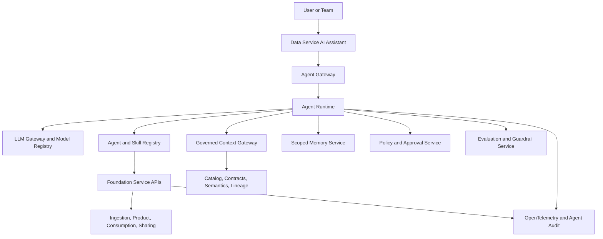
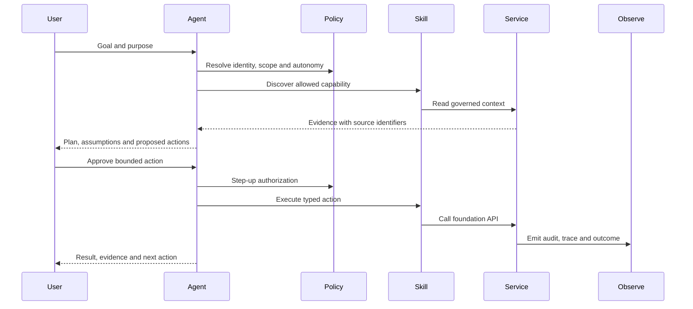

# Agentic Data Foundation

An agentic data foundation uses AI to help users understand, plan, and execute governed data work. Agents accelerate foundation services; they do not bypass contracts, policy, identity, product go-live controls, or audit.

## Core Concepts

| Concept | Responsibility | Must Not Become |
| --- | --- | --- |
| LLM | Interpret intent, reason over context, generate structured proposals. | Policy authority or system of record. |
| Agent | Pursue a bounded goal through an observable control loop. | Unrestricted autonomous administrator. |
| Skill | Reusable capability with typed input, output, permissions, risk, and tests. | A prompt with hidden side effects. |
| Tool | Executable adapter to a foundation API or approved runtime. | Direct, ungoverned database or infrastructure access. |
| Assistant | User-facing composition of agents, skills, context, and approvals. | A second portal or duplicated control plane. |
| Workflow | Deterministic orchestration for approvals, state, retries, and compensation. | Probabilistic agent reasoning. |

Use deterministic workflows for known business processes. Use an agent where intent, evidence gathering, interpretation, or adaptive planning adds value.

## Target Architecture

## Agent Gateway

The Agent Gateway is the single policy-enforced entry point for assistant and agent execution. It provides:

- Authenticated user and workload identity.
- Purpose, tenant, domain, product, and conversation context.
- Agent and skill discovery.
- Model routing and approved model profiles.
- Tool authorization, rate limits, budgets, and timeouts.
- Human approval and step-up authorization.
- Trace, audit, evaluation, and cost correlation.

Agents call foundation service APIs through the gateway. They do not receive broad platform credentials or unrestricted network access.

## Foundation Agents

| Agent | Primary Goal | Example Skills | Default Autonomy |
| --- | --- | --- | --- |
| Discovery assistant | Find and compare fit-for-purpose products. | Search catalog, explain contract, compare health, identify owner. | Read only. |
| Source onboarding agent | Prepare a complete source onboarding plan. | Profile source, draft source contract, classify, select ingestion pattern. | Draft with approval. |
| Contract agent | Author and evolve executable contracts. | Generate ODCS draft, compare versions, detect breaking changes, notify consumers. | Draft with approval. |
| Product steward agent | Improve product readiness and lifecycle evidence. | Check go-live gates, explain gaps, prepare go-live or retirement plan. | Draft with approval. |
| Access agent | Prepare purpose-bound consumption requests. | Resolve identity, policy, permitted use, entitlement path. | Execute low-risk requests with confirmation. |
| Sharing agent | Prepare controlled external sharing. | Minimize fields, verify recipient, draft agreement, test revocation. | Mandatory approval. |
| Reliability agent | Triage data product incidents. | Correlate telemetry, lineage and consumers; propose remediation. | Read and recommend. |
| AI product evaluator | Evaluate model, agent, MCP product, or retrieval use. | Resolve data lineage, run evaluations, inspect tool policy, create evidence pack. | Draft decision; human approves. |

Start with one Data Service AI Assistant coordinating specialist skills. Add multiple remote agents only when separate ownership, scaling, security boundaries, or asynchronous work justify them.

## Autonomy Levels

| Level | Agent Behavior | Example |
| --- | --- | --- |
| A0 Explain | Read and explain trusted evidence. | Explain why a product is not AI-ready. |
| A1 Recommend | Propose options without changing state. | Recommend an ingestion pattern. |
| A2 Draft | Create an editable artifact or workflow draft. | Draft a contract or access request. |
| A3 Confirmed action | Execute an approved, reversible action after explicit confirmation. | Submit a product for review. |
| A4 Bounded automation | Execute pre-approved low-risk actions within policy and budget. | Re-run a failed validation check. |

Irreversible, externally visible, privileged, high-cost, or legally significant actions require human approval regardless of agent maturity.

## Agent Control Loop

## Governed Context

Agent context is assembled at request time and filtered before it reaches the model.

| Context | Required Binding |
| --- | --- |
| User | Identity, roles, team, domain, approved purpose. |
| Product | Product id, version, lifecycle, owner, interfaces. |
| Contract | Contract id, version, permissions, quality, SLO and compatibility. |
| Data | Snapshot or index version, classification, lineage, freshness and quality. |
| Policy | Applicable rules, decision, obligations and expiry. |
| Runtime | Environment, correlation id, trace id, budget and deadline. |

Retrieved content is untrusted input. Separate system instructions, user intent, retrieved evidence, tool descriptions, and tool results so content cannot silently redefine agent goals or permissions.

## Memory Model

| Memory Type | Content | Rule |
| --- | --- | --- |
| Conversation | Current task state and user-visible messages. | Short lived and access controlled. |
| Working | Plan, intermediate structured results, tool receipts. | Bound to agent run and trace. |
| User preference | Saved products, display preferences, recurring interests. | Explicit, editable, and deletable. |
| Organizational | Approved patterns, definitions, policies, examples. | Versioned authoritative source, not learned chat memory. |

Do not store secrets, unrestricted retrieved data, hidden policy decisions, or unreviewed model output as durable memory.

## Open Protocol Profile

- Use OpenAPI or AsyncAPI as the canonical foundation service contract.
- MCP may expose approved resources, prompts, and tools to compatible assistants.
- A2A may be used for remote agent discovery and long-running task exchange when multi-agent boundaries are justified.
- Protocol adapters do not replace product contracts, policy enforcement, agent identity, or audit.
- Use OpenTelemetry GenAI conventions and foundation identifiers to correlate model calls, retrieval, agent runs, tools, products, contracts, users, and purpose.

## Maturity Test

The foundation is agentic only when:

- Agents use authenticated identity and purpose-bound permissions.
- Skills are discoverable, typed, versioned, tested, and independently authorized.
- High-impact actions show an independently generated approval summary.
- Every answer distinguishes sourced facts, inference, assumptions, and proposed actions.
- Every tool call is linked to agent, skill, model, user, product, contract, purpose, trace, policy decision, and outcome.
- Evaluations cover task success, grounding, policy compliance, tool selection, safety, latency, and cost.
- A deterministic workflow can resume, retry, compensate, or stop agent actions safely.
