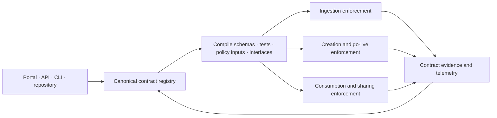

# Data Contract Design

<small>Use when</small><strong>Placing and enforcing a contract in the data journey.</strong>

<small>Decision</small><strong>Which of the three contracts owns this handoff?</strong>

<small>Owner</small><strong>Contract owner for the active boundary.</strong>

<small>Output</small><strong>One versioned promise, enforcement route, and evidence set.</strong>

A data contract is the versioned, machine-readable, and enforceable promise at a data boundary. The contract architecture places that promise along the data journey with only three contracts:

**Source System Ingestion Contract → Data Product Creation Contract → Data Product Consumption Contract**

Use the [Data Contract Standard](../standards/data-contract-standard.md) for the full [definition](../standards/data-contract-standard.md#definition), [core elements](../standards/data-contract-standard.md#core-elements), [business value](../standards/data-contract-standard.md#business-value), mandatory content, lifecycle, approval, testing, and versioning.

## Core Architecture

  

    Input<i></i>Contract boundary<i></i>Published outcome
  

  <section class="standards-map-lane lane-govern">
    
<small>Ingest</small><strong>Source system delivery</strong>
Files, connectors, APIs, CDC, or events with source ownership.

    
    
<strong>Source System Ingestion Contract</strong>
Delivery, receipt, validation, replay, and the source-aligned product descriptor.

    
    
<strong>Source-aligned product</strong>
Centrally managed, validated, traceable input for product teams.

  </section>

  <section class="standards-map-lane lane-build">
    
<small>Create</small><strong>Accepted input products</strong>
Exact source-aligned or product versions and ports.

    
    
<strong>Data Product Creation Contract</strong>
Product descriptor, transformation, meaning, quality, SLO, ports, and change.

    
    
<strong>Live data product</strong>
Aggregate or consumer-aligned with a stable promise.

  </section>

  <section class="standards-map-lane lane-access">
    
<small>Consume</small><strong>Consumer intent</strong>
Identity, use case, purpose, product, port, scope, and duration.

    
    
<strong>Data Product Consumption Contract</strong>
BI, application, platform, sharing, and AI terms in one contract type.

    
    
<strong>Purpose-bound use</strong>
Observable, revocable access for people, systems, recipients, agents, and models.

  </section>

## Contract Placement

| Architecture boundary | Contract | What it governs |
| --- | --- | --- |
| Source system to ingestion | **Source System Ingestion Contract** | Delivery, source schema and meaning, keys, cadence, change notice, identity, reconciliation, replay, quarantine, raw retention, and the embedded descriptor for its validated source-aligned output. |
| Product inputs to product output | **Data Product Creation Contract** | Embedded product descriptor, accepted input versions, transformation, output grain and semantics, quality, SLOs, classification, policy, lineage, ports, compatibility, go-live, rollback, and support. |
| Product output to consumer purpose | **Data Product Consumption Contract** | Consumer or recipient, purpose, exact product and creation-contract version, port, channel, scope, controls, SLO, usage, expiry, revocation, and downstream dependency. |

Raw and validated states are both governed by the Source System Ingestion Contract. Raw remains restricted; validated source-aligned data is the published output of ingestion. It does not require a fourth source-aligned contract type.

Aggregate and consumer-aligned products use the Data Product Creation Contract. Source-aligned products remain the validated output of the Source System Ingestion Contract. Product patterns do not create additional contract types.

## Product Descriptor Placement

The product descriptor is the product-definition section of the publishing contract. It does not have a separate approval or lifecycle.

| Descriptor content | Why it belongs in the publishing contract |
| --- | --- |
| Stable product id, name, domain, purpose, owners, and support | Establishes what is being promised and who is accountable. |
| Lifecycle state, version, input and output ports | Makes the published boundary addressable and discoverable. |
| SLOs, policies, classifications, and authoritative links | Connects the product definition to enforceable trust and control terms. |
| ODPS compatibility metadata | Keeps the definition portable across catalogs and platforms. |

For a source-aligned product, this section is embedded in the Source System Ingestion Contract. For an aggregate or consumer-aligned product, it is embedded in the Data Product Creation Contract. The Data Product Consumption Contract references the exact publishing-contract version and adds consumer-specific purpose, scope, channel, expiry, and obligations.

Internal access, external sharing, and AI use all use the Data Product Consumption Contract. Recipient, legal, retention, AI-purpose, snapshot, model, agent, and evaluation terms are profile-specific clauses, not separate contract or approval objects.

## Contract Chain

Every handoff records the exact upstream version it accepts:

| Contract | References |
| --- | --- |
| Source System Ingestion Contract | Source id, source schema or interface version, delivery endpoint, and source owner. |
| Data Product Creation Contract | One or more ingestion or creation contract versions, accepted ports, and compatibility ranges. |
| Data Product Consumption Contract | One live product version, its creation or ingestion contract version, selected port, consumer identity, and purpose. |

A producer may strengthen, reshape, aggregate, or narrow an upstream promise, but cannot silently weaken quality, classification, permitted use, lineage, or meaning. A Data Product Consumption Contract may narrow scope but cannot widen rights beyond the published product promise and policy.

## Control Architecture

| Component | Responsibility |
| --- | --- |
| Portal, API and CLI | Create, compare, review, approve, and show the state of the three contracts. |
| Canonical repository and registry | Own immutable contract versions, embedded product descriptors, state, owners, bindings, conditions, subscriptions, and history. |
| Contract compiler | Generate catalog projections, validation, compatibility, policy, interface, and telemetry configuration from the canonical artifact. |
| CI/CD and go-live gates | Prove ingestion or creation behavior before activation and publication. |
| Runtime enforcement | Apply the Data Product Consumption Contract at SQL, API, event, file, semantic, feature, retrieval, sharing, and AI boundaries. |
| Catalog and lineage | Relate sources, products, ports, consumers, contract versions, physical bindings, and impact. |
| Observability | Compare actual delivery, product, and consumption behavior with the published contract and route breaches. |

The contract registry owns contract state. Unity Catalog discovers technical assets and enforces native controls, but does not create a fourth catalog-specific contract.

## Lifecycle Enforcement

| Journey stage | Contract action | Blocking evidence |
| --- | --- | --- |
| Ingest | Approve and publish the Source System Ingestion Contract before source activation. | Source owner, delivery and replay tests, classification, validated-state criteria, support, and runtime binding. |
| Create | Approve a Data Product Creation Contract candidate before build and publish it at product go-live. | Accepted input versions, contract tests, quality, lineage, policy, SLO, ports, compatibility, rollback, and support. |
| Consume or share | Approve a Data Product Consumption Contract before releasing data. | Consumer or recipient identity, purpose, exact product version, scope, policy, obligations, channel tests, expiry, and revocation. |
| Operate | Compare runtime behavior with all active contract versions. | Conformance, health, usage, breach, incident, dependency, and change evidence. |
| Change or retire | Version the affected contract and assess connected contracts. | Compatibility, impact, notification, migration, access removal, retention, and archive evidence. |

## Enforcement Outcomes

| Failure | Default outcome |
| --- | --- |
| Invalid source delivery or incompatible source change | Reject or quarantine; keep validated publication closed. |
| Critical product schema, semantic, quality, policy, lineage, or SLO test failure | Block build promotion or product go-live. |
| Unauthorized consumer, purpose, field, recipient, sharing action, or AI use | Deny release and record decision evidence. |
| Breaking change without approved impact and migration | Block the new version and preserve the last compatible version when safe. |
| Runtime drift from any published contract | Mark non-conformant, route owner action, and deny immediately where policy or security is at risk. |

## Minimum Architecture Rules

1. Use only the three named contract types.
2. Every activated source has one published Source System Ingestion Contract version.
3. Every live aggregate or consumer-aligned product has one published Data Product Creation Contract version; source-aligned products are published by the Source System Ingestion Contract.
4. Every publishing contract embeds the product descriptor; no product descriptor has an independent version, approval, or lifecycle.
5. Every governed consumer purpose has one Data Product Consumption Contract referencing an exact live product and publishing-contract version.
6. Sharing and AI use are consumption profiles, not contract types.
7. Product go-live and data release are impossible without matching runtime bindings, passing critical tests, approvals, and observable evidence.
8. Contract changes are assessed across connected contracts of all three types before release.
9. The same canonical contracts drive catalog projections, documentation, tests, policy inputs, interface definitions, and telemetry correlation.

  <strong>Next:</strong> use Data Product Lifecycle Design to align contract versions with product states and go-live gates.

