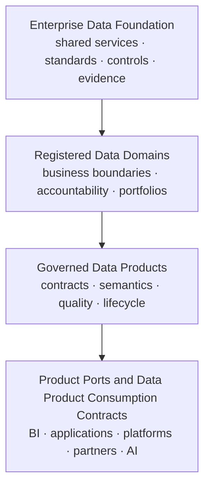
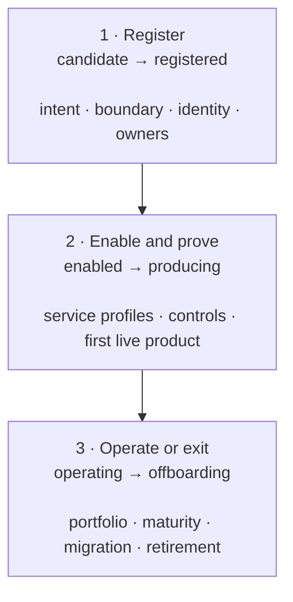

# Data Domain Design

<small>Use when</small><strong>Establishing a business accountability boundary.</strong>

<small>Decision</small><strong>Register, enable, condition, or reject the domain.</strong>

<small>Owner</small><strong>Domain owner with governance.</strong>

<small>Output</small><strong>Stable domain record and adoption obligations.</strong>

A **data domain** is a stable business-aligned accountability boundary within the enterprise data foundation. It groups related business meaning, product ownership, stewardship, source relationships, consumers, policies, and portfolio decisions. It does not create a separate data foundation or permit a domain-specific bypass around shared controls.

The enterprise foundation provides common services, centrally managed source-aligned products, standards, identity, policy, telemetry, and evidence. A domain adopts those capabilities and owns aggregate and consumer-aligned products and business decisions inside its declared boundary. The domain is an accountability and portfolio boundary, not a separate product type; every live product is reusable by design.

## Position in the Foundation

| Concept | Primary purpose | Owns | Does not mean |
| --- | --- | --- | --- |
| Enterprise data foundation | Shared path for trusted data. | Ingestion, source-aligned products, services, standards, control APIs, common evidence and platform patterns. | One central team owns downstream business products. |
| Data domain | Business-aligned accountability and portfolio boundary. | Meaning, stewardship, product priorities, quality decisions and consumer outcomes. | A platform tenancy, schema, workspace, legal entity, or organization chart node by itself. |
| Data product | Unit of trusted delivery and reuse. | Contract, semantics, ports, quality, policy, SLO, support and lifecycle. | Every table or pipeline in a domain. |
| Workspace or runtime | Technical execution boundary. | Compute, storage, networking, deployment and operational isolation. | The authoritative definition of a domain. |

A domain can span several runtimes or regions, and one runtime can host several domains when isolation permits. Domain identity must therefore remain stable and independent of vendor-native catalog, workspace, account, or storage names.

### Central-to-Federated Handoff

The validated source-aligned product is the standard handoff into a domain. The foundation platform team owns its source-preserving contract and operation. The domain team accepts that input contract and becomes accountable when it adds domain meaning, combines sources, changes grain, defines governed metrics, or creates a purpose-specific consumer shape.

Domain teams do not create parallel source extraction or source-aligned ownership models. When execution must occur in a domain-local or regional runtime, it still runs as part of the centrally governed ingestion service with central operating accountability.

## Domain Record

Every onboarded domain has one authoritative record with:

| Area | Required information |
| --- | --- |
| Identity | Stable domain id, name, description, lifecycle state, parent or peer relationships, authoritative registry link. |
| Boundary | Business capabilities and concepts in scope, explicit exclusions, source-system relationships, product portfolio and known overlaps. |
| Accountability | Domain owner, portfolio owner, lead steward, technical lead, risk contact, support and escalation route. |
| Consumers and value | Priority consumers, use cases, outcomes, value measures and cross-domain dependencies. |
| Governance | Classification baseline, privacy and regulatory context, residency, retention, sharing constraints and decision forum. |
| Foundation adoption | Required service profiles, identity boundary, environments, runtime placement, quotas, cost allocation and support tier. |
| Maturity | Assessment scope and date, dimension scores, evidence, gaps, exceptions, improvement plan and next review. |

The domain record is not a second catalog. It links to authoritative identity, organization, product, contract, policy, catalog, lineage, observability and cost records.

## Domain Boundaries

Use business accountability and cohesive meaning to define a domain. Do not start from a convenient technology boundary.

A sound boundary has:

- One accountable owner able to prioritize the portfolio and accept product obligations.
- Related business concepts and decisions that benefit from shared stewardship.
- A coherent product portfolio with identifiable producers and consumers.
- Explicit interfaces to source systems, other domains and external parties.
- Manageable policy, risk, support, cost and operational responsibilities.
- A stable identity even when teams, platforms or implementation technologies change.

Resolve overlaps by naming the authoritative product and contract for each shared concept. Cross-domain products may have one accountable owning domain and contributing stewards from other domains; shared ownership without a final decision owner is not acceptable.

## Lifecycle and Onboarding

| Stage | Exit evidence |
| --- | --- |
| Candidate | Business purpose, proposed boundary, first use case, sponsor and overlap analysis. |
| Registered | Stable id, accountable roles, boundary decision, governance context and assessment scope. |
| Enabled | Identity groups, service profiles, workspaces, policy baseline, telemetry, support and cost allocation are ready. |
| Producing | A real source-to-consumer product passes the standard product go-live gates. |
| Operating | Portfolio, service adoption, SLOs, risks, value, cost and maturity are reviewed on an agreed cadence. |
| Offboarding | Consumers and products are migrated or retired, access is revoked, records are retained and ownership is closed. |

The [Data Domain Onboarding Record](../delivery-templates/data-domain-onboarding-template.md) captures these decisions. Use the [Data Foundation Maturity Assessment](../assessments/data-foundation-maturity-assessment.md) for the baseline and recurring review.

## Admission Gates and Maturity

Domain admission and domain maturity answer different questions:

| Control | Question | Result |
| --- | --- | --- |
| Admission gates | Is the domain identifiable, accountable, governable and safe to enable? | Register, enable with conditions, or block. |
| Maturity assessment | How consistently does the domain adopt and operate foundation capabilities? | Dimension scores, evidence gaps and improvement plan. |
| Product go-live gates | Is a specific product trustworthy and ready for approved consumers? | Approve, reject, or grant an expiring exception. |

A low maturity baseline does not automatically block onboarding; it establishes the improvement plan. Missing ownership, an unresolved boundary, unknown regulatory obligations, or an unenforceable identity and access model does block enablement. A mature domain cannot waive product go-live gates.

## Portal Experience

The Data Service Portal should provide:

1. A domain registry with stable identity, boundary, owners, lifecycle and authoritative links.
2. An onboarding workspace showing admission gates, decisions, dependencies and provisioning status.
3. A capability view showing which foundation service profiles the domain uses and their conformance state.
4. A domain portfolio showing products, contracts, consumers, health, value, cost, duplication and lifecycle.
5. A maturity view with six dimension scores, evidence, gaps, exceptions, actions and assessment history.
6. Cross-domain dependency and overlap views based on contracts, semantics, lineage and consumer relationships.

## Architecture Rules

1. The foundation owns ingestion, source-aligned products, reusable service capabilities, and common control contracts; domains own downstream business meaning and outcomes.
2. Domain identity is stable and portable across organization and technology changes.
3. Every aggregate or consumer-aligned product has one accountable owning domain, even when several domains contribute; source-aligned products have an accountable foundation platform owner.
4. Cross-domain use occurs through product ports, Data Product Consumption Contracts, and unified access, not informal storage access.
5. Domain autonomy does not weaken enterprise identity, security, privacy, interoperability, telemetry or evidence requirements.
6. Compare domains by maturity dimension and evidence quality, not through an unqualified league table.

## Done Criteria

- Domain identity, boundary, owners, governance context and lifecycle are registered.
- Admission gates and baseline maturity assessment have durable evidence.
- Required foundation service profiles, support, cost and telemetry are activated.
- At least one representative product proves the source-to-consumer path.
- Domain portfolio, dependencies, risks, health and maturity are visible in the portal.
- Periodic review and offboarding responsibilities are assigned.
