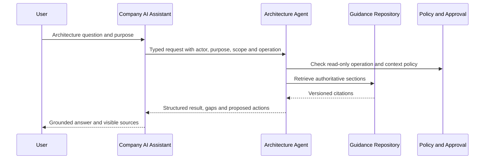

# Data Foundation Architecture Agent

<small>Use when</small><strong>Turning foundation guidance into grounded architecture assistance.</strong>

<small>Decision</small><strong>Which evidence, tool, workflow, and approval boundary should handle the request?</strong>

<small>Owner</small><strong>Data Service AI Assistant owner with the architecture authority.</strong>

<small>Output</small><strong>Cited analysis, structured proposal, evidence gaps, and governed next actions.</strong>

The Data Foundation Architecture Agent is a governed specialist behind the [Data Service AI Assistant](../services/data-service-ai-assistant.md). It is not a tenth foundation service, a second portal, or an approval authority. The company AI assistant may use it through a stable adapter while retaining the user conversation, identity, channel, and approval experience.

## Mission and Boundaries

| Concern | Agent responsibility | Outside the agent |
| --- | --- | --- |
| Architecture knowledge | Retrieve authoritative definitions, designs, services, standards, playbooks, reference solutions, policies, and evidence rules. | Replacing the repository as source of truth. |
| Reasoning | Assess, design, review, and prepare governed artifacts while separating facts, evidence, inference, assumptions, and proposals. | Making unreviewed architecture decisions authoritative. |
| Tools | Invoke typed, least-privilege tools with validated input and output. | Direct database, platform-administrator, or unrestricted network access. |
| Actions | Read by default; create drafts only when a later phase explicitly enables it. | Publishing, approving go-live, granting access, external sharing, deletion, or retirement without external approval. |
| Integration | Provide an HTTP, MCP, or native-tool contract to the Data Service AI Assistant. | Owning the portal conversation, user identity, or workflow system. |

The first slice is **A0 Explain / A1 Recommend**. It returns repository-grounded context and proposed next actions but performs no writes.

## Controlled Architecture Loop

1. Validate actor, purpose, task, scope, operation, and requested evidence window.
2. Retrieve authoritative repository sections and preserve source paths and headings.
3. Classify the request as service-specific, shared-capability, integration, or unresolved.
4. Run deterministic tools before model reasoning.
5. Distinguish verified repository facts, adopter evidence, inference, assumptions, and proposals.
6. Apply policy, side-effect, and approval rules outside prompt text.
7. Return structured results, citations, evidence gaps, and proposed next actions.
8. Emit task, tool, source, policy, latency, and outcome telemetry without sensitive payloads.

## Ten-Step Action Plan

| Step | Deliverable | Exit evidence |
| ---: | --- | --- |
| 1 | Mission, users, scope, non-goals, autonomy, and success measures. | Approved agent boundary and A0/A1 starting level. |
| 2 | Portable task, context, citation, evidence, action, approval, and result contracts. | JSON Schemas validate examples and reject invalid requests. |
| 3 | Authoritative guidance index and hybrid retrieval. | Relevant sections resolve with path, heading, excerpt, authority, and score. |
| 4 | Deterministic read-only tools. | Search, definition, design classification, traceability, and context-pack tests pass. |
| 5 | Assess, Design, Review, and Generate orchestration. | Workflow outputs satisfy their schemas and evidence rules. |
| 6 | Identity, policy, approval, side-effect, and evidence hooks. | Unauthorized or high-impact requests fail closed with an explicit reason. |
| 7 | Company-assistant adapter. | One HTTP, MCP, or native-tool integration passes contract tests. |
| 8 | Golden cases and safety evaluations. | Grounding, citation, consistency, injection, approval, latency, and cost thresholds pass. |
| 9 | OpenTelemetry-compatible observability. | Agent, tool, evidence, policy, approval, and outcome traces correlate end to end. |
| 10 | Portal pilot and bounded automation. | Measured user outcomes justify A2 drafts or selected A3 reversible actions. |

## First Implementation Slice

The repository package under `agent/` starts steps 2, 3, 4, and 7 with five read-only operations:

| Operation | Purpose | Result |
| --- | --- | --- |
| `search_guidance` | Find task-relevant authoritative sections. | Ranked citations with excerpts and authority class. |
| `resolve_definition` | Resolve a glossary term. | Exact definition or an explicit unresolved result. |
| `classify_design` | Pre-classify architecture work. | Service-specific, shared-capability, integration, or needs-review with rationale. |
| `trace_architecture` | Connect the request to designs, services, standards, playbooks, and operations. | Cited traceability context and gaps. |
| `prepare_context_pack` | Build bounded context for a company-assistant reasoning turn. | Deduplicated citations grouped by architecture concern. |

These tools prepare evidence; they do not claim that a generated design is approved or implemented.

## Company Assistant Integration

The company AI assistant supplies authenticated identity and purpose, invokes one operation, and displays citations and gaps. The agent does not accept credentials or broad platform tokens in prompts.

The portable API contract is `agent/openapi.yaml`. MCP or native tool adapters must preserve the same request, result, identity, purpose, citation, approval, and telemetry semantics.

## Success Measures

| Measure | MVP target |
| --- | ---: |
| Citation validity | 100% of returned citations resolve to repository sections. |
| Unsupported architecture claims | 0 in deterministic tool output. |
| Definition resolution | Exact glossary result or explicit unresolved status. |
| Side effects | 0; all operations are read-only. |
| Traceability coverage | Design, service, standard, playbook, and operations sources considered. |
| Invalid request behavior | Fail closed with schema or policy errors. |

## Graduation Gates

Do not add model-generated drafts until retrieval and citation evaluations pass. Do not add write tools until identity, policy, approval, idempotency, rollback, audit, and recovery controls pass. Do not add remote agents until independent ownership or long-running task boundaries justify A2A.

## Done Criteria for the Read-Only MVP

- The five operations have machine-readable contracts and passing positive and negative examples.
- Repository Markdown is indexed by section without using generated site output.
- Every result identifies the repository version, operation, actor, purpose, sources, evidence gaps, and side-effect class.
- The company-assistant OpenAPI adapter contains no model-provider dependency.
- Tests prove exact definition resolution, cited retrieval, design classification, traceability, invalid-input rejection, and no-write behavior.
- CI validates the package together with documentation, policies, and skills.
