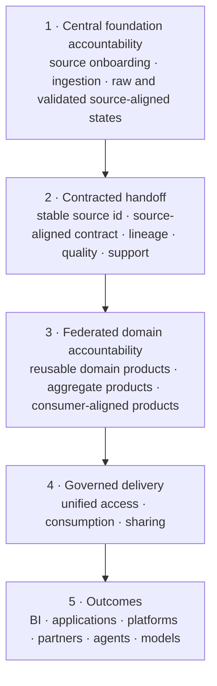

# Data Foundation Model

This model describes the architecture at a conceptual level. It shows what the foundation is made of and how trusted data moves from source to consumption.

## Model Summary

  
<strong>Source</strong>Systems, files, APIs, events, streams.

  
<strong>Ingest</strong>Validate, land, classify, trace.

  
<strong>Product</strong>Contract, transform, test, approve go-live.

  
<strong>Serve</strong>BI, apps, platforms, AI, sharing.

  
<strong>Observe</strong>Quality, freshness, usage, incidents.

  
<strong>Govern</strong>Policy, lineage, access, audit.

## Central and Federated Ownership

The foundation uses one explicit accountability handoff. The **Data Foundation Platform Team centrally manages source onboarding, ingestion, and source-aligned raw and validated states**. **Domain data teams federate the creation and ownership of reusable domain, aggregate, and consumer-aligned data products** using shared product-creation capabilities and standards.

| Boundary | Accountable team | Supporting roles | Management rule |
| --- | --- | --- | --- |
| Source contract and delivery | Source system team | Foundation ingestion owner, source steward | Source owner remains accountable for availability, source semantics, breaking changes, and delivery obligations. |
| Ingestion and raw source-aligned state | Data Foundation Platform Team | Source system team, security and privacy | Centrally operated through approved ingestion patterns, identities, retention, quarantine, replay, lineage, and telemetry. |
| Validated source-aligned state | Data Foundation Platform Team | Source owner and relevant domain stewards | Centrally published with a stable source contract; preserves source meaning and excludes domain business transformation. |
| Reusable domain product | Owning domain data team | Contributing domains and platform enablement | Federated product ownership with domain semantics, contract, quality, SLO, support, value, and lifecycle. |
| Aggregate product | Owning domain data team | Metric owner, contributing product owners | Federated creation at an explicit grain with governed metric semantics and lineage. |
| Consumer-aligned product or view | Serving or consuming domain data team | Consumer owner and upstream product owners | Federated, purpose-specific delivery with expiry and promotion to reusable products when reuse grows. |

Central accountability does not require one physical runtime. Ingestion execution may be regionally distributed, but service ownership, source-aligned contracts, controls, operating evidence, and lifecycle decisions remain with the foundation platform team.

## Conceptual Model

The source-aligned contract is the ownership handoff: the platform team remains accountable for the source-preserving product, while domain teams become accountable for business transformation and downstream product outcomes.

| Cross-cutting control | Applies across the model |
| --- | --- |
| Contracts | Source delivery and source-aligned contracts govern the central boundary; product and consumption contracts govern federated outputs. |
| Catalog, metadata and lineage | Preserve stable identities, ownership, source-to-product provenance, dependencies, and impact. |
| Semantic context | Explain domain and product meaning without changing the source-preserving promise of source-aligned data. |
| Identity, policy and unified access | Enforce named-user and workload access, purpose, obligations, expiry, and revocation. |
| Observability | Correlate ingestion service telemetry with source-aligned and downstream product health end to end. |

## Data Alignment Patterns

### Source-Aligned Data

Source-aligned data represents one source domain while preserving its concepts and grain. **Raw is the landing state inside this pattern**, not a separate architecture layer.

| State | Purpose | Allowed Processing | Access |
| --- | --- | --- | --- |
| Raw landing | Faithful receipt for replay, audit, recovery, and investigation. | Envelope validation, decryption, decompression, technical parsing, ingestion metadata, and quarantine. | Restricted to ingestion, recovery, investigation, and approved product development. |
| Validated source-aligned | Stable, quality-controlled representation that removes technical ingestion friction. | Type normalization, schema enforcement, deduplication, CDC reconciliation, classification, and basic quality validation. | Primarily used as an input to reusable domain and aggregate products. |

| Design Area | Guidance |
| --- | --- |
| Meaning | Preserve source concepts, keys, events, lifecycle, and limitations without claiming an enterprise-wide definition. |
| Grain | Normally unchanged from the authoritative source entity or event. |
| Ownership | The Data Foundation Platform Team owns and operates both states through the Data Ingestion Service. The source system owner owns source availability, source semantics, and change obligations; relevant stewards approve classification and interpretation. |
| Contract | Source delivery, schema, semantics, keys, change behavior, quality thresholds, freshness, and known limitations. |
| Reuse | Stable input for multiple domain products; direct business consumption remains controlled. |
| Retention | Raw and validated states may have different retention based on replay, audit, privacy, and cost needs. |

**Avoid:** business transformation in the raw state, merging unrelated sources, redefining enterprise metrics, hiding source limitations, or presenting source-specific codes as common semantics.

### Aggregate Data

Aggregate data deliberately changes grain by grouping, summarizing, calculating, or combining data. It should exist because a repeated business question needs a governed and reusable answer.

| Design Area | Guidance |
| --- | --- |
| Meaning | A declared measure at a declared dimensional and time grain. |
| Transformations | Grouping, windowing, calculation, reconciliation, multi-source joins, dimensional mapping, and privacy-preserving aggregation. |
| Grain | Explicit and testable, such as customer per month, asset per shift, or supplier per quarter. |
| Ownership | The owning domain data team, domain product owner, and metric owner; not the platform team or the team that happens to run the pipeline. |
| Contract | Metric definitions, dimensions, units, time semantics, inclusion rules, restatement behavior, quality, and source lineage. |
| Product decision | Make it a product when multiple consumers depend on it, it has independent value, or it requires its own SLO and lifecycle. |

**Avoid:** unnamed calculations, conflicting metric definitions, totals without dimensions or time semantics, irreversible loss of lineage, and one aggregate per dashboard.

### Consumer-Aligned Data

Consumer-aligned data presents live products in the shape required by a defined consumer or use case. It optimizes usability without becoming an uncontrolled duplicate source of business truth.

| Design Area | Guidance |
| --- | --- |
| Meaning | Purpose-specific projection of governed product semantics for BI, an application, a platform, sharing, or AI. |
| Transformations | Renaming, denormalization, semantic modeling, API composition, feature creation, retrieval chunking, masking, filtering, and recipient minimization. |
| Grain | Defined by the consumer contract and may differ from upstream product grain. |
| Ownership | The serving or consuming domain data team, with an accountable product or interface owner and an identified consumer and use-case owner. |
| Contract | Consumer purpose, interface, semantic projection, policy, SLO, compatibility, expiry, and upstream product versions. |
| Lifecycle | Review when the consumer need ends, upstream products change, usage falls, or a reusable domain product can replace it. |

**Avoid:** copying logic into every consumer pipeline, bypassing product contracts, creating permanent one-off extracts, or allowing consumer labels to overwrite canonical product meaning.

## Trust Progression

| Stage | Primary Promise | Typical Contract | Suitable for Direct Consumption? |
| --- | --- | --- | --- |
| Source-aligned | Faithful landing followed by a reliable representation of one source. | Source delivery and source-aligned product contract. | Raw state: no. Validated state: limited, mainly as an input to other products. |
| Aggregate | Governed measure at an explicit grain. | Product contract plus metric and dimensional semantics. | Yes, when live and fit for the consumer purpose. |
| Consumer-aligned | Fit-for-purpose interface or projection. | Consumption, sharing, or AI usage contract. | Yes, for the approved consumer and purpose. |

## Choosing the Right Pattern

1. Use **source-aligned raw state** when replay, evidence, or forensic traceability is required.
2. Publish the **validated source-aligned state** when several products need a stable representation of one source.
3. Use an **aggregate product** when a governed calculation or changed grain is reused and independently operated.
4. Use **consumer-aligned** output when the interface, shape, latency, policy, or semantics are specific to a known use case.
5. Promote repeated consumer logic into a reusable domain or aggregate product instead of multiplying copies.
6. Keep raw and validated as logical states; they do not require separate physical storage zones.

## Architecture Objects

| Object | Definition |
| --- | --- |
| Source | System or channel that provides data to the foundation. |
| Source-aligned data | Centrally managed, source-preserving data with a restricted raw landing state and a quality-controlled validated state. |
| Contract | Executable agreement for schema, semantics, quality, access, and change. |
| Data product | Governed, reusable data asset with ownership, contract, quality, lifecycle, and trust signals. |
| Aggregate product | Governed reusable measures or combined data at an explicitly changed grain. |
| Consumer-aligned product or view | Purpose-specific projection of live products for a defined consumer and contract. |
| Unified access design | Governed logical product interfaces above distributed physical storage, with identity, policy, semantic context, routing, and evidence. |
| Policy | Rule that controls access, masking, purpose, sharing, retention, or AI use. |
| Metadata | Business, technical, operational, and governance context. |
| Semantic context | Versioned product meaning, grain, metrics, relationships, usage context, limitations, and references to current trust evidence. |
| Telemetry | OpenTelemetry-compatible signals for health, quality, freshness, usage, and incidents. |

## Model Rules

1. No product go-live without a contract.
2. No consumption without policy enforcement.
3. No AI use without approved purpose and traceable identity.
4. No sharing without recipient scope, expiry, and revocation.
5. No trust claim without quality, lineage, and observability evidence.
6. No semantic or AI context without authoritative references and policy filtering.
7. No ordinary consumption from the raw source-aligned state, and no changed grain without explicit semantic and lineage evidence.
8. No domain-specific ownership of ingestion or source-aligned lifecycle; distributed execution still operates under central platform accountability.
9. No central platform ownership of domain, aggregate, or consumer-aligned business products; domains own their meaning and outcomes.

## Good Model Test

The model is strong when a reader can answer:

- Where does data enter?
- Where is trust created?
- Is the data source-aligned, aggregate, or consumer-aligned, and what trust state or promise does it provide?
- Which contract controls the product?
- Which policy controls access?
- Who consumes the product?
- How is quality and freshness measured?
- How does AI usage trace back to source and product?
- Which semantic context version explains the product and its permitted use?
- Where does central source-aligned accountability hand over to federated domain product ownership?
