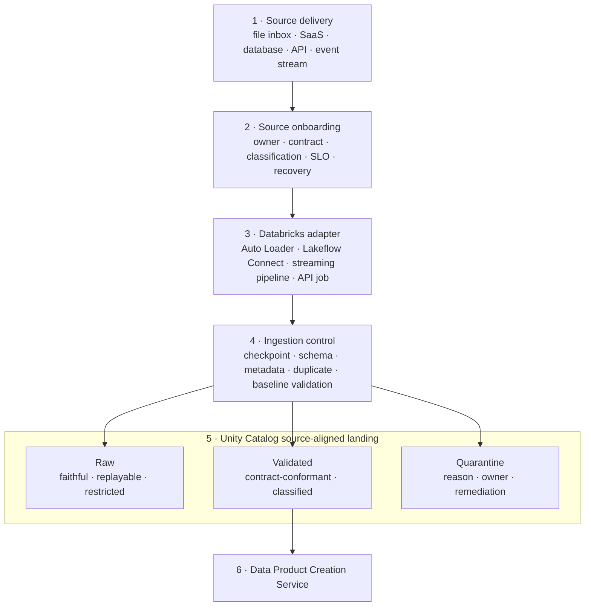
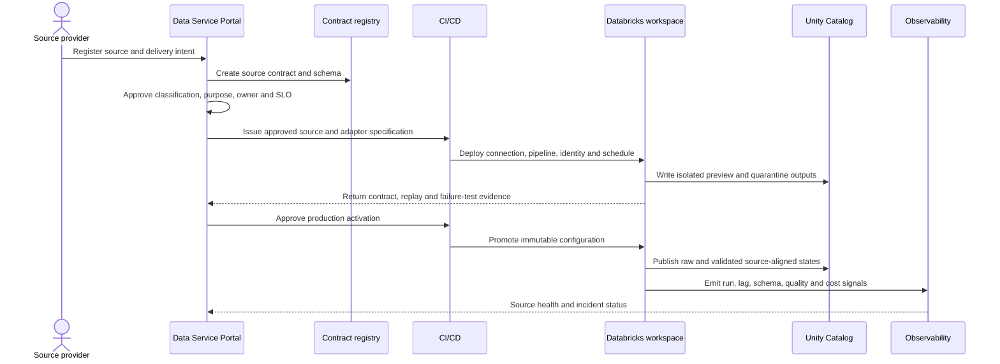

# Data Ingestion Design

<small>Use when</small><strong>Assessing Databricks for a governed ingestion profile.</strong>

<small>Decision</small><strong>Which Lakeflow pattern satisfies the source contract?</strong>

<small>Owner</small><strong>Ingestion architect and platform owner.</strong>

<small>Output</small><strong>Selected pattern, controls, proof, and exit plan.</strong>

This reference solution applies the technology-neutral [Data Ingestion Service](../services/data-ingestion-service.md) and the mandatory [Data Catalog and Storage Standard](../standards/catalog-storage-standard.md) to Databricks. Lakeflow Connect, Auto Loader, Lakeflow Spark Declarative Pipelines, Lakeflow Jobs, Unity Catalog, and Delta Lake implement repeatable file, connector, CDC, API, and event ingestion while preserving source contracts and source-aligned data.

!!! info "Reference solution status"
    Unity Catalog and Delta Lake are mandatory defaults under the [Data Catalog and Storage Standard](../standards/catalog-storage-standard.md). Lakeflow connectors, pipelines, jobs, and ingestion runtime choices remain selected implementation profiles that require connector proof, security and cost review, replay tests, operational evidence, and an exit plan. Source identity, contract, schema, checkpoint semantics, and lineage remain canonical and portable.

!!! tip "Fast path"
    **Decide:** [Executive Recommendation](#executive-recommendation) · **Design:** [Solution at a Glance](#solution-at-a-glance) and [Pattern Selection](#pattern-selection) · **Implement:** [Implementation Runway](#implementation-runway) · **Assure:** [Source Activation Gate](#source-activation-gate) and [Done Criteria](#done-criteria)

## Executive Recommendation

Select the most managed connector that meets the source contract, control, latency, and recovery requirements. Use Lakeflow Connect managed connectors for supported SaaS and database sources, Auto Loader for immutable file inboxes, and Lakeflow declarative or Structured Streaming patterns for event sources and custom integrations.

Land durable tabular data in **source-aligned raw and validated Delta states** registered and governed by Unity Catalog. Keep business transformation and product go-live in the Data Product Creation Service. A connector may automate transport, CDC, retries, and schema handling; it does not own the source contract or decide that a breaking source change is acceptable.

## Solution at a Glance

Identity, connection, workspace, storage, retention, lineage, telemetry, cost, and incident controls apply across every numbered step; they are detailed in the sections below rather than repeated as crossing lines.

## Pattern Selection

| Foundation pattern | Databricks profile | Use when | Mandatory boundary |
| --- | --- | --- | --- |
| File inbox push | Controlled cloud inbox or Unity Catalog volume, Auto Loader, streaming table, and quarantine path. | A provider publishes immutable files on a schedule or event. | File contract, checksum, manifest, immutability, late-file policy, and retention remain explicit. |
| Connector-based pull | Lakeflow Connect managed SaaS, database, query-based, or file connector. | A supported source needs incremental extraction, CDC, or managed API maintenance. | Verify release status and connector-specific limits; do not treat managed schema evolution as contract approval. |
| Event-based streaming | Lakeflow declarative streaming table or Structured Streaming against Kafka or an approved message bus. | Events or operational changes need low-latency capture. | AsyncAPI or event contract, ordering, replay, deduplication, watermark, and dead-letter behavior are required. |
| Contracted API extraction | Lakeflow Job using an approved connector or a thin custom adapter. | No managed connector meets the API, pagination, throttling, or authentication requirements. | OpenAPI, rate limits, checkpoint cursor, idempotency, error semantics, and adapter ownership are mandatory. |
| Bulk migration or backfill | Auto Loader or a bounded batch job writing through the same source-aligned contract. | Historical data must be loaded before incremental ingestion starts. | Reconcile counts, hashes, time ranges, duplicates, and cutover position before activation. |

Databricks recommends beginning with the most managed connector layer that satisfies the use case, then moving to declarative pipelines or Structured Streaming when more control is required. [Lakeflow Connect standard connectors](https://docs.databricks.com/aws/en/ingestion) · [Lakeflow Connect managed connectors](https://docs.databricks.com/aws/en/ingestion/lakeflow-connect)

## Component Responsibilities

| Component | Owns | Does not own |
| --- | --- | --- |
| Data Service Portal | Source onboarding, approvals, contract workflow, status, evidence, and support journey. | Connector execution or source credentials. |
| Source and contract registry | Stable source id, owner, schema, delivery semantics, quality baseline, classification, and change policy. | Runtime checkpoint or pipeline state. |
| Unity Catalog connection | Databricks-native source connection object and access grants. | Enterprise credential ownership, business approval, or the portable source contract. |
| Lakeflow Connect | Supported source extraction, incremental behavior, connector retries, and destination writes. | Acceptance of breaking changes or downstream product semantics. |
| Auto Loader | Incremental file discovery, checkpoint state, schema inference options, and file processing. | File-provider obligations, manifest reconciliation, or retention approval. |
| Declarative pipeline or stream | Event read, transformation limited to ingestion normalization, checkpointing, and source-aligned write. | Business enrichment or consumer-facing product logic. |
| Unity Catalog tables and volumes | Governed registration, native access policy, storage binding, lineage, and audit context. | Product lifecycle or contract authority. |
| Observability service | Cross-platform health, freshness, lag, incidents, lineage correlation, and retained evidence. | Connector configuration or detailed business payload storage. |

## Source Onboarding Flow

## Source-Aligned Storage

Use Unity Catalog to govern named connections, source-aligned tables, volumes, external locations, credentials, and lineage. Keep physical paths out of downstream contracts.

| State | Purpose | Required characteristics |
| --- | --- | --- |
| Raw | Preserve a faithful source representation for traceability, replay, audit, and forensics. | Restricted access, source payload or faithful fields, source metadata, ingestion time, schema version, batch or event id, and retention. |
| Validated | Expose records that conform to the source contract and baseline technical checks. | Stable schema, classification, validation status, source key, event or effective time, lineage, and known limitations. |
| Quarantine | Isolate records or files that cannot proceed safely. | Original reference, reason code, rule version, observation time, remediation owner, retry status, and expiry. |
| Checkpoint and schema state | Resume incremental processing deterministically. | Runtime-managed location, protected access, backup or recovery design, and no manual mutation. |

Raw and validated are states of the same source-aligned data, not enterprise-wide bronze and silver zones. A live data product is created only when the product lifecycle, contract, quality, access, semantic, and go-live controls pass.

## Contract and Schema Change Policy

Auto Loader can infer and evolve file schemas and preserve unexpected fields in a rescued-data column. Configure this behavior deliberately: automated capture is useful, but breaking changes must still stop publication until reviewed. [Auto Loader schema evolution](https://docs.databricks.com/aws/en/ingestion/cloud-object-storage/auto-loader/schema)

| Observation | Runtime action | Governance action |
| --- | --- | --- |
| Additive optional field | Capture or pause according to the source contract; retain evidence. | Compatibility check, classification, contract update, and downstream impact review. |
| Type widening explicitly allowed | Apply only through an approved compatibility rule and tested runtime profile. | Version the schema and notify affected product teams. |
| Rename, removal, incompatible type, or semantic change | Stop validated publication; raw capture may continue if safe. | Breaking-change workflow, migration plan, and provider approval. |
| Unknown or malformed field | Rescue or quarantine without silent loss. | Assign reason, owner, expiry, and remediation decision. |
| Duplicate or replayed record | Apply declared idempotency and deduplication key. | Record duplicate rate and investigate contract or checkpoint breach. |
| Late or out-of-order event | Apply declared event-time and watermark policy. | Surface completeness limitation and consumer impact. |

## Identity and Security

- Use an enterprise-managed identity or service principal per source pipeline or bounded source group.
- Use OAuth or workload identity federation for automation; do not embed personal tokens or source secrets in notebooks or bundle files.
- Store supported source connections as Unity Catalog securable objects and grant `USE CONNECTION` only to approved pipeline identities.
- Bind catalogs, external locations, storage credentials, and connections to approved workspaces where supported.
- Give ingestion identities write access only to their source-aligned schema and read access only to declared source dependencies.
- Restrict raw and quarantine access more tightly than validated access; never expose them as general consumer ports.
- Preserve provider, connector actor, pipeline identity, source id, contract version, and run id in audit and telemetry context.

## Reliability and Replay

| Concern | Required design |
| --- | --- |
| File processing | Immutable files by default, isolated checkpoint per source, checksum or manifest reconciliation, and tested restart. |
| CDC | Document snapshot, log position, update/delete semantics, source retention dependency, and resnapshot procedure. |
| Events | Preserve source partition, offset, event id, event time, ingestion time, ordering scope, and replay window. |
| APIs | Persist cursor or watermark only after durable write; handle pagination, throttling, retries, and poison responses. |
| Backfill | Use a bounded run identity and reconcile overlap with the incremental stream. |
| Recovery | Test checkpoint loss, duplicate delivery, partial batch, source outage, schema break, credential expiry, and destination outage. |

Auto Loader uses checkpoint state to resume file ingestion and provides exactly-once processing when writing to Delta Lake under its documented conditions. The foundation must still test source immutability, overwrite behavior, checkpoint isolation, and end-to-end reconciliation. [Auto Loader](https://docs.databricks.com/aws/en/ingestion/cloud-object-storage/auto-loader/)

## Observability Contract

Emit and correlate:

- `data.source.system`, source id, contract id and version, connector type and version.
- Pipeline id, run id, task id, workspace, environment, and deployment version.
- Source cursor, batch id, partition and offset ranges, or file counts without sensitive payloads.
- Records and bytes read, accepted, rescued, quarantined, duplicated, and written.
- Source-to-platform lag, freshness, schema-change state, retry count, and checkpoint age.
- Runtime availability, cost, error category, incident id, and recovery evidence.

Lakeflow pipeline event logs and system tables provide Databricks-native runtime evidence; the Observability Service exports normalized product and system signals using the [OpenTelemetry Standard](../standards/otel-telemetry-standard.md).

## Source Activation Gate

Production ingestion may activate only when:

- Source owner, technical owner, support route, contract, schema, classification, and SLO are approved.
- Connector release state, limits, authentication, network path, cost, and operational ownership are accepted.
- Raw, validated, quarantine, checkpoint, retention, and deletion behavior are tested.
- Schema change, duplicate, late data, replay, backfill, source outage, and credential-expiry tests pass.
- Unity Catalog connections, catalog bindings, storage, grants, and pipeline identity pass allow and deny tests.
- Source-to-landing lineage, telemetry, dashboard, alerts, runbook, and incident routing are active.
- Downstream product teams receive a stable source identifier and validated-state contract rather than a physical path.

## Interoperability and Exit Design

- Keep the canonical source and adapter specification independent of Lakeflow resource ids.
- Keep connector configuration declarative and source controlled; use secret references rather than values.
- Store source-aligned outputs in an approved open table or file profile and retain exportable schema and checkpoints where feasible.
- Define adapter conformance tests so a managed connector can be replaced by a standard or custom connector without changing source identity or contract.
- Export lineage, run history, quality results, schema history, and operational evidence on the foundation retention schedule.
- Prove one file, connector, and event source can be rebuilt in a clean environment from canonical artifacts.

## Operational Ownership

| Role | Primary responsibility in this profile |
| --- | --- |
| Data Foundation Platform Team | Central service ownership, source onboarding, ingestion runtime, source-aligned raw and validated products, contracts, controls, SLOs, incidents, evidence, and lifecycle. |
| Source system team | Source availability, delivery obligations, source semantics, credentials coordination, maintenance windows, and change notice. |
| Domain data team | Downstream acceptance needs and stewardship input; consumption of validated source-aligned ports without parallel extraction ownership. |
| Security and privacy | Classification policy, sensitive-source review, retention, residency, access constraints, and exceptions. |
| Data reliability team | Telemetry standard, cross-service correlation, incident integration, and evidence retention. |

Deployment may be regional or physically distributed, but the foundation platform team remains accountable for service behavior and the source-aligned lifecycle.

## Implementation Runway

### Increment 1: Establish Ingestion Controls

- Define source ids, contract profile, classification, metadata columns, identities, catalog structure, and telemetry attributes.
- Build source onboarding, connector assessment, and activation workflows in the portal.
- Prove raw, validated, quarantine, and replay behavior with synthetic sources.

### Increment 2: Deliver Three Golden Paths

- Implement file inbox push with Auto Loader.
- Implement connector pull or CDC with Lakeflow Connect.
- Implement event streaming with a declarative streaming table and approved message bus.

### Increment 3: Automate Conformance

- Generate bundle, identity, connection, pipeline, policy, dashboard, and runbook artifacts from approved source intent.
- Automate contract, schema change, replay, failure, access, lineage, and telemetry tests.
- Publish validated source-aligned states only after activation evidence passes.

### Increment 4: Prove Scale and Portability

- Test concurrency, throughput, lag, source throttling, cost limits, regional recovery, and connector replacement.
- Recreate the golden paths from canonical artifacts in a clean workspace and verify evidence export.

## Open Architecture Decisions

| Decision | Required outcome |
| --- | --- |
| Connector policy | Define when managed, standard, community, or custom connectors are allowed and who owns upgrades. |
| Workspace topology | Define shared versus domain ingestion workspaces, isolation, networking, quotas, and regional placement. |
| Source-aligned namespace | Define catalog and schema mapping without exposing physical paths or temporary delivery stages. |
| Schema evolution | Define allowed compatibility classes and the exact pause, rescue, quarantine, and approval behavior. |
| CDC and replay | Define source retention dependency, checkpoint backup, resnapshot, deduplication, and cutover rules. |
| Streaming runtime | Select triggered versus continuous operation, autoscaling, watermark, state, and cost profiles. |
| Evidence retention | Define normalized export and retention for event logs, lineage, schema history, checkpoints, quality, and incidents. |

## Done Criteria

- File, connector, API, CDC, and event patterns use one source-onboarding and contract model.
- Unity Catalog governs source connections and source-aligned assets without becoming the contract authority.
- Raw, validated, quarantine, checkpoint, replay, retention, and deletion behavior are proven.
- Named users cannot bypass pipeline identities or obtain general access to raw and quarantine data.
- Breaking schema changes cannot silently reach validated source-aligned outputs.
- Source, contract, connector, deployment, run, lineage, quality, cost, and incident evidence is correlated.
- A connector can be replaced without changing the canonical source id or downstream validated-state contract.
- Product teams can consume validated source-aligned data without implementing custom source extraction.
- Central platform ownership and source-team obligations are visible for every source-aligned product; no domain-local pipeline creates a competing source of record.

  <strong>Next:</strong> use Data Product Creation Design to turn validated source-aligned data into governed live products.

