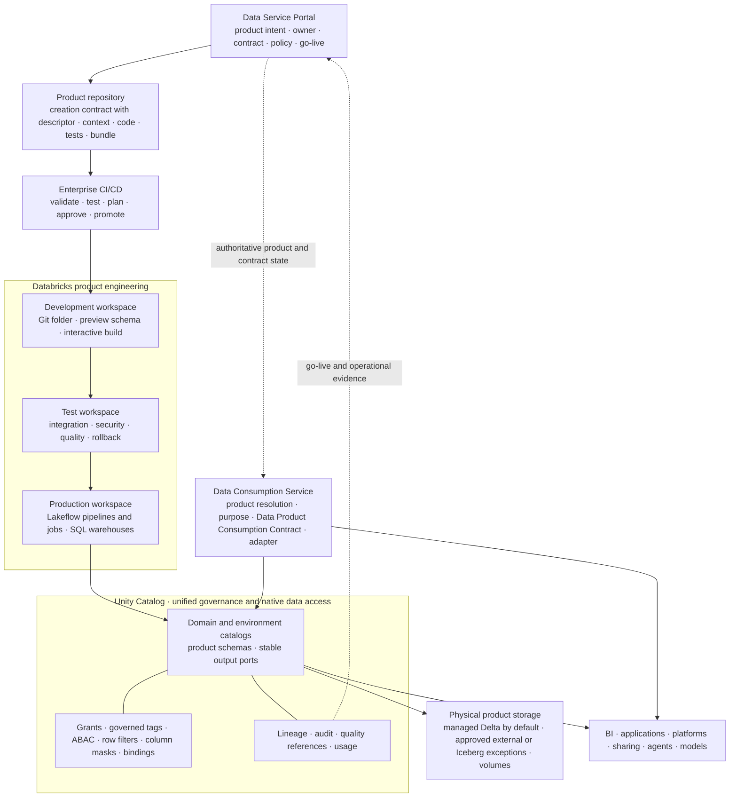
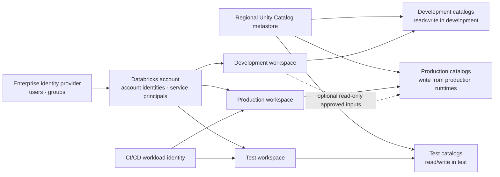
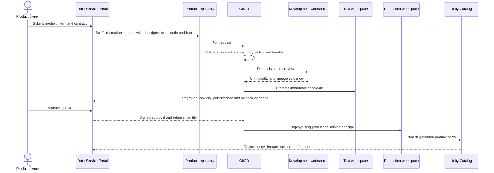
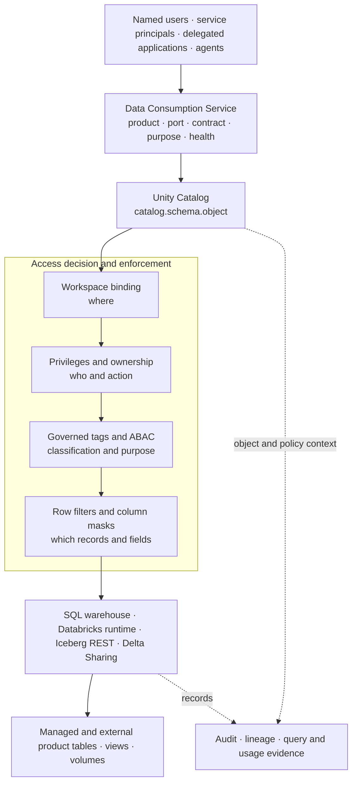

# Data Product Creation Design

<small>Use when</small><strong>Assessing Databricks workspaces and Unity Catalog for product creation.</strong>

<small>Decision</small><strong>How will the Data Product Creation Contract and workload map to the platform?</strong>

<small>Owner</small><strong>Product platform architect.</strong>

<small>Output</small><strong>Workspace, catalog, release, control, and exit design.</strong>

This reference solution applies the technology-neutral [Data Product Creation Service](../services/data-product-creation-service.md) and the mandatory [Data Catalog and Storage Standard](../standards/catalog-storage-standard.md) to Databricks. Databricks workspaces provide governed product engineering environments; Unity Catalog is the standard technical catalog and native governance layer, and Delta Lake is the default physical format for durable product tables.

!!! info "Reference solution status"
    Unity Catalog and Delta Lake are mandatory defaults under the [Data Catalog and Storage Standard](../standards/catalog-storage-standard.md). The Databricks workspace, compute, orchestration, and delivery profile remains a selected implementation that requires proof-of-capability evidence, security and cost review, portability tests, and an exit plan. Publishing-contract, workload, semantic-context, and release artifacts remain canonical and provider-independent; the product descriptor is embedded in the publishing contract.

!!! tip "Fast path"
    **Decide:** [Executive Recommendation](#executive-recommendation) · **Design:** [Solution at a Glance](#solution-at-a-glance) and [Workspace Topology](#workspace-topology) · **Implement:** [Implementation Runway](#implementation-runway) · **Assure:** [Go-Live Gate](#go-live-gate) and [Done Criteria](#done-criteria)

## Executive Recommendation

Use separate development, test, and production workspace boundaries, connected to a regional Unity Catalog metastore. Deliver each data product from a source-controlled repository using Declarative Automation Bundles and automated CI/CD. Register every product asset in Unity Catalog and use Unity Catalog managed Delta tables by default. Keep the Data Product Creation Contract and logical port independent of Unity Catalog object names and physical paths.

Unity Catalog implements the core unified access profile for tables, views, volumes, functions, models, and supported external engines. The Data Consumption Service still resolves logical product ports, purpose, Data Product Consumption Contracts, health, and non-Databricks interfaces. API, event, feature, retrieval, and file-delivery ports require conformant adapters rather than being forced through SQL.

## Solution at a Glance

Read the design from product intent at the top to governed consumption at the bottom.

## Platform Responsibilities

| Architecture capability | Databricks implementation | Authority and boundary |
| --- | --- | --- |
| Product workspace | Git folders, workspace files, notebooks, SQL, approved compute, and isolated preview schemas. | A workspace is an engineering environment, not the product system of record. |
| Declarative deployment | Declarative Automation Bundles define jobs, pipelines, resources, permissions, and environment targets. | The source repository and immutable release record remain authoritative. |
| Transformation | Lakeflow Spark Declarative Pipelines, SQL, Python, Spark, and approved libraries. | Product logic must remain testable and avoid hidden notebook-only state. |
| Orchestration | Lakeflow Jobs or an approved external orchestrator. | The workload specification owns expected behavior; the scheduler owns execution state. |
| Data quality | Contract tests, product quality suites, and pipeline expectations. | The contract and quality standard define required rules; platform metrics are evidence. |
| Native data access | Unity Catalog namespace, privileges, ownership, governed tags, ABAC, row filters, column masks, and workspace bindings. | Unity Catalog is authoritative for Databricks object registration and enforcement, not enterprise business approval. |
| Lineage and audit | Unity Catalog lineage and Databricks system tables. | Publish normalized lineage and telemetry to foundation services where cross-platform history is required. |
| Consumption | SQL warehouses, supported connectors, Delta Sharing, Iceberg REST, and product-specific adapters. | The logical product port and policy contract stay stable when physical bindings change. |

Databricks documents Declarative Automation Bundles as a source-controlled way to define and deploy jobs, pipelines, tests, and other workspace resources. Unity Catalog provides the governed object model, access controls, lineage, audit, and discovery used by this profile. [Declarative Automation Bundles](https://docs.databricks.com/aws/en/dev-tools/bundles) · [Unity Catalog](https://docs.databricks.com/aws/en/data-governance/unity-catalog/)

## Workspace Topology

Use one Unity Catalog metastore per cloud region unless regulation or hard isolation requires a separate boundary. Attach only approved workspaces and isolate environments with catalogs and workspace bindings.

### Required Isolation Rules

- Bind production catalogs, external locations, storage credentials, and service credentials only to approved production workspaces.
- Give non-production workspaces no write access to production catalogs. Use read-only bindings only for explicitly approved reference inputs.
- Use account-level users, groups, and service principals. Do not base Unity Catalog policy on workspace-local groups.
- Give each product or bounded deployment unit a distinct production workload identity and owner.
- Allow production changes only through CI/CD and approved break-glass procedures.
- Separate interactive development compute from production job and SQL compute.
- Set quotas, network policy, runtime policy, audit, and automatic cleanup per environment.

Workspace-catalog bindings can deny access from unbound workspaces even when a principal has object privileges, and can make a binding read-only. This makes them an environment boundary rather than a substitute for grants or row and column controls. [Workspace-catalog binding](https://docs.databricks.com/aws/en/data-governance/unity-catalog/access-control/workspace-catalog-binding)

## Product Delivery Flow

### Delivery Rules

1. The portal creates a stable product id before any workspace object is created.
2. The repository carries the publishing contract with its embedded product descriptor, workload, semantic-context, code, test, and bundle artifacts together. The descriptor shares the contract version; the other artifacts retain their own versions.
3. CI validates artifacts before provisioning and produces a deterministic environment plan.
4. Developers iterate in personal or team-isolated development schemas with synthetic, masked, or approved data.
5. The same immutable code and configuration version moves to test and production; environment values are injected, not rebuilt.
6. A production service principal deploys and runs the product. A named user does not own the production workload.
7. Go-live publishes the stable product ports and release evidence atomically, or rolls back both.

Use workload identity federation for CI/CD so automation exchanges its external identity token for Databricks OAuth credentials instead of storing personal access tokens or long-lived client secrets. [OAuth token federation](https://docs.databricks.com/aws/en/dev-tools/auth/oauth-federation)

## Unity Catalog as the Unified Access Layer

In this reference profile, Unity Catalog implements the governed namespace and native enforcement layer immediately above physical data-product storage. It hides storage credentials and paths from consumers, resolves named assets, enforces privileges and data policies, and records access evidence.

Unity Catalog access control combines privileges, governed tags and ABAC, row and column controls, and workspace restrictions. These controls should be tested together because each answers a different part of the decision. [Unity Catalog access control](https://docs.databricks.com/aws/en/data-governance/unity-catalog/access-control)

### Logical Access Mapping

| Unified access concern | Unity Catalog profile | Additional foundation responsibility |
| --- | --- | --- |
| Product resolution | Map stable product and port ids to approved `catalog.schema.object` bindings. | Product registry controls lifecycle, contract, health, and active binding. |
| Named-user identity | Enterprise SSO and account groups. | Identity provider remains authoritative; portal captures request purpose. |
| Workload identity | Account service principal with OAuth or workload federation. | Workload registry binds owner, environment, purpose, and expiry. |
| Service authorization | Workspace entitlements and ACLs for workspace, job, pipeline, warehouse, and API operations. | API gateway, portal, workflow, and skill authorization remain separate. |
| Data authorization | Catalog privileges, ownership, governed tags, ABAC, filters, masks, and bindings. | Policy service owns enterprise policy intent and approval evidence. |
| Physical routing | Unity Catalog object, managed storage, external location, or supported federation. | Logical port shields consumers from provider-native paths. |
| Evidence | Audit, lineage, query history, job and pipeline system data. | Data Observability Service correlates product, contract, release, actor, run, cost, and outcome. |

Passing a Databricks workspace or API permission never implies permission to product data. Likewise, a Unity Catalog grant does not authorize a portal approval, deployment, job edit, or agent skill.

### Named Users, Systems, and Agents

| Consumer | Recommended identity and access pattern |
| --- | --- |
| Named analyst or engineer | SSO user, account group membership, approved workspace entitlement, and direct Unity Catalog policy evaluation. |
| BI or application workload | Dedicated service principal, OAuth, approved SQL warehouse or connector, least-privilege product-port grants, purpose and expiry. |
| Product pipeline | Product environment service principal with read access to declared inputs and write access only to owned output schemas. |
| CI/CD | Federated deployment service principal; may deploy approved resources but should not read product rows unless a test requires it. |
| Agent acting for a user | Preserve both agent actor and user subject. Use user-delegated access where supported; otherwise enforce the intersection at the access gateway before invoking a narrowly scoped service principal. |

## Product-to-Unity-Catalog Mapping

Do not make every Unity Catalog object a data product. Use a predictable mapping and keep product intent in the product registry.

| Foundation object | Recommended Unity Catalog representation |
| --- | --- |
| Domain and environment | Catalog boundary, for example `prod_customer` or an equivalent governed naming profile. |
| Data product | One schema per product by default; approve exceptions for shared or very large product families. |
| Product output port | Stable table, view, materialized view, streaming table, volume, function, model, or share registered under the product schema. |
| Product version | Product and release metadata linked through governed tags, properties, and the release registry; do not encode every patch version in consumer names. |
| Breaking interface version | Parallel stable port or schema namespace with an explicit migration and deprecation period. |
| Publishing contract | Canonical contract-registry record, including its embedded product descriptor, linked from the product and projected into catalog metadata, tests, comments, tags, schema, and constraints where supported. |
| Semantic context | Versioned context package linked from the product; selected terms, metrics, and classifications may be projected into catalog metadata. |
| Source dependency | Fully qualified input object and contract reference; path-based reads are prohibited for governed product logic unless explicitly approved. |
| Access policy | Enterprise policy reference plus generated Unity Catalog grants, governed tags, ABAC, filters, masks, and workspace bindings. |
| Release evidence | Portal release record linked to Git revision, bundle deployment, job or pipeline ids, test results, approvals, and rollback target. |

Use stable consumer-facing names such as `prod_customer.customer_profile.current_customer`. Underlying physical tables may change, but a port changes only through contract versioning and compatibility rules.

## Contract and Quality Enforcement

Use four enforcement points rather than expecting one Databricks feature to represent the complete data contract.

| Enforcement point | Required checks |
| --- | --- |
| Pull request | Publishing-contract and embedded-descriptor schemas, compatibility, SQL and code quality, policy-as-code, bundle validation, and unit tests. |
| Preview environment | Input compatibility, transformation behavior, representative data tests, quality rules, lineage capture, and resource plan. |
| Test promotion | Integration, security, privacy, performance, resilience, rollback, access-policy, and consumer contract tests. |
| Production runtime | Schema and quality checks, freshness and volume SLOs, pipeline expectations, anomaly signals, and product-health events. |

Lakeflow pipeline expectations can warn, drop, or fail on invalid records and emit quality metrics to the pipeline event log. They are runtime evidence, not a replacement for the broader Data Product Creation Contract or pre-deployment compatibility tests. [Pipeline expectations](https://docs.databricks.com/aws/en/ldp/expectations)

## Go-Live Gate

A product version may go live only when all of the following evidence is linked to the release record:

- Product owner, steward, technical owner, support route, and production workload identity are active.
- Product, contract, semantic context, workload, and release versions resolve consistently.
- Declared input contracts and stable output ports match the deployed Unity Catalog objects.
- Quality, compatibility, security, privacy, performance, resilience, and rollback tests pass.
- Production catalog, workspace, storage, credential, privilege, ABAC, row, and column policies are verified with allow and deny tests.
- Lineage reaches named inputs and product outputs; observability correlates product, release, pipeline, run, and incident identifiers.
- Consumer documentation, access workflow, SLOs, limitations, deprecation rules, and current health are visible in the portal.
- A previous safe release or tested recovery procedure exists.

## Interoperability and Exit Design

Databricks is an implementation, not the external Data Product Creation Contract. Preserve the ability to consume or move a product without rebuilding its meaning and governance from screenshots or workspace state.

- Keep product, contract, semantic context, workload intent, policy intent, and release metadata in portable YAML or JSON schemas.
- Use Delta Lake as the default physical format for durable tabular products and expose stable interfaces rather than storage paths.
- Test supported Iceberg REST access for approved external engines and validate policy behavior, credential vending, read/write limits, and format compatibility. [Unity Catalog Iceberg REST](https://docs.databricks.com/aws/en/external-access/iceberg)
- Use Delta Sharing for governed sharing profiles, with recipient, expiry, and revocation clauses in the Data Product Consumption Contract.
- Publish OpenLineage-compatible events where cross-platform lineage is required and OpenTelemetry signals for system and product operations.
- Export catalog, policy, lineage, quality, audit, and release evidence on a defined schedule and retention model.
- Prove that one reference product can be recreated in another environment from canonical artifacts and data, without depending on a developer's workspace.

## Operational Model

| Role | Primary responsibility in this profile |
| --- | --- |
| Product owner | Product value, intended use, SLO, lifecycle, go-live, and consumer communication. |
| Domain product engineering team | Federated ownership of repository, business transformation, tests, bundle, pipeline, product on-call, and remediation. |
| Domain steward | Contract semantics, quality rules, classification, governed tags, and policy interpretation. |
| Data platform team | Shared creation service, workspaces, compute policies, networking, Unity Catalog metastore, automation templates, and platform SLOs; it does not own domain product meaning or lifecycle. |
| Access governance team | Enterprise policy intent, group model, ABAC templates, entitlement lifecycle, and control evidence. |
| Data observability team | Cross-platform telemetry, lineage normalization, product health, incidents, and evidence retention. |

## Implementation Runway

### Increment 1: Establish the Platform Boundary

- Create development, test, and production workspace patterns.
- Configure account identities, service principals, regional metastore, catalog naming, and isolated workspace bindings.
- Prove named-user and workload access with allow, deny, masking, row-filter, and audit tests.

### Increment 2: Create the Golden Product Path

- Build one repository template containing portable product, contract, semantic-context, workload, test, and bundle artifacts.
- Scaffold a development preview from the Data Service Portal.
- Deploy one domain-owned live product from a centrally managed validated source-aligned input through development, test, and production with an immutable release record.

### Increment 3: Automate Go-Live

- Integrate contract compatibility, quality, security, lineage, policy, performance, and rollback evidence.
- Generate Unity Catalog objects and policies from approved product and policy intent.
- Publish product ports and portal state only after all gates pass.

### Increment 4: Prove Unified Access and Portability

- Add named-user, BI, application, agent, and external-engine consumption tests.
- Validate SQL, Iceberg REST, sharing, and non-tabular adapter boundaries.
- Recreate the reference product from canonical artifacts in a clean environment and test rollback and revocation.

## Open Architecture Decisions

| Decision | Required outcome |
| --- | --- |
| Workspace model | Define shared versus domain workspaces, regional placement, isolation, quotas, and ownership. |
| Catalog model | Define domain and environment boundaries without encoding temporary delivery stages into consumer names. |
| Product mapping | Confirm default schema-per-product mapping and approved exceptions. |
| Runtime profile | Select serverless or classic compute, runtime versions, libraries, network controls, and cost limits per workload class. |
| Orchestration | Define when Lakeflow Jobs owns orchestration and when an external orchestrator remains authoritative. |
| Policy projection | Define how enterprise policy and entitlement decisions generate and reconcile Unity Catalog controls. |
| Contract enforcement | Select schema, compatibility, quality, and consumer-test tooling beyond native expectations. |
| External access | Approve SQL, Delta Sharing, Iceberg REST, API, event, feature, retrieval, and file adapter profiles. |
| Evidence retention | Define export, retention, and cross-platform correlation for audit, lineage, quality, deployment, and runtime evidence. |

## Done Criteria

- A product can be created from the portal and repository template without a platform ticket.
- Development, test, and production are isolated by workspace, identity, catalog, and policy controls.
- CI/CD deploys the same immutable product release with a federated workload identity.
- Unity Catalog resolves stable product ports, enforces named-user and workload access, and records lineage and audit evidence.
- The contract registry remains authoritative and contract rules are tested in CI, preview, test, and production.
- Service authorization and data authorization are independently tested.
- Product go-live is blocked until contract, quality, security, policy, lineage, observability, rollback, and documentation evidence pass.
- BI, application, platform, agent, model, sharing, and approved external-engine paths use governed product ports.
- One product can be recreated from canonical artifacts outside its original workspace and physical bindings.

  <strong>Next:</strong> use Data Consumption Design to expose live product ports through Unity Catalog, SQL, open interfaces, and governed adapters.

