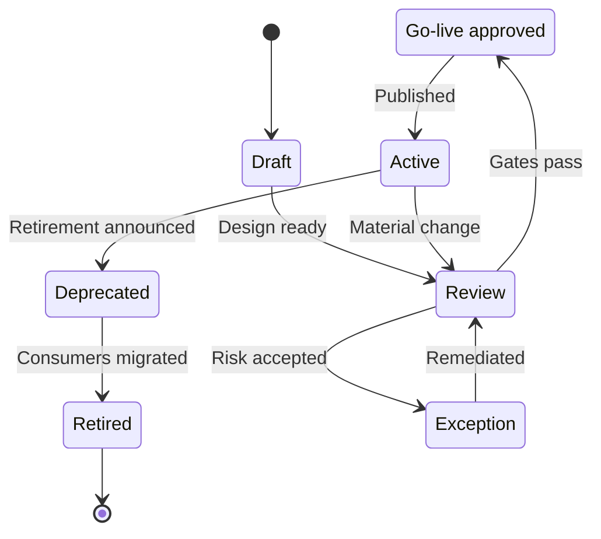

# Data Product Design

<small>Use when</small><strong>Defining, reviewing, changing, or retiring a data product.</strong>

<small>Decision</small><strong>Is this a real product, what is its boundary, and what must remain true throughout its life?</strong>

<small>Owner</small><strong>Product owner with steward, technical owner, consumers, and lifecycle approvers.</strong>

<small>Output</small><strong>Defined product boundary, design, lifecycle state, and evidence.</strong>

## Design Reasoning

<small>Context</small>
Datasets and pipelines alone do not provide a durable, understandable, or supportable consumer promise.

<small>Forces</small>
Consumer value and reuse must justify ownership, quality, support, change, and lifecycle cost.

<small>Decision</small>
Manage a data product as an owned promise with bounded data, contracts, context, governed ports, service levels, and evidence.

<small>Consequences</small>
Products remain stable across implementation changes, but not every dataset qualifies or merits product overhead.

<small>Verification</small>
Prove consumer outcome, ownership, contract, semantics, access, SLOs, support, health, and lifecycle readiness at go-live.

## Data Product Definition

A **data product** is an owned, contract-governed, and independently manageable data offering that provides trustworthy data through stable product ports for defined consumer outcomes. It combines the data with the meaning, interfaces, ownership, controls, service levels, support, and evidence needed to use it without understanding its internal pipelines or physical storage.

> **Data product = consumer outcome + bounded data + publishing data contract + semantic context + governed ports + accountable ownership + observable trust + lifecycle**

A product is not simply a table, file, dashboard, pipeline, catalog entry, or API. Any of these can be part of a product, but the product is the managed promise made to consumers. It remains identifiable and governed when its implementation, storage location, or technology changes.

Every live data product must be:

- **Purposeful:** solves a stated consumer problem and has measurable value.
- **Owned:** has accountable product, stewardship, technical, support, and escalation ownership.
- **Contracted:** publishes a versioned, machine-readable promise for meaning, quality, interfaces, controls, and change.
- **Understandable:** declares grain, semantics, time behavior, limitations, valid uses, and prohibited uses.
- **Accessible:** exposes stable governed ports suited to approved consumers.
- **Trustworthy:** proves quality, freshness, lineage, security, availability, and current health.
- **Independently manageable:** can be versioned, approved, operated, changed, deprecated, and retired as one unit.
- **Reusable by design:** can support approved consumers without coupling them to internal implementation.

Use the [Data Product Management Standard](../standards/data-product-management-standard.md) for mandatory product qualities, states, go-live gates, portfolio rules, and evidence.

## Product, Asset, and Interface

This distinction prevents teams from labeling every technical output as a product.

| Concept | What it is | Relationship to a data product |
| --- | --- | --- |
| Data asset | A table, file, topic, feature set, index, model, or other data-bearing object. | One product may contain or derive several assets. An internal asset is not automatically a product. |
| Data workload | Ingestion, transformation, quality, indexing, or serving logic. | Implements the product but remains replaceable behind the product boundary. |
| Product port | A stable SQL, API, event, file, semantic, feature, retrieval, context, or sharing interface. | Publishes or accepts data without exposing internal storage and pipelines. |
| Catalog entry | A searchable projection of product metadata and health. | Helps consumers discover and assess the product; it is not the product definition. |
| Data product | The complete managed offering and promise to consumers. | Owns purpose, identity, contract, context, ports, controls, SLOs, support, evidence, and lifecycle. |

## Product Design Model

Design the product as one coherent boundary. Each element answers a question that a product owner, engineer, approver, or consumer must be able to resolve.

| Design element | Required question | Design outcome |
| --- | --- | --- |
| Purpose and value | Which problem is solved, for whom, and how is value measured? | Product outcome, intended consumers, valid uses, non-goals, and value measure. |
| Identity and boundary | What belongs to this product and what remains an upstream dependency or internal detail? | Stable product id, name, domain, scope, grain, and dependency boundary. |
| Ownership and service | Who decides meaning, funds change, operates the product, and supports consumers? | Product owner, steward, technical owner, support route, escalation, and review cadence. |
| Publishing data contract | What does the producer promise and how may that promise change? | Approved data contract containing the product descriptor, schema, semantics, quality, SLOs, policies, ports, and compatibility rules. |
| Semantic context | How should people, applications, models, and AI agents interpret the data? | Concepts, grain, metrics, relationships, time meaning, limitations, valid uses, and prohibited uses. |
| Product ports | How do producers supply inputs and consumers obtain outputs? | Stable input and output port ids with interface, version, policy, and service expectations. |
| Data and quality | Which data is included and what makes it fit for intended use? | Data model, lineage, quality rules, thresholds, reconciliation, freshness, and known limitations. |
| Access and security | Who or what may use the product, for which purpose, and under which obligations? | Classification, identity patterns, purpose rules, least privilege, masking, expiry, audit, and revocation. |
| Observability and support | How can consumers and operators know whether the product is healthy and trustworthy now? | Product telemetry, SLO status, incidents, usage, cost, consumer impact, and support information. |
| Lifecycle and change | How does the product become live, evolve compatibly, and end safely? | State, gates, version policy, migration, deprecation, retention, retirement, and retained evidence. |

The product descriptor is embedded in the contract that publishes the product; it is not a separately governed definition. Source-aligned products carry it in the Source System Ingestion Contract. Aggregate and consumer-aligned products carry it in the Data Product Creation Contract. Catalog and vendor-native metadata are synchronized projections of that published definition.

## Define the Product Boundary

Create one product when purpose, meaning, ownership, lifecycle, quality expectations, and change impact belong together. Split the boundary when those concerns need to change or operate independently.

| Boundary question | Keep as one product when... | Split or treat as an internal asset when... |
| --- | --- | --- |
| Consumer outcome | The data supports one coherent outcome or reusable business meaning. | Outputs serve unrelated outcomes with different meaning or obligations. |
| Ownership | One accountable owner can make purpose, priority, quality, and lifecycle decisions. | Different owners need independent decision rights or funding. |
| Change | Consumers can follow one compatibility and release policy. | Parts require independent versions, migration paths, or release cadence. |
| Service level | Quality, freshness, availability, and support form one promise. | Consumers need materially different promises or operating models. |
| Access | Classification and permitted-use rules can be enforced coherently. | Data requires distinct policy boundaries, recipients, retention, or residency. |
| Independence | The offering can be discovered, consumed, operated, and retired as one unit. | The object exists only as an intermediate pipeline detail with no independent consumer promise. |

Do not create a new product only because a new table, pipeline, workspace, schema, or physical copy exists. Start from the consumer outcome and independently managed promise.

## Product Patterns and Ownership

The foundation uses three alignment patterns. Reusability is mandatory for all three and is not a separate product type.

| Product pattern | Purpose | Accountable owner | Product boundary |
| --- | --- | --- | --- |
| Source-aligned | Preserve source meaning and provenance while providing a validated, stable, governed foundation output. | Data Foundation Platform Team, with source-system obligations retained by the source owner. | Includes restricted raw receipt where needed and the publishable validated source-aligned output. |
| Aggregate | Combine or derive published products into a shared business entity, measure, grain, or analytical structure. | Owning domain data team. | Begins where products are combined, harmonized, enriched, or governed under new shared meaning. |
| Consumer-aligned | Shape a governed product or view for a declared consumer, channel, or purpose. | Serving or consuming domain data team. | Includes the purpose-specific shape and promise; consolidate into an aggregate product when broader shared use emerges. |

The platform team centrally manages source onboarding and source-aligned products. Federated domain teams own aggregate and consumer-aligned products while using shared creation, access, contract, catalog, observability, and operational capabilities. See [Data Foundation Model](data-foundation-model.md#data-alignment-patterns) for the flow between patterns.

## Product Lifecycle

The lifecycle has two complementary views:

- **Delivery stages** describe the work needed to create value and preserve trust.
- **Management states** communicate the product's current governance and availability status.

### Delivery Stages

| Stage | Product outcome | Exit evidence |
| --- | --- | --- |
| 1. Frame | Purpose, consumers, boundary, owner, value, and reuse decision are agreed. | Product brief, owner, consumer need, existing-product check, and non-goals. |
| 2. Design | Contract, context, ports, classification, quality, access, SLOs, and dependencies are defined. | Reviewed design and contract draft with embedded product descriptor. |
| 3. Build | Data, workloads, interfaces, controls, lineage, and telemetry are implemented. | Versioned artifact and passing engineering, contract, quality, and security tests. |
| 4. Prove | The exact candidate is shown to be fit for intended consumers and operation. | Consumer acceptance, product-quality evidence, operational readiness, and resolved exceptions. |
| 5. Go live | The approved version becomes discoverable, requestable, supported, and observable. | Go-live decision, published contract and ports, active health, support route, and rollback target. |
| 6. Operate | The product meets its promise and produces measurable consumer value. | SLOs, quality, usage, cost, incidents, feedback, and review decisions. |
| 7. Evolve | Compatible or breaking changes are assessed, versioned, communicated, and released safely. | Impact analysis, compatibility decision, migration plan, new evidence, and release record. |
| 8. Retire | Consumers migrate and the product, access, data, and records are closed according to policy. | Deprecation notice, migration completion, revoked access, retention action, and archived evidence. |

### Management States

| State | Meaning | Consumer expectation |
| --- | --- | --- |
| Draft | Product definition or implementation is incomplete. | Not available for production use. |
| Review | Product evidence is being assessed against required gates. | No new production dependency until approved. |
| Go-live approved | The exact product and contract version passed readiness gates. | May be published through controlled release. |
| Active | Product is live, supported, and operated against its contract and SLOs. | Approved use is supported and observable. |
| Deprecated | Product remains temporarily available while consumers migrate. | No new use; follow the published migration path and deadline. |
| Retired | Product ports and access are closed. | Product is unavailable; retained data and evidence follow policy. |
| Exception | A time-bound deviation has explicit risk ownership and compensating controls. | Use only within the approved exception conditions. |

## Data Contract and Lifecycle Alignment

The product lifecycle manages the offering; the data contract manages its versioned promise. They must identify the same product, version, ports, owners, state, and evidence.

| Product moment | Contract action | Required alignment |
| --- | --- | --- |
| Frame and design | Draft the publishing data contract and embedded product descriptor. | Purpose, boundary, owners, meaning, ports, controls, SLOs, and change policy agree. |
| Build and prove | Validate implementation against the contract. | Schema, semantics, quality, security, compatibility, interface, and evidence checks pass. |
| Go live | Approve and publish the exact contract and product version together. | Catalog, ports, access, telemetry, support, and release evidence resolve to stable ids. |
| Operate | Compare measured health and use with the published promise. | Breaches create observable incidents, consumer impact, and remediation actions. |
| Evolve | Assess compatibility and publish a new version or migration path. | Impacted consumers are known and contract obligations are updated before release. |
| Retire | Deprecate contracts and ports, migrate consumers, then revoke access. | Product, contract, catalog, storage, retention, and evidence reach consistent final states. |

A Data Product Consumption Contract does not redefine the product. It binds an exact live product version and port to an approved consumer, recipient, AI agent, model, or purpose with narrower access, obligations, expiry, and revocation. See [Data Contract Design](data-contract-design.md).

## Product Go-Live Decision

A product goes live only when the complete managed offering is ready, not merely when its pipeline runs or its data tests pass.

| Gate | Decision question |
| --- | --- |
| Purpose and ownership | Is the outcome valuable, the boundary clear, and active ownership accountable? |
| Contract and meaning | Is the publishing promise approved, machine-readable, understandable, and versioned? |
| Data fitness | Do lineage, reconciliation, quality, freshness, and limitations support intended uses? |
| Access and security | Are named users, workloads, models, and AI agents purpose-bound, least-privileged, observable, and revocable? |
| Product ports | Can representative consumers use stable governed interfaces without physical-storage coupling? |
| Operations | Are SLOs, telemetry, support, incident response, cost, rollback, and continuity ready? |
| Consumer readiness | Have intended consumers accepted the product and understood usage and change obligations? |
| Lifecycle evidence | Do the portal, catalog, contract, runtime, and retained records describe the same candidate version and state? |

Testing is evidence for these decisions. The end state is a **supported live data product** that remains fit for use after release.

## Design Responsibilities

| Role | Primary design responsibility |
| --- | --- |
| Product owner | Outcome, boundary, value, consumers, priorities, lifecycle, and go-live accountability. |
| Data steward | Meaning, classification, quality policy, permitted use, limitations, and governance decisions. |
| Technical owner | Workload, ports, tests, lineage, telemetry, reliability, change, and recovery design. |
| Consumer representative | Intended-use validation, interface fitness, acceptance, and migration readiness. |
| Foundation service owners | Reusable creation, contract, catalog, access, observability, and operational capabilities and controls. |
| Lifecycle approvers | Independent assessment of mandatory evidence, risks, exceptions, and go-live decision. |

<strong>Next:</strong> use the <a href="../../playbooks/create-change-data-product/">Create or Change a Data Product</a> playbook to apply this design, then verify mandatory requirements in the <a href="../../standards/data-product-management-standard/">Data Product Management Standard</a>.

