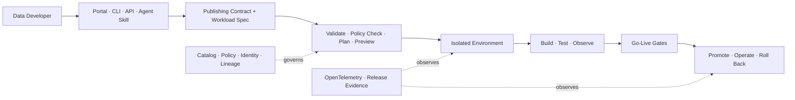

# Data Product Developer Experience

The Data Product Developer Experience gives engineers one declarative, self-service path from product intent to a running, observable data product. It complements the Data Service Portal with API, CLI, repository, and approved agent-skill interfaces backed by the same service contracts.

## Experience Model

## Core Developer Journeys

| Journey | Developer Outcome | Platform Responsibility |
| --- | --- | --- |
| Start | Create a product workspace from an approved template. | Generate repository, identifiers, owners, contract skeleton, workload skeleton, and CI pipeline. |
| Connect | Declare sources and dependencies without hand-building integration plumbing. | Resolve approved connectors, identities, secrets, network policy, and Source System Ingestion Contracts. |
| Build | Develop batch, streaming, API, semantic, feature, or retrieval outputs. | Provision an isolated environment and reusable runtime patterns. |
| Preview | See resource, policy, contract, and downstream impact before deployment. | Produce a deterministic plan with cost, risk, compatibility, and approval requirements. |
| Test | Run contract, quality, security, lineage, interoperability, and operational tests. | Execute standard suites and attach results to the product version. |
| Promote | Move the same version through test and production. | Enforce go-live gates, immutable release identity, configuration inheritance, and separation of duties. |
| Operate | Debug health, quality, usage, cost, and consumer impact. | Correlate code, workload, product, contract, release, runtime, and incident telemetry. |
| Roll back | Restore the last safe release without losing evidence. | Reverse code, configuration, and managed resources through a tested rollback plan. |

## Declarative Artifact Set

| Artifact | Owns | Must Reference |
| --- | --- | --- |
| Publishing contract | Product descriptor, schema, semantics, quality, compatibility, policies, ports, lifecycle, SLOs, and support. | Inputs, interfaces, workload, authoritative metadata, and applicable consumers. |
| Workload specification | Code, inputs, outputs, runtime needs, environments, deployment, rollback. | Product and contract versions, policies, SLOs, telemetry, and resources. |
| Release record | Immutable deployed version and evidence. | Product, contract, workload, source revision, environment, test results, approvals, and rollback target. |

The publishing contract embeds the ODPS-compatible product descriptor and owns one version and lifecycle. The workload specification and release record remain separate because runtime intent and deployment evidence change for different reasons. Stable identifiers bind all three into one release.

## Channel Parity

Portal, CLI, API, and agent skills must:

- Invoke the same versioned foundation service contracts.
- Apply the same authenticated identity, delegated authority, policy, and approval path.
- Produce the same plan, task state, evidence, telemetry, and receipt.
- Avoid channel-specific product or runtime state.
- Support idempotency, cancellation, retry, and recovery for long-running actions.

## Environment Model

| Environment | Purpose | Minimum Controls |
| --- | --- | --- |
| Local or personal | Fast specification and code validation. | Synthetic or approved data, no production secrets, local contract tests. |
| Development | Integration and exploratory work. | Isolation, expiry, quotas, masked data, telemetry, automatic cleanup. |
| Test | Release validation under production-like controls. | Representative data, policy tests, load tests, rollback rehearsal. |
| Production | Approved consumer service. | Go-live evidence, separation of duties, immutable release, SLOs, incident and rollback controls. |

## Resource Abstraction

The developer declares outcomes using a small portable resource model:

- `workload`: batch, stream, service, notebook, model, retrieval, or quality job.
- `connector`: governed source or destination binding.
- `compute`: workload class, scaling bounds, runtime profile, and budget.
- `storage`: lifecycle, format, residency, retention, and access characteristics.
- `secret`: reference to managed credentials, never secret values.
- `policy`: access, data handling, network, purpose, and approval bindings.
- `endpoint`: SQL, API, event, file, feature, retrieval, or sharing interface.

Provider adapters translate these resources into runtime-native objects. Provider details must not become part of the Data Product Creation Contract.

## Done Criteria

- One specification can be validated and planned without provisioning resources.
- A developer can create and remove an isolated environment without a platform ticket.
- The same release is promoted across environments without rebuilding the artifact.
- Policy, contract, quality, security, interoperability, and rollback tests run automatically.
- A failed release can be rolled back with linked evidence and consumer impact.
- Portal, API, CLI, and approved agent skills return equivalent state and receipts.
- OpenTelemetry links developer action, deployment, runtime, product health, and cost.

  <strong>Next:</strong> apply the Data Product Workload Standard and start from its delivery template.

