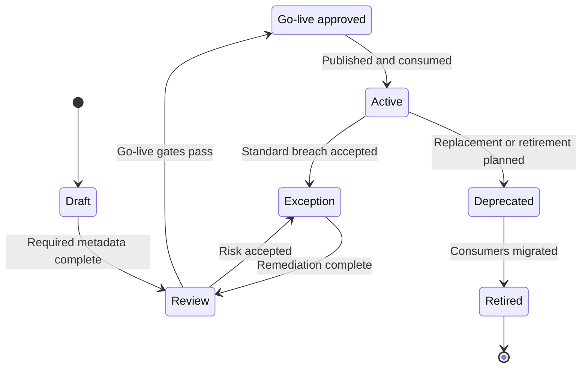

# Data Product Lifecycle Design

Data products are trusted datasets or data interfaces created for reuse. They are managed through a lifecycle from idea to retirement so ownership, trust, access, quality, and observability remain clear.

Use the [Data Product Management Standard](../standards/data-product-management-standard.md) as the mandatory management model for product ownership, lifecycle states, go-live gates, portfolio reviews, and enforcement rules. Use [Data Contract Architecture](data-contract-architecture.md) to determine which contract governs each product layer and how it is enforced.

The product is ready only when it is discoverable, addressable, understandable, natively accessible through governed interfaces, trustworthy, interoperable, independent, and secure. These qualities are demonstrated during delivery and continuously measured after go-live.

## Lifecycle Ownership by Product Type

| Product type | Accountable owner | Lifecycle boundary |
| --- | --- | --- |
| Source-aligned raw and validated states | Data Foundation Platform Team | Raw is a restricted state governed by source-contract clauses. Validated source-aligned data is published under a source-aligned product contract; source teams retain source delivery and change obligations. |
| Reusable domain product | Owning domain data team | Begins when a domain accepts input contracts and adds domain meaning or a reusable business interface. |
| Aggregate product | Owning domain data team | Begins when a domain changes grain, combines products, or governs a reusable metric. |
| Consumer-aligned product or view | Serving or consuming domain data team | Begins for a declared consumer and purpose; ends or is promoted when the use case changes or reuse grows. |

The foundation platform team supplies the product-creation service and enforces common gates. It does not own the meaning, value, support, or lifecycle of federated domain products.

## Lifecycle Stages

| Stage | Description | Key Controls |
| --- | --- | --- |
| Discover | Identify a reusable data need or source opportunity. | Business value, owner, target consumers |
| Design | Define product purpose, accountable platform or domain ownership, contract, quality expectations, and access model. | Data contract, classification, conceptual model |
| Build | Use central ingestion for source-aligned states; transform, validate, document, and prepare federated domain product interfaces through the shared creation service. | Pipeline testing, quality rules, lineage capture |
| Approve go-live | Confirm that the product is fit for intended use. | Steward approval, quality threshold, security review |
| Operate | Monitor freshness, usage, cost, quality, incidents, and consumer feedback. | SLOs, alerts, issue management |
| Evolve | Version the product as schemas, rules, or consumers change. | Change management, compatibility checks |
| Retire | Remove obsolete products safely. | Consumer migration, archive, deprecation notice |

## Minimum Product Metadata

- Product name and domain.
- Product owner and technical owner.
- Business description and intended use.
- Source systems and lineage.
- Data classification and sensitivity.
- Data contract and schema.
- Quality rules and current quality status.
- Freshness and availability expectations.
- Access request process and approved consumption patterns.
- Version and lifecycle state.
- Product-quality evidence for discoverability, addressability, understandability, accessibility, trust, interoperability, independence, and security.

## Product Management Workflow

## Data Contract Lifecycle

Data contracts are managed through the Data Service Portal and linked to the product lifecycle. The product lifecycle controls readiness and ownership; the contract lifecycle controls the versioned promise. They synchronize at product go-live, change, and retirement.

| Stage | Description | Evidence |
| --- | --- | --- |
| Draft | Product or source team proposes a contract using the standard template. | Draft schema, semantics, owner, intended consumers. |
| Review | Stewards, security, privacy, platform, and impacted consumers review the contract. | Review comments, risk decisions, required controls. |
| Approve | Contract is accepted for implementation or publication. | Approval record, version, lifecycle state. |
| Validate | Pipelines, interfaces, and quality rules are tested against the contract. | Test results, compatibility result, quality evidence. |
| Publish | Contract is available to consumers and linked to the product catalog entry. | Published version, consumer guidance, subscription options. |
| Change | Proposed changes are checked for compatibility and communicated. | Change record, migration path, consumer notification. |
| Retire | Obsolete contract versions are deprecated and removed safely. | Deprecation notice, consumer migration evidence. |

At every publishable layer, the producer accepts upstream contract versions and publishes one output product contract. Consumption, sharing, and AI-use contracts narrow that output for a specific interface, recipient, or purpose. See [Data Contract Architecture](data-contract-architecture.md) for the layer map, control components, failure outcomes, and detailed enforcement matrix.

## Lifecycle Gates

| Gate | Question |
| --- | --- |
| Design approved | Is the product purpose, owner, source, contract, classification, and target consumer set clear? |
| Build complete | Are transformations, tests, lineage, documentation, and access controls implemented? |
| Go-live approved | Has the product met quality, security, stewardship, and observability expectations? |
| Operated | Are freshness, quality, usage, incidents, and cost monitored against SLOs? |
| Retired safely | Have consumers migrated, access been removed, and retention or archive rules been applied? |

## Product Controls by Lifecycle Stage

| Stage | Mandatory Controls |
| --- | --- |
| Draft | Owner assigned, purpose described, target consumers identified, source candidates listed. |
| Review | Contract drafted, classification completed, quality rules defined, access pattern proposed. |
| Go-live approved | Contract approved, quality tests passing, lineage available, observability active, portal page ready. |
| Active | SLOs monitored, incidents managed, usage reviewed, consumer subscriptions maintained. |
| Deprecated | New access blocked, migration guidance published, consumers notified. |
| Retired | Access removed, catalog updated, evidence archived, retention applied. |
