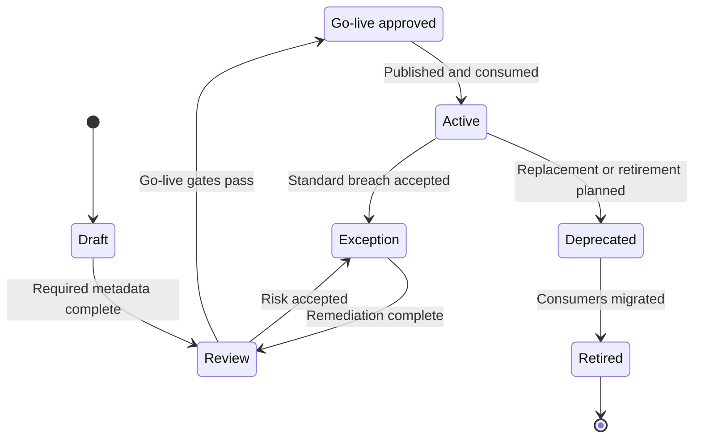

# Data Product Lifecycle Design

Data products are trusted datasets or data interfaces created for reuse. They are managed through a lifecycle from idea to retirement so ownership, trust, access, quality, and observability remain clear.

Use the [Data Product Management Standard](../standards/data-product-management-standard.md) as the mandatory management model for product ownership, lifecycle states, go-live gates, portfolio reviews, and enforcement rules.

The product is ready only when it is discoverable, addressable, understandable, natively accessible through governed interfaces, trustworthy, interoperable, independent, and secure. These qualities are demonstrated during delivery and continuously measured after go-live.

## Lifecycle Stages

| Stage | Description | Key Controls |
| --- | --- | --- |
| Discover | Identify a reusable data need or source opportunity. | Business value, owner, target consumers |
| Design | Define product purpose, domain ownership, contract, quality expectations, and access model. | Data contract, classification, conceptual model |
| Build | Ingest, transform, validate, document, and prepare the product interfaces. | Pipeline testing, quality rules, lineage capture |
| Approve go-live | Confirm that the product is fit for intended use. | Steward approval, quality threshold, security review |
| Operate | Monitor freshness, usage, cost, quality, incidents, and consumer feedback. | SLOs, alerts, issue management |
| Evolve | Version the product as schemas, rules, or consumers change. | Change management, compatibility checks |
| Retire | Remove obsolete products safely. | Consumer migration, archive, deprecation notice |

## Minimum Product Metadata

- Product name and domain.
- Product owner and technical owner.
- Business description and intended use.
- Source systems and lineage.
- Data classification and sensitivity.
- Data contract and schema.
- Quality rules and current quality status.
- Freshness and availability expectations.
- Access request process and approved consumption patterns.
- Version and lifecycle state.
- Product-quality evidence for discoverability, addressability, understandability, accessibility, trust, interoperability, independence, and security.

## Product Management Workflow

## Data Contract Lifecycle

Data contracts are managed through the Data Service Portal and linked to the product lifecycle.

| Stage | Description | Evidence |
| --- | --- | --- |
| Draft | Product or source team proposes a contract using the standard template. | Draft schema, semantics, owner, intended consumers. |
| Review | Stewards, security, privacy, platform, and impacted consumers review the contract. | Review comments, risk decisions, required controls. |
| Approve | Contract is accepted for implementation or publication. | Approval record, version, lifecycle state. |
| Validate | Pipelines, interfaces, and quality rules are tested against the contract. | Test results, compatibility result, quality evidence. |
| Publish | Contract is available to consumers and linked to the product catalog entry. | Published version, consumer guidance, subscription options. |
| Change | Proposed changes are checked for compatibility and communicated. | Change record, migration path, consumer notification. |
| Retire | Obsolete contract versions are deprecated and removed safely. | Deprecation notice, consumer migration evidence. |

## Lifecycle Gates

| Gate | Question |
| --- | --- |
| Design approved | Is the product purpose, owner, source, contract, classification, and target consumer set clear? |
| Build complete | Are transformations, tests, lineage, documentation, and access controls implemented? |
| Go-live approved | Has the product met quality, security, stewardship, and observability expectations? |
| Operated | Are freshness, quality, usage, incidents, and cost monitored against SLOs? |
| Retired safely | Have consumers migrated, access been removed, and retention or archive rules been applied? |

## Product Controls by Lifecycle Stage

| Stage | Mandatory Controls |
| --- | --- |
| Draft | Owner assigned, purpose described, target consumers identified, source candidates listed. |
| Review | Contract drafted, classification completed, quality rules defined, access pattern proposed. |
| Go-live approved | Contract approved, quality tests passing, lineage available, observability active, portal page ready. |
| Active | SLOs monitored, incidents managed, usage reviewed, consumer subscriptions maintained. |
| Deprecated | New access blocked, migration guidance published, consumers notified. |
| Retired | Access removed, catalog updated, evidence archived, retention applied. |
