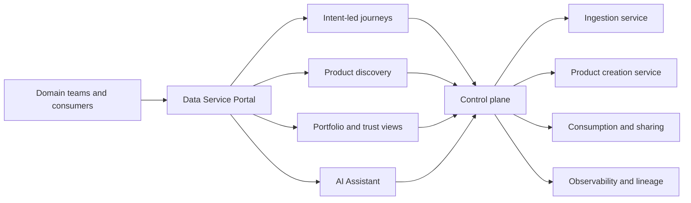
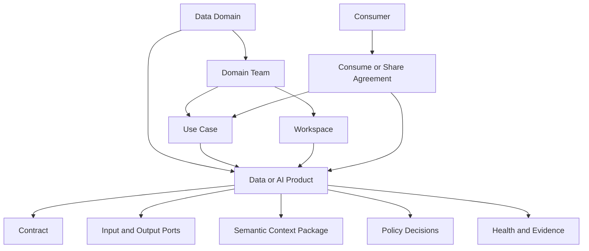
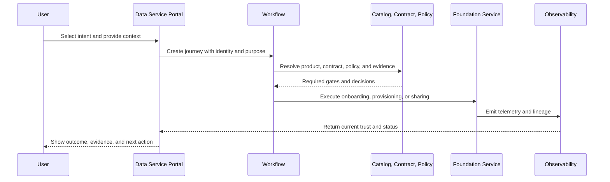

# Data Service Portal Design

The Data Service Portal helps domain teams discover, produce, consume, share, govern, and operate data and AI products through one consistent entry point.

It is not a separate data platform. The portal orchestrates foundation services and presents their evidence without replacing the catalog, contract registry, policy engine, workflow service, lineage system, observability platform, or data runtimes.

## Experience Model

## Intent-Led Journeys

Start with the user's intended outcome, not a platform component.

| Intent | Portal Journey | Foundation Outcome |
| --- | --- | --- |
| Explore | Start an innovation idea | Accountable idea, hypothesis, workspace, evidence need, and next decision. |
| Produce | Produce a data product | Product proposal, workspace, contract, semantics, go-live plan. |
| Consume | Consume a data product | Purpose-bound subscription and governed entitlement. |
| Connect | Connect a source system | Source onboarding request and ingestion contract. |
| Share | Share with customer, supplier, or partner | Recipient-specific sharing agreement and revocable delivery. |
| Build AI | Build an MCP product, AI agent, or AI model | Governed AI product with data, tool, identity, policy, and evaluation dependencies. |
| Evaluate AI | Evaluate an AI product | Versioned evaluation evidence, risk decision, and release outcome. |
| Analyze | Create a BI or analytics product | Governed metric, semantic, dashboard, or analytical interface. |
| Understand | Define business semantics | Stewarded concept and product semantic mapping. |
| Govern | Apply product policy | Policy decision and required evidence linked to the product lifecycle. |
| Observe | Observe product health | Current SLO, quality, lineage, usage, incident, and cost evidence. |
| Industrialize | Industrialize a product | Operated product with support, release, reliability, and lifecycle controls. |

Every journey has an owner, purpose, current state, required evidence, decisions, next action, and link to authoritative records.

The [Data Service AI Assistant](../services/data-service-ai-assistant.md) supports Ask, Plan and Act modes across these journeys through governed agents and skills.

## Portal Object Model

| Object | Purpose | Authority |
| --- | --- | --- |
| Data domain | Stable business boundary, accountable roles, portfolio, foundation capability profile, maturity and lifecycle. | Domain registry linked to identity, governance and portfolio authorities. |
| Domain team | Ownership, stewardship, support, and publish or consume capabilities. | Identity, team, and domain services. |
| Use case | Business objective, consumers, value measures, and approved purpose. | Portfolio or use-case service. |
| Workspace | Governed environment for exploration, engineering, analytics, or AI delivery. | Platform provisioning service. |
| Product | Stable product identity, owner, lifecycle, descriptor, and ports. | Product registry and catalog. |
| Contract | Schema, semantics, quality, SLO, policy, compatibility, and change rules. | Contract registry. |
| Agreement | Purpose-bound consumption or recipient-specific sharing terms. | Workflow, policy, and entitlement services. |
| Semantic context | Product-specific meaning, grain, metrics, relationships, usage context, limitations, and authoritative references. | Product-owned package referencing glossary, metric, contract, policy, lineage, and health authorities. |
| Trust evidence | Quality, freshness, availability, lineage, usage, incidents, and cost. | Observability, quality, and lineage services. |

## Product Detail Standard

A product page should help a consumer decide whether a product is understandable, trustworthy, permitted, and fit for use.

| Section | Minimum Content |
| --- | --- |
| Identity | Name, type, domain, description, version, lifecycle, tags. |
| Accountability | Product owner, steward, technical owner, support and escalation route. |
| Purpose | Intended use, prohibited use, linked use cases, known consumers. |
| Infrastructure | Runtime, environment, region, hosting and support model. |
| Contract | Contract id, version, status, schema, SLOs, compatibility and change policy. |
| Quality | Rules, latest results, trends, failures, limitations and remediation owner. |
| Interfaces | Tables, files, APIs, events, semantic models, features, retrieval or tools. |
| Semantics and context | Business concepts, definitions, grain, metrics, relationships, valid uses, prohibited uses, examples, and limitations. |
| Lineage | Real upstream sources, transformations, downstream products and consumers. |
| Access | Permitted channels, classification, policy, approval and expected lead time. |
| Health | Freshness, availability, incidents, usage, cost and go-live state. |
| Change | Release history, subscribers, deprecation and migration guidance. |

Product health and lineage must come from authoritative telemetry and lineage events. They must never be inferred from names, tags, descriptions, or shared semantic labels.

## Journey Orchestration

## State Ownership

The portal may own:

- User preferences, saved products, recent activity, and notification settings.
- Journey presentation, drafts, comments, and task views.
- Search indexes and read projections that can be rebuilt.
- Correlation ids linking a journey to authoritative records.

The portal must not be the sole owner of:

- Canonical product descriptors or data contracts.
- Policy decisions, entitlements, approvals, or recipient identity.
- Quality results, product health, usage, incidents, or lineage.
- Platform assets, pipeline execution, workspace provisioning, or sharing delivery.

## Experience Principles

1. **Intent before technology:** ask what the user wants to achieve before selecting a platform or runtime.
2. **One primary action:** discovery, consumption, creation, and sharing each have one clear workflow entry.
3. **Progressive detail:** show a concise product summary first and evidence-rich detail on demand.
4. **Trust at decision time:** show current contract, quality, freshness, policy, lineage, and incident status beside the action.
5. **Purpose-bound access:** connect every consume or share request to identity, team, use case, purpose, duration, and product version.
6. **Domain autonomy with guardrails:** domain teams own products while platform services enforce common gates.
7. **Human and machine access:** expose the same governed product through portal views and open machine-readable interfaces.
8. **No duplicated truth:** display source system and observation time for authoritative evidence.

## Portal Controls

- Identity and team are derived from authenticated claims, not free-text request fields.
- Product go-live requires all mandatory gates and an approved canonical contract.
- Consume and share agreements are separate lifecycle objects with expiry and revocation.
- AI journeys capture approved data, tools, model or agent identity, evaluation evidence, and purpose.
- Product pages distinguish declared SLOs from current measured status.
- Read projections are reconciled with authoritative services and expose staleness.
- Every journey emits an audit event and preserves correlation identifiers.
- Assistant actions use registered skills, typed previews, independent policy decisions and explicit approval when required.

## Done Criteria

- Users can discover products by domain, type, concept, use case, interface, health, and permitted purpose.
- Domain teams can create and evolve products without bypassing common go-live gates.
- Consumers can compare trust evidence and complete purpose-bound access through one journey.
- Source onboarding, product creation, consumption, sharing, observability, semantics, policy, and AI journeys call real foundation services.
- Product health, usage, quality, incidents, and lineage are measured rather than simulated.
- Portal records can be rebuilt from canonical product, contract, catalog, policy, lineage, and observability sources.
