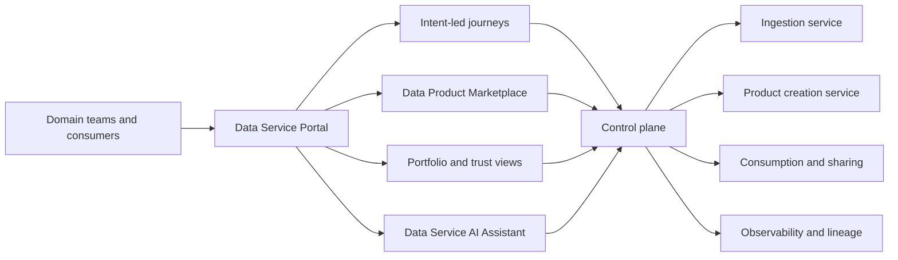
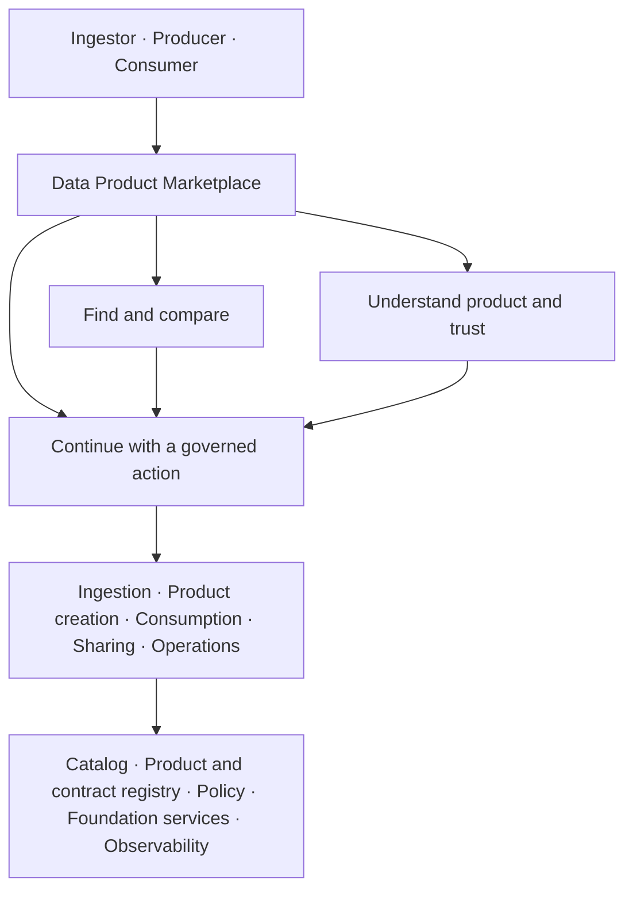
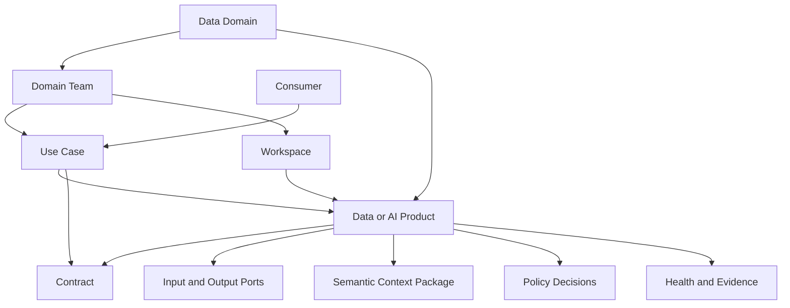
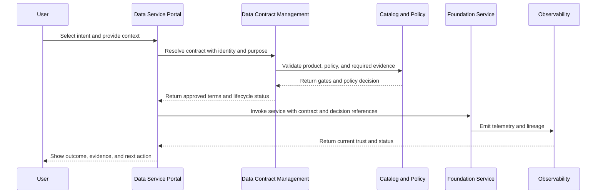

# Data Service Portal Design

<small>Use when</small><strong>Designing portal navigation, marketplace, or service handoffs.</strong>

<small>Decision</small><strong>Which portal area and authoritative service own the outcome?</strong>

<small>Owner</small><strong>Portal owner with journey and service owners.</strong>

<small>Output</small><strong>Simple experience with preserved context and authority.</strong>

The Data Service Portal helps domain teams discover, produce, consume, share, govern, and operate data and AI products through one consistent entry point. Its Data Product Marketplace provides discovery, evaluation, and engagement within that portal.

The portal and marketplace compose foundation service journeys and present their evidence. They do not replace the catalog, product or contract registry, policy engine, lineage system, observability platform, or data runtimes. Data contract review, approval, consumption, and sharing flows belong to Data Contract Management rather than a separate portal workflow capability.

## Experience Model

## Portal Navigation

Keep the first level stable and based on the user's intended outcome. Detailed tasks appear only after the user selects an area.

| Area | Includes | Foundation Outcome |
| --- | --- | --- |
| Explore | Data Product Marketplace, search, compare, product detail, collections, and innovation ideas. | Fit-for-purpose product or accountable innovation path. |
| Ingest | Source onboarding, Source System Ingestion Contracts, source-aligned products, schema changes, and ingestion health. | Governed source delivery and validated source-aligned product. |
| Produce | Product creation and change, analytics and AI development, semantics, contracts, workspaces, and product go-live. | Live aggregate, consumer-aligned, analytics, or AI product. |
| Consume | Purpose declaration, access request, subscription, entitlement, and approved product port. | Purpose-bound governed access. |
| Share | Share with customer, supplier, or partner | Recipient-specific contract terms and revocable delivery. |
| Operate | Product health, support, incidents, planned changes, reliability, cost, and retirement. | Restored or improved service with retained evidence. |
| My Work | Owned products and sources, requests, approvals, contracts, subscriptions, notices, tasks, and portfolio decisions. | One prioritized view of work requiring attention. |

Every journey has an owner, purpose, current state, required evidence, decisions, next action, and link to authoritative records.

The [Data Service AI Assistant](../services/data-service-ai-assistant.md) supports Ask, Plan and Act modes across these journeys through governed agents and skills.

## Marketplace within the Portal

The marketplace turns product metadata and trust evidence into decisions. It does not sell data, duplicate the catalog, approve access, or own product lifecycle state.

=== "Ingestor"

    **See:** owned sources, source-aligned products, schema changes, failures, and downstream impact.

    **Decide:** is source delivery understood and safe for dependent products?

    **Continue:** source onboarding, contract change, remediation, or incident response.

=== "Producer"

    **See:** candidate inputs, owned products, duplicates, dependencies, semantics, and consumer demand.

    **Decide:** reuse, extend, consolidate, create, or change a product?

    **Continue:** product workspace, contract proposal, impact review, or product go-live.

=== "Consumer"

    **See:** purpose, permitted products, comparable trust, interfaces, lead time, and current subscriptions.

    **Decide:** which product and port are fit for the intended outcome?

    **Continue:** purpose-bound contract terms, access activation, sharing delivery, or an approved interface.

### Marketplace Information Architecture

| Surface | Minimum Behavior |
| --- | --- |
| Explore | Search, filter, browse domains and concepts, open curated collections, and resume recent work. |
| Compare | Compare purpose, semantics, contract, quality, freshness, availability, access conditions, interfaces, and support without flattening important differences into one score. |
| Product detail | Present the complete product detail standard below with current authority and observation time. |
| My marketplace | Show saved products, owned products, subscriptions, requests, approvals, notices, and recent activity. |
| Action handoff | Carry identity, role, use case, purpose, product id, contract version, selected port, and correlation id into the authoritative service or contract lifecycle. |

Ranking and recommendations may use declared purpose, semantic match, policy eligibility, reliability, adoption, and team context. The portal must explain why an item is recommended, must not use popularity as a substitute for fitness, and must never rank a prohibited or unavailable product as actionable.

## Portal Object Model

| Object | Purpose | Authority |
| --- | --- | --- |
| Data domain | Stable business boundary, accountable roles, portfolio, foundation capability profile, maturity and lifecycle. | Domain registry linked to identity, governance and portfolio authorities. |
| Domain team | Ownership, stewardship, support, and publish or consume capabilities. | Identity, team, and domain services. |
| Use case | Business objective, consumers, value measures, and approved purpose. | Portfolio or use-case service. |
| Workspace | Governed environment for exploration, engineering, analytics, or AI delivery. | Platform provisioning service. |
| Product | Stable product identity, owner, lifecycle, descriptor, and ports. | Product registry and catalog. |
| Contract | Schema, semantics, quality, SLO, policy, compatibility, change rules, and purpose-bound consumption or recipient-specific sharing terms. | Contract registry linked to policy and entitlement services. |
| Semantic context | Product-specific meaning, grain, metrics, relationships, usage context, limitations, and authoritative references. | Product-owned package referencing glossary, metric, contract, policy, lineage, and health authorities. |
| Trust evidence | Quality, freshness, availability, lineage, usage, incidents, and cost. | Observability, quality, and lineage services. |

## Product Detail Standard

A product page should help a consumer decide whether a product is understandable, trustworthy, permitted, and fit for use.

| Section | Minimum Content |
| --- | --- |
| Identity | Name, type, domain, description, version, lifecycle, tags. |
| Accountability | Product owner, steward, technical owner, support and escalation route. |
| Purpose | Intended use, prohibited use, linked use cases, known consumers. |
| Infrastructure | Runtime, environment, region, hosting and support model. |
| Contract | Contract id, version, status, schema, SLOs, compatibility and change policy. |
| Quality | Rules, latest results, trends, failures, limitations and remediation owner. |
| Interfaces | Tables, files, APIs, events, semantic models, features, retrieval or tools. |
| Semantics and context | Business concepts, definitions, grain, metrics, relationships, valid uses, prohibited uses, examples, and limitations. |
| Lineage | Real upstream sources, transformations, downstream products and consumers. |
| Access | Permitted channels, classification, policy, approval and expected lead time. |
| Health | Freshness, availability, incidents, usage, cost and go-live state. |
| Change | Release history, subscribers, deprecation and migration guidance. |

Product health and lineage must come from authoritative telemetry and lineage events. They must never be inferred from names, tags, descriptions, or shared semantic labels.

## Contract-Bound Service Handoff

## State Ownership

The portal may own:

- User preferences, saved products, marketplace collections, recent activity, and notification settings.
- Journey presentation, drafts, comments, and task views.
- Marketplace ranking configuration, search indexes, and read projections that can be rebuilt.
- Correlation ids linking a journey to authoritative records.

The portal must not be the sole owner of:

- Canonical product descriptors or data contracts.
- Policy decisions, entitlements, approvals, or recipient identity.
- Quality results, product health, usage, incidents, or lineage.
- Platform assets, pipeline execution, workspace provisioning, or sharing delivery.

## Experience Principles

1. **Intent before technology:** ask what the user wants to achieve before selecting a platform or runtime.
2. **One primary action:** discovery, consumption, creation, and sharing each have one clear service or data contract entry.
3. **Progressive detail:** show a concise product summary first and evidence-rich detail on demand.
4. **Trust at decision time:** show current contract, quality, freshness, policy, lineage, and incident status beside the action.
5. **Purpose-bound access:** connect every consume or share request to identity, team, use case, purpose, duration, and product version.
6. **Domain autonomy with guardrails:** domain teams own products while platform services enforce common gates.
7. **Human and machine access:** expose the same governed product through portal views and open machine-readable interfaces.
8. **No duplicated truth:** display source system and observation time for authoritative evidence.

## Portal Controls

- Identity and team are derived from authenticated claims, not free-text request fields.
- Product go-live requires all mandatory gates and an approved canonical contract.
- Consumption and sharing terms are governed within the data contract lifecycle with purpose, scope, approval, expiry, and revocation.
- AI journeys capture approved data, tools, model or agent identity, evaluation evidence, and purpose.
- Product pages distinguish declared SLOs from current measured status.
- Read projections are reconciled with authoritative services and expose staleness.
- Every journey emits an audit event and preserves correlation identifiers.
- Assistant actions use registered skills, typed previews, independent policy decisions and explicit approval when required.

## Done Criteria

- Users can discover products by domain, type, concept, use case, interface, health, and permitted purpose.
- Domain teams can create and evolve products without bypassing common go-live gates.
- Consumers can compare trust evidence and complete purpose-bound access through one journey.
- Ingestors can move from source-aligned marketplace context to onboarding, impact, remediation, or incident response.
- Producers can discover and compare reusable input products before creating or changing a product.
- Marketplace actions preserve product, contract, purpose, identity, and correlation context when entering authoritative services or contract flows.
- Source onboarding, product creation, consumption, sharing, observability, operations, semantics, policy, and AI journeys call real foundation services.
- Product health, usage, quality, incidents, and lineage are measured rather than simulated.
- Portal records can be rebuilt from canonical product, contract, catalog, policy, lineage, and observability sources.
