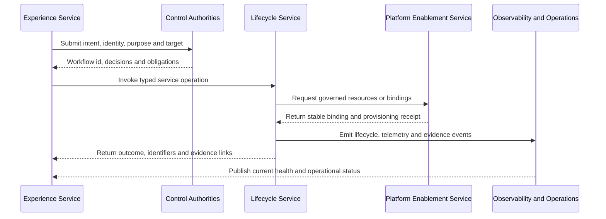
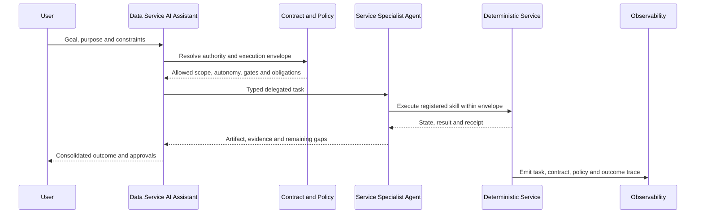

# Integration Design

<small>Use when</small><strong>An outcome crosses two or more service boundaries.</strong>

<small>Decision</small><strong>Which service owns completion, and how are handoffs controlled and evidenced?</strong>

<small>Owner</small><strong>Integration architect with participating service owners.</strong>

<small>Output</small><strong>Interface specifications, sequence, failure behavior, and end-to-end test.</strong>

Integration design connects independently owned foundation services without merging their responsibilities. It defines stable interactions across the Experience, Control, Data, AI, Observability, and Security planes in the [Architecture Blueprint](target-architecture.md).

## Design Reasoning

<small>Context</small>
User outcomes cross independently owned services and cannot be proven by one local success.

<small>Forces</small>
Service autonomy must coexist with reliable completion, policy propagation, recovery, and end-to-end evidence.

<small>Decision</small>
Use stable APIs, events, callbacks, and product ports with one completion owner and shared correlation identifiers.

<small>Consequences</small>
Handoffs, failure ownership, compensation, and reconciliation become explicit design work.

<small>Verification</small>
Test the complete outcome, including timeout, retry, denial, partial failure, recovery, and correlated evidence.

## Integration Principles

1. Integrate through stable service APIs, events, workflow callbacks, and product ports rather than provider tables or user-interface automation.
2. Name one service accountable for the end-to-end outcome and one owner for each handoff.
3. Carry stable identifiers and policy context across every boundary.
4. Separate request acceptance from completed outcome; return durable workflow state for long-running work.
5. Design timeout, retry, idempotency, compensation, reconciliation, and degraded operation before go-live.
6. Prove the end-to-end outcome with correlated evidence, not only successful local calls.
7. Treat agent delegation as another controlled service interaction: the receiving agent may narrow or reject a task but cannot widen identity, purpose, contract, scope, budget, or autonomy.

## Interaction Types

| Interaction | Use For | Required Interface Definition |
| --- | --- | --- |
| Synchronous API | Bounded query, validation, policy decision, preview, or short command. | OpenAPI operation, identity and purpose, timeout, errors, obligations, and correlation ids. |
| Asynchronous event | State change, telemetry, lineage, notification, or fan-out. | AsyncAPI and CloudEvents envelope, schema version, source, subject, event id, time, ordering, and replay behavior. |
| Durable workflow | Approval, onboarding, provisioning, go-live, sharing, change, or recovery. | Workflow id, owner, state machine, gates, callbacks, expiry, compensation, and evidence links. |
| Product port | Governed data query, table, API, event, file, feature, retrieval, or semantic interface. | Product and contract versions, consumer purpose, policy, SLO, obligations, and usage evidence. |
| Agent task | Goal decomposition or delegated work between the assistant and a service specialist agent. | Task and parent ids, actor, delegated identity, purpose, contract references, scope, autonomy ceiling, budget, deadline, expected artifact, approval state, status, and correlation ids. |
| Telemetry and evidence | Health, audit, lineage, cost, control result, and operational correlation. | OpenTelemetry conventions, portable lineage records, retention, access, correlation, and source authority. |

## Core Integration Flow

Not every flow calls every participant, but it uses the same authority, identity, correlation, and evidence rules.

## Multi-Agent Coordination Flow

The assistant owns coordination and user-visible task state. The selected service owns completion and authoritative state. The agent owns neither policy nor approval.

## Critical Integration Flows

| Outcome Owner | Flow | Participating Services | Primary Handoffs | End-to-End Evidence |
| --- | --- | --- | --- | --- |
| Data Ingestion Service | Source onboarding | Portal, Ingestion, Platform Enablement, Observability, Operations. | Intent → ingestion contract → connection and storage → validated source-aligned state → health. | Contract, source id, resource receipt, run and reconciliation result, lineage, quality, and support route. |
| Data Product Creation Service | Product creation and go-live | Portal, Creation, Platform Enablement, Consumption, Observability, Operations. | Product intent → workspace and workload → tests and policy → stable ports → go-live → health. | Product and contract versions, release, tests, lineage, policy results, ports, approval, and runbook. |
| Data Consumption Service | Governed product use | Portal or Assistant, Consumption, Platform Enablement, Observability. | Consumer purpose → service decision → data decision → port resolution → adapter execution → usage receipt. | Consumption contract, identity, purpose, decisions, obligations, product version, result, and trace. |
| Data Sharing Service | External exchange | Portal, Sharing, Platform Enablement, Observability, Operations. | Recipient request → approval → minimized package → entitlement → delivery → expiry or revocation. | Recipient, contract, package, entitlement, delivery, usage, expiry, revocation, and deletion proof. |
| Data Foundation Operations Service | Incident and recovery | Portal, Observability, affected lifecycle services, Platform Enablement, Operations. | Signal or request → impact → command → remediation → system and product recovery → communication. | Alert, incident, affected products and consumers, actions, recovery checks, communication, and improvement. |
| Data Service AI Assistant | Contract-governed agent task | Portal, Assistant, selected service agents, contract and policy authorities, Observability. | User goal → task decomposition → contract and policy scope → delegated service tasks → deterministic execution → consolidated result. | Delegation chain, agent and skill versions, contract versions, scope, budgets, decisions, service receipts, outcome, and trace. |

## Failure Ownership

| Failure | Accountable Owner | Required Behavior |
| --- | --- | --- |
| Request rejected before acceptance | Receiving service. | Return a stable error, failed control, missing input, and no side effect. |
| Accepted workflow cannot complete | Outcome-owning service. | Preserve workflow state, expose current owner, retry or compensate safely, and notify affected users. |
| Provider resource differs from declared state | Platform Enablement Service. | Detect drift, reconcile or raise an exception, and retain before-and-after evidence. |
| Telemetry or evidence cannot be correlated | Data Observability Service. | Mark coverage degraded, restore correlation, and prevent unsupported health claims. |
| Cross-service recovery is blocked | Data Foundation Operations Service. | Coordinate escalation, authority, communication, continuity, and recovery validation. |

## Integration Review Record

Every material integration records:

- Initiator, outcome owner, participating services, target planes, and trust boundaries.
- Interaction type, published schema, versioning, compatibility, and deprecation behavior.
- Identity, purpose, service authorization, data authorization, and obligations.
- Agent and skill versions, parent and child tasks, contract references, delegated scope, autonomy ceiling, budgets, approval state, and completion ownership.
- stable identifiers and propagation rules.
- Timeout, retry, idempotency, ordering, replay, compensation, reconciliation, and degraded mode.
- SLO, telemetry, audit, lineage, evidence retention, and operational owner.
- Contract tests, failure tests, security tests, recovery exercise, and exit path.

## Done Criteria

- Every cross-service handoff has an explicit producer, consumer, contract, owner, and compatibility policy.
- Long-running work exposes authoritative workflow state and safe cancellation or compensation.
- Policy decisions and obligations are enforced at the receiving service.
- One trace resolves from user intent through service actions, platform bindings, product outcome, and operational evidence.
- Multi-agent handoffs preserve authority and contract scope, and each authoritative state change resolves to one deterministic service receipt.
- Failure, retry, duplicate, timeout, partial completion, revocation, and recovery paths are tested.

<strong>Next:</strong> map the integration to the Architecture Design Map, assign the accountable data service, then add its end-to-end evidence to the Architecture to Delivery record.

