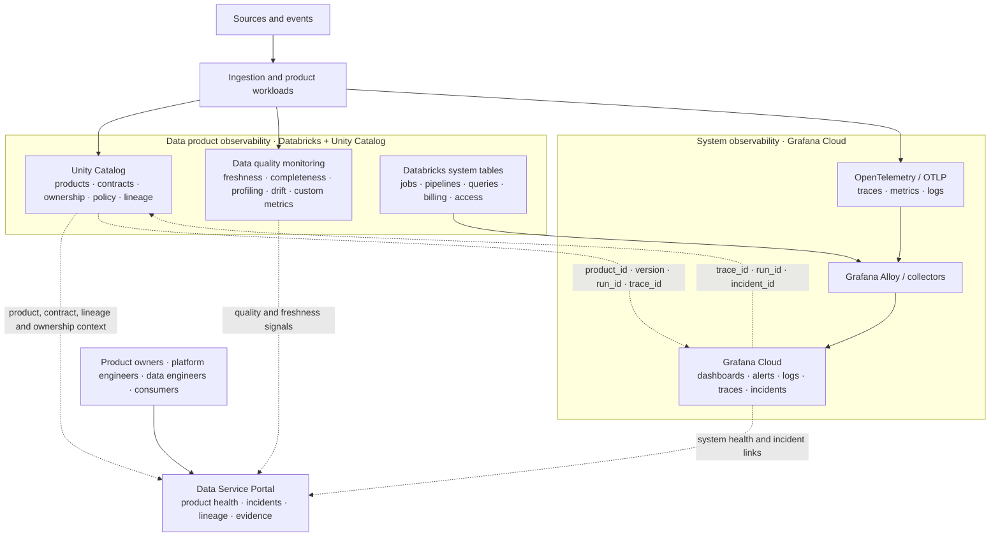
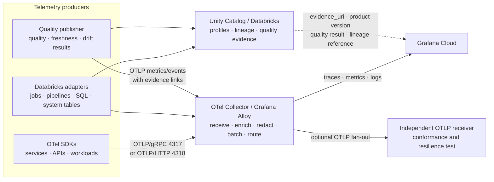

# Observability Design

<div class="decision-brief"><div><small>Use when</small><strong>Applying Databricks, Unity Catalog, and Grafana Cloud to observability.</strong></div><div><small>Decision</small><strong>Where do system and product signals live and correlate?</strong></div><div><small>Owner</small><strong>Observability architect and service owners.</strong></div><div><small>Output</small><strong>Telemetry routes, authority, dashboards, and evidence.</strong></div></div>

This proposal extends the Data Foundation Architecture observability service with a pragmatic two-platform design:

- **Databricks and Unity Catalog** provide data product observability, quality, profiling, lineage, and governed data context.
- **Grafana Cloud** provides platform and system observability for services, pipelines, runtimes, infrastructure, logs, metrics, traces, and alerts.
- **OpenTelemetry and OpenLineage** connect both views without making either tool the system of record for the other.

The result is one observability experience with two authoritative signal domains.

!!! info "Reference solution status"
    This page applies the technology-neutral [Data Observability Service](../services/data-observability-service.md) to a selected Databricks, Unity Catalog, and Grafana Cloud profile. It does not make these products mandatory for the foundation. Adoption requires an approved [Technology Selection Record](../delivery-templates/technology-selection-template.md), proof-of-capability evidence, security review, cost analysis, and an exit plan.

!!! tip "Fast path"
    **Decide:** [Executive Recommendation](#executive-recommendation) · **Design:** [Target Architecture](#target-architecture) and [OTLP Solution Design](#otlp-solution-design) · **Implement:** [Implementation Runway](#implementation-runway) · **Assure:** [Suggested Alert Ownership](#suggested-alert-ownership) and [Key Risks and Guardrails](#key-risks-and-guardrails)

## Executive Recommendation

Use Unity Catalog as the authoritative context for data products and use Grafana Cloud as the operational command center for system health. Publish a shared correlation model so an operator can move from a product freshness breach to the responsible pipeline run, service trace, infrastructure symptom, and affected consumers.

Do not force all data quality logic into Grafana, and do not force all runtime telemetry into Unity Catalog. Keep the tools focused and connect them through stable identifiers, APIs, events, and links.

## Target Architecture



## OTLP Solution Design

OTLP is the transport contract between telemetry producers, collectors, and observability backends. The current OTLP specification defines stable trace, metric, and log signals over Protobuf using gRPC or HTTP; the default OTLP/gRPC port is `4317`. Use OTLP for operational signals and compact product-context signals, while keeping detailed profiles, failed-record samples, lineage views, and quality evidence in their authoritative data systems. [OTLP specification](https://opentelemetry.io/docs/specs/otlp/)



### Signal Responsibilities

| Signal or artifact | Transport and location | Required design |
| --- | --- | --- |
| Traces | OTLP to the collector, then Grafana Cloud | Trace ingestion, transformation, publication, access, sharing, and incident steps. |
| Metrics | OTLP to Grafana Cloud; product health metrics also exposed to the portal | Keep labels bounded. Use product, version, domain, environment, quality dimension, and outcome; never use raw business values. |
| Logs | OTLP to Grafana Cloud | Structured logs with `trace_id`, `span_id`, actor type, run id, product id, and redacted error context. |
| Quality and profiling | Databricks/Unity Catalog | Store detailed distributions, profiling results, failed checks, evidence, and retention-controlled samples in the data platform. |
| Lineage | OpenLineage and Unity Catalog | Preserve runtime lineage and catalog lineage; correlate with `data.pipeline.run_id`, product version, and trace id. |
| Product lifecycle events | Contracted event or OTLP log/event projection | Publish product created, tested, go-live, degraded, recovered, and retired events with evidence references. |

### Collector Placement

Use a two-tier collector pattern:

1. **Local or workload collectors** receive SDK, node, container, and job telemetry close to the source. They add environment and runtime resource attributes, apply basic batching, and protect workloads from backend outages.
2. **Central gateway collectors** receive OTLP from local collectors and Databricks adapters. They apply authentication, redaction, sampling, routing, retry, queueing, and export to Grafana Cloud or an independent receiver.

The OpenTelemetry Collector is designed for receive, process, and export pipelines, so this separation keeps instrumentation vendor-neutral and allows backend changes without changing every product workload. [Collector architecture](https://opentelemetry.io/docs/collector/architecture/)

### Required OTLP Resource Context

Set stable resource attributes at the producer or collector gateway. Use OpenTelemetry semantic conventions first, then the existing `data.*` enterprise attributes for product context. Semantic conventions provide the common meaning and naming model across traces, metrics, logs, and resources. [OpenTelemetry semantic conventions](https://opentelemetry.io/docs/specs/semconv/)

| Attribute | Level | Example |
| --- | --- | --- |
| `service.name` | Resource | `data-product-creation-service` |
| `deployment.environment.name` | Resource | `prod` |
| `cloud.region` | Resource | `eu-west-1` |
| `data.product.id` | Signal context | `customer-profile` |
| `data.product.version` | Signal context | `3.2.0` |
| `data.contract.id` and `data.contract.version` | Signal context | `customer-profile-contract`, `2.1.0` |
| `data.pipeline.id` and `data.pipeline.run_id` | Span/event context | `customer-profile-build`, `run-2026-07-13-001` |
| `data.quality.dimension` | Metric/event context | `freshness` |
| `data.observation.source` | Metric/event context | `databricks.unity_catalog` or `grafana.cloud` |
| `data.evidence.uri` | Event/link context | Portal or catalog evidence reference, never raw data |

### Collector Pipeline Policy

```yaml
receivers:
  otlp:
    protocols:
      grpc: { endpoint: 0.0.0.0:4317 }
      http: { endpoint: 0.0.0.0:4318 }

processors:
  memory_limiter: {}
  batch: {}
  attributes/product_context: {}
  filter/sensitive_payloads: {}
exporters:
  otlp/grafana_cloud: {}
  otlp/independent_receiver: {}

service:
  pipelines:
    traces:
      receivers: [otlp]
      processors: [memory_limiter, attributes/product_context, filter/sensitive_payloads, batch]
      exporters: [otlp/grafana_cloud]
    metrics:
      receivers: [otlp]
      processors: [memory_limiter, attributes/product_context, filter/sensitive_payloads, batch]
      exporters: [otlp/grafana_cloud]
    logs:
      receivers: [otlp]
      processors: [memory_limiter, attributes/product_context, filter/sensitive_payloads, batch]
      exporters: [otlp/grafana_cloud]
```

The YAML is a logical design, not a production collector configuration. Production configuration must add TLS, authentication, queue storage, retry limits, exporter endpoints, resource detection, sampling policy, and component-specific stability checks.

### Product Health Event Pattern

Publish a compact event when a product health state changes. Keep the detailed result in Databricks and link to it:

```json
{
  "event_name": "data.product.health.changed",
  "product_id": "customer-profile",
  "product_version": "3.2.0",
  "contract_version": "2.1.0",
  "pipeline_run_id": "run-2026-07-13-001",
  "quality_dimension": "freshness",
  "status": "breached",
  "observed_at": "2026-07-13T08:15:00Z",
  "evidence_uri": "catalog://quality/customer-profile/3.2.0/observations/12345",
  "trace_id": "correlated-runtime-trace-id"
}
```

This gives Grafana enough context to alert and investigate while preserving Unity Catalog/Databricks as the authoritative place for the profile, lineage, data contract, and detailed evidence.

### Protocol and Reliability Decisions

| Decision | Recommendation |
| --- | --- |
| Primary export | OTLP/gRPC for managed service-to-collector traffic; support OTLP/HTTP for constrained or cross-network clients. |
| Security | TLS in transit, workload identity or short-lived credentials, private connectivity where available, and no shared static secrets in workloads. |
| Backpressure | Memory limiter, bounded queues, retries with backoff, and explicit drop policy by signal priority. |
| Sampling | Tail-sample high-volume traces, retain all product health breaches, access denials, go-live events, and incident-linked traces. |
| Cardinality | Do not put product version, consumer id, run id, or trace id into high-volume metric labels unless the backend and cost model support it; use events and exemplars for detailed correlation. |
| Data hygiene | Reject or redact personal data, business payloads, query text, and raw records before export. |
| Conformance | Validate OTLP export with an independent receiver and test schema, retry, outage, duplicate, and recovery behavior. |

## What Each Platform Owns

| Concern | Databricks and Unity Catalog | Grafana Cloud | Shared outcome |
| --- | --- | --- | --- |
| Product identity | Product, dataset, contract, version, owner, domain, classification | Uses product identity as telemetry context | One product identifier across views |
| Data quality | Freshness, completeness, profiling, anomaly, distribution, custom data metrics | Displays alerts and operational impact | Product health and quality SLO |
| Lineage | Unity Catalog lineage and lineage system tables | Links traces and runtime events to lineage identifiers | Source-to-consumer impact path |
| Runtime health | Databricks jobs, pipelines, SQL, access, and billing system tables | Cross-platform metrics, logs, traces, dashboards, alerts | Platform reliability and cost visibility |
| Incident response | Product impact, affected consumers, contract and go-live evidence | Detection, alert routing, investigation, timelines | Faster diagnosis with accountable ownership |
| Governance | Catalog metadata, policy, ownership, contract and lifecycle context | Access-controlled telemetry and audit trails | No sensitive data in telemetry |

## Product Canvas

### Product

**Data and System Observability Service**

### Problem

Teams can see either platform symptoms or data symptoms, but cannot reliably connect a product freshness or quality issue to the system cause, affected consumers, business impact, and evidence required for recovery and governance.

### Primary Users

| User | Needs |
| --- | --- |
| Data product owner | Product health, quality SLO, freshness, consumers, incidents, and go-live evidence. |
| Data engineer | Failed runs, schema and quality failures, lineage, logs, traces, and remediation path. |
| Platform engineer | Service health, pipeline runtime, infrastructure, spend, capacity, and error budgets. |
| Steward and governance owner | Contract status, classification, lineage, policy, evidence, and audit history. |
| Consumer | Freshness, quality, availability, known incidents, and safe-use limitations. |

### Value Proposition

One product-centric view that answers:

1. Is the data product fit for use?
2. If not, what system or data condition caused the problem?
3. Which consumers, contracts, reports, applications, agents, or models are affected?
4. Who owns the next action and what evidence proves recovery?

### In Scope

- Unity Catalog product context, ownership, contracts, policy, and lineage.
- Databricks data quality monitoring, profiling, freshness, anomaly, lineage, access, job, pipeline, query, and cost signals.
- Grafana Cloud dashboards, alerting, logs, traces, metrics, incident links, and cross-platform system health.
- OpenTelemetry telemetry and OpenLineage events correlated to canonical product and run identifiers.
- Data Service Portal views for product health, incidents, evidence, and consumer impact.

### Out of Scope

- Making Grafana the data catalog or Data Product Creation Contract registry.
- Treating Unity Catalog as the enterprise replacement for system monitoring.
- Putting raw business values, personal data, or sensitive payloads into telemetry.
- Replacing domain ownership decisions about acceptable quality thresholds.

### Core Outputs

- Product health scorecard with freshness, quality, availability, usage, cost, and incident state.
- System health dashboard for services, Databricks workloads, pipelines, SQL warehouses, and platform dependencies.
- Product-to-runtime investigation link: product version -> pipeline run -> trace/log -> incident.
- Lineage-aware impact view for consumers, agents, models, reports, and shared packages.
- Go-live and recovery evidence linked to the product, contract, quality results, and telemetry observation time.

## Canonical Correlation Model

Every signal should carry the identifiers that allow the two observability domains to join without copying sensitive data:

| Identifier | Purpose |
| --- | --- |
| `data.product.id` | Stable product identity. |
| `data.product.version` | Exact product release or snapshot. |
| `data.contract.id` and `data.contract.version` | Contract in force. |
| `data.pipeline.id` and `data.pipeline.run_id` | Producing workload and execution. |
| `trace_id` and `span_id` | Distributed runtime investigation. |
| `data.source.system` | Upstream source context. |
| `data.consumer.id` | Consumer, application, agent, model, or team. |
| `data.quality.dimension` | Quality measure such as freshness, completeness, validity, or drift. |
| `incident_id` | Shared operational and product incident reference. |

The correlation model should be implemented as a versioned extension of the existing [OpenTelemetry Telemetry Standard](../standards/otel-telemetry-standard.md). Runtime lineage remains OpenLineage-compatible; Unity Catalog lineage is treated as an important catalog-side view, not the only lineage protocol.

## Recommended Dashboards

### 1. Product Health Dashboard

Owned by the data product owner. Show product status, contract and go-live state, freshness SLO, quality dimensions, latest version, lineage, consumers, incidents, usage, and cost-to-serve.

### 2. Platform Operations Dashboard

Owned by platform and service teams. Show service availability, ingestion latency, Databricks job and pipeline failures, SQL warehouse performance, queue lag, storage errors, API latency, traces, logs, spend, and error budgets.

### 3. Product Incident Investigation

Start with a product or consumer impact and drill through:

`product version -> quality/freshness signal -> pipeline run -> trace and logs -> platform dependency -> incident -> recovery evidence`

### 4. Portfolio and Governance View

Show products by owner, domain, criticality, quality posture, freshness posture, contract status, lineage coverage, consumer impact, observability coverage, and technical debt.

## Suggested Alert Ownership

| Alert | Primary owner | Escalation |
| --- | --- | --- |
| Product freshness SLO breach | Data product owner | Data engineering and platform on-call |
| Quality rule or anomaly breach | Data product owner and steward | Product creation service owner |
| Pipeline or job failure | Data engineering or service owner | Platform on-call when runtime-related |
| API, service, or infrastructure failure | Platform or service owner | Product owners for affected products |
| Cost or usage anomaly | Platform FinOps owner | Product owner for product-level cost |
| Lineage or telemetry coverage gap | Observability service owner | Catalog, platform, or product owner |

## Implementation Runway

### Increment 1: Establish the contract

- Confirm the observability service owns the correlation model and portal health experience.
- Define product criticality, freshness SLO, quality SLO, incident severity, and ownership rules.
- Enable Unity Catalog system tables and required lineage access.
- Configure Grafana Cloud Databricks integration using a dedicated service principal and least-privilege access.

### Increment 2: Connect the signals

- Export OpenTelemetry traces, metrics, and logs from foundation services through Grafana Alloy or an OpenTelemetry Collector.
- Ingest Databricks jobs, pipelines, SQL warehouse, access, billing, and lineage signals.
- Add product, contract, version, run, consumer, and trace identifiers to workload telemetry.
- Build a first product health dashboard and a first platform operations dashboard.

### Increment 3: Close the operational loop

- Link quality and freshness alerts to Grafana incidents and accountable owners.
- Add source-to-consumer impact views and consumer notifications.
- Publish observability evidence to the Data Service Portal and go-live workflow.
- Test recovery, alert routing, telemetry hygiene, retention, and access controls.

### Increment 4: Scale and improve

- Add portfolio health, cost-to-serve, adoption, and observability coverage measures.
- Add AI and model consumption signals with product, semantic context, purpose, and evaluation identifiers.
- Measure mean time to detect, diagnose, recover, and prove recovery.

## Open Architecture Decisions

1. Is Unity Catalog the authoritative product context for Databricks-managed products, while the Data Service Portal remains the user entry point?
2. Is Grafana Cloud the enterprise system-observability command center for metrics, logs, traces, alerts, and incidents?
3. Which canonical identifiers must every workload emit before a product can go live?
4. Which product tiers require quality profiling, freshness SLOs, lineage coverage, and 24x7 alerting?
5. Which signals may cross platform boundaries, and what data classification and retention rules apply?
6. Who owns the shared correlation model and the product health scorecard?

## Key Risks and Guardrails

| Risk | Guardrail |
| --- | --- |
| Two dashboards disagree | Define authoritative ownership for each signal and show observation time and source. |
| Unity Catalog lineage is incomplete for some events | Preserve OpenLineage events and document coverage limitations and fallback paths. |
| Telemetry exposes sensitive data | Use identifiers, masking, classification-aware access, retention controls, and payload hygiene. |
| Product quality becomes an engineering-only concern | Make product owner and steward accountable for SLOs and acceptable thresholds. |
| Grafana becomes a second catalog | Link to catalog and product records; do not duplicate lifecycle authority. |
| Alert volume becomes unmanageable | Use criticality tiers, SLO-based alerting, deduplication, ownership, and runbooks. |

## Reference Sources

- [Data Observability Service](../services/data-observability-service.md)
- [OpenTelemetry Telemetry Standard](../standards/otel-telemetry-standard.md)
- [Data Product Management Standard](../standards/data-product-management-standard.md)
- [Databricks data quality monitoring](https://docs.databricks.com/aws/en/data-governance/unity-catalog/data-quality-monitoring/)
- [Databricks lineage system tables](https://docs.databricks.com/aws/en/admin/system-tables/lineage)
- [Grafana Cloud Databricks integration](https://grafana.com/docs/grafana-cloud/monitor-infrastructure/integrations/integration-reference/integration-databricks/)
- [Grafana Cloud OpenTelemetry integration](https://grafana.com/docs/grafana-cloud/monitor-infrastructure/integrations/integration-reference/integration-opentelemetry/)
