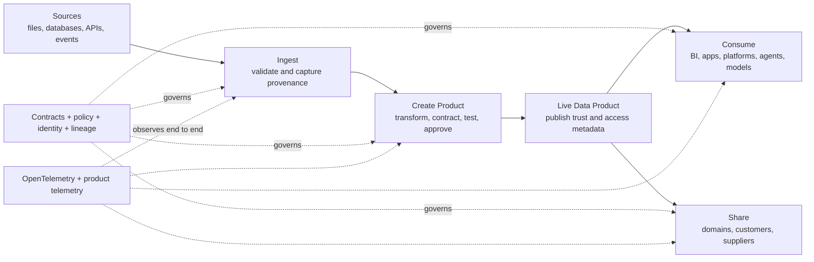

# Architecture Overview

<small>Use when</small><strong>Orienting or reviewing an end-to-end design.</strong>

<small>Decision</small><strong>Which service, shared-capability, or integration design is required?</strong>

<small>Owner</small><strong>Architecture owner with service owners.</strong>

<small>Output</small><strong>Selected design class, target planes, boundaries, and review path.</strong>

The data foundation is a layered set of reusable services. It converts source data into governed data products and makes them safe to discover, use, share, and access with AI.

!!! tip "Use one primary journey"
    Navigate work through **Frame → Establish → Deliver → Use → Operate**. The layers below locate responsibilities; they are not another delivery sequence. Start with [Foundation in One View](../foundation/foundation-in-one-view.md) when orienting a team or review.

## How the Architecture Fits

  

    Design class<i></i>Architecture responsibility<i></i>Target result
  

  <section class="standards-map-lane lane-govern">
    
<small>One owned capability</small><strong>Service-specific design</strong>
Defines a service boundary, behavior, interfaces, controls, SLOs, and evidence.

    
    
<a href="../design-map/"><strong>Nine Service Designs</strong></a><strong>Owned outcomes · APIs · events · controls</strong>

    
    
<strong>Capabilities in target planes</strong>
Every service has explicit placement, ownership, and operational proof.

  </section>
  <section class="standards-map-lane lane-build">
    
<small>Shared across services</small><strong>Shared capability design</strong>
Defines contracts, products, catalog, storage, identity, semantics, access, and telemetry once.

    
    
<a href="../platform-foundation-design/"><strong>Shared Platform Capabilities</strong></a><a href="../data-foundation-model/"><strong>Product and Contract Models</strong></a><a href="../unified-access-design/"><strong>Unified Access</strong></a>

    
    
<strong>Reusable foundation</strong>
Services share authorities and runtime patterns without losing accountability.

  </section>
  <section class="standards-map-lane lane-intelligence">
    
<small>Across service boundaries</small><strong>Integration design</strong>
Defines handoffs, workflows, identifiers, failure behavior, and end-to-end evidence.

    
    
<a href="../integration-design/"><strong>Integration Design</strong></a><a href="../reference-architecture/"><strong>Reference Architecture</strong></a><a href="../../foundation/architecture-service-operations-map/"><strong>Operations Trace</strong></a>

    
    
<strong>Coherent target architecture</strong>
Critical flows cross all required planes and remain traceable into operation.

  </section>

The [Architecture Design Map](design-map.md) is the authoritative service-to-design matrix. Use it before selecting a detailed architecture page or technology reference solution.

## Layered Architecture

Read the model from top to bottom. Users enter through the experience layer; control services govern every action; foundation services move and serve data; data products carry trust; platform capabilities provide the runtime.

The five layers and six target planes are supporting views. **Layers** show where responsibilities sit in the solution stack. **Planes** test cross-cutting completeness. The reference architecture lanes show capability interaction. None replaces the five-stage foundation journey.

  <section class="architecture-layer layer-experience">
    1
    
<strong>Experience and Access</strong>
Data Service Portal · Developer Workspace · AI Assistant · APIs · CLI · Events

  </section>
  
Intent and access

  <section class="architecture-layer layer-control">
    2
    
<strong>Governance and Control</strong>
Catalog · Semantics · Contracts · Lifecycle · Policy · Identity · Lineage · Quality

  </section>
  
Policy and orchestration

  <section class="architecture-layer layer-services">
    3
    
<strong>Data Foundation Services</strong>
Ingestion · Product Creation · Unified Data Access · Sharing · Platform Enablement · Observability · Operations

  </section>
  
Create and serve

  <section class="architecture-layer layer-products">
    4
    
<strong>Governed Data Products</strong>
Source-aligned · Aggregate · Consumer-aligned · AI-ready

  </section>
  
Runs on

  <section class="architecture-layer layer-platform">
    5
    
<strong>Platform Runtime</strong>
Storage · Batch and Stream Processing · APIs and Events · OpenTelemetry

  </section>

!!! note "Cross-cutting by design"
    Security, policy, metadata, contracts, lineage, and observability are not final pipeline steps. They govern or measure every layer. Agentic access uses the same controls as human and application access.

## Layer Responsibilities

| Layer | Owns | Must Not Become |
| --- | --- | --- |
| Experience and access | Portal journeys, developer workspace, discovery, requests, assistant interaction, service APIs, and CLI. | A duplicate catalog, policy engine, or product system of record. |
| Governance and control | Product metadata, contracts, policy decisions, workflow, lineage, go-live evidence. | A documentation-only approval process. |
| Foundation services | Standard ingestion, creation, consumption, sharing, platform enablement, observability, and operations capabilities. | A collection of product-specific pipelines, duplicated controls, or disconnected support processes. |
| Governed data products | Reusable data with an owner, contract, semantics, quality, SLO, policy, and lifecycle. | Unowned tables published directly to consumers. |
| Platform runtime | Portable storage, processing, event, API, telemetry, and lineage infrastructure. | A vendor-specific architecture contract. |

!!! info "Central-to-federated ownership"
    The Data Foundation Platform Team centrally manages source onboarding, ingestion, and raw and validated source-aligned products. Domain data teams use shared creation services and own aggregate and consumer-aligned products. Every live product is reusable by design. The validated source-aligned contract is the accountability handoff. See the [Data Foundation Model](data-foundation-model.md#central-and-federated-ownership).

## End-to-End Value Flow

The layered model explains **where responsibilities sit**. This flow explains **how value moves**.

## Core Architecture Rules

  <section>
    <small>01 · Product integrity</small>
    <h3>Make trust part of the product</h3>
    <ul>
      <li>A <strong>data product</strong> is the unit of reuse and trust; a table alone is not a product.</li>
      <li>A <strong>data contract</strong> is versioned, testable, and enforced at ingestion, publication, and consumption boundaries.</li>
    </ul>
  </section>
  <section>
    <small>02 · Service boundaries</small>
    <h3>Keep capabilities reusable</h3>
    <ul>
      <li>The <strong>Data Service Portal</strong> is the front door, not the system of record for all metadata.</li>
      <li><strong>Foundation services</strong> provide reusable capabilities through stable APIs, events, and workflow interfaces.</li>
      <li><strong>Platform Enablement</strong> provides shared storage, contract, identity, security, integration, and automation controls without taking ownership from lifecycle services.</li>
    </ul>
  </section>
  <section>
    <small>03 · Governed operation</small>
    <h3>Carry trust through every use</h3>
    <ul>
      <li><strong>Security and governance</strong> are policy-driven and follow the data across every access channel.</li>
      <li><strong>OpenTelemetry and lineage events</strong> connect technical health with product quality, usage, cost, and incidents.</li>
      <li><strong>AI agents and models</strong> use governed identities, approved purposes, typed interfaces, and traceable product versions.</li>
      <li>Canonical product, contract, policy, lineage, and telemetry artifacts remain portable across technologies.</li>
    </ul>
  </section>

## Use the Architecture Views

| View | Use It To Answer |
| --- | --- |
| This overview | What are the major layers and boundaries? |
| [Target Architecture](target-architecture.md) | Which logical planes govern the target state? |
| [Architecture Design Map](design-map.md) | Which service-specific, platform foundation, and integration designs apply to each service? |
| [Data Foundation Model](data-foundation-model.md) | What are the core architecture objects and relationships? |
| [Data Contract Design](data-contract-design.md) | Which contract governs each product layer, lifecycle gate, and enforcement point? |
| [Reference Architecture](reference-architecture.md) | Which technology-neutral capabilities are required? |
| [Integration Design](integration-design.md) | How do services hand off work, propagate controls, handle failure, and prove an end-to-end outcome? |
| [Shared Platform Capabilities](platform-foundation-design.md) | Which shared control and runtime capabilities are provided once for all services? |
| [Foundation Service Designs](../services/index.md) | What does each service own, how is it structured, and what must engineers and product owners do? |
| [Architecture to Operations Map](../foundation/architecture-service-operations-map.md) | How do architecture decisions map to service ownership, playbooks, runbooks, evidence, and runway phases? |
| [Data Product Lifecycle Design](data-product-lifecycle-design.md) | How does a product move from idea through go-live, operation, change, and retirement? |
| [Semantic and Context Design](semantic-context-design.md) | How do catalog, semantics, context packages, and graph projections fit together? |
| [Unified Access Design](unified-access-design.md) | How are identity, policy, logical product ports, and physical runtimes connected? |
| [Data Service Portal](../services/data-service-portal.md) | How do users and agents interact with the foundation without duplicating authority? |
| [Data Product Developer Experience](data-product-developer-experience.md) | How do developers declare, test, deploy, and roll back product workloads? |
| [Agentic Data Foundation](agentic-data-foundation.md) | How are agents, skills, models, context, approval, and evidence governed? |
| [Data Ingestion Design](data-ingestion-design.md) | How can Databricks implement governed file, connector, CDC, API, and event ingestion? |
| [Data Product Creation Design](data-product-creation-design.md) | How can Databricks workspaces and Unity Catalog implement product creation and unified governed access? |
| [Data Consumption Design](data-consumption-design.md) | How can Unity Catalog, SQL warehouses, open interfaces, and adapters serve governed product ports? |
| [Data Sharing Design](data-sharing-design.md) | How can Delta Sharing deliver contract-based, minimized, monitored, and revocable data exchange? |
| [Observability Design](observability-design.md) | How can the observability contract be implemented with Databricks, Unity Catalog, and Grafana Cloud? |
| [Architecture Blueprint](../implementation/implementation-blueprint.md) | How should the architecture be implemented and sequenced? |

  <strong>Next:</strong> use the Target Architecture to review the six planes and their control boundaries.

