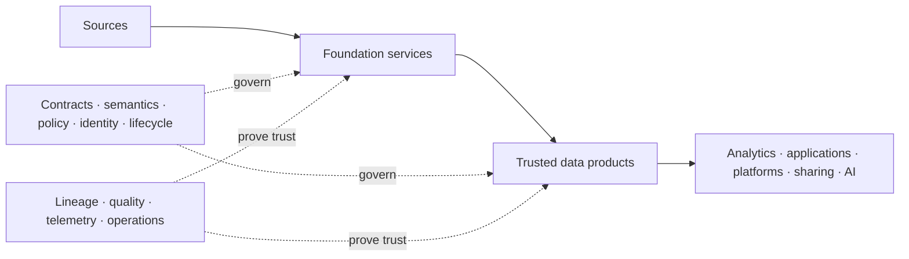

# Architecture Overview

<small>Use when</small><strong>Explaining or reviewing the foundation as a whole.</strong>

<small>Decision</small><strong>Which responsibility, boundary, or relationship must the architecture make clear?</strong>

<small>Owner</small><strong>Architecture owner with service and product owners.</strong>

<small>Output</small><strong>Agreed architecture intent, responsibility placement, and decision path.</strong>

## Purpose

The data foundation turns distributed source data into governed data products that people, applications, platforms, partners, AI agents, and models can use with confidence.

The architecture exists to make five things explicit:

1. Where data enters and where trust is created.
2. Which capabilities are shared and which outcomes remain domain-owned.
3. Which contracts, policies, and lifecycle decisions govern each boundary.
4. How products are discovered, accessed, shared, observed, changed, and retired.
5. How every important decision can be traced to evidence and an accountable owner.

## Core Logic

This is not a pipeline-only design. Contracts, policy, identity, semantics, lineage, and observability apply across the journey rather than appearing as final review steps.

## Responsibility Layers

Read the model from user intent to platform execution. Each layer has one primary reason to exist.

  <section class="architecture-layer layer-experience">1
<strong>Experience and Access</strong>
Make foundation capabilities understandable and usable through coherent journeys and interfaces.

</section>
  
Captures intent

  <section class="architecture-layer layer-control">2
<strong>Governance and Control</strong>
Turn ownership, meaning, contracts, policy, lifecycle, and evidence into authoritative decisions.

</section>
  
Governs execution

  <section class="architecture-layer layer-services">3
<strong>Foundation Services</strong>
Provide reusable ingestion, creation, consumption, sharing, enablement, observability, and operational capabilities.

</section>
  
Creates and serves

  <section class="architecture-layer layer-products">4
<strong>Governed Data Products</strong>
Carry owned meaning, quality, interfaces, policy, service levels, and lifecycle promises.

</section>
  
Runs on

  <section class="architecture-layer layer-platform">5
<strong>Platform Runtime</strong>
Supply replaceable storage, processing, integration, access, and telemetry technology.

</section>

| Layer | Why It Exists | Boundary That Keeps It Clear |
| --- | --- | --- |
| Experience and access | Give users and systems one coherent way to discover, request, build, consume, and operate. | It does not replace catalog, contract, policy, or workflow authorities. |
| Governance and control | Make decisions consistent, enforceable, and explainable. | It defines and records control intent; services enforce it at real boundaries. |
| Foundation services | Avoid rebuilding ingestion, product creation, access, sharing, and operations for every use case. | Services own reusable capability outcomes, not domain product meaning. |
| Governed data products | Make data independently understandable, trustworthy, and reusable. | A table, pipeline, dashboard extract, or private model input is not automatically a product. |
| Platform runtime | Execute the architecture reliably and at scale. | Selected technology implements the architecture; it does not define the canonical architecture contract. |

## Three Design Classes

Every architecture concern belongs to one of three design classes. This prevents duplicated shared controls and hidden integration responsibilities.

| Design Class | Use It When | It Must Explain |
| --- | --- | --- |
| **Service-specific design** | One foundation service owns the outcome. | Purpose, scope, capabilities, interfaces, controls, service levels, dependencies, and evidence. |
| **Shared capability design** | Several services require the same authority or runtime capability. | Common responsibility, ownership, reuse boundary, policy, lifecycle, and how services consume it. |
| **Integration design** | The outcome crosses service or trust boundaries. | Handoffs, identifiers, state, policy propagation, failure behavior, recovery, and end-to-end evidence. |

The [Architecture Design Map](design-map.md) relates these design classes to each foundation service and target plane.

## Ownership Logic

The platform team centrally owns source onboarding, ingestion, source-aligned states, shared capabilities, and the reliability of paved paths. Domain teams own the meaning, fitness, lifecycle, and outcomes of aggregate and consumer-aligned products.

This balance exists for a reason:

- Central ownership keeps source capture, controls, interoperability, and operation consistent.
- Federated ownership keeps business meaning and consumer value close to accountable domains.
- Contracts make the handoff explicit without transferring all responsibility to either side.
- Shared services reduce duplication without becoming owners of every data product.

See the [Data Foundation Model](data-foundation-model.md) for the ownership boundaries, product layers, and detailed rationale.

## Architecture Principles

1. **Product before platform object.** Design around a trusted product outcome, not a table, workspace, pipeline, or tool.
2. **Contract at every material boundary.** Make promises versioned, testable, and visible to affected parties.
3. **One authority for each decision.** Catalogs, contracts, policies, lineage, semantics, and telemetry may reference each other but must not silently duplicate ownership.
4. **Govern access independently from storage.** People, workloads, and agents use logical product interfaces with separate service and data authorization.
5. **Trust requires current evidence.** Quality, freshness, lineage, usage, reliability, and incidents must be observable throughout product operation.
6. **Every service is agentic by design.** Service specialist agents expose typed skills and collaborate through the Data Service AI Assistant without replacing deterministic service authority.
7. **Contracts bound autonomy.** Published data contracts compile into policy inputs, tool scope, workflow gates, validation, and evidence; agents cannot infer wider permission.
8. **AI follows the same foundation rules.** Agents and models use governed products, declared purposes, bounded interfaces, evaluations, and traceable identities.
9. **Technology remains replaceable.** Canonical meaning, policy, contracts, and evidence survive implementation changes.

## Architecture Views

Use the smallest view that answers the current question.

| Question | View |
| --- | --- |
| What is inside the blueprint and which concerns are cross-cutting? | [Architecture Blueprint](target-architecture.md) |
| What are the core product states, objects, ownership boundaries, and relationships? | [Data Foundation Model](data-foundation-model.md) |
| Which service or shared capability owns this concern? | [Architecture Design Map](design-map.md) |
| Which promise governs this boundary? | [Data Contract Design](data-contract-design.md) |
| How do domain, lifecycle, semantics, access, and agentic use fit? | The relevant **Core Guidance** page in this section. |
| How do services hand off state and recover from failure? | [Integration Design](integration-design.md) |
| What does a foundation service provide and own? | [Services](../services/index.md) |
| Why does a major direction exist? | The rationale and principles on the applicable architecture or service page. |
| How can a selected technology implement the guidance? | **Reference Solutions**, after the technology-neutral decision is understood. |

<strong>Next:</strong> use the Architecture Blueprint for completeness or the Architecture Design Map to locate an owning design.

