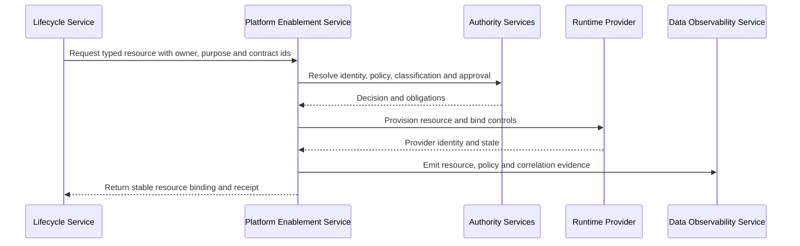

# Shared Platform Capabilities

<small>Use when</small><strong>Designing shared capabilities used by several foundation services.</strong>

<small>Decision</small><strong>What is provided once, reused consistently, and kept replaceable?</strong>

<small>Owner</small><strong>Platform Enablement Service owner with security and architecture authorities.</strong>

<small>Output</small><strong>Shared capability boundaries, provider interfaces, controls, and lifecycle evidence.</strong>

This shared design supports the canonical [Platform Enablement Service](../services/platform-enablement-service.md) architecture. It defines common control and runtime capabilities reused across services without taking lifecycle accountability from ingestion, creation, consumption, sharing, observability, or operations owners.

## Shared Capabilities

| Capability Area | What It Provides | Authoritative Boundary |
| --- | --- | --- |
| Contract and product management | Contract registry, product identifiers, lifecycle bindings, schema validation, compatibility results, and product projections. | Canonical contracts and product descriptors remain portable; provider objects are projections. |
| Catalog and storage | Technical asset registration, governed storage defaults, locations, retention, recovery, deletion, and external-object binding. | The selected catalog governs technical objects; product and semantic meaning remain in their canonical authorities. |
| Identity and security | Workload identities, named-user federation, secrets, policy bindings, delegated scopes, entitlements, and audit integration. | Enterprise identity and policy authorities issue decisions; lifecycle services enforce them at execution. |
| Integration | API gateway, event transport, workflow callbacks, schema registry, connector framework, service discovery, and stable identifiers. | Integration infrastructure transports interactions; owning services retain business and lifecycle decisions. |
| Automation | Workspace and environment provisioning, policy checks, deployment, promotion, rollback, drift detection, and deprovisioning. | Automation executes approved intent and returns receipts; it does not approve its own changes. |
| Evidence and telemetry | OpenTelemetry routing, audit retention, control receipts, reconciliation results, cost attribution, and evidence retrieval. | Evidence retains source authority, observation time, correlation ids, and access policy. |

## Architecture Blueprint Placement

| Target Plane | Shared Capability Responsibility |
| --- | --- |
| Control | Contract, catalog, policy, workflow, metadata, and automation interfaces. |
| Data | Storage, processing, event, API, sharing, and product-port runtime resources. |
| Security | Identity, secret, entitlement, policy-enforcement, audit, retention, and deletion integration. |
| Observability | Telemetry collection, correlation, evidence retention, drift, cost, and resource health. |

The Experience and AI planes consume these capabilities through their owning services. They do not receive direct platform administrator access.

## Provisioning Interaction

## Provider Boundary

Every provider adapter must support:

- A typed request independent of provider naming and object paths.
- Plan, apply, validate, rollback, reconcile, and deprovision operations.
- Stable mappings between foundation identifiers and provider identifiers.
- Idempotency, retry safety, timeout behavior, and partial-failure reporting.
- Policy obligations, telemetry, cost attribution, and immutable receipts.
- Export or migration of canonical metadata and an approved exit path.

## Integration Responsibilities

| Owning Service | Requests from Platform Enablement | Remains Accountable For |
| --- | --- | --- |
| Data Ingestion | Connection, secret, source storage, checkpoint, schema, and retention resources. | Source onboarding, delivery, validation, quarantine, replay, and source-aligned outcome. |
| Data Product Creation | Workspace, workload, product storage, catalog, policy, deployment, and release resources. | Product semantics, transformation, quality, lineage, compatibility, and go-live evidence. |
| Data Consumption | Consumer identity, endpoint, entitlement, policy, adapter, and revocation resources. | Product and port resolution, purpose, authorization orchestration, obligations, and usage receipt. |
| Data Sharing | Recipient identity, package, delivery, entitlement, expiry, and deletion resources. | Approved recipient purpose, minimization, delivery behavior, monitoring, revocation, and offboarding. |
| Data Observability | Collector, exporter, dashboard, alert, evidence store, and retention resources. | Signal semantics, correlation, health interpretation, SLOs, and product-impact evidence. |
| Data Foundation Operations | Service-management integration, responder role, notification, continuity, and evidence resources. | Operational command, communication, recovery validation, and improvement ownership. |

## Controls

- No resource without an owner, purpose, environment, lifecycle, classification, and deprovisioning condition.
- No provider object becomes the only record of a contract, product, policy, entitlement, or decision.
- No lifecycle service receives unrestricted platform credentials.
- No provisioning completes until required policy bindings and telemetry are active.
- No deletion or deprovisioning is marked complete without reconciliation and evidence.
- Every exception has an owner, expiry, compensating controls, and migration path.

## Done Criteria

- Every shared capability has a stable service interface and provider adapter boundary.
- At least one end-to-end product provisions, changes, reconciles, rolls back, and deprovisions resources through the service.
- Control and provider state reconcile through stable identifiers.
- Identity, policy, telemetry, retention, deletion, and recovery paths are tested.
- A provider can be replaced without redefining the product, contract, or owning service outcome.

<strong>Next:</strong> use the Integration Design to define how lifecycle services request, receive, reconcile, and recover shared platform capabilities.

