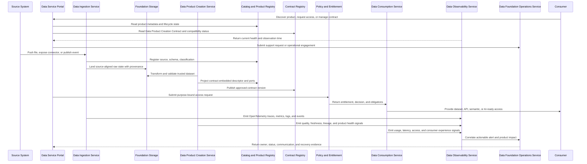

# Platform Architecture

<small>Use when</small><strong>Translating the target into technology-neutral capabilities.</strong>

<small>Decision</small><strong>Which capabilities and interactions are required?</strong>

<small>Owner</small><strong>Platform architect and service owners.</strong>

<small>Output</small><strong>Capability map, interfaces, and critical flow.</strong>

The platform architecture shows the minimum building blocks needed to realize the architecture blueprint. Technology can vary; these capabilities should not.

!!! info "Architecture classification"
    This is an **integration design** and technology-neutral capability composition. It connects service-specific designs through shared platform capabilities; it does not replace their service definitions or select a provider.

## Design Reasoning

<small>Context</small>
Foundation services need a coherent platform while technology and provider choices change.

<small>Forces</small>
Shared consistency and scale must coexist with service ownership, domain autonomy, and replaceability.

<small>Decision</small>
Compose technology-neutral capabilities around the product flow and connect them through stable service interfaces.

<small>Consequences</small>
Shared capabilities reduce duplication, but every provider mapping needs an explicit boundary and exit path.

<small>Verification</small>
Map each capability to an owning service, interface, blueprint plane, critical flow, and portability test.

## Architecture View

Read the primary data flow from sources through ingestion, creation, physical product storage, unified access or sharing, and consumption. Portal, product control, enablement, observability, and operations are horizontal services around that flow.

These services realize the architecture blueprint; they are not additional architecture planes. Use the [Architecture Blueprint](target-architecture.md) for cross-cutting plane responsibilities and this view for capability interaction.

  <a class="reference-rail rail-portal" href="../../services/data-service-portal/"><strong>Data Service Portal</strong>Marketplace · journeys · workspaces · requests · status · evidence · AI assistant orchestration</a>
  <a class="reference-rail rail-control" href="../data-contract-design/"><strong>Product Control Backbone</strong>Catalog · product registry · contracts and compiler · semantics · policy · lineage · quality · workflow</a>
  

    
<strong>Source systems</strong>Files · APIs · databases · events
<i aria-hidden="true"></i>
    <a class="reference-node node-build" href="../../services/data-ingestion-service/"><strong>Data Ingestion</strong>Centrally managed source-aligned states</a><i aria-hidden="true"></i>
    <a class="reference-node node-build" href="../../services/data-product-creation-service/"><strong>Product Creation</strong>Federated aggregate and consumer-aligned products</a><i aria-hidden="true"></i>
    <a class="reference-node node-store" href="../data-foundation-model/"><strong>Product Storage</strong>Governed · durable · distributed</a><i aria-hidden="true"></i>
    <a class="reference-node node-access" href="../unified-access-design/"><strong>Unified Access</strong>Product · port · policy · context · adapter</a><i aria-hidden="true"></i>
    
<strong>BI · Apps · Platforms · AI</strong>SQL · APIs · events · features · retrieval

  

  
Approved exchange path<a href="../../services/data-sharing-service/"><strong>Data Sharing</strong>Internal and external · expiry · audit · revocation</a>

  <a class="reference-rail rail-enable" href="../../services/platform-enablement-service/"><strong>Platform Enablement across every data service</strong>Contracts · storage lifecycle · identity · security · integration · catalog synchronization · automation</a>
  

    <a href="../../services/data-observability-service/"><strong>Data Observability</strong>OpenTelemetry · product health · SLOs · lineage · usage · impact</a>
    <a href="../../services/data-foundation-operations-service/"><strong>Foundation Operations</strong>Support · incident · problem · change · release · recovery · improvement</a>
  

The primary flow contains an explicit ownership handoff. The foundation platform team centrally manages Data Ingestion and source-aligned raw and validated states. Domain data teams use Product Creation as a shared service and remain accountable for the aggregate and consumer-aligned products they publish.

Every service in this view also exposes a service-owned specialist agent and typed skills. The Data Service AI Assistant coordinates those agents, while published contracts, policy, and deterministic service APIs bound and enforce their actions.

## Capability Map

| Domain | Capabilities |
| --- | --- |
| Portal | Intent-led journeys, Data Product Marketplace, product comparison and detail, three contract types, portfolio, and product health. |
| Ingestion | Files, APIs, connectors, CDC, streams, validation. |
| Storage and processing | Source-aligned raw and validated states, product storage, archive, batch, and streaming. |
| Products | Registry, contracts, semantics, ownership, lifecycle, go-live approval. |
| Consumption | Unified product and port resolution, SQL, semantic layer, APIs, events, files, features, retrieval, context, federation, and runtime adapters. |
| Sharing | Internal exchange, external packages, APIs, clean rooms, revocation. |
| Platform enablement | Storage lifecycle, contract system, identity and security bindings, catalog synchronization, integration interfaces, provisioning, reconciliation, and deprovisioning. |
| Observability | OpenTelemetry, SLOs, health, incidents, usage, lineage correlation. |
| Operations and reliability | Service portfolio, support, incident, problem, change, release, continuity, communication, error budgets, and improvement. |
| Agentic AI | Data Service AI Assistant orchestration, service specialist agents, contract compiler, agent gateway, agent and skill registry, model gateway, context, memory, approval, evaluation, and receipts. |
| Governance and security | Named-user and workload identity, policy administration and decision, service and data enforcement, entitlement, classification, masking, audit. |

## Interoperability Boundaries

| Boundary | Portable Contract |
| --- | --- |
| Portal to control plane | Stable APIs; portal stores workflow state, not duplicate product truth. |
| Product to catalog | ODPS-compatible descriptor projected from the publishing data contract, plus DCAT-compatible catalog exchange. |
| Producer to consumer | Stable logical product port with ODCS contract plus OpenAPI, AsyncAPI, table, query, file, feature, retrieval, semantic, or context interface definition. |
| Runtime to lineage | Exportable run, job, and dataset lineage records with stable identifiers. |
| Runtime to observability | OpenTelemetry semantic conventions and OTLP export. |
| Assistant to service agents | Typed delegated-task envelope; optional A2A adapter for independent runtimes; contract, identity, purpose, scope, budget, approval, and correlation preserved. |
| Provider to external recipient | Open sharing protocol or documented, tested export adapter with revocation. |

See the [Open Interoperability Standard](../standards/open-interoperability-standard.md) for profiles and conformance tests.

The [Data Service Portal](../services/data-service-portal.md) defines how portal journeys compose these boundaries without becoming an additional system of record.

## Reference Flow

## Platform Enablement Across Services

Cross-cutting technical capabilities are delivered through the [Platform Enablement Service](../services/platform-enablement-service.md). They are provided once because several data services need the same secure, interoperable runtime foundations. They are not separate business-facing services, and using them does not transfer accountability away from the service that delivers the user outcome.

### Shared Enablement Capabilities

| Capability | Why It Is Shared | Ownership Boundary |
| --- | --- | --- |
| Contract and schema system | Services need one versioned contract lifecycle, compiler, schema registry, validation interface, and evidence model. | Contract owners approve meaning and promises; each service enforces the applicable contract at its boundary. |
| Storage lifecycle | Ingestion and product services need consistent provisioning, encryption, retention, archival, recovery, quota, and deprovisioning. | Platform Enablement manages the storage capability; product and service owners remain accountable for data lifecycle decisions. |
| Identity and security bindings | Named users, workloads, delegated agents, secrets, keys, policy points, and audit need consistent trust and revocation. | Security authorities define policy; each service authorizes its operations and data release at execution time. |
| Catalog and metadata synchronization | Product identity, ownership, contracts, ports, lineage, classification, and runtime metadata must remain correlated. | Authoritative systems retain their records; enablement synchronizes projections without creating another source of truth. |
| Integration foundations | APIs, events, workflow callbacks, service discovery, identity propagation, retries, and correlation must work consistently across service boundaries. | Integration capabilities transport requests and evidence; the receiving service owns validation, state, and completion. |
| Provisioning and automation | Standard environments, resources, controls, telemetry bindings, and teardown should be repeatable and policy compliant. | Platform Enablement automates approved patterns; service owners approve profiles and remain accountable for workload behavior. |

### Service Dependency View

| Data Service | Platform Enablement It Uses | Outcome That Remains Service-Owned |
| --- | --- | --- |
| Data Service Portal | Identity, contract APIs, catalog synchronization, workflow integration, and audit bindings. | User journeys, marketplace experience, requests, status, and evidence presentation. |
| Data Service AI Assistant | Delegated identity, agent and skill registry, model profiles, policy integration, budgets, and telemetry bindings. | Grounded coordination, bounded delegation, approval experience, and task receipts. |
| Data Ingestion Service | Source identities, connectors, contract and schema validation, storage lifecycle, secrets, and runtime provisioning. | Reliable source receipt, validation, quarantine, replay, and source-aligned publication. |
| Data Product Creation Service | Workspaces, product storage, contract compilation, catalog projection, deployment automation, and policy bindings. | Product transformation, semantics, quality, testing, go-live, rollback, and lifecycle. |
| Data Consumption Service | Unified identity and policy bindings, catalog resolution, adapters, entitlement provisioning, and revocation. | Purpose-bound product access, obligations, channel behavior, and consumption evidence. |
| Data Sharing Service | Recipient identity, package storage, secure exchange adapters, secrets, expiry, and revocation integration. | Recipient approval, minimization, delivery, monitoring, offboarding, and sharing evidence. |
| Data Observability Service | Telemetry collectors, identity, storage, catalog synchronization, integration endpoints, and retention controls. | System and data product insight, SLO evaluation, impact correlation, and actionable alerts. |
| Data Foundation Operations Service | Identity, workflow integration, event routing, automation hooks, audit, and operational data retention. | Support, incident, problem, change, release, recovery, communication, and improvement. |

Platform Enablement is therefore a dependency of every data service, not a replacement for them. A service design is incomplete until it identifies the enablement capabilities it consumes, the interface and SLO for each dependency, and the fallback or recovery behavior when an enablement capability is unavailable.

## Readability Notes

- Use the diagram to explain component interaction.
- Use the capability map to check scope coverage.
- Use the reference flow to validate an end-to-end design.
- Use standards pages for mandatory contract, product, AI, and telemetry rules.
- Use conformance tests to prove that architecture boundaries are portable in practice.

  <strong>Next:</strong> use the Implementation Blueprint to turn this into delivery work.

