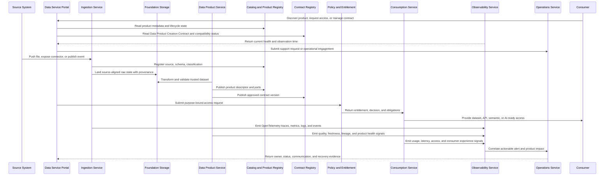

# Reference Architecture

<small>Use when</small><strong>Translating the target into technology-neutral capabilities.</strong>

<small>Decision</small><strong>Which capabilities and interactions are required?</strong>

<small>Owner</small><strong>Platform architect and service owners.</strong>

<small>Output</small><strong>Capability map, interfaces, and critical flow.</strong>

The reference architecture shows the minimum building blocks needed to implement the target architecture. Technology can vary; these capabilities should not.

## Architecture View

Read the primary data flow from sources through ingestion, creation, physical product storage, unified access or sharing, and consumption. Portal, product control, enablement, observability, and operations are horizontal services around that flow.

These services implement the target architecture; they are not additional target architecture planes. Use the [Target Architecture](target-architecture.md) for cross-cutting plane responsibilities and this view for capability interaction.

  <a class="reference-rail rail-portal" href="../data-service-portal-model/"><strong>Data Service Portal</strong>Marketplace · journeys · workspaces · requests · status · evidence · AI assistant</a>
  <a class="reference-rail rail-control" href="../data-contract-design/"><strong>Product Control Backbone</strong>Unity Catalog · product registry · contracts · semantics · policy · lineage · quality · workflow</a>
  

    
<strong>Source systems</strong>Files · APIs · databases · events
<i aria-hidden="true"></i>
    <a class="reference-node node-build" href="../../services/data-ingestion-service/"><strong>Data Ingestion</strong>Centrally managed source-aligned states</a><i aria-hidden="true"></i>
    <a class="reference-node node-build" href="../../services/data-product-creation-service/"><strong>Product Creation</strong>Federated aggregate and consumer-aligned products</a><i aria-hidden="true"></i>
    <a class="reference-node node-store" href="../data-product-creation-design/"><strong>Product Storage</strong>Delta Lake · distributed runtimes</a><i aria-hidden="true"></i>
    <a class="reference-node node-access" href="../unified-access-design/"><strong>Unified Access</strong>Product · port · policy · context · adapter</a><i aria-hidden="true"></i>
    
<strong>BI · Apps · Platforms · AI</strong>SQL · APIs · events · features · retrieval

  

  
Approved exchange path<a href="../../services/data-sharing-service/"><strong>Data Sharing</strong>Internal and external · expiry · audit · revocation</a>

  <a class="reference-rail rail-enable" href="../../services/platform-enablement-service/"><strong>Platform Enablement</strong>Contracts · Delta lifecycle · identity · security · integration · catalog synchronization · automation</a>
  

    <a href="../../services/data-observability-service/"><strong>Data Observability</strong>OpenTelemetry · product health · SLOs · lineage · usage · impact</a>
    <a href="../../services/data-foundation-operations-service/"><strong>Foundation Operations</strong>Support · incident · problem · change · release · recovery · improvement</a>
  

The primary flow contains an explicit ownership handoff. The foundation platform team centrally manages Data Ingestion and source-aligned raw and validated states. Domain data teams use Product Creation as a shared service and remain accountable for the aggregate and consumer-aligned products they publish.

## Capability Map

| Domain | Capabilities |
| --- | --- |
| Portal | Intent-led journeys, Data Product Marketplace, product comparison and detail, three contract types, portfolio, and product health. |
| Ingestion | Files, APIs, connectors, CDC, streams, validation. |
| Storage and processing | Source-aligned raw and validated states, product storage, archive, batch, and streaming. |
| Products | Registry, contracts, semantics, ownership, lifecycle, go-live approval. |
| Consumption | Unified product and port resolution, SQL, semantic layer, APIs, events, files, features, retrieval, context, federation, and runtime adapters. |
| Sharing | Internal exchange, external packages, APIs, clean rooms, revocation. |
| Platform enablement | Storage lifecycle, contract system, identity and security bindings, catalog synchronization, integration interfaces, provisioning, reconciliation, and deprovisioning. |
| Observability | OpenTelemetry, SLOs, health, incidents, usage, lineage correlation. |
| Operations and reliability | Service portfolio, support, incident, problem, change, release, continuity, communication, error budgets, and improvement. |
| Agentic AI | Data Service AI Assistant, agent gateway, agent and skill registry, LLM gateway, context, memory, approval, evaluation. |
| Governance and security | Named-user and workload identity, policy administration and decision, service and data enforcement, entitlement, classification, masking, audit. |

## Interoperability Boundaries

| Boundary | Portable Contract |
| --- | --- |
| Portal to control plane | Stable APIs; portal stores workflow state, not duplicate product truth. |
| Product to catalog | ODPS-compatible descriptor and DCAT-compatible catalog exchange. |
| Producer to consumer | Stable logical product port with ODCS contract plus OpenAPI, AsyncAPI, table, query, file, feature, retrieval, semantic, or context interface definition. |
| Runtime to lineage | OpenLineage-compatible run, job, and dataset events. |
| Runtime to observability | OpenTelemetry semantic conventions and OTLP export. |
| Provider to external recipient | Open sharing protocol or documented, tested export adapter with revocation. |

See the [Open Interoperability Standard](../standards/open-interoperability-standard.md) for profiles and conformance tests.

The [Data Service Portal Design](data-service-portal-model.md) defines how portal journeys compose these boundaries without becoming an additional system of record.

## Reference Flow

## Cross-Cutting Services

- Identity and access management
- Workload identity, delegated identity, policy decision, service and data enforcement, entitlement lifecycle, and revocation
- Secrets and key management
- Metadata and catalog
- Data quality and observability
- OpenTelemetry collection and telemetry correlation
- Policy enforcement and audit
- Schema registry and contract testing
- Lineage and impact analysis
- Platform monitoring and cost controls
- Service management, support, incident, problem, change, release, continuity, and operational improvement
- Agent and skill registry, model gateway, evaluation service, scoped memory, and human approval

## Readability Notes

- Use the diagram to explain component interaction.
- Use the capability map to check scope coverage.
- Use the reference flow to validate an end-to-end design.
- Use standards pages for mandatory contract, product, AI, and telemetry rules.
- Use conformance tests to prove that architecture boundaries are portable in practice.

  <strong>Next:</strong> use the Architecture Blueprint to turn this into delivery work.

