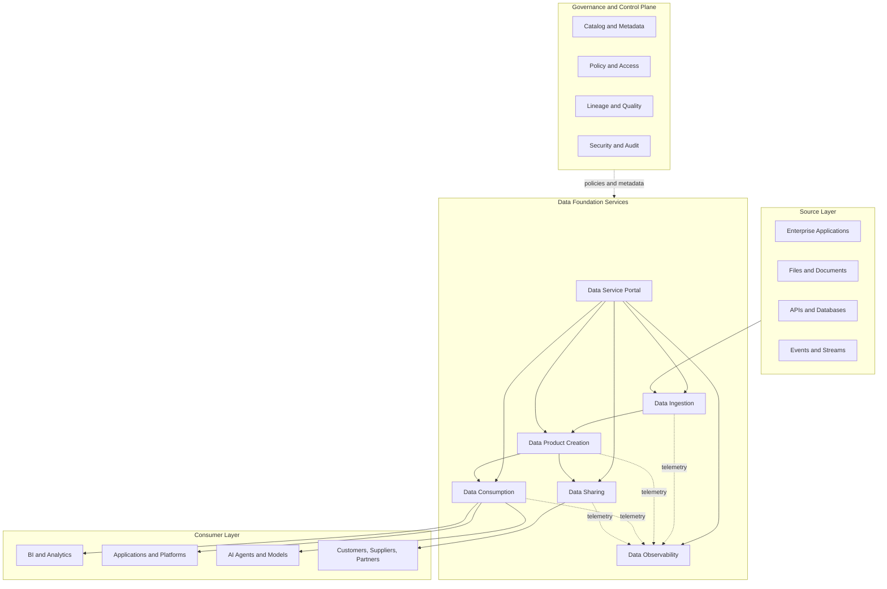
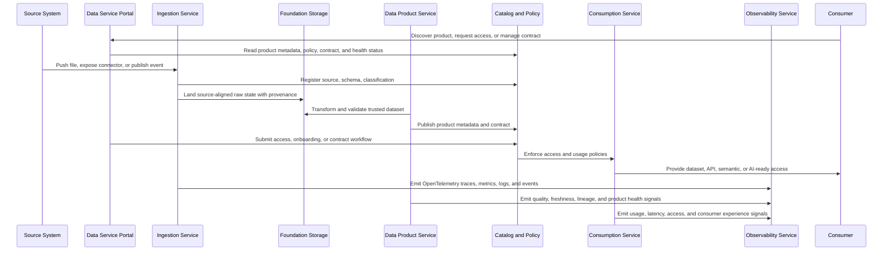

# Reference Architecture

The reference architecture shows the minimum building blocks needed to implement the target architecture. Technology can vary; these capabilities should not.

## Architecture View

## Capability Map

| Domain | Capabilities |
| --- | --- |
| Portal | Intent-led journeys, product discovery, product detail, agreements, portfolio, contracts, product health. |
| Ingestion | Files, APIs, connectors, CDC, streams, validation. |
| Storage and processing | Source-aligned raw and validated states, product storage, archive, batch, and streaming. |
| Products | Registry, contracts, semantics, ownership, lifecycle, go-live approval. |
| Consumption | Unified product and port resolution, SQL, semantic layer, APIs, events, files, features, retrieval, context, federation, and runtime adapters. |
| Sharing | Internal exchange, external packages, APIs, clean rooms, revocation. |
| Observability | OpenTelemetry, SLOs, health, incidents, usage, lineage correlation. |
| Agentic AI | Data Service AI Assistant, agent gateway, agent and skill registry, LLM gateway, context, memory, approval, evaluation. |
| Governance and security | Named-user and workload identity, policy administration and decision, service and data enforcement, entitlement, classification, masking, audit. |

## Interoperability Boundaries

| Boundary | Portable Contract |
| --- | --- |
| Portal to control plane | Stable APIs; portal stores workflow state, not duplicate product truth. |
| Product to catalog | ODPS-compatible descriptor and DCAT-compatible catalog exchange. |
| Producer to consumer | Stable logical product port with ODCS contract plus OpenAPI, AsyncAPI, table, query, file, feature, retrieval, semantic, or context interface definition. |
| Runtime to lineage | OpenLineage-compatible run, job, and dataset events. |
| Runtime to observability | OpenTelemetry semantic conventions and OTLP export. |
| Provider to external recipient | Open sharing protocol or documented, tested export adapter with revocation. |

See the [Open Interoperability Standard](../standards/open-interoperability-standard.md) for profiles and conformance tests.

The [Data Service Portal model](data-service-portal-model.md) defines how portal journeys compose these boundaries without becoming an additional system of record.

## Reference Flow

## Cross-Cutting Services

- Identity and access management
- Workload identity, delegated identity, policy decision, service and data enforcement, entitlement lifecycle, and revocation
- Secrets and key management
- Metadata and catalog
- Data quality and observability
- OpenTelemetry collection and telemetry correlation
- Policy enforcement and audit
- Schema registry and contract testing
- Lineage and impact analysis
- Platform monitoring and cost controls
- Agent and skill registry, model gateway, evaluation service, scoped memory, and human approval

## Readability Notes

- Use the diagram to explain component interaction.
- Use the capability map to check scope coverage.
- Use the reference flow to validate an end-to-end design.
- Use standards pages for mandatory contract, product, AI, and telemetry rules.
- Use conformance tests to prove that architecture boundaries are portable in practice.

  <strong>Next:</strong> use the Architecture Blueprint to turn this into delivery work.

