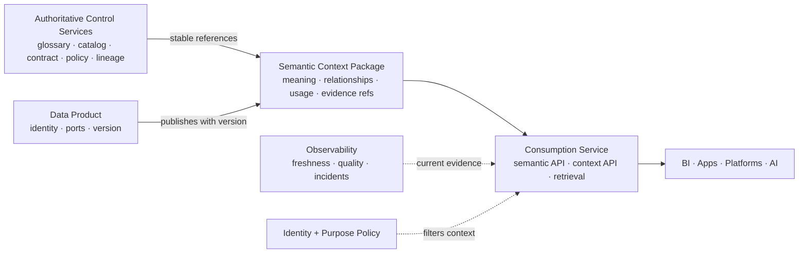
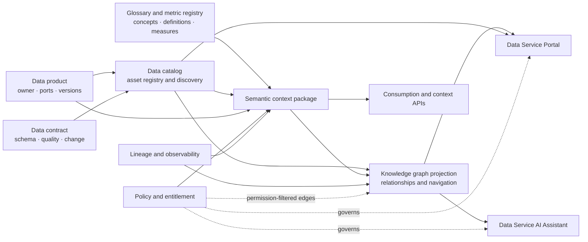

# Semantic and Context Design

Semantic and context capabilities make a data product understandable to people, applications, and AI. They fit into the existing **control plane** and travel with the product; they do not create a new foundation layer or system of record.

## Simple Design Rule

Every live data product publishes a versioned **semantic context package** that answers four questions:

1. **What does it mean?** Business concepts, terms, metrics, units, and relationships.
2. **When is it valid?** Time meaning, grain, scope, assumptions, and known limitations.
3. **How may it be used?** Intended and prohibited uses, classification, purpose, and policy references.
4. **What can be trusted now?** Product version, contract, lineage, freshness, quality, and current health references.

The package references authoritative records. It does not copy the glossary, contract, policy, lineage graph, or telemetry store.

## Architecture Fit



| Existing Architecture Area | Semantic and Context Responsibility |
| --- | --- |
| Control plane | Own concept identifiers, glossary terms, metric definitions, relationships, policy references, and package validation. |
| Data product | Declare the product-specific semantic context version and bind it to product and contract versions. |
| Data Service Portal | Present meaning, scope, metrics, examples, limitations, and current trust evidence on the product page. |
| Consumption Service | Serve semantic models and permission-filtered context through stable APIs and retrieval interfaces. |
| Data Service AI Assistant | Retrieve only the context allowed by identity, purpose, product contract, and current policy. |
| Observability | Provide current health references and record product, context, and contract versions used by consumers. |

## Catalog and Knowledge Graph Fit

The **data catalog** belongs in the control plane and remains the authoritative registry for discoverable assets and their governance context. It should register products, ports, contracts, owners, classifications, interfaces, lifecycle state, lineage references, quality references, and semantic references.

The **semantic and context layer** is the product-facing explanation of a product. It packages meaning, grain, metrics, relationships, valid and prohibited uses, limitations, and trust references for a specific product and contract version. It references catalog and governance authorities; it does not duplicate them.

A **knowledge graph** is an optional derived projection that connects catalog assets, concepts, products, contracts, lineage, policies, consumers, incidents, and use cases. It is valuable for impact analysis, discovery, recommendation, semantic search, and AI grounding, but it must not become the canonical owner of product metadata, access decisions, contracts, or quality results.



### Authority Rules

| Concern | Authoritative source | Catalog or graph role |
| --- | --- | --- |
| Product identity and lifecycle | Product registry and catalog | Register, index, and expose relationships. |
| Schema and compatibility | Data contract registry | Link contract versions and impact paths. |
| Business concepts and metrics | Glossary and metric registry | Connect terms, products, metrics, and use cases. |
| Access decisions and obligations | Policy decision and entitlement services | Show permitted relationships only after policy filtering. |
| Runtime lineage | OpenLineage and lineage service | Project upstream/downstream paths and impact edges. |
| Quality and current health | Data quality and observability services | Link current evidence and observation time; do not copy detailed profiles. |
| Product meaning for consumers and AI | Versioned semantic context package | Serve permission-filtered context and citations. |

### Recommended Graph Scope

Start with a small, useful graph vocabulary:

`Product -> Port -> Contract -> Concept -> Metric -> Source -> Pipeline -> Product -> Consumer -> Use Case`

Add policy, incident, quality, semantic-context, agent, and model edges when they support a specific workflow. Keep graph projections rebuildable from authoritative records, version the graph schema, and apply identity and purpose filtering before returning graph results.

The graph should answer questions such as:

- Which products contain this business concept or metric?
- Which consumers and AI products depend on this product version?
- Which contract, pipeline, source, or incident explains this quality breach?
- Which products are permitted for this user, purpose, and use case?

It should not answer an access request by itself. The graph can recommend or explain; the policy decision point must authorize.

## Semantic Context Package

The minimum portable representation is YAML or JSON. Platform-specific graphs, semantic models, embeddings, and indexes are projections of this artifact.

```yaml
apiVersion: data.foundation/v1alpha1
kind: SemanticContext
metadata:
  id: customer-profile-context
  version: 2.1.0
spec:
  productRef: customer-profile@2.1.0
  contractRef: customer-profile-contract@2.1.0
  grain: one record per active customer
  concepts:
    - id: business.customer
      termRef: glossary/customer
  metrics:
    - id: active_customer_count
      definitionRef: metrics/active-customer-count@1.3.0
      unit: customer
  relationships:
    - subject: business.customer
      predicate: belongs_to
      object: business.market_segment
  context:
    validFor: [customer_service, commercial_analytics]
    prohibitedFor: [automated_credit_decision]
    limitations: [source updates once per day]
  evidence:
    lineageRef: lineage/customer-profile@2.1.0
    healthRef: health/customer-profile
```

## Ownership and Authority

| Content | Accountable Owner | Authority |
| --- | --- | --- |
| Business concepts and definitions | Domain steward | Glossary or semantic registry |
| Product grain, scope, and limitations | Data product owner | Product descriptor and context package |
| Schema and field semantics | Product owner and steward | Data contract |
| Metrics and calculation rules | Metric owner | Governed metric registry or semantic model |
| Usage and prohibited purposes | Product owner and risk owner | Contract and policy service |
| Lineage and current health | Platform services | Lineage and observability systems |

## Serving Patterns

| Consumer | Served Context |
| --- | --- |
| BI | Governed dimensions, metrics, units, grain, filters, and time semantics. |
| Application | Field meaning, enumerations, relationships, API examples, and compatibility rules. |
| Platform | Stable concept ids, product relationships, ports, policy, and dependency context. |
| AI retrieval or agent | Permission-filtered definitions, examples, limitations, lineage, freshness, and citations bound to exact versions. |

## Keep It Simple

- Start with context packages for high-value products, not an enterprise-wide ontology program.
- Reuse stable glossary, metric, product, contract, and policy identifiers.
- Model only relationships needed for discovery, consumption, policy, lineage, or AI grounding.
- Generate indexes and graph projections; do not make them the canonical source.
- Keep current health dynamic and referenced, not copied into the package.
- Version semantic changes and run consumer-impact checks with contract changes.

## Done Criteria

- The package has a stable id and is bound to exact product and contract versions.
- Terms, concepts, metrics, policies, lineage, and health use authoritative references.
- Grain, time meaning, scope, valid uses, prohibited uses, and limitations are explicit.
- Portal, semantic API, context API, and AI retrieval return consistent meaning.
- Context access applies identity, purpose, classification, and field-level policy.
- Telemetry records product, contract, and semantic context versions used.
- Breaking semantic changes trigger impact analysis and consumer notification.

<div class="read-next">
  <strong>Next:</strong> add the semantic context package to the Data Product Template and enforce it at product go-live.
</div>
