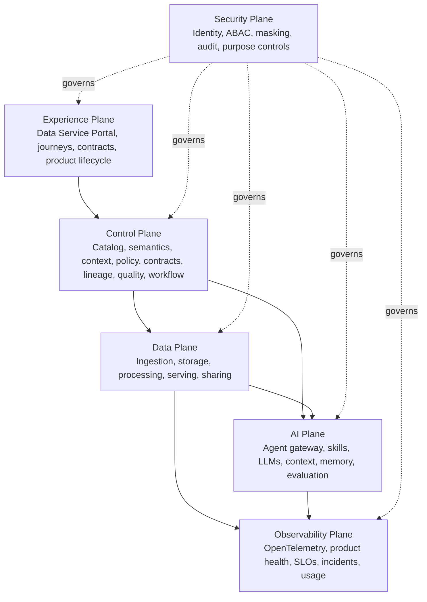

# Target Architecture

The target architecture is organized into six planes. Each plane has a clear responsibility, but they operate together through shared metadata, contracts, policies, telemetry, and workflow.

## Architecture Planes

## Plane Responsibilities

| Plane | Owns | State-of-the-Art Expectation |
| --- | --- | --- |
| Experience | Intent-led portal journeys, product discovery, product detail, developer workspaces, API and CLI, agreements, portfolio, contract workflows, product health views. | One coherent experience with channel parity for users, developers, decisions, and evidence. |
| Control | Catalog, semantic registry, context packages, knowledge graph projections, contracts, policy, lineage, quality rules, workflow, go-live gates. | Metadata-driven governance and automation with clear authority boundaries. |
| Data | Source onboarding, source-aligned raw and validated states, products, unified logical access, serving, and sharing. | Standard product ports over custom pipelines and provider-native paths. |
| AI | Agent gateway, skill registry, LLM gateway, governed context, scoped memory, evaluation, retrieval and AI lineage. | Agents are bounded, governed, traceable and purpose-bound. |
| Observability | OpenTelemetry, SLOs, product health, incidents, usage, cost. | Trust is measured end to end. |
| Security | Named-user and workload identity, delegated authority, service authorization, data authorization, ABAC, purpose, masking, entitlement, audit, retention, sharing controls. | Every request passes separate service and data decisions; security follows data and identities. |

## Core Design Moves

1. Make the **Data Service Portal** the entry point for all user journeys.
2. Treat **data contracts** as executable controls, not documents.
3. Manage **data products** as a portfolio with go-live approval, health, usage, and retirement.
4. Use **policy-as-code** for access, masking, AI purpose, and sharing decisions.
5. Emit **OpenTelemetry** from every foundation service and product lifecycle event.
6. Link AI usage back to product version, contract version, identity, purpose, and lineage.
7. Keep canonical contracts, product descriptors, metadata, lineage, and interfaces portable through the open interoperability profile.
8. Organize the Data Service Portal around domain teams, use cases, workspaces, products, contracts, agreements, semantics, and measured trust evidence.
9. Make foundation services agent-callable through typed skills while keeping policy, workflow and approval deterministic.
10. Give data developers a declarative workspace with versioned workload intent, isolated environments, automated promotion, rollback, and portal/API/CLI parity.
11. Bind each product to a versioned semantic context package that references authoritative terms, metrics, policies, lineage, and health.
12. Separate service authorization from data authorization and apply both to named users, workloads, delegated applications, agents, and external recipients.
13. Place a unified logical access layer above physical product storage while keeping execution distributed and close to approved runtimes.

## Critical Flows

| Flow | Required Outcome |
| --- | --- |
| Source to product | Source contract, ingestion validation, lineage, quality, product go-live. |
| Product to consumer | Portal discovery, access approval, policy enforcement, subscription, usage telemetry. |
| Access decision | Authenticate actor and subject, authorize service operation, authorize product data and purpose, enforce obligations, record evidence. |
| Logical product access | Resolve product port, contract, context, policy and health; select adapter; execute near data; validate result; emit evidence. |
| Contract change | Compatibility check, impact analysis, approval, notification, migration path. |
| Product incident | SLO breach, affected consumers, source impact, owner routing, evidence capture. |
| AI access | AI purpose approval, governed identity, retrieval or feature control, model-to-data trace. |
| Agent action | Authenticated intent, bounded plan, approved skill, policy decision, typed tool call, receipt and trace. |
| Product deployment | Versioned workload specification, environment plan, policy checks, preview, progressive release, evidence, and deterministic rollback. |
| External sharing | Recipient scope, minimization, entitlement, expiry, revocation, audit. |

## Minimum State-of-the-Art Bar

The architecture should not be called mature unless these are true:

- Products cannot go live without approved contracts and passing go-live gates.
- Consumers access products through governed serving or sharing patterns.
- Product health is visible in the portal.
- Contract changes are tested before release and communicated to subscribers.
- AI agents and models use governed identities and approved purposes.
- Observability connects source, pipeline, product, consumer, contract, and incident.
- Security policies are enforced by services, not only written in documentation.
- Canonical artifacts can be exported, validated, and imported without a platform-specific control plane.
- Agent actions cannot exceed the user's delegated authority, registered skill contract, approved autonomy or task budget.

## State-of-the-Art Checklist

| Question | Required Answer |
| --- | --- |
| Can users find, request, and subscribe through one portal? | Yes |
| Are contracts tested before data is published? | Yes |
| Can a product go live without quality, lineage, or an owner? | No |
| Can AI access bypass policy or purpose approval? | No |
| Can incidents show affected consumers and source impact? | Yes |
| Can products be retired safely with migration evidence? | Yes |
| Can a product move between platforms without losing contract, metadata, lineage, or policy intent? | Yes |

  <strong>Next:</strong> use the Reference Architecture to map these planes to concrete platform capabilities, then apply the Open Interoperability Standard.

