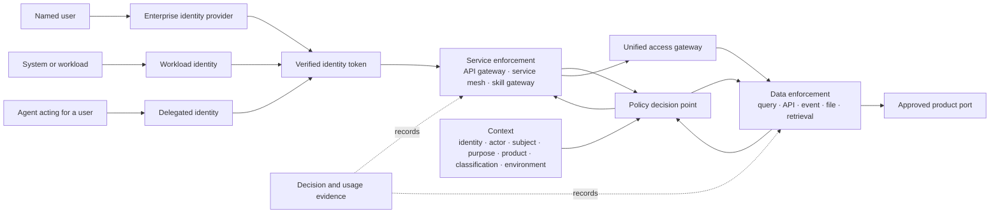
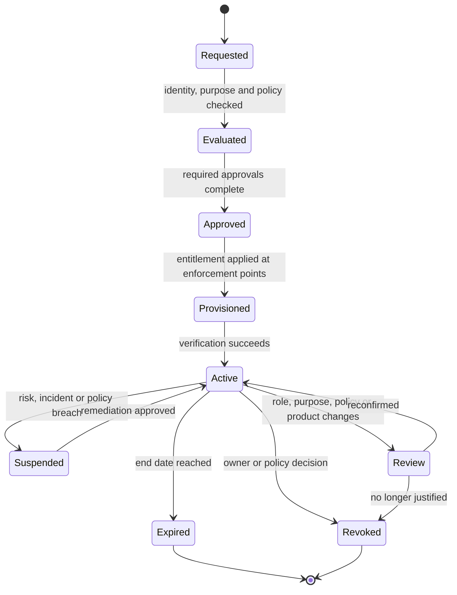

# Unified Access Design

Unified Access Design combines the governed logical access surface with the identity, authorization, entitlement, and evidence model above physical data-product storage. It gives named users, systems, applications, platforms, agents, and models one consistent way to access live products without forcing all data into one engine or location.

It is implemented by the **Data Consumption Service**. It is not a new system of record, storage layer, or mandatory central query engine.

## Architecture

Read the main path from top to bottom. Control services provide authoritative decision context; observability records the decision and execution outcome.

  <section class="access-map-band access-map-consumers">
    <small>Consumers and identities</small>
    <strong>Named users · Workloads · Applications · BI · Platforms · Agents · Models</strong>
  </section>

  

  <section class="access-map-core">
    <header><small>Logical access surface</small><strong>Unified Access Design</strong></header>
    

      <article>1<strong>Enter</strong>
SQL · API · Event · File · Semantic · Feature · Retrieval
</article>
      <article>2<strong>Resolve</strong>
Identity · Product · Port · Contract · Context · Health
</article>
      <article>3<strong>Decide</strong>
Service authorization · Data authorization · Purpose · Obligations
</article>
      <article>4<strong>Execute</strong>
Route · Push down · Federate · Validate · Minimize
</article>
    

  </section>

  

    <section><small>Authoritative control context</small><strong>Catalog · Contracts · Policy · Entitlements · Semantics · Lineage · Health</strong></section>
    <section><small>Decision and usage evidence</small><strong>OpenTelemetry · Audit · Usage · Cost · Outcome · Consumer impact</strong></section>
  

  

  <section class="access-map-band access-map-runtimes">
    <small>Physical data product storage and runtimes</small>
    

      Open tables and files
      Warehouse and query engines
      Product APIs
      Events and streams
      Feature views
      Retrieval and context indexes
    

  </section>

## Access Decision Model

Access control protects two different things. **Service authorization** controls which portal, API, workflow, agent skill, or platform operation an identity may invoke. **Data authorization** controls which product, interface, rows, columns, records, purposes, and actions that identity may use. Passing service authorization never implies data authorization.

## Identity Types

| Identity | Authentication | Typical use | Required rules |
| --- | --- | --- | --- |
| Named user | Enterprise SSO with MFA or step-up authentication. | Portal, CLI, BI, notebooks, approvals, administration. | Personal identity, current team attributes, no shared accounts, visible purpose. |
| Workload or system | Short-lived credential for a registered application, job, service, or model. | Pipelines, APIs, scheduled jobs, applications, platform integrations. | Unique identity, owner, environment, allowed services, product purposes, rotation. |
| Delegated workload | Workload identity plus verified named-user delegation. | Application or CLI acting for a user. | Preserve both actor and subject; never replace the user with a generic account. |
| Agent | Registered agent identity plus delegated user or task authority. | Data Service AI Assistant and automated workflows. | Bind agent, skill, user, purpose, autonomy, approval, product scope, and task id. |
| External recipient | Federated user or workload from an approved trust domain. | Supplier, customer, partner, or cross-company access. | Trust agreement, minimized scope, expiry, revocation, and enhanced audit. |

## Authorization Layers

### Service Authorization

Service authorization answers: **May this identity invoke this operation?**

| Control | Examples |
| --- | --- |
| Resource | Portal workflow, API route, CLI operation, agent skill, admin function. |
| Action | Read, search, draft, submit, approve, deploy, revoke, administer. |
| Decision inputs | Identity type, role, team, environment, delegation, risk, device or workload posture. |
| Enforcement points | Portal backend, API gateway, service mesh, workflow engine, agent or skill gateway. |
| Result | Permit, deny, require step-up, require approval, reduce scope, or apply rate and budget limits. |

### Data Authorization

Data authorization answers: **May this identity use this product data for this purpose and at this level of detail?**

| Control | Examples |
| --- | --- |
| Resource | Product, contract version, table, API, event topic, file package, feature view, retrieval index. |
| Action | Discover metadata, read, query, subscribe, export, share, train, retrieve, update, delete. |
| Decision inputs | Product classification, consumer identity, team, purpose, agreement, geography, time, environment, row and field attributes. |
| Enforcement points | Query gateway, database, semantic layer, API, event broker, object gateway, feature service, retrieval gateway. |
| Obligations | Row filter, column mask, tokenization, aggregation, watermarking, output limit, logging, retention, or expiry. |

Every decision evaluates:

`subject + actor + action + resource + purpose + context + policy version`

The **subject** receives access and the **actor** makes the call. For delegated applications and agents, effective access is the intersection of actor authority and subject authority.

## Core Design Principle

**Unify the access contract and controls, not the physical execution.**

The layer provides consistent identity, product addressing, contracts, policy, semantics, and evidence. Adapters push execution to the product's approved runtime whenever possible. This avoids creating a central bottleneck or copying every product into a new access store.

## Responsibilities

| Capability | Responsibility |
| --- | --- |
| Product resolution | Resolve stable product and port ids to the current approved contract, interface, runtime, and health state. |
| Identity | Authenticate named users and workloads; preserve actor and subject for delegated applications and agents. |
| Service authorization | Control which access operation, API, query, subscription, export, or administration function may be invoked. |
| Data authorization | Evaluate product, port, action, purpose, classification, agreement, row, field, and output policy. |
| Obligations | Apply masking, row filters, tokenization, aggregation, limits, watermarking, expiry, and logging requirements. |
| Semantic context | Provide governed metrics, dimensions, grain, relationships, limitations, and context version. |
| Routing and federation | Select the approved runtime adapter and push down query, filter, and policy operations where supported. |
| Contract enforcement | Validate schema, compatibility, request shape, response shape, and product-port behavior. |
| Evidence | Correlate identity, authorization, product, contract, semantic context, runtime, usage, cost, and outcome. |

## Logical Access Contract

Every exposed product port declares:

| Field | Requirement |
| --- | --- |
| Product and port id | Stable, globally resolvable identifiers. |
| Product, contract, and semantic context version | Exact compatible versions used by the interface. |
| Interface type | SQL, API, event, file, semantic, feature, retrieval, or context. |
| Physical binding | Runtime adapter and provider-native location held outside consumer contracts. |
| Supported actions | Discover, query, read, subscribe, export, retrieve, train, or administer. |
| Identity types | Named user, workload, delegated workload, agent, model, or external recipient. |
| Policy | Required purpose, classification, agreement, entitlement, and obligations. |
| Service levels | Availability, latency, freshness, throughput, and recovery targets. |
| Evidence | Required telemetry, usage, lineage, decision, and cost attributes. |

## Access Flow

1. Consumer authenticates with a named-user, workload, delegated, agent, or external identity.
2. Access layer authorizes the requested service operation.
3. Product resolver loads the approved port, contract, semantic context, health, and physical binding.
4. Policy decision evaluates data action, purpose, classification, agreement, environment, and entitlement.
5. The layer applies obligations and selects an approved runtime adapter.
6. Execution is pushed to the physical runtime or federated only where required.
7. Results are validated, minimized, and returned through the declared interface.
8. Authorization, runtime, product, usage, cost, and outcome evidence is emitted.

## Named User and System Access

| Consumer | Entry Pattern | Identity and Policy Behavior |
| --- | --- | --- |
| Named analyst | SQL, semantic model, BI connector, notebook. | User subject is evaluated directly; team, role, purpose, row, and field policy apply. |
| Application | Product API, query API, event subscription. | Unique workload identity and approved application purpose determine port, actions, fields, rate, and expiry. |
| Pipeline | Table, file, event, or query interface. | Workload, environment, input-port contract, and product dependency constrain access. |
| Delegated application | API, CLI, notebook, or portal backend acting for a user. | Both application actor and user subject must be allowed; effective access is their intersection. |
| Agent or model | Context, retrieval, feature, API, or approved query interface. | Agent or model actor, delegated user, skill, purpose, product contract, and AI-use policy are all evaluated. |

## Entitlement Lifecycle

Access is never permanent by default. Every entitlement has an owner, subject, purpose, product or service scope, environment, start time, expiry, review trigger, and revocation path.

## Authority Boundaries

| Component | Owns | Does not own |
| --- | --- | --- |
| Identity provider | Authentication, named-user identity, groups, core attributes, MFA. | Product-specific authorization. |
| Workload identity service | Application and runtime identities, credential issuance, trust domains. | Business purpose approval. |
| Policy administration | Versioned policies, tests, approval, publication. | Runtime enforcement or entitlement state. |
| Policy decision point | Consistent decisions and obligations from current context. | Authentication or direct data serving. |
| Service enforcement point | API or operation authorization, rate, step-up, task limits. | Row and field policy unless it serves the data itself. |
| Data enforcement point | Product, row, column, record, purpose, and output controls. | Identity lifecycle. |
| Entitlement service | Approved grants, expiry, review, suspension, revocation, reconciliation. | Canonical product or identity metadata. |
| Data Service Portal | Requests, approvals, status, evidence, and user experience. | Acting as the policy engine or entitlement authority. |

## Adapter Boundary

Adapters translate the logical access contract into runtime-native operations. Each adapter must declare:

- Supported interface types, policy obligations, and pushdown capabilities.
- Identity propagation or credential-exchange behavior.
- Contract, schema, and semantic compatibility.
- Failure, timeout, retry, cancellation, and partial-result behavior.
- Telemetry, lineage, usage, and cost correlation.
- Portability and conformance tests.

If a runtime cannot enforce a required obligation, the access layer must enforce it before release or deny access. It must never silently weaken policy.

## Availability and Scale

The access layer is logically unified but may be deployed as regional or domain-local gateways. Shared control APIs distribute product, contract, policy, and entitlement state; data execution remains close to the product runtime.

Avoid a single central data proxy for all traffic. Use:

- Stateless access gateways where possible.
- Cached policy and metadata with bounded freshness and fail-closed rules.
- Regional or domain-local execution adapters.
- Direct approved runtime access only when the same identity, policy, contract, and telemetry controls are enforced.
- Clear degradation behavior when catalog, policy, entitlement, or runtime dependencies are unavailable.

## Done Criteria

- Consumers address products and ports without depending on provider-native storage paths.
- Named users and system identities use the same logical product interfaces with identity-appropriate policy.
- Service authorization and data authorization are independently enforced.
- Product, contract, semantic context, policy, entitlement, and physical binding versions are traceable.
- Required row, field, masking, purpose, output, expiry, and logging obligations are proven per adapter.
- Query and policy execution are pushed down when safe; unsupported obligations fail closed.
- One product can move between two physical runtimes without changing its consumer-facing logical contract.
- OpenTelemetry correlates access request, decision, adapter, physical execution, product, consumer, cost, and outcome.
- Deny is the default when identity, purpose, agreement, policy context, or enforcement capability is missing.

  <strong>Next:</strong> implement the layer through the Data Consumption Service and validate every adapter against the Access Control and Open Interoperability standards.

