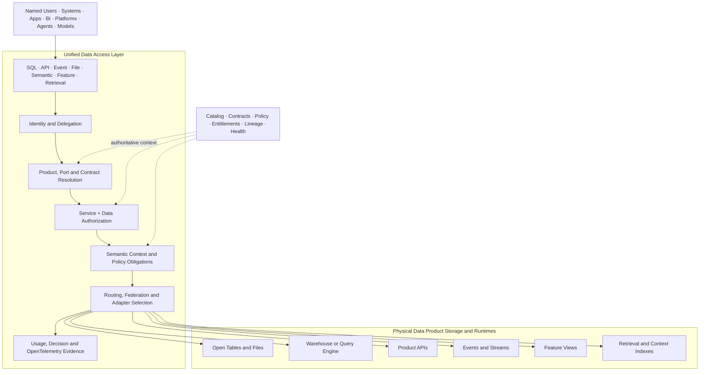

# Unified Data Access Layer

The Unified Data Access Layer is the governed logical access surface above physical data-product storage. It gives named users, systems, applications, platforms, agents, and models one consistent way to access live products without forcing all data into one engine or location.

It is implemented by the **Data Consumption Service**. It is not a new system of record, storage layer, or mandatory central query engine.

## Architecture

## Core Design Principle

**Unify the access contract and controls, not the physical execution.**

The layer provides consistent identity, product addressing, contracts, policy, semantics, and evidence. Adapters push execution to the product's approved runtime whenever possible. This avoids creating a central bottleneck or copying every product into a new access store.

## Responsibilities

| Capability | Responsibility |
| --- | --- |
| Product resolution | Resolve stable product and port ids to the current approved contract, interface, runtime, and health state. |
| Identity | Authenticate named users and workloads; preserve actor and subject for delegated applications and agents. |
| Service authorization | Control which access operation, API, query, subscription, export, or administration function may be invoked. |
| Data authorization | Evaluate product, port, action, purpose, classification, agreement, row, field, and output policy. |
| Obligations | Apply masking, row filters, tokenization, aggregation, limits, watermarking, expiry, and logging requirements. |
| Semantic context | Provide governed metrics, dimensions, grain, relationships, limitations, and context version. |
| Routing and federation | Select the approved runtime adapter and push down query, filter, and policy operations where supported. |
| Contract enforcement | Validate schema, compatibility, request shape, response shape, and product-port behavior. |
| Evidence | Correlate identity, authorization, product, contract, semantic context, runtime, usage, cost, and outcome. |

## Logical Access Contract

Every exposed product port declares:

| Field | Requirement |
| --- | --- |
| Product and port id | Stable, globally resolvable identifiers. |
| Product, contract, and semantic context version | Exact compatible versions used by the interface. |
| Interface type | SQL, API, event, file, semantic, feature, retrieval, or context. |
| Physical binding | Runtime adapter and provider-native location held outside consumer contracts. |
| Supported actions | Discover, query, read, subscribe, export, retrieve, train, or administer. |
| Identity types | Named user, workload, delegated workload, agent, model, or external recipient. |
| Policy | Required purpose, classification, agreement, entitlement, and obligations. |
| Service levels | Availability, latency, freshness, throughput, and recovery targets. |
| Evidence | Required telemetry, usage, lineage, decision, and cost attributes. |

## Access Flow

1. Consumer authenticates with a named-user, workload, delegated, agent, or external identity.
2. Access layer authorizes the requested service operation.
3. Product resolver loads the approved port, contract, semantic context, health, and physical binding.
4. Policy decision evaluates data action, purpose, classification, agreement, environment, and entitlement.
5. The layer applies obligations and selects an approved runtime adapter.
6. Execution is pushed to the physical runtime or federated only where required.
7. Results are validated, minimized, and returned through the declared interface.
8. Authorization, runtime, product, usage, cost, and outcome evidence is emitted.

## Named User and System Access

| Consumer | Entry Pattern | Identity and Policy Behavior |
| --- | --- | --- |
| Named analyst | SQL, semantic model, BI connector, notebook. | User subject is evaluated directly; team, role, purpose, row, and field policy apply. |
| Application | Product API, query API, event subscription. | Unique workload identity and approved application purpose determine port, actions, fields, rate, and expiry. |
| Pipeline | Table, file, event, or query interface. | Workload, environment, input-port contract, and product dependency constrain access. |
| Delegated application | API, CLI, notebook, or portal backend acting for a user. | Both application actor and user subject must be allowed; effective access is their intersection. |
| Agent or model | Context, retrieval, feature, API, or approved query interface. | Agent or model actor, delegated user, skill, purpose, product contract, and AI-use policy are all evaluated. |

## Adapter Boundary

Adapters translate the logical access contract into runtime-native operations. Each adapter must declare:

- Supported interface types, policy obligations, and pushdown capabilities.
- Identity propagation or credential-exchange behavior.
- Contract, schema, and semantic compatibility.
- Failure, timeout, retry, cancellation, and partial-result behavior.
- Telemetry, lineage, usage, and cost correlation.
- Portability and conformance tests.

If a runtime cannot enforce a required obligation, the access layer must enforce it before release or deny access. It must never silently weaken policy.

## Availability and Scale

The access layer is logically unified but may be deployed as regional or domain-local gateways. Shared control APIs distribute product, contract, policy, and entitlement state; data execution remains close to the product runtime.

Avoid a single central data proxy for all traffic. Use:

- Stateless access gateways where possible.
- Cached policy and metadata with bounded freshness and fail-closed rules.
- Regional or domain-local execution adapters.
- Direct approved runtime access only when the same identity, policy, contract, and telemetry controls are enforced.
- Clear degradation behavior when catalog, policy, entitlement, or runtime dependencies are unavailable.

## Done Criteria

- Consumers address products and ports without depending on provider-native storage paths.
- Named users and system identities use the same logical product interfaces with identity-appropriate policy.
- Service authorization and data authorization are independently enforced.
- Product, contract, semantic context, policy, entitlement, and physical binding versions are traceable.
- Required row, field, masking, purpose, output, expiry, and logging obligations are proven per adapter.
- Query and policy execution are pushed down when safe; unsupported obligations fail closed.
- One product can move between two physical runtimes without changing its consumer-facing logical contract.
- OpenTelemetry correlates access request, decision, adapter, physical execution, product, consumer, cost, and outcome.

  <strong>Next:</strong> implement the layer through the Data Consumption Service and validate every adapter against the Access Control and Open Interoperability standards.

