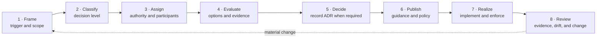
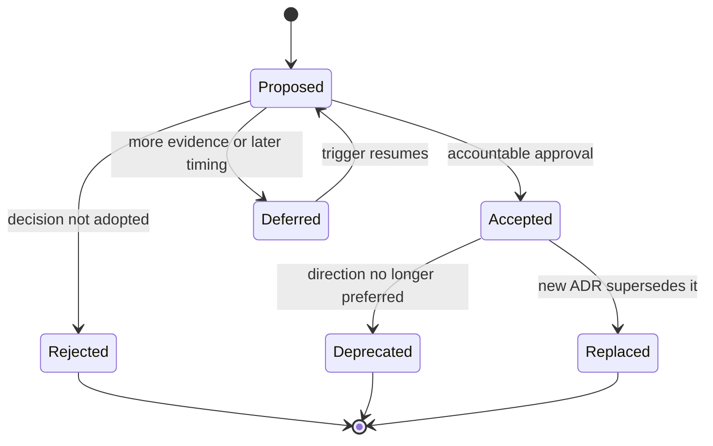

# Architecture Decision Process

<small>Use when</small><strong>A consequential architecture choice needs an accountable decision.</strong>

<small>Decision</small><strong>Who decides, what must be recorded, and how does the decision become implemented guidance?</strong>

<small>Owner</small><strong>Named decision owner with affected architecture, business, service, security, and governance authorities.</strong>

<small>Output</small><strong>Accepted or rejected decision, ADR when required, updated guidance or policy, and verifiable evidence.</strong>

Architecture decision-making connects four artifacts without confusing their roles:

| Artifact | Question | Authority |
| --- | --- | --- |
| Published architecture or service guidance | What direction and boundary apply now? | Current approved guidance. |
| Architecture Decision Record (ADR) | Why was one consequential option selected over alternatives? | Dated decision by the accountable authority. |
| Architecture Decision Policy | Which mandatory rules and criteria must be evaluated? | Versioned policy source and named policy decision. |
| Evidence | Was the decision implemented, enforced, and operated as intended? | Authoritative delivery, control, and runtime records. |

An ADR preserves rationale and consequences; it does not replace the published design. Design pages remain understandable without following historical ADR links. An accepted ADR becomes effective guidance only when the affected architecture, service, standard, or policy is updated and published.

## End-to-End Decision Flow

| Stage | Required action | Accountable result |
| --- | --- | --- |
| **1. Frame** | State the trigger, decision question, desired outcome, scope, constraints, assumptions, affected users, and deadline. | One bounded decision question and named initiator. |
| **2. Classify** | Determine whether the choice is local, cross-service, platform-wide, policy-bearing, technology-binding, or temporary. | Decision level, required record, and review path. |
| **3. Assign** | Use the authority matrix to name one accountable decision owner, required participants, approvers, and consulted experts. | Explicit decision rights and no competing authority. |
| **4. Evaluate** | Compare viable options against principles, standards, risks, interoperability, cost, operability, reversibility, and available evidence. | Traceable option assessment with unresolved uncertainty visible. |
| **5. Decide** | Approve, reject, defer, or request evidence. Create an ADR for a consequential decision and record dissent or conditions. | Dated decision, rationale, consequences, owner, and review date. |
| **6. Publish** | Update the current architecture, service guidance, standard, and executable policy affected by the decision. | One coherent current direction; no ADR-dependent design interpretation. |
| **7. Realize** | Implement through owned data services, enforce applicable policy, test acceptance criteria, and retain release evidence. | Deployed capability and control evidence tied to the decision. |
| **8. Review** | Revisit on the review date or when assumptions, risk, technology, policy, or outcomes materially change. | Confirm, amend through a new decision, deprecate, or replace. |

## When an ADR Is Required

Create an ADR when a decision does one or more of the following:

- Changes a foundation-wide boundary, ownership model, authority, or shared capability.
- Introduces or changes a stable product port, service interface, interoperability profile, or mandatory standard.
- Selects a default technology, creates material vendor dependency, or requires a migration and exit path.
- Changes security, privacy, retention, identity, access, agent autonomy, or external-sharing behavior.
- Affects several services, domains, or consumer groups and has meaningful alternatives or trade-offs.
- Is difficult or costly to reverse, creates material operational risk, or intentionally deviates from published guidance.

A local, reversible implementation choice within published architecture and standards does not need an ADR. Record it in the owning service backlog, design, or configuration. A temporary policy deviation uses the governed exception process, not an ADR pretending the rule changed.

## Authority Matrix

Decision authority, authoritative record, enforcement, and evidence are separate. A portal, catalog, graph, dashboard, or AI assistant may project a decision without becoming its authority.

| Concern | Accountable Authority | Authoritative Record | Primary Enforcement | Evidence |
| --- | --- | --- | --- | --- |
| Source transactions | Source system owner | Operational source | Source application and APIs | Transaction and source audit records |
| Source meaning and change | Source data owner | Source metadata and Source System Ingestion Contract | Source interface and ingestion boundary | Data-contract acknowledgement and change notice |
| Data domain | Domain owner | Domain registry | Portfolio and onboarding workflows | Domain decision and ownership history |
| Product definition and lifecycle | Data product owner | Product descriptor and lifecycle record | Product creation and portal workflows | Go-live, change, support, and retirement decisions |
| Data-boundary promise | Data-contract parties with named owner | Versioned data contract | Ingestion, creation, consumption, and sharing gates | Validation, compatibility, approval, and enforcement receipts |
| Business terms and metrics | Business term or metric owner | Governed semantic registry | Product context publication and consumption | Version, approval, usage, and change evidence |
| Technical assets and storage | Platform Enablement Service owner | Technical catalog and storage control record | Catalog, storage, compute, and lifecycle adapters | Registration, policy, retention, recovery, and deletion receipts |
| Identity | Enterprise identity authority | Identity provider | Service gateway and runtime identity controls | Authentication, delegation, and credential events |
| Policy intent | Security, privacy, risk, or governance authority | Versioned policy repository | Policy decision points and service gates | Policy version, decision, obligations, and exception record |
| Entitlement and access | Data product owner under policy authority | Entitlement and decision record | Service and data authorization points | Allow, deny, expiry, renewal, and revocation receipts |
| Lineage | Producing service and product technical owner | Lineage record with stable product and run identifiers | Pipeline, query, serving, and agent instrumentation | Versioned lineage events and reconciliation results |
| Quality expectation and result | Data product owner; producing service measures | Data-contract quality rules and quality-result store | Build, publication, and operation gates | Rule version, result, exception, and impact evidence |
| Product health and SLO | Data product and service owners | Product-health and SLO state | Observability and operational workflows | Current SLI, breach, incident, recovery, and communication evidence |
| Workflow and go-live state | Owning lifecycle service | Service workflow state | Workflow engine and release controls | Approvals, gates, state transitions, and release receipts |
| Agent skill and autonomy | Owning foundation service | Skill registry and autonomy policy | Agent gateway, tool gateway, and service controls | Task envelope, evaluation, approval, tool trace, and suspension state |
| Incident and recovery | Data Foundation Operations Service with affected owner | Incident and recovery record | Operational workflows and service recovery controls | Timeline, impact, decisions, restoration, and improvement actions |

## Decision Rights

1. One accountable authority makes the decision; participants provide evidence and challenge but do not create parallel decisions.
2. The authority for the affected concern approves the outcome. Architecture facilitates coherence and records rationale; it does not absorb business, security, privacy, product, or service accountability.
3. Another system may cache or project the authoritative result but cannot silently override it.
4. A stale or missing projection triggers refresh, denial, or an explicitly designed degraded mode; it never becomes a new source of truth.
5. Evidence proves what happened but does not retroactively become the authority for what should happen.
6. An AI assistant or specialist agent may frame, research, compare, draft, and trace a decision. It cannot approve an ADR, accept risk, grant an exception, or widen its delegated authority.

## ADR Lifecycle

Use the [Decision Register](../implementation/architecture-decisions.md) to find accepted ADRs and the repository ADR template. Every ADR records status, context, decision, alternatives considered, consequences, evidence, applicable policy decisions, owner, and review date. `Accepted` means the choice is approved; implementation and conformance still require separate evidence.

## From Decision to Control

| Decision content | Published destination | Proof |
| --- | --- | --- |
| Enduring direction and rationale | Definition and Principles or relevant architecture design | Approved guidance revision. |
| Service responsibility or interface | Owning service page and integration design | Interface tests, service evidence, and operational readiness. |
| Mandatory behavior | Applicable standard | Conformance criteria and test result. |
| Machine-enforceable rule | [Architecture Decision Policy](architecture-decision-policy.md) | Policy decision, enforcement receipt, and exception record. |
| Technology selection | Reference solution and technology assessment | Proof of capability, risk, cost, portability, and exit evidence. |
| Delivery and operational change | Service backlog, release, and runbook | Deployment, telemetry, recovery, and review evidence. |

## Completion Criteria

- The decision question, scope, owner, participants, alternatives, evidence, and deadline are explicit.
- Applicable principles, standards, policies, dependencies, and affected users are identified.
- A consequential decision has a dated ADR with rationale, consequences, status, owner, and review date.
- Current guidance is updated so readers do not need the ADR to understand the architecture.
- Mandatory rules are expressed and tested through the Architecture Decision Policy where automation is justified.
- Implementation, enforcement, exception, release, and runtime evidence resolve to stable decision and policy versions.
- Review triggers are observable, and replacement decisions link to what they supersede.

The machine-readable relationships behind the architecture are maintained in [`architecture-registry.yaml`](../assets/data/architecture-registry.yaml). Use [End-to-End Service Scenarios](../services/end-to-end-service-scenarios.md) to test decision authority across service boundaries.

<strong>Next:</strong> classify the decision, identify its accountable authority, then open the <a href="../../implementation/architecture-decisions/">Decision Register</a> to reuse or create the required ADR.

