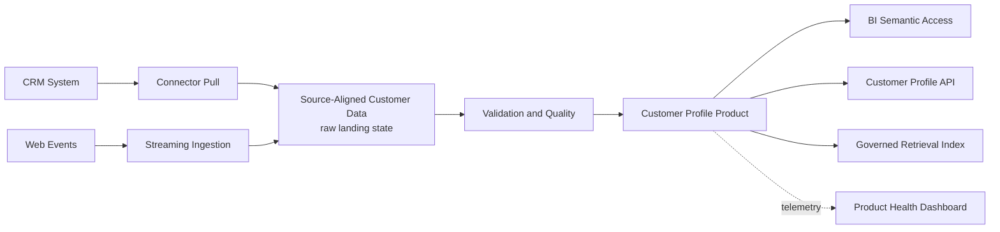

# Example: Customer Profile Data Product

This example shows how the guidance can be applied to a concrete data product.

## Product Summary

| Field | Value |
| --- | --- |
| Product name | Customer Profile |
| Domain | Customer |
| Owner | Customer Data Product Team |
| Steward | Customer Data Steward |
| Lifecycle state | Active |
| Primary consumers | BI, CRM application, approved AI retrieval |

## Architecture Flow

## Contract Highlights

| Contract Area | Example |
| --- | --- |
| Key | `customer_id` is mandatory and stable. |
| Freshness | Daily by 08:00 business day. |
| Quality | `customer_id` completeness must be 100%; segment validity must be above 99%. |
| AI usage | Retrieval allowed with approval; training prohibited. |
| Breaking change | Removing fields, changing meanings, or reducing freshness is breaking. |

## Product Health

| Signal | Target |
| --- | --- |
| Freshness | Available by 08:00 business day. |
| Quality pass rate | At least 99%. |
| Availability | 99.5% for API and SQL serving. |
| Incident routing | Customer Data Product Team. |

## AI-Ready Usage

The product may be used for retrieval by approved customer service agents when:

- The agent uses a governed service identity.
- The retrieval index points to a live product version.
- Sensitive fields are filtered or masked.
- Responses can cite source product and version.
- Retrieval usage is logged with consumer, purpose, and timestamp.
