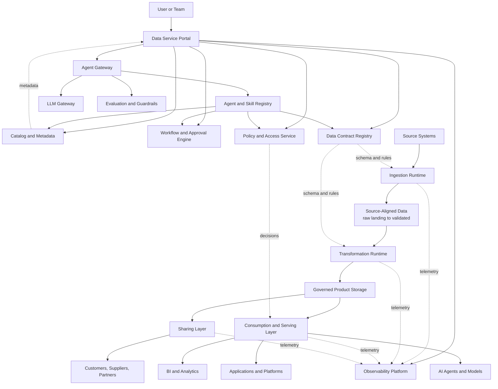

# Implementation Blueprint

This implementation blueprint turns the platform architecture into a delivery path. It is intentionally technology-neutral, but concrete enough to guide platform design, backlog creation, and architecture review.

## Target Delivery Model

## Architecture Building Blocks

| Building Block | Purpose | Minimum Capability |
| --- | --- | --- |
| Data Service Portal | User entry point. | Intent-led journeys, discovery, product detail, three contract types, portfolio, approvals, contract lifecycle, and product health views. |
| Catalog and Metadata | Product and asset inventory. | Search, ownership, schema, classification, lineage links, documentation, lifecycle state. |
| Semantic Context and Graph Projection | Make products understandable and connected without duplicating authority. | Versioned context packages, glossary and metric references, rebuildable relationship graph, permission-filtered discovery and AI grounding. |
| Data Contract Registry | Contract source of truth. | Contract templates, versioning, compatibility checks, approval evidence, consumer notifications. |
| Data Product Developer Workspace | Declarative product development experience. | Repo and workspace templates, workload specification, API and CLI, isolated environments, preview, CI/CD, promotion, rollback, and developer telemetry. |
| Resource Orchestrator | Translate declared product intent into runtime resources. | Versioned plans, policy checks, provisioning, de-provisioning, dependency resolution, drift detection, and execution receipts. |
| Ingestion Runtime | Bring data into the foundation. | File, connector, API, CDC, streaming, validation, quarantine, telemetry. |
| Product Storage and States | Store data according to product purpose, trust, retention, and runtime needs. | Source-aligned raw and validated states, product outputs, consumer-aligned projections, archive, and open formats. |
| Transformation Runtime | Build trusted data products. | Batch and streaming transforms, quality rules, lineage, release controls. |
| Policy and Access Service | Enforce usage rules. | Identity, role and attribute policy, purpose-based access, masking, audit. |
| Consumption Layer | Serve trusted data. | SQL, semantic, API, event, feature, retrieval, and bulk access patterns. |
| Sharing Layer | Exchange data beyond the product boundary. | Entitlements, packaging, secure delivery, expiry, revocation, audit. |
| Observability Platform | Monitor trust and operations. | OpenTelemetry ingestion, product health, alerts, incidents, freshness, quality, usage. |
| Platform Enablement | Provide common controls and resources once. | Storage lifecycle, contract system, identity and security bindings, catalog synchronization, integration APIs, provisioning, reconciliation, and deprovisioning. |
| Operations Workflow Platform | Coordinate service operation and improvement. | Service registry, support, incident, problem, change, release, communication, continuity, reliability, knowledge, and improvement records. |
| Interoperability Gateway | Keep platform boundaries portable. | Artifact import/export, open API and event adapters, identifier mapping, conformance tests. |
| Agent Gateway | Govern agent execution. | Identity, delegated authority, skill discovery, policy, approval, budgets, audit and suspension. |
| Agent and Skill Registry | Manage reusable agentic capabilities. | Versioned manifests, ownership, schemas, risk, permissions, evaluations and lifecycle. |
| LLM Gateway | Abstract model providers. | Approved profiles, routing, fallback, data handling, safety, latency and cost controls. |
| Context and Memory | Ground agents safely. | Permission-filtered retrieval, provenance, conversation state, scoped memory and deletion. |
| Evaluation Service | Prove agent quality and safety. | Test suites, thresholds, regression, red-team evidence and release gates. |

## Delivery Sequence

The foundation should be implemented in thin vertical slices instead of as one large platform program.

| Step | Deliverable | Why It Matters |
| --- | --- | --- |
| 1. Establish control plane | Catalog, identity integration, classification, basic workflow. | Enables governed onboarding and access from the start. |
| 2. Launch portal MVP | Product search, request intake, contract workflow, status tracking. | Gives users one entry point and avoids informal delivery channels. |
| 3. Launch developer workspace | Add repo templates, declarative workload specification, API and CLI, isolated environments, preview, and CI/CD. | Gives data developers a consistent self-service path without infrastructure tickets. |
| 4. Standardize ingestion | File inbox, connector pull, CDC or stream pattern, validation, quarantine. | Reduces custom source integration work. |
| 5. Create product factory | Product templates, transformation patterns, quality gates, go-live approval. | Makes trusted product creation repeatable. |
| 6. Automate deployment | Add environment promotion, policy checks, progressive delivery, drift detection, rollback, and release evidence. | Makes product releases repeatable and fail-safe. |
| 7. Enable consumption | SQL, API, semantic, retrieval, and feature access patterns. | Supports BI, apps, platforms, agents, and models. |
| 8. Add observability | OpenTelemetry conventions, service and product health, alerts, impact correlation, and recovery evidence. | Makes trust and reliability visible. |
| 9. Establish foundation operations | Add service records, portal support, incident, problem, change, release, continuity, reliability, communication, and improvement workflows. | Turns visible conditions into accountable response and safer operation. |
| 10. Mature sharing | Internal sharing, external packages, clean room or secure exchange patterns. | Supports ecosystem use while preserving governance. |
| 11. Prove portability | Run clean-room import/export and independent-client tests across selected interfaces. | Turns vendor neutrality from intent into evidence. |
| 12. Launch assistant read mode | Add grounded Ask and Plan experiences over catalog, contracts, policy, lineage and health. | Creates value before agents receive write authority. |
| 13. Enable bounded actions | Add typed skills, approval, task state, receipts and agent evaluations one journey at a time. | Introduces agency with controlled risk. |

## Architecture Backlog

Use this backlog as a starting point for implementation epics.

| Epic | Example Stories |
| --- | --- |
| Portal foundation | As a consumer, I can search live data products; as a steward, I can approve access; as a product owner, I can see product health. |
| Portal journeys | As a user, I start from an intended outcome; as a workflow service, I receive identity, team, use case, workspace, product, purpose, and correlation context. |
| Product detail | As a consumer, I can distinguish declared contract terms from current measured quality, lineage, health, incidents, usage, and cost. |
| Contract management | As a product owner, I can create a contract; as a consumer, I can subscribe to contract changes; as a platform, I can detect breaking changes. |
| Source onboarding | As a source owner, I can request onboarding; as a data engineer, I can select a pattern; as a steward, I can approve classification. |
| Product go-live | As a steward, I can review readiness evidence; as a product owner, I can bring an approved product live; as a consumer, I can see go-live status. |
| Developer workspace | As a data developer, I can declare a product workload, create an isolated environment, preview changes, and promote or roll back a release through portal, API, or CLI. |
| Resource orchestration | As a platform engineer, I can expose governed resource abstractions; as a developer, I can request outcomes without managing provider-specific infrastructure. |
| AI-ready consumption | As an AI team, I can request retrieval access; as governance, I can approve AI usage purpose; as observability, I can trace usage. |
| Observability | As a platform engineer, I can see service failures; as a product owner, I can see freshness, quality, and consumer impact; as operations, I receive correlated evidence. |
| Foundation operations | As a user, I can get support and see status; as an incident commander, I can coordinate recovery; as a change owner, I can prove risk, validation, and rollback; as a service owner, I can prioritize improvement. |
| Data Service AI Assistant | As a user, I can ask, plan and execute approved actions with sources, previews, progress and receipts. |
| Agent platform | As a skill owner, I can publish a typed capability; as governance, I can certify or suspend an agent version. |

## Definition of Done

A foundation capability is implementation-ready when:

- The service owner and support model are defined.
- The portal workflow exists for user-facing actions.
- Required metadata is captured in authoritative systems.
- Policy and access controls are enforceable.
- Operational and product telemetry are emitted.
- Support, incident, change, recovery, continuity, and improvement responsibilities are defined and exercised according to service criticality.
- Evidence is available for architecture, security, governance, and audit review.
- The capability has at least one real product use case proving the pattern end to end.
- Canonical artifacts and open interfaces pass the required interoperability conformance level.
- Developer-facing capabilities have equivalent portal, API, CLI, and approved agent-skill paths.
- Runtime intent, environment, deployment target, dependencies, policy, and rollback are versioned as declarative artifacts.
