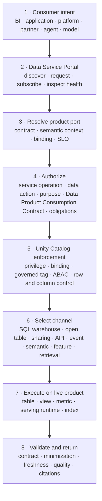
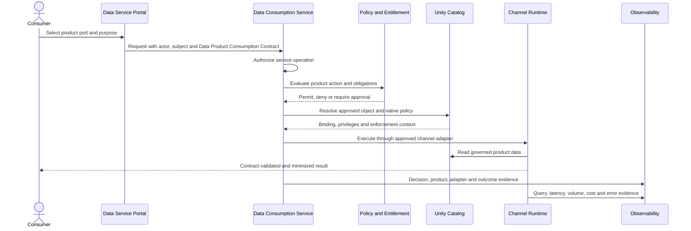

# Data Consumption Design

<small>Use when</small><strong>Assessing Databricks channels for governed product access.</strong>

<small>Decision</small><strong>Which port and adapter meet consumer needs and controls?</strong>

<small>Owner</small><strong>Consumption and access architect.</strong>

<small>Output</small><strong>Channel mapping, policy proof, SLO, and exit plan.</strong>

This reference solution applies the technology-neutral [Data Consumption Service](../services/data-consumption-service.md), [Unified Access Design](../architecture/unified-access-design.md), and mandatory [Data Catalog and Storage Standard](../standards/catalog-storage-standard.md) to Databricks. Unity Catalog is the standard technical catalog and governed namespace; Delta Lake is the default durable table format; SQL warehouses, open table interfaces, sharing, and conformant adapters provide fit-for-purpose product access.

!!! info "Reference solution status"
    Unity Catalog and Delta Lake are mandatory defaults under the [Data Catalog and Storage Standard](../standards/catalog-storage-standard.md). SQL warehouses, open table clients, sharing, and adapter choices remain selected implementation profiles that require channel-specific access tests, performance and cost evidence, security review, interoperability proof, and an exit plan. Logical product ports, contracts, semantic context, policy intent, and purpose-bound consumption terms remain provider-independent.

!!! tip "Fast path"
    **Decide:** [Executive Recommendation](#executive-recommendation) · **Design:** [Solution at a Glance](#solution-at-a-glance) and [Channel Selection](#channel-selection) · **Implement:** [Implementation Runway](#implementation-runway) · **Assure:** [Port Activation Gate](#port-activation-gate) and [Done Criteria](#done-criteria)

## Executive Recommendation

Use Unity Catalog as the common governed access surface for Databricks-native data products, and place the Data Consumption Service above it as the logical product resolver. Consumers request a stable product port, not a workspace, SQL warehouse, table path, or cloud-storage credential.

Use SQL warehouses for BI and analytical application access, Unity Catalog open table interfaces for approved external engines, and OpenSharing or the approved sharing profile for cross-organization delivery. Use explicit adapters for operational APIs, events, files, semantic context, features, and retrieval. Do not force every consumption need through SQL or expose source-aligned raw data as a shortcut.

## Source Access Decision

Apply the technology-neutral [Direct, Federated, or Replicated Access Decision](../services/data-consumption-service.md#direct-federated-or-replicated-access-decision) before creating a Databricks copy.

| Selected mode | Databricks reference profile |
| --- | --- |
| Direct source API or MCP | Register the source interface as a logical product port. Route through an approved API or tool gateway with contract, identity, purpose, policy, rate, SLO, dependency, and telemetry controls; do not copy data into Unity Catalog only to support a current-state lookup or source-owned action. |
| Federated or virtual | Resolve the logical product port to an approved federated query or bounded source adapter. Prove policy pushdown, source capacity, latency, availability, lineage, cost, and fail-closed behavior before activation. |
| Selective projection or event | Materialize only the contracted fields, events, cache, search, feature, or retrieval projection required by the use case. Retain source linkage, reconciliation, retention, rebuild, and expiry behavior. |
| Replicated data product | Ingest to a Unity Catalog-governed source-aligned product when history, quality remediation, high-volume reuse, cross-source transformation, BI, AI training or evaluation, sharing, or workload isolation requires durable data. |

The access mode is part of the documented product-port binding. Changing from direct to federated or replicated access should not change the logical product id or consumer contract unless externally visible behavior changes.

## Solution at a Glance

Identity, policy, entitlement, product, contract, health, decision, usage, cost, and incident context applies across every numbered step; the detailed sections define where each control is authoritative and enforced.

## Channel Selection

| Consumer need | Databricks profile | Use when | Do not use when |
| --- | --- | --- | --- |
| BI and interactive analytics | Serverless or approved SQL warehouse, stable views, and governed metric views. | Consumers need SQL, dashboards, governed metrics, and interactive analysis. | The workload requires transactional writes or a strict operational API SLO. |
| Analytical application | Parameterized SQL through a supported driver or Statement Execution API. | Results are analytical, asynchronous or bounded, and query latency is acceptable. | A customer-facing request needs predictable millisecond latency or complex application transactions. |
| Platform or external engine | Unity REST or Iceberg REST with supported client and credential-vending profile. | An approved engine needs governed open-table access. | Required policy obligations or table features are not supported by that client profile. |
| Internal or external sharing | OpenSharing/Delta Sharing profile with recipient and Data Product Consumption Contract lifecycle. | Live governed datasets must cross workspace, platform, company, or cloud boundaries. | The use case requires an operational API, event contract, or write-back workflow. |
| Operational application | Product API backed by an approved serving pattern, with Unity Catalog as source or governance context. | Stable API semantics, rate limits, caching, low latency, or transaction isolation are required. | Direct SQL already meets the consumer SLO and contract safely. |
| Event consumer | Contracted event port through the enterprise event platform. | Consumers need change notifications or event-driven processing. | Consumers need historical bulk scans or ad hoc analytics. |
| Agent, model, or retrieval | Governed context, feature, retrieval, or bounded query adapter linked to product and contract versions. | AI needs permission-filtered context, features, training data, evaluation data, or grounded retrieval. | Raw unrestricted table access would bypass purpose, minimization, or evaluation controls. |

Databricks recommends serverless SQL warehouses where available for SQL workloads. The Statement Execution API supports authenticated, parameterized SQL execution, but application teams must still define result limits, cancellation, timeout, and injection controls. [SQL warehouses](https://docs.databricks.com/aws/en/compute/sql-warehouse) · [Statement Execution API](https://docs.databricks.com/aws/en/dev-tools/sql-execution-tutorial)

## Component Responsibilities

| Component | Owns | Does not own |
| --- | --- | --- |
| Data Service Portal | Discovery, Data Product Consumption Contracts, subscriptions, status, documentation, and evidence. | Runtime policy evaluation or query execution. |
| Product registry | Stable product and port ids, lifecycle, contract, semantic context, current binding, SLO, and health reference. | Unity Catalog grants or SQL warehouse state. |
| Data Consumption Service | Product resolution, channel selection, service authorization, purpose and consumption-contract checks, adapter orchestration, and receipts. | Physical product storage or identity lifecycle. |
| Unity Catalog | Databricks object registration, native privileges, governed tags, ABAC, fine-grained controls, bindings, lineage, and audit context. | Enterprise business-purpose approval or non-Databricks service authorization. |
| SQL warehouse | Governed SQL execution, workload capacity, query history, and analytical result delivery. | Data Product Creation Contract, semantic authority, or operational API behavior. |
| Open table adapter | Translate a logical table port to a supported Unity or Iceberg REST client profile. | Silent reduction of policy, format, or audit obligations. |
| Product API, event, feature, or retrieval adapter | Enforce the declared non-SQL interface and SLO. | Reinterpreting product semantics or widening consumer scope. |
| Data Observability Service | Correlate access decision, runtime, product, consumer, usage, cost, SLO, and outcome. | Authorization or detailed business-result storage. |

## Governed Access Flow

Service authorization and data authorization remain separate. Permission to use a SQL warehouse, API route, portal flow, or agent skill does not imply permission to product data. A Unity Catalog grant does not authorize a different purpose, Data Product Consumption Contract, export, sharing action, or model-training use.

## Identity Profiles

| Identity | Databricks implementation | Required behavior |
| --- | --- | --- |
| Named user | Enterprise SSO, account identity and groups, workspace entitlement, and Unity Catalog policy. | Evaluate the user directly; no shared analyst accounts. |
| BI or application workload | Dedicated service principal and OAuth. | Bind owner, application, environment, purpose, product ports, expiry, rate, and budget. |
| Delegated application | User OAuth or verified user subject plus application actor. | Effective access is the intersection of user and application authority. |
| Agent acting for a user | Registered agent identity plus delegated subject and approved skill. | Preserve agent, user, purpose, task, autonomy, product scope, and approval evidence. |
| External engine | Registered service principal or recipient identity using the approved open-table or sharing profile. | Restrict catalogs, schemas, actions, storage credentials, geography, and expiry. |

Use OAuth or workload identity federation for system access. Personal access tokens are not an approved production identity pattern.

## Unity Catalog Enforcement Profile

Unity Catalog combines object privileges, ownership, workspace bindings, governed tags, ABAC, row filters, and column masks. Treat these as complementary controls and prove them against every enabled channel. [Unity Catalog access control](https://docs.databricks.com/aws/en/data-governance/unity-catalog/access-control/)

| Decision question | Primary control |
| --- | --- |
| From which workspace may the object be accessed? | Workspace-catalog binding. |
| Which principal may perform which native action? | Catalog, schema, table, view, function, volume, model, or share privileges. |
| Which tagged assets and fields require common policy? | Governed tags and ABAC. |
| Which rows or values may this subject see? | ABAC policy, row filter, column mask, or governed view. |
| Which purpose and Data Product Consumption Contract allow the request? | Foundation policy and entitlement decision, projected to native enforcement where possible. |
| Which service operation may be invoked? | Portal, gateway, warehouse, job, API, event, or skill authorization. |

Policy support differs by runtime, client, object type, table format, and interface. Unsupported obligations must be enforced by a conformant adapter or the request must be denied. They must never be silently dropped.

## Product Port Mapping

| Logical port | Databricks binding | Stable consumer contract |
| --- | --- | --- |
| SQL | Fully qualified Unity Catalog table, view, materialized view, or metric view plus approved warehouse profile. | SQL schema, semantics, compatibility, SLO, purpose, and result limits. |
| Open table | Unity REST or Iceberg REST catalog binding and supported table format. | Table contract, snapshot behavior, client versions, actions, policy support, and credential model. |
| Sharing | Share, recipient, provider, and approved data objects. | Data Product Consumption Contract, product version, update mode, expiry, revocation, and audit. |
| Application API | Product service or serving adapter reading governed product outputs. | OpenAPI contract, identity, rate, latency, error, caching, and version behavior. |
| Event | Enterprise event broker binding generated from an approved product event port. | AsyncAPI, CloudEvents envelope, ordering, replay, retention, and compatibility. |
| Semantic | Unity Catalog metric view or semantic adapter linked to the canonical semantic context package. | Metric, dimension, grain, time, filter, unit, and context versions. |
| AI feature or retrieval | Approved feature, vector, context, or bounded-query adapter linked to governed product assets. | Product snapshot, purpose, fields, retrieval behavior, evaluation, freshness, and citations. |

Provider-native locations stay in the physical binding. The logical product port remains stable when the warehouse, object, serving runtime, or table format changes within its compatibility contract.

## Semantic and AI Consumption

Unity Catalog metric views can project governed measures and dimensions for SQL, BI, dashboards, and supported agents. They implement part of the [Semantic and Context Design](../architecture/semantic-context-design.md), but the versioned semantic context package remains the portable product-facing authority for grain, meaning, relationships, valid uses, limitations, and evidence references. [Unity Catalog metric views](https://docs.databricks.com/aws/en/business-semantics/metric-views/)

AI consumption must additionally bind:

- Product, contract, semantic context, and data snapshot or release version.
- Agent or model identity, delegated user, purpose, skill, task, and approval.
- Allowed fields, row scope, retrieval filters, output limits, and prohibited uses.
- Freshness, quality, lineage, evaluation status, and known limitations.
- Citations or evidence references for grounded answers and automated decisions.

An embedding, feature table, vector index, or metric view is a projection of a governed product. It does not become a separate unowned data source.

## Workload Isolation and SLOs

| Profile | Recommended isolation |
| --- | --- |
| Interactive BI | Dedicated warehouse profile by domain, sensitivity, concurrency, or criticality; autoscaling and query limits. |
| Scheduled BI and extracts | Separate scheduled profile so bulk work does not starve interactive consumers. |
| Analytical application | Dedicated workload identity, bounded queries, parameters, timeout, cancellation, result size, and cost budget. |
| External engine | Per-integration client profile, catalog scope, format version, policy tests, concurrency, and storage controls. |
| Agent or model | Per-use-case budget, row and field minimization, bounded retrieval, rate limit, evaluation, and kill switch. |
| Operational API | Dedicated service and serving runtime with explicit latency, availability, cache, recovery, and backpressure behavior. |

Measure availability, latency, queue time, result size, throughput, error rate, denial rate, freshness, quality, cost per query or consumer, and downstream impact. Do not mix product engineering jobs and consumer SQL on the same uncontrolled compute profile.

## Open Access and Sharing

Unity Catalog supports governed access from external systems through Unity REST and Iceberg REST profiles, with capability depending on the object, format, client, credential-vending, and policy combination. [External system access](https://docs.databricks.com/aws/en/external-access) · [Iceberg REST catalog](https://docs.databricks.com/aws/en/external-access/iceberg)

Before enabling a client or recipient, test:

- Authentication, credential lifetime, storage access, catalog and schema scope.
- Read and write support, snapshot semantics, schema evolution, deletes, and time travel.
- Grants, ABAC, row and column obligations, and deny behavior.
- Query or file telemetry, lineage, usage, cost, and consumer attribution.
- Revocation, credential expiry, product retirement, and incident containment.
- Round-trip compatibility with the declared open table or sharing profile.

Use the Data Sharing Service for recipient-specific Data Product Consumption Contracts, packages, expiry, and revocation. Open table access is not a substitute for an external-sharing consumption profile.

## Port Activation Gate

A consumption port may go live only when:

- Product, port, contract, semantic context, owner, SLO, classification, health, and support route are published.
- Named-user, workload, delegated, agent, and external identity behavior is defined for the enabled channels.
- Service and data authorization pass independent allow, deny, expiry, revocation, and purpose tests.
- Unity Catalog grants, bindings, governed tags, ABAC, row filters, masks, and views enforce required obligations.
- Client, driver, protocol, object, table-format, and policy combinations pass conformance tests.
- Schema, result, latency, concurrency, availability, freshness, quality, cost, and recovery SLOs pass.
- Access decision, runtime, query, usage, cost, lineage, and consumer outcome evidence is correlated.
- Breaking-change, deprecation, incident, and consumer-notification procedures are active.

## Interoperability and Exit Design

- Keep logical product ports and physical Unity Catalog bindings in separate versioned artifacts.
- Publish portable product, contract, semantic-context, policy-intent, and interface schemas.
- Require an independent client test for each declared open interface; do not count a provider SDK as interoperability proof.
- Export product bindings, grants, lineage, audit, usage, query, quality, and release evidence on the retention schedule.
- Prove one SQL or table port can move to another conformant runtime without changing its consumer-facing identifier or contract.
- Keep API, event, semantic, feature, and retrieval adapters replaceable through OpenAPI, AsyncAPI, CloudEvents, open table, and foundation context profiles.

## Implementation Runway

### Increment 1: Establish the Access Contract

- Define product and port resolution, identity profiles, purpose and consumption-contract fields, Unity Catalog policy projection, and evidence attributes.
- Implement portal discovery, request, approval, subscription, expiry, and revocation journeys.
- Prove independent service and data authorization.

### Increment 2: Deliver Core Channels

- Deliver governed SQL for named users and BI workloads.
- Deliver one application workload profile through parameterized SQL or a product API.
- Deliver one open-table or sharing profile with an independent client.

### Increment 3: Add Semantic and AI Profiles

- Link metric views and semantic adapters to versioned semantic context packages.
- Deliver permission-filtered context, feature, retrieval, training, or evaluation access for one governed AI use case.
- Add budgets, evaluation, citations, approval, and kill-switch controls.

### Increment 4: Prove Scale and Portability

- Test concurrency, workload isolation, latency, cost, policy performance, regional recovery, revocation, and consumer impact.
- Rebind one product port to another conformant runtime and prove that the consumer contract does not change.

## Open Design Choices

| Decision | Required outcome |
| --- | --- |
| Warehouse topology | Define shared versus dedicated warehouses, serverless eligibility, regions, scaling, query limits, cost allocation, and ownership. |
| Policy projection | Define how purpose, Data Product Consumption Contract, entitlement, and classification become Unity Catalog controls and how drift is reconciled. |
| Open table profile | Select supported formats, client versions, credentials, read/write behavior, policy coverage, and conformance suite. |
| Application serving | Define when Statement Execution is acceptable and when a dedicated API or serving store is required. |
| Semantic implementation | Define metric-view scope, canonical semantic package mapping, change control, and BI-tool behavior. |
| AI access | Define approved feature, retrieval, context, and bounded-query patterns with evaluation and delegated authority. |
| Sharing boundary | Define when open table access ends and the Data Sharing Service recipient lifecycle begins. |
| Evidence retention | Define export, correlation, and retention for decisions, queries, lineage, usage, cost, results, and incidents. |

## Done Criteria

- Consumers request stable product ports without depending on workspace, warehouse, object path, or storage credentials.
- Unity Catalog enforces native access while the Consumption Service preserves purpose, Data Product Consumption Contract, service authorization, and channel orchestration.
- SQL, application, open-table, sharing, event, semantic, and AI profiles have explicit capability and policy boundaries.
- Named-user, system, delegated, agent, and external access preserve actor, subject, purpose, product, contract, policy, adapter, and outcome.
- Unsupported obligations fail closed for every client and channel.
- Freshness, quality, health, SLO, usage, cost, incidents, and deprecation are visible to consumers and product owners.
- An independent client consumes every declared open interface without a provider-specific SDK.
- One logical product port can be rebound to another conformant runtime without changing the consumer contract.

  <strong>Next:</strong> use Data Sharing Design to expose minimized, contract-based product packages to internal and external recipients.

