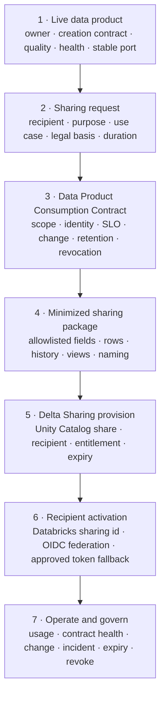
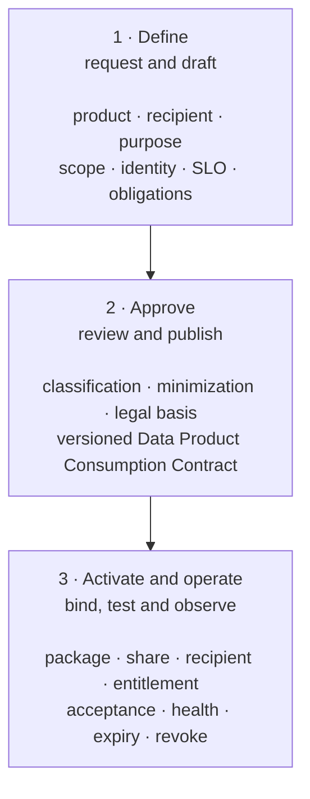

# Data Sharing Design

<div class="decision-brief"><div><small>Use when</small><strong>Assessing Delta Sharing for a governed exchange.</strong></div><div><small>Decision</small><strong>How will the Data Product Consumption Contract, package, recipient, expiry, and revocation map?</strong></div><div><small>Owner</small><strong>Sharing architect and sharing owner.</strong></div><div><small>Output</small><strong>Exchange design, proof, operations, and exit plan.</strong></div></div>

This reference solution applies the technology-neutral [Data Sharing Service](../services/data-sharing-service.md) to Databricks using Delta Sharing, Unity Catalog shares and recipients, and an explicit data-contract workflow. It supports governed exchange with internal platforms, customers, suppliers, partners, and external ecosystems without copying product ownership into the sharing platform.

!!! info "Delta Sharing and OpenSharing"
    This guide uses **Delta Sharing** for the open sharing protocol and its Databricks-managed implementation. Current Databricks product documentation calls that managed capability **OpenSharing**. The architecture remains contract-first and protocol-oriented so terminology or implementation changes do not alter the Data Product Consumption Contract.

!!! info "Reference solution status"
    This page is a selected implementation profile, not a mandatory platform choice. Adoption requires an approved [Technology Selection Record](../reference-solutions/technology-selection-template.md), recipient and client conformance tests, security and privacy review, legal approval where required, cost evidence, revocation proof, and an exit plan.

!!! tip "Fast path"
    **Decide:** [Executive Recommendation](#executive-recommendation) · **Design:** [Solution at a Glance](#solution-at-a-glance) and [Data Contract Model](#data-contract-model) · **Implement:** [Implementation Runway](#implementation-runway) · **Assure:** [Sharing Activation Gate](#sharing-activation-gate) and [Done Criteria](#done-criteria)

## Executive Recommendation

Share only from a live, governed data product. Create a recipient-specific Data Product Consumption Contract that references the Data Product Creation Contract, reduces the product to the minimum approved scope, and declares delivery, identity, freshness, quality, change, expiry, retention, and revocation behavior.

Use Databricks-to-Databricks sharing when both parties use Unity Catalog. For non-Databricks recipients, prefer OIDC federation with short-lived recipient identity tokens; use bearer-token profiles only as an approved fallback with strict expiry, secure activation, rotation, and revocation controls.

Treat a Unity Catalog **share** as the technical package and a **recipient** as the technical delivery identity. Neither is the Data Product Consumption Contract, legal basis, or system of record for approvals.

## Solution at a Glance



Identity, policy, privacy, contract testing, telemetry, audit, and evidence controls apply across every numbered step. The sections below define the authority and enforcement points without adding crossing lines to the overview.

## Data Contract Model

| Artifact | Purpose | Authoritative owner | Databricks projection |
| --- | --- | --- | --- |
| Data Product Creation Contract | Defines the live product schema, semantics, quality, freshness, classification, compatibility, and logical ports. | Product owner and contract registry. | Schema, comments, tags, views, quality evidence, and linked Unity Catalog product objects. |
| Data Product Consumption Contract | Binds recipient identity, purpose, legal basis, exact product version, minimized package, delivery protocol, service levels, permitted use, change behavior, duration, retention, entitlement, expiry, revocation, obligations, and approvers. | Sharing owner and contract registry. | Share contents, exposed names, recipient properties, package view or table, grant, authentication profile, activation status, expiry automation, and monitoring configuration. |
| Technical binding | Connects the approved Data Product Consumption Contract to exact provider objects and recipient configuration. | Data Sharing Service. | Unity Catalog share id, recipient id, shared objects, aliases, partitions or views, and client profile. |

The Data Product Consumption Contract narrows the Data Product Creation Contract; it cannot silently weaken product quality, classification, semantic, or change controls. One contract version binds one recipient and purpose. Reusing one recipient object across contracts must not make scope or evidence ambiguous.

## Data Contract Flow



| Handoff | Accountable role | System of record | Gate |
| --- | --- | --- | --- |
| Request to draft | Product and recipient owners | Data Service Portal | Live product selected; recipient, purpose, use and duration identified. |
| Draft to approval | Sharing owner with security, privacy, legal and steward review as applicable | Contract registry | Scope is minimized and obligations, service levels, change, retention and revocation are explicit. |
| Approval to binding | Data Sharing Service owner | Approved Data Product Consumption Contract | Package and technical plan exactly match the approved version. |
| Binding to activation | Recipient owner and sharing owner | Unity Catalog plus conformance evidence | Package, identity, client, access and deny tests pass; recipient accepts. |
| Activation to operation | Sharing owner | Observability and evidence store | Contract health, access, expiry, incidents and revocation remain observable. |

### Data Contract State Flow

| State | Entry evidence | Exit rule |
| --- | --- | --- |
| Draft | Product and recipient identified; purpose and requested scope recorded. | Required consumption-contract fields complete. |
| In review | Minimized package, classification, identity, legal basis, SLO, change and retention proposed. | Product, steward, security, privacy, legal and recipient reviews complete as applicable. |
| Approved | Risk decisions, obligations, expiry, revocation, and technical profile accepted. | Package and client conformance tests pass. |
| Active | Unity Catalog share, recipient and entitlement match the approved binding; recipient acceptance recorded. | Expiry, suspension, revocation, deprecation, or approved contract change. |
| Suspended | Incident, policy breach, contract breach, identity failure, or unresolved change risk. | Remediation and reapproval, or revocation. |
| Deprecated | Replacement contract and recipient migration path published. | Recipient migrated or approved exception expires. |
| Revoked | Access removed and future delivery blocked. | Evidence retained; provider retention and recipient deletion obligations followed. |

## Data Product Consumption Contract Fields

The Data Product Consumption Contract is a portable artifact in the contract registry. It uses the external-sharing profile in the enterprise [Data Contract Standard](../standards/data-contract-standard.md) rather than creating an unrelated contract type.

| Field group | Minimum content |
| --- | --- |
| Identity | Contract id and version, product and creation-contract references, sharing owner, recipient id, recipient trust domain, named-user or workload profile. |
| Purpose | Approved purpose, use case, legal basis, valid uses, prohibited uses, AI-use permissions, geography, and environment. |
| Scope | Product port, exposed objects, allowlisted fields, row or partition scope, history, refresh mode, and volume or model scope where supported. |
| Semantics | Grain, time meaning, terms, metrics, units, limitations, and semantic-context version. |
| Service levels | Freshness, availability, delivery latency, history, retention, recovery, support, and incident notification. |
| Quality | Required rules, thresholds, observation time, breach handling, and evidence references. |
| Security | Classification, identity, authentication, encryption, network restrictions, policy obligations, and audit requirements. |
| Change | Compatibility rules, notice period, parallel-version behavior, migration, deprecation, and termination rights. |
| Lifecycle | Start, expiry, review frequency, suspension, revocation target, recipient deletion, evidence retention, and offboarding owner. |
| Binding | Protocol and profile version, Unity Catalog share and recipient references, exposed aliases, client versions, and conformance evidence. |

### Logical Data Contract Example

```yaml
apiVersion: data.foundation/v1alpha1
kind: DataProductConsumptionContract
metadata:
  id: supplier-forecast-share
  version: 1.2.0
spec:
  productRef: supply-forecast@3.1.0
  creationContractRef: supply-forecast-creation@3.1.0
  recipient:
    id: supplier-042
    trustDomain: supplier.example
    identityProfile: oidc-m2m
  purpose:
    allowed: [production_planning]
    prohibited: [resale, model_training]
    expiresAt: 2027-07-31T23:59:59Z
  scope:
    portRef: supply-forecast.table
    fields: [supplier_id, part_id, week, forecast_quantity]
    rowPolicyRef: policy/supplier-own-data
  delivery:
    protocol: delta-sharing
    profile: databricks-to-open-oidc
    freshnessSlo: PT6H
    history: false
  change:
    compatibility: backward
    noticePeriod: P30D
  lifecycle:
    reviewEvery: P90D
    revocationTarget: PT15M
    recipientDeletionPeriod: P30D
```

This is a logical enterprise extension example. The source artifact must validate against the pinned contract schema and preserve enterprise extensions during round-trip export and import.

## Delta Sharing Component Mapping

| Foundation concept | Delta Sharing / Unity Catalog implementation | Boundary |
| --- | --- | --- |
| Provider product | Live Unity Catalog table or approved supported asset. | Must already pass product go-live; sharing does not improve an untrusted source. |
| Sharing package | Unity Catalog share containing approved tables, partitions, views, volumes, models, or aliases supported by the selected recipient profile. | Contains only contract-approved assets; package scope is not inferred from catalog hierarchy. |
| Recipient | Unity Catalog recipient object using Databricks sharing identity, OIDC federation, or approved bearer token. | Represents a recipient trust and authentication binding, not legal approval. |
| Entitlement | Grant of a share to a recipient. | Exists only while the Data Product Consumption Contract is active and must be reconciled with expiry and revocation state. |
| Recipient access | Read-only shared catalog for Databricks recipients or open Delta Sharing client profile for non-Databricks recipients. | Client capability, policy behavior, and audit coverage require conformance proof. |
| Evidence | Unity Catalog audit events, system tables, portal workflow, contract tests, and observability signals. | Export normalized evidence according to foundation retention and privacy policy. |

In the managed service, a share is a Unity Catalog securable object and recipient access can be assigned or revoked. Databricks supports Databricks-to-Databricks and open recipient profiles. [Databricks OpenSharing concepts](https://docs.databricks.com/aws/en/opensharing)

## Recipient Profiles

| Profile | Authentication | Use when | Required controls |
| --- | --- | --- | --- |
| Databricks-to-Databricks | Recipient sharing identifier and Unity Catalog-to-Unity Catalog trust. | Recipient has a Unity Catalog-enabled Databricks workspace. | Verify metastore identity, recipient owner, shared-catalog access, downstream grants, expiry, and provider/recipient audit. |
| Databricks-to-open with OIDC | Recipient identity provider issues short-lived JWTs for U2M or M2M federation. | Non-Databricks users or workloads can use a supported OIDC-enabled client. | Validate issuer, audience, subject, claims, MFA or workload policy, token lifetime, client, and revocation. |
| Databricks-to-open with bearer token | Databricks-issued activation profile and bearer token. | OIDC is unavailable and risk acceptance permits token-based access. | One recipient per accountable party, maximum approved lifetime, secure delivery, IP restrictions where applicable, rotation, monitoring, and rapid revocation. |

OIDC federation avoids exchanging long-lived provider-issued credentials and supports named-user and workload flows through the recipient identity provider. [OIDC federation for recipients](https://docs.databricks.com/aws/en/opensharing/create-recipient-oidc-fed)

## Package and Minimization Design

Build the sharing package from explicit allowlists. Do not share an entire catalog or schema merely because all current fields appear acceptable.

- Include only approved product ports, fields, rows, time range, history, and update mode.
- Use stable recipient-facing aliases so provider-native catalog and schema names do not become the external contract.
- Remove internal identifiers, technical metadata, and sensitive fields unless contractually required.
- Apply aggregation, tokenization, pseudonymization, masking, or recipient-specific projection before sharing where required.
- Keep recipient-specific transformation logic versioned, tested, owned, and observable.
- For non-Databricks recipients, materialize a minimized Delta table when the selected open profile cannot share or enforce the required view or policy behavior.
- Test that the recipient cannot enumerate or access provider objects outside the package.

Unity Catalog policy support varies by object and sharing profile. Table-level row filters and column masks have sharing limitations; ABAC and view behavior also require specific owner and runtime conditions. Use a recipient-specific package and conformance tests rather than assuming provider-side controls transfer unchanged. [Row filters and column masks](https://docs.databricks.com/aws/en/data-governance/unity-catalog/filters-and-masks/)

## Provisioning Flow

1. Resolve the approved product, Data Product Creation Contract, Data Product Consumption Contract, recipient, and package version.
2. Generate a deterministic plan showing objects, exposed aliases, recipient profile, grants, expiry, and policy obligations.
3. Create or reconcile the Unity Catalog share and add only approved objects.
4. Create or reconcile the recipient with the approved authentication and network profile.
5. Grant the recipient access to the share only after package and contract tests pass.
6. Deliver the sharing identifier, OIDC portal URL, or activation link through the approved secure channel.
7. Run an independent recipient test for discovery, schema, values, history, freshness, policy, performance, telemetry, expiry, and deny behavior.
8. Mark the Data Product Consumption Contract active only after recipient acceptance and evidence capture.

Provision through version-controlled automation using supported SQL, CLI, API, or infrastructure-as-code interfaces. Manual changes must be detected and reconciled or reverted through the approved workflow.

## Change and Compatibility Flow

| Change | Default sharing behavior |
| --- | --- |
| Additive field in provider product | Do not expose automatically when package fields are allowlisted. Review classification and issue a compatible consumption-contract version if required. |
| Remove, rename, retype, or reinterpret a shared field | Breaking change. Keep the previous major package active during the agreed migration period. |
| Tighten classification or prohibited use | Suspend affected access, reassess the Data Product Consumption Contract, and reactivate only after obligations are enforceable. |
| Reduce freshness, quality, availability, or history | Contract breach or breaking change; notify the recipient and record acceptance or remediation. |
| Change recipient identity, trust domain, purpose, or legal entity | New or reapproved Data Product Consumption Contract; do not silently reuse the old entitlement. |
| Change sharing protocol, client, authentication, or table feature | Run full client and policy conformance before promotion. |
| Deprecate or retire the provider product | Publish migration and termination dates, block new recipients, notify active recipients, then revoke and archive evidence. |

The contract registry drives change notification and compatibility decisions. Updating a Unity Catalog share directly must not bypass recipient impact analysis or notice periods.

## Observability and Audit

Correlate these identifiers across portal, contract registry, Unity Catalog, Delta Sharing, and observability:

- Product id and version, Data Product Creation Contract id and version, Data Product Consumption Contract id and version.
- Recipient id, recipient profile, share id, package version, and exposed object alias.
- Provider actor, recipient subject or workload, purpose, environment, and policy version.
- Activation, access, schema, freshness, volume, latency, error, denial, expiry, suspension, and revocation events.
- Incident id, notification state, remediation, recipient acknowledgement, and retained evidence reference.

Provider and recipient audit events can be queried through Databricks audit logs and `system.access.audit` when enabled. Normalize the required events into the Data Observability Service rather than making consumers inspect platform logs. [Audit and monitor sharing](https://docs.databricks.com/aws/en/opensharing/audit-logs)

## Revocation and Offboarding

Revocation blocks future access; it cannot erase data that a recipient already exported. The Data Product Consumption Contract must therefore combine technical revocation with retention, deletion, backup, derived-data, and evidence obligations.

| Trigger | Required action |
| --- | --- |
| Data Product Consumption Contract expiry | Revoke entitlement automatically, disable or remove recipient access as scoped, notify owners, and record evidence. |
| Security or privacy incident | Suspend immediately, preserve evidence, notify required parties, investigate exported scope, and decide reactivation or revocation. |
| Purpose or ownership change | Suspend until the Data Product Consumption Contract and identity are reapproved. |
| Product or contract retirement | Complete recipient migration or revoke before removing the old package. |
| Recipient offboarding | Remove share grants, rotate or revoke credentials, remove recipient where appropriate, and confirm deletion obligations. |

Test revocation from both provider and recipient perspectives. The recipient must lose new access within the contract target, and monitoring must distinguish expected denial from platform failure.

## Sharing Activation Gate

A Data Product Consumption Contract may activate for external sharing only when:

- The provider product is live and its contract, quality, freshness, lineage, classification, health, and support route are current.
- Recipient identity, trust domain, purpose, legal basis, allowed and prohibited uses, geography, duration, and accountable owners are approved.
- The Data Product Consumption Contract references exact product and creation-contract versions.
- Minimized package, aliases, history, policy, retention, expiry, and revocation behavior match the contract.
- Security, privacy, legal, export-control, and AI-use reviews pass where applicable.
- Delta Sharing profile, recipient client, authentication, policy, schema, freshness, performance, audit, expiry, and revocation tests pass.
- Recipient acceptance, support route, incident notification, change notice, migration, and offboarding procedures are recorded.
- Portal, contract registry, Unity Catalog binding, and observability evidence reconcile without drift.

## Interoperability and Exit Design

- Keep product, creation contract, Data Product Consumption Contract, recipient, and technical binding artifacts portable and version controlled.
- Require an independent Delta Sharing client for open-recipient conformance; a provider UI alone is not proof.
- Export share, recipient, entitlement, package, contract, audit, usage, and lifecycle evidence on the retention schedule.
- Avoid consumer dependence on provider-native catalog, schema, table, storage, or workspace names.
- Define a fallback export or API profile for recipients whose required Delta or policy capabilities are unsupported.
- Prove one sharing package can be recreated from portable source artifacts in a clean environment and revoked without manual repair.

## Implementation Runway

### Increment 1: Establish Data Product Consumption Contract and Recipient Controls

- Define the external-sharing consumption profile, recipient, package, binding, identity, expiry, revocation, and evidence schemas.
- Implement portal request, review, approval, activation, suspension, change, and offboarding workflows.
- Define Databricks-to-Databricks, OIDC, and approved token profiles.

### Increment 2: Deliver a Golden Sharing Path

- Select one live, non-sensitive product and one accountable recipient.
- Build a minimized package, create share and recipient objects, and run independent client tests.
- Prove audit, contract health, expiry, suspension, and revocation end to end.

### Increment 3: Automate Data-Contract-Driven Provisioning

- Generate deterministic plans and reconcile Unity Catalog share, recipient, object, alias, and entitlement state from approved artifacts.
- Automate schema, compatibility, policy, freshness, client, expiry, and revocation tests.
- Detect manual drift and block activation when registry and platform state differ.

### Increment 4: Scale Recipient and Change Management

- Add sensitive-data, multiple-recipient, Databricks-to-open, streaming, and breaking-change scenarios.
- Test concurrency, cost, regional recovery, credential compromise, product retirement, and recipient legal-entity change.

## Open Design Choices

| Decision | Required outcome |
| --- | --- |
| Recipient profile | Define eligibility and control requirements for Databricks sharing id, OIDC U2M/M2M, and token fallback. |
| Package strategy | Define when to share tables, partitions, views, materialized recipient tables, volumes, models, or streams. |
| Contract projection | Define how Data Product Consumption Contract fields generate package objects, aliases, recipient properties, entitlements, tests, and evidence. |
| Fine-grained policy | Define approved minimization, ABAC, view, partition, and materialization patterns per recipient profile. |
| Change rollout | Define parallel major versions, notice periods, recipient acceptance, migration, and forced termination rules. |
| Revocation target | Define suspension and revocation SLOs, credential rotation, recipient deletion, exported-data obligations, and evidence. |
| Audit retention | Define provider and recipient event normalization, privacy, retention, and portal reporting. |

## Done Criteria

- Every share starts from a live product and references exact Data Product Creation and Data Product Consumption Contract versions.
- Every active entitlement has an approved recipient, purpose, duration, and revocation target in the Data Product Consumption Contract.
- Unity Catalog share and recipient objects are generated from and reconciled with authoritative contract state.
- Packages use explicit allowlists and do not expose new provider fields automatically.
- Databricks-to-Databricks, OIDC, or token profiles pass identity, client, policy, expiry, and revoke tests before use.
- Product and sharing changes trigger compatibility analysis, recipient notice, migration, and evidence.
- Provider and recipient activity is auditable and correlated to product, creation contract, Data Product Consumption Contract, share, recipient, and outcome.
- Revocation blocks future access within the SLO, while contractual deletion and retention obligations cover exported copies.
- An independent recipient client can consume the declared open interface and observe expiry or revocation correctly.

<div class="read-next">
  <strong>Next:</strong> use Observability Design to correlate sharing health, recipient activity, contract breaches, incidents, expiry, and revocation.
</div>
