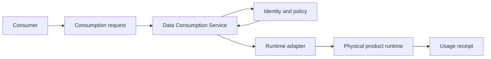

# Data Consumption Service

<small>Use when</small><strong>Serving a live product to a governed consumer.</strong>

<small>Decision</small><strong>Which logical port, access mode, policy, and runtime adapter apply?</strong>

<small>Owner</small><strong>Consumption service owner with product and consumer owners.</strong>

<small>Output</small><strong>Purpose-bound, observable, revocable access.</strong>

## Purpose and Definition

The Data Consumption Service resolves a consumer's approved purpose to a live product version and logical port, authorizes service and data use, selects a conformant runtime adapter, enforces obligations, and returns an observable usage receipt. It supports BI, applications, platforms, AI agents, and models without forcing one physical access technology.

It exists to separate the stable consumer promise from physical storage and runtime choices, so access remains consistent, governed, observable, and replaceable across channels.

## Scope and Boundaries

| Owns | Does Not Own |
| --- | --- |
| Product and port resolution, channel selection, service authorization, data authorization orchestration, entitlement, adapter execution, obligations, and revocation. | Product storage, business interpretation, identity lifecycle, product quality acceptance, or consumer misuse outside approved purpose. |
| Direct, federated, selectively projected, and replicated access decisions. | Requiring every source or product to be copied into the foundation. |
| Query, table, API, event, file, feature, retrieval, and semantic access profiles. | Exposing provider paths or credentials as the product interface. |

## Architecture Alignment

| Concern | Alignment |
| --- | --- |
| Primary plane | Data |
| Supporting planes | Control, Security, AI, and Observability |
| Supporting designs and capabilities | [Unified Access Design](../architecture/unified-access-design.md), [Semantic and Context Design](../architecture/semantic-context-design.md), [Data Contract Design](../architecture/data-contract-design.md), [Platform Governance Design](../architecture/platform-governance-design.md), [Platform Enablement Design](../architecture/platform-enablement-design.md), and [Agentic Data Service Design](../architecture/agentic-data-foundation.md) supply consumption contracts, identity, policy, entitlement, catalog, and telemetry. |
| Integration flows | Discover and subscribe, request access, authorize, resolve port, execute adapter, enforce obligations, record usage, renew, and revoke. |

## Service Architecture

The logical product port remains stable while physical storage, compute, endpoint, or adapter changes.

## Agentic Interaction

| Concern | Agent Operating Specification |
| --- | --- |
| Specialist role | Consumption agent that resolves fit-for-purpose products, selects logical ports and adapters, and fulfills governed access. |
| Declarative boundary | Published Data Product Consumption Contract, consumer identity, purpose, product version, policy, obligations, and expiry. |
| Autonomous range | Resolve, authorize, select a conformant adapter, enforce scope, issue receipts, renew within limits, and revoke on expiry or policy trigger. |
| Must defer | Wider purpose, broader data scope, new entitlement, or a non-conformant access path requires contract and policy review. |

## Core Capabilities

| Category | Capability | Owned Outcome |
| --- | --- | --- |
| Discovery | Product and port resolution | The approved product, version, port, health, semantics, policy, and support are resolved from stable ids. |
| Contracts | Consumption agreement | Consumer, purpose, scope, channel, SLO, obligations, expiry, and revocation are explicit. |
| Authorization | Separate service and data decisions | The actor may invoke the service and use the selected product for the declared purpose. |
| Orchestration | Adapter selection and execution | Work executes through a conformant channel near the approved data runtime. |
| Enforcement | Obligations and entitlement | Masking, filtering, minimization, rate, region, retention, output, and expiry controls are applied. |
| Operations | Usage, SLO, cost, and revocation | Access remains observable, supportable, renewable, and immediately revocable. |

## Data Contracts and Interfaces

| Interface | Purpose | Required Definition |
| --- | --- | --- |
| Consumption request API | Request a product port for a named purpose. | Consumer and subject identity, product and port, purpose, scope, duration, channel, environment, and use-case owner. |
| Resolution API | Resolve logical port to approved version and runtime binding. | Product, contract, semantic-context, health, policy, adapter, and compatibility versions. |
| Authorization API | Obtain service and data decisions with obligations. | Actor, subject, action, product, purpose, classification, environment, policy context, and entitlement. |
| Runtime adapter | Execute query, API, event, file, feature, retrieval, or semantic access. | Typed input and output, identity propagation, obligations, SLO, errors, telemetry, and fail-closed behavior. |
| Usage receipt | Record access outcome and current binding. | Consumer, purpose, product and contract versions, decisions, obligations, adapter, cost, latency, outcome, and trace. |

## Integrations and Dependencies

| Dependency | Consumption Uses | Consumption Provides |
| --- | --- | --- |
| Data Service Portal and Assistant | Consumer intent, selected product, purpose, requested action, confirmation, and task context. | Available ports, requirements, decisions, status, endpoint or binding, obligations, and receipt. |
| Product, contract, semantic, catalog, and health authorities | Product versions, ports, meaning, policy intent, lifecycle, SLO, support, and current health. | Subscription, selected port, consumer dependency, usage, and feedback. |
| Identity, policy, and entitlement | Authentication, delegated scope, service decision, data decision, and obligations. | Actor, subject, purpose, target, action, environment, and enforcement result. |
| Platform Enablement Service | Endpoint, warehouse, compute, identity binding, policy, adapter, secret, and revocation resources. | Typed resource request, lifecycle, owner, policy context, and deprovisioning intent. |
| Observability and Operations | Access telemetry, SLOs, incidents, product impact, support, and recovery. | Decision, adapter, latency, errors, usage, cost, consumer impact, revocation, and recovery evidence. |

## Direct, Federated, or Replicated Access Decision

| Access Mode | Use When | Avoid When |
| --- | --- | --- |
| Direct source API or MCP | Current operational state, bounded commands, and source remains the correct runtime authority. | History, reproducibility, broad analytics, source isolation, or cross-source composition is required. |
| Federated query | Data can stay at source and the engine can enforce identity, policy, performance, and telemetry. | Source load, availability, semantics, or cross-platform controls are insufficient. |
| Selective projection | A narrow decoupled cache, index, feature, or search view is justified. | It becomes an unmanaged second product or loses source lineage and expiry. |
| Replicated product | History, transformation, scale, reuse, isolation, reproducibility, or contractual SLO requires a governed copy. | Replication is merely the default integration habit. |

## Controls and Evidence

| Control | Required Evidence |
| --- | --- |
| Service authorization and data authorization are separate and fail closed. | Two decision ids, policy versions, evaluated attributes, result, obligations, and enforcement point. |
| Every access is purpose-bound, minimized, time-limited where appropriate, and revocable. | Consumption contract, entitlement, scope, purpose, expiry, renewal, revocation, and access audit. |
| Adapters preserve logical product identity and enforce obligations. | Conformance tests, identity propagation, masking or filtering result, SLO, errors, and telemetry. |
| Physical runtime details are hidden behind stable ports. | Product and port ids, adapter binding, provider mapping, compatibility, and tested migration. |
| AI access uses the same contract and policy boundary. | Agent or model identity, delegated scope, approved purpose, product and context versions, and evaluation trace. |

## Action Checklist

| Engineer | Product Owner |
| --- | --- |
| Implement resolver, policy integration, entitlements, adapters, obligations, receipts, revocation, SLO telemetry, and failure handling; test every supported channel. | Define consumer purpose, approved audience, product and port, scope, service level, obligations, expiry, prohibited uses, support, and success measure. |
| Test allow, deny, masking, minimization, stale product, unhealthy port, adapter failure, latency, duplicate request, expiry, revocation, source outage, and provider migration. | Choose the lightest access mode that satisfies the outcome and controls; review usage, value, cost, incidents, and continued need. |

## Reference Solutions

[Data Consumption Design](../reference-solutions/data-consumption-design.md) maps this service to Unity Catalog, Databricks SQL, open table interfaces, sharing, and conformant adapters. It is a selected reference profile; logical product ports and policy intent remain portable.

## Target User Experience

Use each row as an end-to-end acceptance scenario for product design and engineering validation.

| User and Intent | User Action | Required Service Behavior | Observable Result |
| --- | --- | --- | --- |
| Consumer selects a product and interface. | Compare products, health, semantics, and available ports for a declared purpose. | Resolve permission-filtered product context and recommend a fit-for-purpose logical port and access mode. | The consumer can choose an interface without needing storage paths, provider credentials, or implementation knowledge. |
| Consumer requests access. | Submit purpose, scope, identity, duration, and required interface. | Evaluate service access and data access separately, resolve the consumption contract, obligations, approval, and entitlement. | The decision explains approved scope, reason, obligations, expiry, missing requirements, and next action. |
| Consumer connects and uses data. | Resolve the logical port and execute an approved query, API, event, file, feature, retrieval, or semantic operation. | Select and operate the direct, federated, projected, or replicated adapter while enforcing policy, SLO, telemetry, and fail-closed behavior. | BI, application, platform, agent, and model consumers receive consistent meaning, current health, and an execution receipt. |
| Consumer manages access lifecycle. | Inspect, renew, reduce, suspend, revoke, or deprovision access. | Re-evaluate purpose and policy, update entitlement, stop affected access, and retain proof across adapters. | Access state is current, explainable, time-bound, and revocable without provider-specific cleanup. |
| Consumer uses agent assistance. | Ask the agent to discover, request, connect, or diagnose. | Keep every delegated task inside the product, port, purpose, scope, obligations, and expiry of the consumption contract. | Assistance accelerates the journey without widening authority or hiding the deterministic service decision. |
