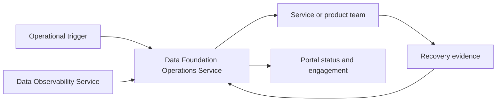

# Data Foundation Operations Service

<small>Use when</small><strong>Coordinating support, response, change, recovery, or improvement.</strong>

<small>Decision</small><strong>Who owns the response and what proves recovery?</strong>

<small>Owner</small><strong>Foundation operations owner with affected service owners.</strong>

<small>Output</small><strong>Owned operational record, communication, and recovery evidence.</strong>

## Purpose and Definition

The Data Foundation Operations Service turns user needs, health signals, planned changes, and operational risks into accountable support, incident, problem, change, release, continuity, recovery, communication, and improvement workflows across all foundation services.

It exists to connect service health, product trust, consumer impact, ownership, communication, and recovery instead of leaving each service to coordinate operational response independently.

## Scope and Boundaries

| Owns | Does Not Own |
| --- | --- |
| Service registry, support intake, operational workflow state, incident command, problem coordination, change and release coordination, continuity, communication, and improvement tracking. | Portal experience, telemetry detection, engineering remediation, deployment execution, product meaning, product-quality acceptance, or security-risk acceptance. |
| Cross-service impact, ownership, escalation, timeline, recovery validation, and operational evidence. | Replacing enterprise service management, security incident response, business continuity governance, or team delivery backlogs. |
| System-plus-product recovery and consumer communication. | Closing an incident merely because a process or job is running. |

## Architecture Alignment

| Concern | Alignment |
| --- | --- |
| Primary planes | Experience and Control |
| Supporting planes | AI, Observability, and Security |
| Shared capabilities | Agentic foundation, service ownership, workflow, telemetry, identity, responder authority, change, continuity, runbooks, and evidence retention. |
| Integration flows | Support, incident, problem, change, release, recovery, continuity, communication, and improvement. |

## Service Architecture

Operations owns coordination and authoritative operational records. The affected service or product team owns technical diagnosis and remediation.

## Agentic Interaction

| Concern | Service Agent Contract |
| --- | --- |
| Specialist role | Operations agent that triages, coordinates responders, communicates status, invokes runbooks, and verifies recovery evidence. |
| Declarative boundary | Service ownership, incident or change record, responder authority, approved runbook, policy, impact, and recovery criteria. |
| Autonomous range | Classify, route, correlate impact, communicate, execute pre-approved recovery, escalate, and track improvement. |
| Must defer | Risk acceptance, unapproved privileged remediation, major change, and incident closure without system and product recovery evidence. |

## Core Capabilities

| Category | Capability | Owned Outcome |
| --- | --- | --- |
| Service management | Portfolio and readiness | Every production service has an owner, tier, SLO, dependencies, support, continuity, runbooks, and readiness evidence. |
| Engagement | Support and service request | One intake path routes needs by service, product, impact, urgency, owner, target, and status. |
| Response | Incident management | Severity, command, impact, containment, recovery, communication, validation, and timeline remain coordinated. |
| Learning | Problem management | Recurring failure becomes causal evidence, known error, workaround, owned remediation, and measured recurrence reduction. |
| Change | Change and release coordination | Risk, dependencies, approval, window, communication, validation, rollback, and outcome are explicit. |
| Reliability | Continuity and recovery | SLOs, error budgets, capacity, resilience, exercises, recovery objectives, toil, and risk guide investment. |
| Improvement | Operational excellence | Support, incident, change, reliability, cost, risk, and feedback evidence drives measurable owned improvements. |

## Contracts and Interfaces

| Interface | Purpose | Required Contract |
| --- | --- | --- |
| Support API | Create and track a user or service request. | Requester, service, product, purpose, impact, urgency, owner, target, status, communication, and resolution. |
| Incident API | Coordinate material service or product impact. | Severity, commander, responders, affected services, products and consumers, timeline, decisions, actions, communication, and recovery. |
| Change and release API | Coordinate planned or emergency change. | Scope, risk, dependencies, approvals, window, release, validation, telemetry, communication, rollback, and outcome. |
| Problem and improvement API | Track cause, recurring weakness, and corrective outcome. | Incidents, cause, known error, workaround, risk, owner, due date, change, measure, and residual risk. |
| Operational event | Exchange status, escalation, recovery, or communication state. | Record id, service, product, release, environment, severity, state, owner, event time, and correlation ids. |

## Integrations and Dependencies

| Dependency | Operations Uses | Operations Provides |
| --- | --- | --- |
| Data Service Portal | Request context, user impact, subscriptions, feedback, and audience. | Owner, target, status, incident, planned change, communication, workaround, and closure evidence. |
| Data Observability Service | Alerts, SLOs, product health, affected consumers, releases, dependencies, and recovery evidence. | Incident, change, severity, current owner, timeline, action, and outcome context. |
| Foundation service and product teams | Diagnosis, remediation, technical validation, release, rollback, runbooks, and improvement delivery. | Command, priorities, dependencies, authority, communication, escalation, and recovery acceptance. |
| Identity, security, risk, and continuity authorities | Responder scopes, segregation, emergency access, risk, crisis, and recovery requirements. | Operational need, action record, access use, impact, timeline, and assurance evidence. |
| Enterprise service management | Service, request, incident, problem, change, knowledge, communication, and escalation records. | Data-foundation identifiers, product impact, telemetry links, runbook, and recovery detail. |

## Controls and Evidence

| Control | Required Evidence |
| --- | --- |
| Every production service has operational ownership and readiness. | Owner, tier, SLO, dependencies, support, escalation, continuity, runbooks, telemetry, and last exercise. |
| Major incident has one command structure and timeline. | Commander, responders, severity, impact, decisions, actions, communications, timestamps, and closure approval. |
| Recovery proves system, product, consumer, control, and stability outcomes. | Runtime, quality, freshness, lineage, access, backlog, consumer, policy, and observation-window checks. |
| Change control is proportionate and cannot bypass product, contract, security, or deployment gates. | Change class, risk, dependencies, approvals, release, validation, telemetry, rollback, and outcome. |
| Privileged and emergency action is bounded and reviewed. | Named authority, scope, duration, action audit, revocation, and retrospective review. |

## Action Checklist

| Engineer | Product Owner |
| --- | --- |
| Integrate telemetry and service-management APIs; propagate service, product, contract, release, run, trace, change, and incident ids; automate runbook triggers, status, recovery checks, and evidence retention. | Define service tier, support hours, SLO, impact model, escalation, communication audiences, change tolerance, continuity objectives, recovery acceptance, improvement priorities, and outcome measures. |
| Exercise alert deduplication, service outage, product-quality incident, dependency failure, failed change, rollback, emergency access, continuity, communication, and evidence retrieval. | Participate in readiness, major incident, change, recovery, and service reviews; accept product and consumer recovery; own business communication and prioritized improvement. |

## Reference Solutions

No service-management vendor is mandated. A selected implementation must preserve stable foundation identifiers, product-impact context, workflow authority, API integration, permission-filtered status, exportability, and an exit path. Use [Architecture to Delivery](../foundation/architecture-to-delivery.md) and the [Service Runbook Template](../reference-solutions/service-runbook-template.md).

## Done Criteria

- Every production foundation service has a complete operational record and exercised runbooks.
- Portal support and status use authoritative operational APIs rather than copied state.
- Alerts create or enrich deduplicated operational records with affected products and consumers.
- Support, incident, problem, change, release, continuity, recovery, and improvement flows are exercised.
- Recovery is proven from telemetry through system, product, control, and consumer outcomes.
- The operations agent uses approved runbooks and responder authority; autonomous recovery, escalation, suspension, and deterministic fallback are exercised.
- Operational evidence is searchable, permission-filtered, retained, and linked to architecture, service, change, and improvement decisions.
