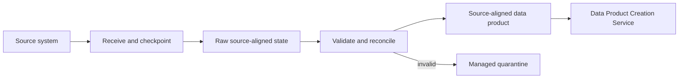

# Data Ingestion Service

<small>Use when</small><strong>Onboarding or operating a source channel.</strong>

<small>Decision</small><strong>Which governed ingestion pattern and contract apply?</strong>

<small>Owner</small><strong>Foundation ingestion owner with source owner.</strong>

<small>Output</small><strong>Validated source-aligned product and handoff.</strong>

## Purpose and Definition

The Data Ingestion Service centrally manages source onboarding and reliable receipt through file inbox push, connector pull, API extraction, CDC, and event streaming. It publishes raw and validated source-aligned states while preserving source meaning, provenance, replay, and source-owner obligations.

It exists to solve source connectivity, change, replay, and provenance once, so domain teams can build products from a dependable source-aligned handoff instead of operating duplicated ingestion pipelines.

## Scope and Boundaries

| Owns | Does Not Own |
| --- | --- |
| Source onboarding, connectivity, transport, raw receipt, validation, quarantine, replay, reconciliation, and source-aligned publication. | Aggregate or consumer-aligned business transformation. |
| Operational reliability and evidence for centrally managed source-aligned states. | Accepting breaking source changes without accountable contract review. |
| Standard push, pull, API, CDC, and streaming patterns. | Replicating data when direct or federated access better satisfies the use case. |

## Architecture Alignment

| Concern | Alignment |
| --- | --- |
| Primary plane | Data |
| Supporting planes | AI, Control, Security, and Observability |
| Supporting designs and capabilities | [Data Foundation Model](../architecture/data-foundation-model.md), [Data Contract Design](../architecture/data-contract-design.md), [Platform Enablement Design](../architecture/platform-enablement-design.md), [Platform Governance Design](../architecture/platform-governance-design.md), and [Agentic Data Service Design](../architecture/agentic-data-foundation.md) supply the ingestion contract, catalog, governed storage, identity, secrets, lineage, retention, and telemetry. |
| Integration flows | Source onboarding, source change, delivery, quarantine and replay, validated handoff, and incident recovery. |

## Service Architecture

Transport, validation, and storage remain separable so a delivery mechanism can change without redefining downstream products.

## Agentic Interaction

| Concern | Agent Operating Specification |
| --- | --- |
| Specialist role | Ingestion agent that prepares onboarding, operates source delivery, diagnoses exceptions, and maintains source-aligned trust. |
| Declarative boundary | Published Source System Ingestion Contract, source identity, approved connection, policy, SLOs, and runbooks. |
| Autonomous range | Profile, validate, reconcile, quarantine, retry, replay, and recover within published limits. |
| Must defer | New source activation, material contract change, accepted data-quality exception, and destructive retention action require their named gates. |

## Core Capabilities

| Category | Capability | Owned Outcome |
| --- | --- | --- |
| Onboarding | Source registration and pattern selection | Owner, interface, classification, contract, access mode, support, and activation evidence are explicit. |
| Transport | Reliable incremental movement | Checkpointing, idempotency, ordering, deduplication, backpressure, retry, and replay meet the contract. |
| Validation | Schema and delivery validation | Invalid or unexpected data is blocked, quarantined, explained, and recoverable. |
| Reconciliation | Completeness and continuity | Expected and received counts, watermarks, gaps, duplicates, and late data are measured and resolved. |
| Publication | Source-aligned handoff | Raw and validated states have stable identities, lineage, ownership, ports, SLOs, retention, and support. |
| Operations | Source-channel reliability | Lag, backlog, failure, quarantine, replay, cost, and source impact are observable. |

## Data Contracts and Interfaces

| Interface | Purpose | Required Definition |
| --- | --- | --- |
| Source onboarding API | Register or change a source channel. | Source owner, interface, pattern, classification, schema, keys, cadence, volume, change notice, support, and access decision. |
| Delivery interface | Receive file, connector extract, API result, CDC, or event stream. | Source System Ingestion Contract with identity, ordering, checkpoint, retry, replay, and compatibility behavior. |
| Quarantine and replay API | Inspect, correct, release, or replay failed delivery. | Failure reason, affected range, authority, correction, idempotency, and reconciliation target. |
| Source-aligned product port | Publish validated source meaning to product teams. | Product descriptor embedded in the ingestion contract, SLO, quality, lineage, classification, retention, and support. |
| Lifecycle event | Announce activation, schema change, lag, breach, replay, deprecation, or recovery. | Source, contract, dataset, run, event, trace, state, time, and evidence links. |

## Integrations and Dependencies

| Dependency | Ingestion Uses | Ingestion Provides |
| --- | --- | --- |
| Source system team | Availability, semantics, schema, keys, delivery behavior, and change notice. | Activation status, receipt, reconciliation, rejection, lag, and impact evidence. |
| Platform Enablement Service | Connections, secrets, storage, checkpoints, catalog bindings, identity, retention, and automation. | Typed resource requests, owner, purpose, policy context, lifecycle, and deprovisioning intent. |
| Contract, catalog, policy, and lineage | Contract decisions, classification, authorization, identifiers, and metadata authorities. | Source and dataset versions, technical metadata, lineage, validation, and current state. |
| Product Creation Service | Accepted source-aligned input and change communication. | Stable validated port, contract version, SLO, quality, lineage, and support route. |
| Observability and Operations | Telemetry, alerting, incident, change, and recovery workflow. | Lag, backlog, run, failure, quarantine, replay, cost, product impact, and recovery signals. |

## Controls and Evidence

| Control | Required Evidence |
| --- | --- |
| No activation without an approved Source System Ingestion Contract and source owner. | Contract version, approvals, source identity, support route, and activation receipt. |
| Raw access is restricted and retention-controlled. | Classification, policy decision, entitlement, access audit, retention, and deletion result. |
| Delivery is replayable and reconciled. | Checkpoint, watermark, expected and actual counts, duplicates, gaps, replay, and final reconciliation. |
| Breaking change is blocked or versioned. | Compatibility result, affected products and consumers, decision, migration window, and rollback. |
| Validated handoff is observable. | Freshness, quality, lineage, volume, contract status, SLO, and current health. |

## Action Checklist

| Engineer | Product Owner |
| --- | --- |
| Implement the approved pattern, identity, checkpoint, raw and validated states, schema validation, quarantine, replay, reconciliation, lineage, telemetry, retention, and recovery tests. | Confirm source purpose, accountable owner, downstream need, service level, known limitations, change obligations, access mode, retention, support, and activation acceptance. |
| Test duplicate, missing, late, corrupt, reordered, schema-change, credential-rotation, source-outage, backlog, replay, and deprovisioning scenarios. | Decide whether replication is justified; accept the validated source-aligned promise and consumer communication obligations. |

## Reference Solutions

[Data Ingestion Design](../reference-solutions/data-ingestion-design.md) maps this service to Databricks Lakeflow, Auto Loader, Unity Catalog, and Delta Lake. It is a selected reference profile and cannot redefine the Source System Ingestion Contract or service boundary.

## Target User Experience

Use each row as an end-to-end acceptance scenario for product design and engineering validation.

| User and Intent | User Action | Required Service Behavior | Observable Result |
| --- | --- | --- | --- |
| Source owner selects the right integration boundary. | Describe source, consumers, latency, history, reuse, scale, and control needs. | Compare direct, federated, event, projected, and replicated patterns and record the decision rationale. | The owner understands whether ingestion is justified and which obligations follow. |
| Source owner onboards a source. | Submit file, connector, API, CDC, or event intent and approve the ingestion contract. | Validate identity, schema, semantics, classification, delivery, replay, retention, support, and source-aligned output before activation. | One approved source record, contract, pattern, owner, support route, and activation decision are visible. |
| Ingestor monitors delivery. | Inspect receipt, validation, lag, reconciliation, and publication state. | Correlate source delivery through raw receipt and validation to the published source-aligned version. | The user sees what arrived, what passed, what was published, and whether freshness and completeness meet the contract. |
| Ingestor resolves an exception. | Quarantine, correct, replay, pause, or escalate. | Explain failure and impact, preserve evidence, enforce authority and idempotency, and reconcile after recovery. | Missing, duplicate, late, corrupt, or incompatible data is recovered without silent loss or duplication. |
| Product team consumes the source-aligned output. | Discover and bind to the published product port. | Expose stable identity, meaning, lineage, quality, freshness, limitations, change notice, and support without internal pipeline details. | The team can build downstream products against a versioned and observable source promise. |
