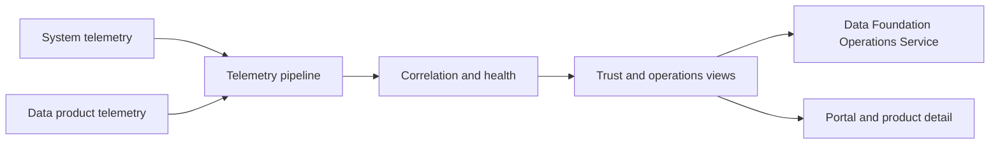

# Data Observability Service

<small>Use when</small><strong>Defining measurable service and data-product trust.</strong>

<small>Decision</small><strong>Which signals, SLOs, context, and correlations prove current health?</strong>

<small>Owner</small><strong>Observability owner with service and product owners.</strong>

<small>Output</small><strong>Current health, impact, alert, and recovery evidence.</strong>

## Definition

The Data Observability Service correlates system telemetry and data-product telemetry from source through consumption and sharing. It uses OpenTelemetry as the system-signal standard, OpenLineage for runtime data lineage, and canonical product identifiers to make health, trust, impact, usage, cost, incidents, and recovery evidence understandable end to end.

## Scope and Boundaries

| Owns | Does Not Own |
| --- | --- |
| Telemetry conventions, collection, normalization, correlation, SLO calculation, health records, alert enrichment, impact views, and evidence publication. | Product metadata, contract, catalog, policy, entitlement, workflow, incident-command, or product-quality decision authority. |
| System and data-product signal coverage across every foundation service. | Storing sensitive business payloads in logs, traces, metrics, or events. |
| Detection and current health evidence. | Coordinating response, communication, change, or improvement, which belongs to Foundation Operations. |

## Architecture Alignment

| Concern | Alignment |
| --- | --- |
| Primary plane | Observability |
| Supporting planes | Every plane through common identity, telemetry, and evidence. |
| Shared capabilities | OpenTelemetry conventions, product and contract ids, lineage, SLOs, catalog context, identity, policy, and evidence retention. |
| Integration flows | Emit, collect, normalize, correlate, calculate health, detect, assess impact, alert, recover, and publish current evidence. |

## Service Architecture

Product metadata is referenced from canonical authorities rather than copied as a new truth. Every health claim includes authority, observation time, coverage, and limitations.

## Core Capabilities

| Category | Capability | Owned Outcome |
| --- | --- | --- |
| Standards | Telemetry conventions | Services emit consistent resource, service, product, contract, run, consumer, release, and trace context. |
| Collection | Signal ingestion and routing | Telemetry is validated, minimized, classified, sampled, retained, and routed to approved backends. |
| Product insight | Quality, freshness, volume, schema, lineage, usage, and cost | Current product trust is measurable against contracts and SLOs. |
| Correlation | End-to-end impact model | Source, pipeline, product, consumer, contract, release, policy, and incident are connected. |
| Alerting | Actionable detection | SLO breaches and anomalies are deduplicated, enriched with product impact, and routed to accountable owners. |
| Publication | Health and evidence views | Portal, catalog, service owners, and operations receive permission-filtered current health and evidence links. |

## Contracts and Interfaces

| Interface | Purpose | Required Contract |
| --- | --- | --- |
| OTLP endpoint | Receive traces, metrics, and logs. | Required resource attributes, semantic conventions, classification, sampling, retention, errors, and source identity. |
| Product telemetry event | Publish quality, freshness, volume, schema, usage, cost, lifecycle, or SLO evidence. | Product, contract, dataset, run, rule, consumer, observation time, result, threshold, and lineage ids. |
| OpenLineage event | Exchange runtime lineage. | Job, run, input and output datasets, facets, event time, namespace, and correlation ids. |
| Health API | Return current service or product health. | Subject id, SLO state, signal coverage, observation time, authority, incidents, impact, and limitations. |
| Alert and recovery event | Create or enrich operational workflow. | Alert id, severity, service, product, consumers, evidence, deduplication, owner, incident, and recovery state. |

## Integrations and Dependencies

| Dependency | Observability Uses | Observability Provides |
| --- | --- | --- |
| Foundation services and runtimes | Telemetry, lifecycle events, SLO targets, releases, errors, usage, cost, and recovery checks. | Validated conventions, collectors, health, alerts, impact, dashboards, and evidence. |
| Product, contract, catalog, semantic, policy, and lineage authorities | Stable ids, owners, lifecycle, classifications, SLOs, relationships, and decisions. | Current measured state, coverage, observation time, anomaly, usage, cost, and incident links. |
| Platform Enablement Service | Collectors, exporters, storage, dashboard, alert, identity, policy, and retention resources. | Typed telemetry-resource requirements, health, drift, cost, and evidence lifecycle. |
| Data Foundation Operations Service | Incident, change, release, support, recovery, and communication context. | Detection, impact, affected consumers, timeline signals, and system-plus-product recovery evidence. |
| Data Service Portal | Identity and requested view. | Permission-filtered health, authority, observation time, limitations, and action links. |

## Controls and Evidence

| Control | Required Evidence |
| --- | --- |
| Every production service and live product has defined signal and SLO coverage. | Coverage inventory, SLO, owner, dashboard, alert route, runbook, and last test. |
| Telemetry contains canonical correlation ids and no prohibited payload. | Schema validation, attribute coverage, classification scan, redaction, sampling, and retention result. |
| Health is not inferred beyond available evidence. | Observation time, source authority, coverage, limitations, stale threshold, and unknown state behavior. |
| Alerts are actionable and deduplicated. | Alert rule, threshold, owner, affected products and consumers, deduplication key, incident link, and outcome. |
| Recovery validates system and product trust. | Runtime, quality, freshness, lineage, access, backlog, consumer, and stability checks. |

## Action Checklist

| Engineer | Product Owner |
| --- | --- |
| Instrument services and workloads; validate conventions; propagate canonical ids; build SLOs, correlation, alerts, health APIs, retention, access, and recovery checks; test telemetry failure. | Define product SLOs, quality and freshness thresholds, acceptable unknown states, owner and escalation, consumer impact, health communication, value and cost measures, and review cadence. |
| Test missing, stale, malformed, sensitive, high-cardinality, duplicate, out-of-order, backend-outage, exporter-failure, alert-storm, correlation-gap, and evidence-restoration scenarios. | Review health, incidents, usage, cost, signal coverage, false alerts, consumer impact, and improvement priorities; do not claim trust without current evidence. |

## Reference Solutions

[Observability Design](../architecture/observability-design.md) maps product observability to Databricks and Unity Catalog and system observability to Grafana Cloud, connected through OpenTelemetry and OpenLineage. It is a selected reference profile; canonical telemetry semantics remain portable.

## Done Criteria

- Every production service and live product emits validated system and product signals with canonical identifiers.
- Health views show SLO, quality, freshness, usage, cost, incidents, authority, observation time, coverage, and limitations.
- Alerts identify accountable owners and affected products and consumers.
- A trace resolves from consumer impact through product, workload, source, release, and incident.
- Telemetry loss, sensitive-data leakage, alert storm, stale health, correlation failure, and backend recovery are tested.
- OTLP and OpenLineage outputs are accepted by independent reference receivers.
