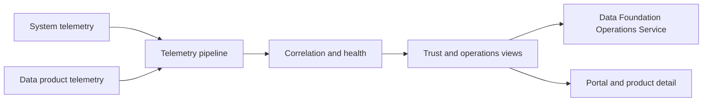

# Data Observability Service

<small>Use when</small><strong>Defining measurable service and data-product trust.</strong>

<small>Decision</small><strong>Which signals, SLOs, context, and correlations prove current health?</strong>

<small>Owner</small><strong>Observability owner with service and product owners.</strong>

<small>Output</small><strong>Current health, impact, alert, and recovery evidence.</strong>

## Purpose and Definition

The Data Observability Service correlates system telemetry and data-product telemetry from source through consumption and sharing. It uses OpenTelemetry as the telemetry standard, exportable runtime lineage records, and authoritative product identifiers to make health, trust, impact, usage, cost, incidents, and recovery evidence understandable end to end.

It exists because technical uptime alone cannot prove that a data product is fresh, accurate, used, trustworthy, or safe for its consumers.

## Scope and Boundaries

| Owns | Does Not Own |
| --- | --- |
| Telemetry conventions, collection, normalization, correlation, SLO calculation, health records, alert enrichment, impact views, and evidence publication. | Product metadata, contract, catalog, policy, entitlement, workflow, incident-command, or product-quality decision authority. |
| System and data-product signal coverage across every foundation service. | Storing sensitive business payloads in logs, traces, metrics, or events. |
| Detection and current health evidence. | Coordinating response, communication, change, or improvement, which belongs to Foundation Operations. |

## Architecture Alignment

| Concern | Alignment |
| --- | --- |
| Primary plane | Observability |
| Supporting planes | Every plane through common identity, telemetry, and evidence. |
| Supporting designs and capabilities | [Data Product Design](../architecture/data-product-design.md), [Data Contract Design](../architecture/data-contract-design.md), [Platform Governance Design](../architecture/platform-governance-design.md), [Platform Enablement Design](../architecture/platform-enablement-design.md), and [Agentic Data Service Design](../architecture/agentic-data-foundation.md) supply product and contract identity, lineage, SLO context, policy, automation, and evidence retention; the [OpenTelemetry Standard](../standards/otel-telemetry-standard.md) defines telemetry conventions. |
| Integration flows | Emit, collect, normalize, correlate, calculate health, detect, assess impact, alert, recover, and publish current evidence. |

## Service Architecture

Product metadata is referenced from authoritative sources rather than copied as a new truth. Every health claim includes authority, observation time, coverage, and limitations.

## Agentic Interaction

| Concern | Agent Operating Specification |
| --- | --- |
| Specialist role | Observability agent that correlates system and product signals, explains trust and impact, and prepares operational evidence. |
| Declarative boundary | Telemetry profiles, product and contract identifiers, SLOs, evidence policy, incident thresholds, and permission-filtered context. |
| Autonomous range | Detect, correlate, diagnose, alert, explain impact, and assemble evidence or recommended action. |
| Must defer | It cannot alter source telemetry, suppress required evidence, accept product risk, or close recovery without owner validation. |

## Core Capabilities

| Category | Capability | Owned Outcome |
| --- | --- | --- |
| Standards | Telemetry conventions | Services emit consistent resource, service, product, contract, run, consumer, release, and trace context. |
| Collection | Signal ingestion and routing | Telemetry is validated, minimized, classified, sampled, retained, and routed to approved backends. |
| Product insight | Quality, freshness, volume, schema, lineage, usage, and cost | Current product trust is measurable against contracts and SLOs. |
| Correlation | End-to-end impact model | Source, pipeline, product, consumer, contract, release, policy, and incident are connected. |
| Alerting | Actionable detection | SLO breaches and anomalies are deduplicated, enriched with product impact, and routed to accountable owners. |
| Publication | Health and evidence views | Portal, catalog, service owners, and operations receive permission-filtered current health and evidence links. |

## Data Contracts and Interfaces

| Interface | Purpose | Required Definition |
| --- | --- | --- |
| OTLP endpoint | Receive traces, metrics, and logs. | Required resource attributes, semantic conventions, classification, sampling, retention, errors, and source identity. |
| Product telemetry event | Publish quality, freshness, volume, schema, usage, cost, lifecycle, or SLO evidence. | Product, contract, dataset, run, rule, consumer, observation time, result, threshold, and lineage ids. |
| Lineage export | Exchange runtime lineage. | Job, run, input and output datasets, transformations, event time, namespace, and correlation ids. |
| Health API | Return current service or product health. | Subject id, SLO state, signal coverage, observation time, authority, incidents, impact, and limitations. |
| Alert and recovery event | Create or enrich operational workflow. | Alert id, severity, service, product, consumers, evidence, deduplication, owner, incident, and recovery state. |

## Integrations and Dependencies

| Dependency | Observability Uses | Observability Provides |
| --- | --- | --- |
| Foundation services and runtimes | Telemetry, lifecycle events, SLO targets, releases, errors, usage, cost, and recovery checks. | Validated conventions, collectors, health, alerts, impact, dashboards, and evidence. |
| Product, contract, catalog, semantic, policy, and lineage authorities | Stable ids, owners, lifecycle, classifications, SLOs, relationships, and decisions. | Current measured state, coverage, observation time, anomaly, usage, cost, and incident links. |
| Platform Enablement Service | Collectors, exporters, storage, dashboard, alert, identity, policy, and retention resources. | Typed telemetry-resource requirements, health, drift, cost, and evidence lifecycle. |
| Data Foundation Operations Service | Incident, change, release, support, recovery, and communication context. | Detection, impact, affected consumers, timeline signals, and system-plus-product recovery evidence. |
| Data Service Portal | Identity and requested view. | Permission-filtered health, authority, observation time, limitations, and action links. |

## Controls and Evidence

| Control | Required Evidence |
| --- | --- |
| Every production service and live product has defined signal and SLO coverage. | Coverage inventory, SLO, owner, dashboard, alert route, runbook, and last test. |
| Telemetry contains authoritative correlation ids and no prohibited payload. | Schema validation, attribute coverage, classification scan, redaction, sampling, and retention result. |
| Health is not inferred beyond available evidence. | Observation time, source authority, coverage, limitations, stale threshold, and unknown state behavior. |
| Alerts are actionable and deduplicated. | Alert rule, threshold, owner, affected products and consumers, deduplication key, incident link, and outcome. |
| Recovery validates system and product trust. | Runtime, quality, freshness, lineage, access, backlog, consumer, and stability checks. |

## Action Checklist

| Engineer | Product Owner |
| --- | --- |
| Instrument services and workloads; validate conventions; propagate stable ids; build SLOs, correlation, alerts, health APIs, retention, access, and recovery checks; test telemetry failure. | Define product SLOs, quality and freshness thresholds, acceptable unknown states, owner and escalation, consumer impact, health communication, value and cost measures, and review cadence. |
| Test missing, stale, malformed, sensitive, high-cardinality, duplicate, out-of-order, backend-outage, exporter-failure, alert-storm, correlation-gap, and evidence-restoration scenarios. | Review health, incidents, usage, cost, signal coverage, false alerts, consumer impact, and improvement priorities; do not claim trust without current evidence. |

## Reference Solutions

[Observability Design](../reference-solutions/observability-design.md) maps product observability to Databricks and Unity Catalog and system observability to Grafana Cloud, connected through stable identifiers, portable lineage records, and OpenTelemetry. It is a selected reference profile; authoritative telemetry and lineage semantics remain portable.

## Target User Experience

Use each row as an end-to-end acceptance scenario for product design and engineering validation.

| User and Intent | User Action | Required Service Behavior | Observable Result |
| --- | --- | --- | --- |
| Product owner evaluates trust. | Open product health and select a time window or version. | Correlate quality, freshness, availability, usage, cost, incidents, lineage, authority, observation time, coverage, and limitations. | The owner can explain current product health, consumer impact, trend, and required action. |
| Consumer checks fitness before use. | Inspect health from discovery or a product port. | Return permission-filtered, current SLO and product-quality status with source, time, coverage, and known gaps. | The consumer can decide whether to use, wait, degrade, or escalate. |
| Operator investigates an issue. | Start from an alert, consumer symptom, product, run, service, or incident. | Traverse stable correlations across product, workload run, source, release, traces, logs, metrics, lineage, owner, and incident. | The operator reaches the likely failure domain and affected consumers without manually joining tools. |
| Owner or responder receives an alert. | Acknowledge, route, suppress under policy, or open an incident. | Explain breached objective, severity, affected products and consumers, accountable owner, evidence, and recommended response. | The alert is actionable, deduplicated, correctly owned, and linked to response state. |
| Telemetry is missing or unreliable. | Inspect coverage or report a discrepancy. | Mark stale, sampled, conflicting, or absent signals as evidence gaps and route telemetry restoration. | Unknown health is never presented as healthy, and users can see the limitation and recovery owner. |
