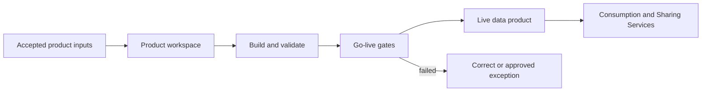

# Data Product Creation Service

<small>Use when</small><strong>Building or changing an aggregate or consumer-aligned product.</strong>

<small>Decision</small><strong>Which product design, workload, tests, and gates are required?</strong>

<small>Owner</small><strong>Product creation service owner with domain product owner.</strong>

<small>Output</small><strong>Live product version with stable ports and evidence.</strong>

## Purpose and Definition

The Data Product Creation Service provides the shared engineering path used by federated domain teams to create, change, release, and retire aggregate and consumer-aligned data products. The platform team owns the service and paved paths; the domain product owner owns product meaning, fitness, lifecycle, and consumer outcome.

It exists to give domain teams freedom over business meaning without forcing each team to rebuild environments, controls, testing, release, lineage, and operational foundations.

## Scope and Boundaries

| Owns | Does Not Own |
| --- | --- |
| Workspaces, templates, product workloads, build and test automation, policy integration, release orchestration, product ports, and go-live evidence. | Product purpose, domain semantics, quality acceptance, value, or lifecycle decisions. |
| Repeatable paths for batch, streaming, API, event, feature, retrieval, semantic, and file products. | Central ownership of aggregate or consumer-aligned products. |
| Compatibility, lineage, quality, rollback, and publication automation. | Treating a successful pipeline or table creation as product go-live. |

## Architecture Alignment

| Concern | Alignment |
| --- | --- |
| Primary planes | Data and Control |
| Supporting planes | AI, Security, and Observability |
| Shared capabilities | Data Product Creation Contract, agentic foundation, domain and lifecycle models, semantic context, developer experience, catalog, governed product storage, policy, lineage, and telemetry. |
| Integration flows | Propose product, provision workspace, build, validate, compatibility review, go-live, publish ports, change, rollback, and retire. |

## Service Architecture

Product code, Data Product Creation Contract, embedded descriptor, semantic context, tests, workload, release, and rollback target are versioned together.

## Agentic Interaction

| Concern | Service Agent Contract |
| --- | --- |
| Specialist role | Product creation agent that prepares designs and workloads, builds, tests, evaluates readiness, and operates approved releases. |
| Declarative boundary | Published Data Product Creation Contract, product workload, accepted inputs, domain ownership, policy, and environment profile. |
| Autonomous range | Generate or change code drafts, build, test, deploy to pre-approved environments, diagnose, and roll back safely. |
| Must defer | Product meaning, accepted exceptions, go-live, breaking changes, and retirement remain accountable owner decisions. |

## Core Capabilities

| Category | Capability | Owned Outcome |
| --- | --- | --- |
| Developer experience | Product workspace and templates | Teams start from supported product patterns with source control, environments, local validation, and clear ownership. |
| Contracts | Product definition and compatibility | Purpose, inputs, outputs, semantics, quality, SLOs, policies, ports, change behavior, and support are versioned and testable. |
| Engineering | Workload build and execution | Transformations are reproducible, observable, recoverable, and independent from hidden manual state. |
| Assurance | Automated product tests | Schema, semantics, quality, lineage, policy, performance, resilience, compatibility, and rollback are verified. |
| Lifecycle | Go-live and release | Only approved product versions publish stable ports and current evidence. |
| Portfolio | Change, deprecation, and retirement | Consumer impact, migration, access removal, archive, and retained evidence are managed. |

## Contracts and Interfaces

| Interface | Purpose | Required Contract |
| --- | --- | --- |
| Product workspace API | Create or update a product workspace and environments. | Product id, domain, owners, pattern, inputs, classification, environment, policy, and cost context. |
| Product workload | Declare code, resources, dependencies, environments, tests, deployment, telemetry, and rollback. | Data Product Workload specification linked to the creation contract. |
| Product build and test API | Plan, validate, build, test, and produce a release candidate. | Immutable input versions, code and contract versions, test profile, policy results, and artifact identity. |
| Go-live workflow | Evaluate readiness and publish an approved version. | Contract, descriptor, semantics, quality, lineage, security, SLO, support, runbook, release, and approvals. |
| Product ports | Expose table, query, API, event, file, feature, retrieval, or semantic interfaces. | Stable logical port, schema, contract version, SLO, policy, compatibility, and telemetry. |

## Integrations and Dependencies

| Dependency | Creation Uses | Creation Provides |
| --- | --- | --- |
| Product owner and domain team | Purpose, semantics, input selection, quality acceptance, lifecycle, support, and value. | Workspace, tests, evidence, release candidate, ports, and current health. |
| Platform Enablement Service | Workspace, storage, compute, catalog, identity, policy, deployment, secret, and evidence resources. | Typed workload and resource intent, owner, purpose, environment, lifecycle, and deprovisioning plan. |
| Contract, catalog, semantic, policy, and lineage authorities | Canonical ids, standards, compatibility, classification, policy, definitions, and dependencies. | Product and contract versions, assets, semantic context, lineage, test results, and lifecycle state. |
| Consumption and Sharing Services | Port requirements, consumer purpose, channel constraints, and usage feedback. | Live stable product ports, compatibility, SLO, policy, support, and deprecation information. |
| Observability and Operations | SLOs, alerts, release, incident, change, runbook, recovery, and improvement workflows. | Build, test, release, quality, lineage, health, usage, cost, failure, and rollback evidence. |

## Controls and Evidence

| Control | Required Evidence |
| --- | --- |
| Every product has an owner, steward, domain, purpose, support route, and lifecycle. | Product registry and accepted ownership record. |
| Product descriptor is embedded in the approved creation contract. | Valid canonical artifact, compatibility result, approval, and immutable version. |
| Go-live is blocked on mandatory test or control failure. | Gate results, policy decisions, exception where allowed, approvers, and release receipt. |
| Inputs and outputs are reproducible and traceable. | Pinned input versions, code, workload, environment, lineage, build, and output identity. |
| Change and retirement protect consumers. | Impact analysis, subscribers, migration window, deprecation events, access removal, archive, and evidence retention. |

## Action Checklist

| Engineer | Product Owner |
| --- | --- |
| Implement contract and workload as code; pin inputs; build repeatable environments; automate schema, quality, lineage, security, compatibility, performance, resilience, telemetry, deployment, and rollback tests. | Define purpose, consumer outcomes, semantic grain, owner and steward, quality and SLO targets, supported ports, change policy, support model, value measures, and lifecycle decision. |
| Prove failed build, bad input, policy deny, quality breach, incompatible change, failed deployment, rollback, drift, and recovery paths. | Approve fitness and go-live evidence; communicate changes; review adoption, health, cost, duplication, and retirement readiness. |

## Reference Solutions

[Data Product Creation Design](../reference-solutions/data-product-creation-design.md) maps this service to Databricks workspaces, Declarative Automation Bundles, Unity Catalog, and Delta Lake. It is a selected reference profile; canonical product and contract meaning remain provider-independent.

## Done Criteria

- A domain team creates a product through a supported workspace and workload without bespoke platform setup.
- Product contract, descriptor, semantics, tests, lineage, policy, release, ports, and support are versioned and linked.
- Mandatory go-live gates fail closed and approved exceptions expire.
- Consumers bind to stable logical ports rather than workspace, table path, or provider credentials.
- Change, rollback, deprecation, retirement, and recovery are exercised with consumer-impact evidence.
- The product creation agent preserves contract, workload, policy, and environment scope, while go-live and accepted exceptions remain independently controlled.
- Product health, usage, cost, value, and support evidence are visible to owners.
