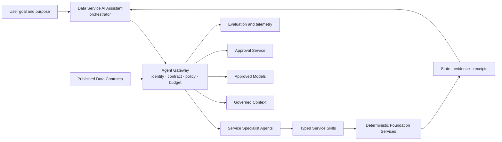

# Data Service AI Assistant

<small>Use when</small><strong>Adding conversational help or governed agent actions.</strong>

<small>Decision</small><strong>Which answer, plan, or action is safe and useful?</strong>

<small>Owner</small><strong>Assistant owner with service and risk owners.</strong>

<small>Output</small><strong>Grounded response or approved action receipt.</strong>

## Purpose and Definition

The Data Service AI Assistant is the conversational interface and multi-agent coordinator for foundation knowledge and typed service actions. It helps users discover evidence, understand decisions, prepare work, delegate tasks to service specialist agents, and execute approved or contract-authorized actions without replacing deterministic services, policies, workflows, or human accountability.

It exists to make complex guidance and service journeys easier to use without turning generated advice into authority or giving an agent uncontrolled access.

## Scope and Boundaries

| Owns | Does Not Own |
| --- | --- |
| Ask, Plan, and governed Act experiences; task decomposition; specialist-agent coordination; grounded responses; action previews; progress; and receipts. | Catalog, contract, policy, entitlement, workflow, product, or service authority. |
| Permission-filtered retrieval, skill selection, model routing, evaluation, and assistant telemetry. | Granting permission, approving itself, changing control rules, or bypassing a service API. |
| Bounded conversational memory and user-visible task state. | Unrestricted memory, broad credentials, direct platform administration, or autonomous high-impact action. |

## Architecture Alignment

| Concern | Alignment |
| --- | --- |
| Primary planes | Experience and AI |
| Supporting planes | Control, Security, and Observability |
| Shared capabilities | Data contracts and compiler, semantic context, unified access, identity, policy, agent and skill registry, model profiles, workflow, and telemetry. |
| Integration flows | Ask and explain, decompose goal, delegate typed tasks, resolve contracts and policy, coordinate execution, and return consolidated evidence. |

## Service Architecture

The assistant coordinates; specialist agents plan and act within their manifests; contracts declare the execution envelope; deterministic services authorize, validate, execute, and record side effects.

## Agentic Interaction

| Concern | Service Agent Contract |
| --- | --- |
| Specialist role | User-facing orchestrator that decomposes goals, delegates bounded tasks to service agents, and consolidates evidence and approvals. |
| Declarative boundary | Delegated user authority, published contracts, agent and skill manifests, task budget, purpose, and approval policy. |
| Autonomous range | Explain, recommend, draft, coordinate, retry safe tasks, and execute pre-approved contract-bounded actions. |
| Must defer | It cannot approve itself, widen a contract, grant authority, or directly mutate another service's state. |

## Core Capabilities

| Category | Capability | Owned Outcome |
| --- | --- | --- |
| Conversation | Ask | Permission-filtered explanation with sources, authority, freshness, uncertainty, and next actions. |
| Planning | Plan | Editable structured plan, impact analysis, checklist, or draft grounded in current state. |
| Action | Act | Typed service call with preview, scope, policy, approval, progress, receipt, and recovery path. |
| Grounding | Context retrieval | Product, contract, semantic, lineage, policy, workflow, and health evidence is retrieved under the user's authority. |
| Orchestration | Skill and model routing | Approved skills and model profiles are selected by task, risk, data class, latency, quality, and cost. |
| Multi-agent coordination | Goal decomposition and task delegation | Each task is delegated to the service agent that owns the outcome, with bounded context, authority, budget, status, and expected evidence. |
| Assurance | Evaluation and safety | Grounding, authorization, tool choice, result correctness, refusal, and recovery are continuously tested. |

## Contracts and Interfaces

| Interface | Purpose | Required Contract |
| --- | --- | --- |
| Assistant API | Start or resume a task and stream grounded output. | Task id, mode, user, purpose, scope, context references, budget, and response provenance. |
| Context API | Retrieve permission-filtered evidence. | Resource ids, requested fields, identity, purpose, policy result, source authority, and observation time. |
| Skill contract | Execute a stable service operation. | Typed input and output, side effects, required scopes, approval class, idempotency, errors, and receipt. |
| Agent task contract | Delegate work to a service specialist agent. | Task, goal, actor, purpose, contract references, scope, autonomy ceiling, budget, deadline, expected artifact, status, and correlation ids. |
| Approval API | Confirm consequential action. | Preview, impact, actor, approver, expiry, segregation, and approved parameters. |
| Evaluation event | Record quality and safety result. | Agent, skill, model, prompt, product, contract, task, trace, test set, result, and threshold. |

## Integrations and Dependencies

| Dependency | Assistant Uses | Assistant Provides |
| --- | --- | --- |
| Data Service Portal | Identity context, selected object, current journey, confirmation UI, and task presentation. | Grounded response, plan, preview, progress, receipt, and source links. |
| Context and authority systems | Products, contracts, semantics, policy, lineage, health, workflows, and current state. | Bounded retrieval request and evidence references; never a copied authority. |
| Foundation services | Registered read and write operations. | Typed request, delegated scope, purpose, approval, idempotency key, and correlation ids. |
| Service specialist agents | Agent manifests, skills, current task state, required contracts, and service ownership. | Bounded delegated task, context references, autonomy ceiling, budget, approval state, and expected evidence. |
| Model platform | Approved profile, routing, limits, and provider controls. | Prompt and context within policy, token and cost telemetry, and evaluation result. |
| Observability and operations | Trace storage, alerts, incidents, suspension, and recovery. | Agent, model, skill, task, policy, approval, tool, cost, outcome, and error signals. |

## Controls and Evidence

| Control | Required Evidence |
| --- | --- |
| Ask and Plan are read-only; Act uses registered skills only. | Mode, selected skill, declared side effect, and blocked direct access attempts. |
| Multi-agent delegation cannot widen the initiating user's or contract's authority. | Delegation chain, contract version, policy decisions, task scope, autonomy ceiling, and agent receipts. |
| Retrieved content and tool output cannot change authorization or approval requirements. | Independent policy decision, instruction-source classification, and executed parameters. |
| High-impact actions require explicit confirmation, step-up authorization, and named approval. | Preview, approval, identity, expiry, action receipt, and recovery route. |
| Memory is bounded by user, task, purpose, retention, and classification. | Memory scope, source, retention, deletion, and access audit. |
| Every answer and action is traceable. | Sources, model profile, prompt version, product and contract versions, skills, decisions, cost, latency, outcome, and evaluation. |

## Action Checklist

| Engineer | Product Owner |
| --- | --- |
| Register typed skills over stable service APIs; implement delegated identity, policy checks, idempotency, approvals, receipts, cancellation, evaluation, rate limits, and kill switches. | Define user jobs, allowed modes, autonomy ceiling, unacceptable outcomes, confirmation language, quality thresholds, escalation, support, and measurable value. |
| Test prompt injection, unauthorized retrieval, excessive agency, tool failure, duplicate action, stale context, model fallback, cancellation, and audit reconstruction. | Approve only evidence-backed capabilities; review failure and refusal experience; increase autonomy only after evaluation and operational evidence. |

## Reference Solutions

The [Agentic Data Service Design](../architecture/agentic-data-foundation.md) defines the shared agent, skill, model, context, memory, approval, and evaluation capabilities. No model provider is mandated. A selected implementation must preserve skill contracts, policy enforcement, evidence, portability, and suspension controls.

## Done Criteria

- Ask responses cite current permission-filtered evidence and state uncertainty or missing authority.
- Plans are editable and do not create side effects.
- Act mode executes only registered skills within delegated scope and approved parameters.
- Every delegated task names one service specialist agent, applicable contract versions, autonomy ceiling, budget, expected evidence, and completion owner.
- Multi-agent results preserve the delegation chain and cannot be promoted to authoritative service state without deterministic validation.
- Consequential actions show preview, approval, progress, receipt, and recovery path.
- Evaluation covers grounding, authorization, tool choice, result correctness, refusal, safety, cost, latency, and recovery.
- The assistant can be suspended independently without blocking deterministic portal and service workflows.
