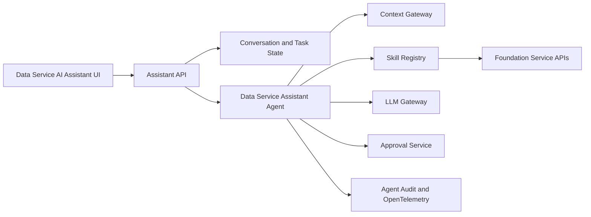

# Data Service AI Assistant

## Definition

The Data Service AI Assistant is the conversational entry point to the agentic data foundation. Available through the Data Service Portal, it helps users find evidence, understand decisions, prepare work, and execute approved actions through governed skills.

## Scope

| In Scope | Out of Scope |
| --- | --- |
| Permission-filtered search, explanation, planning, drafting, and approved actions across foundation services. | Replacing the catalog, contract registry, policy engine, workflow service, or foundation service APIs. |
| Ask, Plan, and Act interactions with sources, previews, approvals, progress, and receipts. | Granting itself permissions, approving its own actions, or bypassing deterministic controls. |
| Registered agents, typed skills, governed model routing, context retrieval, evaluation, and telemetry. | Acting as an unrestricted general-purpose automation runtime. |

## Assistant Modes

| Mode | User Expectation | Allowed Behavior |
| --- | --- | --- |
| Ask | Explain, search, summarize, compare. | Read-only retrieval with source links and freshness. |
| Plan | Prepare a sequence, draft, checklist, or impact analysis. | Read tools plus editable structured output. |
| Act | Execute selected steps. | Typed tools, policy checks, explicit approval, progress and receipts. |

The current mode must always be visible. The assistant never moves from Ask or Plan to Act without user confirmation.

## Portal Placement

The assistant should be available as a persistent panel and as contextual actions on product, contract, journey, health, and portfolio pages.

| Portal Context | Useful Assistant Actions |
| --- | --- |
| Product discovery | Find products by purpose, compare contracts, explain health and access. |
| Product detail | Explain fields, summarize limitations, identify impacted consumers, start a consume request. |
| Source journey | Recommend ingestion pattern, draft source contract, identify missing onboarding evidence. |
| Product journey | Draft descriptor and contract, map semantics, check go-live readiness. |
| Contract editor | Explain clauses, compare versions, detect breaking changes, prepare notifications. |
| Product health | Correlate quality, freshness, lineage and incidents; propose remediation. |
| Operations journey | Explain service health and impact, summarize incident status, find support guidance, draft a support request, and identify change or recovery evidence. |
| Sharing journey | Check permitted use, minimize scope, prepare agreement and revocation test. |
| AI journey | Check data permissions, select context products, prepare evaluations and evidence. |

## Response Design

Every response should separate:

1. **Answer:** concise result for the user.
2. **Evidence:** authoritative products, contracts, policies, telemetry and observation times.
3. **Assumptions:** unresolved or inferred information.
4. **Proposed actions:** exact skills and effects before execution.
5. **Approval:** risk, scope, target, duration, cost and reversibility.
6. **Receipt:** completed actions, identifiers, outcomes and next step.

## Action Preview

Before a write action, show a trusted preview generated from the typed tool request, not from free-form retrieved content.

| Field | Example |
| --- | --- |
| Action | Submit contract version for review. |
| Target | `customer-profile` / contract `2.0.0`. |
| Effect | Creates a review workflow and notifies subscribed consumers. |
| Permissions | Product owner plus contract editor. |
| Risk | Breaking change affects three consumers. |
| Reversible | Review can be withdrawn before approval. |
| Evidence | Compatibility result and consumer impact report. |

## Architecture Guidance

## Minimum Skills

| Skill | Type | Approval |
| --- | --- | --- |
| `product.search` | Read | None. |
| `product.explain` | Read | None. |
| `product.context` | Read | None; results remain identity, purpose, and policy filtered. |
| `contract.compare` | Read | None. |
| `lineage.impact` | Read | None. |
| `health.explain` | Read | None. |
| `operations.status` | Read | None; results remain identity and incident-sensitivity filtered. |
| `contract.draft` | Draft | User reviews output. |
| `source.onboarding_plan` | Draft | User reviews output. |
| `access.request_draft` | Draft | User confirms purpose and scope. |
| `support.request_draft` | Draft | User reviews service, product, impact, urgency, and included evidence. |
| `product.submit_review` | Write | Explicit confirmation. |
| `access.request_submit` | Write | Explicit confirmation and policy check. |
| `support.request_submit` | Write | Explicit confirmation; operations service owns triage and priority. |
| `sharing.submit` | High impact | Step-up authorization and approver. |
| `entitlement.revoke` | High impact | Step-up authorization and impact preview. |

## Assistant API

| Endpoint | Purpose |
| --- | --- |
| `POST /assistant/conversations` | Start a scoped conversation. |
| `POST /assistant/conversations/{id}/messages` | Ask, plan, or request an action. |
| `GET /assistant/tasks/{id}` | Read plan, progress, evidence and artifacts. |
| `POST /assistant/tasks/{id}/approve` | Approve the exact typed action and scope. |
| `POST /assistant/tasks/{id}/cancel` | Stop pending or running work. |
| `GET /assistant/tasks/{id}/receipt` | Retrieve tool calls, decisions and outcomes. |

Streaming improves responsiveness, but task state and receipts remain durable outside the model conversation.

## Controls

- Derive identity, team and permissions from authenticated claims.
- Apply row, column, purpose and classification policy before retrieval.
- Treat product descriptions, documents, tool output and retrieved text as untrusted content.
- Allow only registered skills and exact tool versions for the selected agent.
- Validate tool input and output against schemas.
- Require step-up authorization for privileged, destructive, external or costly actions.
- Use independent policy code to decide whether approval is required.
- Limit turns, tool calls, tokens, time and cost for every task.
- Do not expose hidden prompts, secrets, credentials or unrestricted retrieved content.
- Provide cancel, retry and escalation to a human owner.

## Done Criteria

- Ask mode provides grounded answers with source, version and freshness.
- Plan mode creates editable structured artifacts without side effects.
- Act mode executes only approved typed skills and returns receipts.
- Product, contract, policy, lineage, observability and workflow context is permission filtered.
- Prompt injection, tool misuse, memory poisoning and excessive-agency tests pass.
- Assistant traces show conversation, agent, model, skill, tool, user, product, contract, purpose, approval and outcome.
