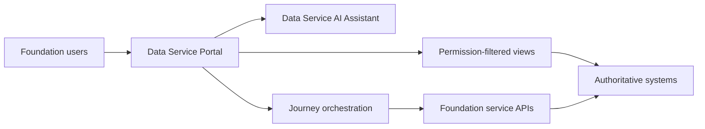

# Data Service Portal

<small>Use when</small><strong>Designing a user entry point or foundation journey.</strong>

<small>Decision</small><strong>What belongs in the portal versus an authoritative service?</strong>

<small>Owner</small><strong>Portal owner with journey and service owners.</strong>

<small>Output</small><strong>Coherent journey, state boundary, and evidence view.</strong>

## Definition

The Data Service Portal is the user entry point for the data foundation. It combines the Data Product Marketplace, source and product journeys, contract management, access requests, operational engagement, and the Data Service AI Assistant without becoming a competing catalog, policy, contract, workflow, or observability authority.

## Scope and Boundaries

| Owns | Does Not Own |
| --- | --- |
| Journey navigation, marketplace experience, product comparison, request intake, task status, notifications, drafts, preferences, and permission-filtered evidence views. | Product, contract, policy, lineage, entitlement, telemetry, incident, or deployment authority. |
| User interaction for the three data contract types, product lifecycle, access, sharing, support, and domain onboarding. | Executing ingestion, product creation, consumption, sharing, or operational remediation. |
| Rebuildable search and read projections with visible authority and observation time. | A second master copy of authoritative foundation state. |

## Architecture Alignment

| Concern | Alignment |
| --- | --- |
| Primary plane | Experience |
| Supporting planes | Control and Security; AI and Observability where assistant or health views are used. |
| Shared capabilities | Product and contract models, semantic context, identity, policy, workflow, catalog, and telemetry. |
| Integration flows | Discover and request, onboard source, create product, approve go-live, consume, share, support, and operate. |

## Service Architecture

Portal-owned state is limited to experience state, drafts, preferences, tasks, notifications, and rebuildable projections. Every displayed decision or trust signal identifies its authority and observation time.

## Core Capabilities

| Category | Capability | Owned Outcome |
| --- | --- | --- |
| Journey | Intent-led navigation | Users start from Explore, Ingest, Produce, Consume, Share, Operate, or My Work and retain context. |
| Marketplace | Product discovery and comparison | Users compare purpose, semantics, ownership, quality, freshness, access, interfaces, support, and current health. |
| Contracts | Contract workspace | Teams author, review, compare, approve, publish, change, and retire the three contract types through authoritative workflows. |
| Product | Product and portfolio management | Owners manage proposal, go-live, change, health, deprecation, retirement, reuse, duplication, and adoption. |
| Access | Request and entitlement experience | Users see separate service and data decisions, obligations, scope, expiry, and revocation state. |
| Operations | Support and status | Users open support, inspect service or product status, follow recovery, and receive relevant communication. |
| Intelligence | Assistant experience | Ask, Plan, and approved Act modes use the same identity, context, workflows, and service APIs. |

## Product Detail Standard

| Section | Required Content |
| --- | --- |
| Identity and purpose | Product id and version, name, purpose, pattern, domain, owner, steward, support, and lifecycle state. |
| Contract and meaning | Contract type, version and status; schema; grain; business definitions; metrics; context; permitted and prohibited use; known limitations. |
| Access and interfaces | Available ports, channel, identity, purpose, classification, policy summary, expected decision path, SLO, and request action. |
| Current trust | Measured quality, freshness, availability, incidents, usage, cost, signal coverage, authority, observation time, and limitations. |
| Lineage and impact | Sources, upstream products, downstream products and consumers, changes, deprecation, and migration guidance. |
| Actions | Use as input, request access, request sharing, manage product, subscribe, report issue, or open support, filtered by role and state. |

Declared contract targets must remain visually and semantically distinct from current measured health. Missing or stale evidence is shown as unknown, never inferred as healthy.

## Contracts and Interfaces

| Interface | Purpose | Required Contract |
| --- | --- | --- |
| Portal and journey API | Start, resume, inspect, cancel, or complete a journey. | Stable journey, task, actor, purpose, target, state, and evidence links. |
| Marketplace query | Search and compare permission-filtered product projections. | Product id, version, authority, observation time, health, policy summary, and available actions. |
| Contract workspace | Manage canonical contract artifacts and decisions. | Source System Ingestion, Data Product Creation, or Data Product Consumption Contract. |
| Service action | Invoke a typed foundation-service operation. | OpenAPI operation, workflow id, identity, purpose, policy decision, idempotency key, and receipt. |
| Event subscription | Receive task, contract, product, incident, release, and deprecation updates. | Versioned event schema, subject, audience, ordering, replay, and delivery status. |

## Integrations and Dependencies

| Dependency | Portal Uses | Portal Provides |
| --- | --- | --- |
| Catalog and product registry | Product identity, lifecycle, ownership, technical assets, and discoverability. | Search intent, navigation, and links to authoritative records. |
| Contract and workflow systems | Contract versions, decisions, approvals, compatibility, and task state. | User input, drafts, review actions, and status presentation. |
| Identity, policy, and entitlement | Permission filtering, service decisions, data decisions, and obligations. | Actor, subject, purpose, requested operation, and target context. |
| Lifecycle services | Typed onboarding, creation, access, sharing, and operational actions. | Intent, workflow context, confirmation, and user-visible progress. |
| Observability and operations | Product health, incidents, status, impact, support, and recovery evidence. | Support intake, subscriptions, feedback, and audience-filtered communication. |

## Controls and Evidence

| Control | Required Evidence |
| --- | --- |
| Portal never approves its own access, contract, product go-live, or operational action. | External decision id, policy version, approver, timestamp, and receipt. |
| Search, recommendations, and health views are rebuildable projections. | Source authority, projection version, freshness, reconciliation status, and limitations. |
| Sensitive metadata and operational detail are permission-filtered. | Identity, purpose, filtering decision, disclosed fields, and audit event. |
| Consequential actions require preview, confirmation, approval where required, and idempotent execution. | Preview, user confirmation, approval, action id, outcome, and rollback or recovery link. |
| Channel parity preserves the same controls across portal, API, CLI, and assistant. | Conformance tests for identical operation, policy, workflow, and receipt behavior. |

## Action Checklist

| Engineer | Product Owner |
| --- | --- |
| Implement journey APIs against authoritative service contracts; keep projections rebuildable; propagate identity, purpose, workflow, product, contract, and trace ids; test stale, denied, duplicate, failed, and resumed journeys. | Define user outcomes, journey owner, marketplace ranking basis, product-detail decisions, notification rules, support expectations, accessibility, and success measures. |
| Prove permission filtering, projection freshness, action idempotency, workflow reconciliation, and degraded-mode behavior. | Accept the authority boundary; prioritize high-frequency journeys; verify that users can understand trust, ownership, current state, and the next action without specialist knowledge. |

## Reference Solutions

No portal technology is mandated. A selected implementation must prove channel parity, authority separation, accessible responsive behavior, search freshness, workflow recovery, policy enforcement, telemetry, exportability, and an exit path.

Related shared designs: [Architecture Design Map](../architecture/design-map.md), [Integration Design](../architecture/integration-design.md), [Data Contract Design](../architecture/data-contract-design.md), and [Agentic Data Foundation](../architecture/agentic-data-foundation.md).

## Done Criteria

- Ingestors, producers, consumers, owners, and operators complete their primary journeys through one coherent entry point.
- Product views show purpose, owner, contract, semantics, access, quality, freshness, lifecycle, support, and current health with authority and time.
- Contract changes, access decisions, product go-live, sharing, and operational actions use authoritative workflows and return receipts.
- Portal failure or projection rebuild does not lose canonical foundation state.
- Portal, API, CLI, and assistant channels enforce the same identity, policy, approval, and evidence rules.
- Journey success, failure, abandonment, recovery, and user outcome are observable.
