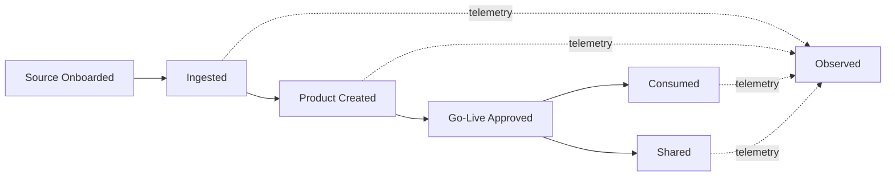

# Services Overview

<small>Use when</small><strong>Locating a reusable foundation capability.</strong>

<small>Decision</small><strong>Which service owns the requested outcome?</strong>

<small>Owner</small><strong>Foundation service owner.</strong>

<small>Output</small><strong>Service contract, interface, controls, and support.</strong>

Foundation services are reusable architecture capabilities. They reduce custom delivery work by giving teams standard ways to ingest, create, consume, share, enable, observe, and reliably operate trusted data products.

!!! note "Capabilities across the journey"
    Services perform reusable work across **Frame → Establish → Deliver → Use → Operate**; they are not additional journey stages. Select a service by the outcome it owns, then use the matching [action playbook](../playbooks/index.md) to execute the work.

## How the Services Fit

  

    User intent<i></i>Foundation services<i></i>Service outcome
  

  <section class="standards-map-lane lane-govern">
    
<small>Enter and manage</small><strong>Discover · Request · Produce</strong>
Start from a user goal and retain visible workflow state.

    
    
<a href="data-service-portal/"><strong>Data Service Portal</strong></a><a href="data-service-ai-assistant/"><strong>Data Service AI Assistant</strong></a>

    
    
<strong>One front door</strong>
Discovery, contracts, approvals, evidence, guidance, and task status.

  </section>
  <section class="standards-map-lane lane-build">
    
<small>Create value</small><strong>Connect · Build · Serve · Exchange</strong>
Move from governed source data to reusable product outcomes.

    
    
<a href="data-ingestion-service/"><strong>Ingestion</strong></a><a href="data-product-creation-service/"><strong>Product Creation</strong></a><a href="data-consumption-service/"><strong>Consumption</strong></a><a href="data-sharing-service/"><strong>Sharing</strong></a>

    
    
<strong>Live data products</strong>
Contracted, policy-controlled interfaces for internal and external use.

  </section>
  <section class="standards-map-lane lane-access">
    
<small>Enable consistently</small><strong>Provision · Control · Integrate</strong>
Provide common capabilities once and reuse them across every lifecycle service.

    
    
<a href="platform-enablement-service/"><strong>Platform Enablement</strong></a><strong>Storage · Contracts · Identity</strong><strong>Security · Integration · Automation</strong>

    
    
<strong>Governed paved paths</strong>
Reusable resources, controls, interfaces, policy evidence, and lifecycle automation.

  </section>
  <section class="standards-map-lane lane-intelligence">
    
<small>Operate and improve</small><strong>Observe · Respond · Learn</strong>
Measure health, coordinate response, and improve services end to end.

    
    
<a href="data-observability-service/"><strong>Data Observability</strong></a><a href="data-foundation-operations-service/"><strong>Foundation Operations</strong></a>

    
    
<strong>Reliable operation</strong>
Health, response, recovery, communication, safer change, and improvement evidence.

  </section>

## Capability Definition

Every service defines its core capabilities with the same three fields:

| Field | Meaning | Architecture Question |
| --- | --- | --- |
| Category | A coherent responsibility area within the service. | Where does this capability belong? |
| Capability | A stable, technology-neutral function the service provides. | What must the service be able to do? |
| Owned outcome | The observable result for which the service is accountable. | What proves the capability worked? |

Capabilities define service responsibility, not product features or vendor components. A technology may implement several capabilities, and a capability may span several technologies; the owned outcome remains stable in either case.

## Service Portfolio

| Service | Owns | Does Not Own |
| --- | --- | --- |
| Data service portal | User entry point, Data Product Marketplace, requests, workflow tracking, product onboarding, and data contract management. | Replacing underlying catalog, product registry, policy, lineage, observability, or workflow systems. |
| Data Service AI Assistant | Permission-filtered explanation, planning, and approved actions through registered agents, models, and typed skills. | Granting permissions, approving its own actions, or replacing deterministic foundation controls. |
| Data ingestion service | Centrally managed source onboarding, transport, raw and validated source-aligned states, validation, source metadata, and operating evidence. | Domain business transformation into aggregate or consumer-aligned products. |
| Data product creation service | Shared product engineering capability, templates, controls, quality validation, go-live workflow, and publication automation. | Ownership of the aggregate or consumer-aligned products created by federated domain teams. |
| Data consumption service | Governed access for BI, applications, platforms, AI agents, and models. | Business misuse of data outside approved purpose. |
| Data sharing service | Governed internal and external exchange, recipient entitlement, sharing evidence. | Legal contract negotiation outside data usage controls. |
| Platform enablement service | Shared storage lifecycle, contract system, identity and security integration, catalog synchronization, integration patterns, and platform automation. | Product semantics, enterprise IAM or security authority, lifecycle-service execution, or operational command. |
| Data observability service | Product telemetry, quality and freshness SLOs, usage insights, incident correlation, OpenTelemetry standards. | Domain ownership of product quality decisions. |
| Data foundation operations service | Service management, support, incident, problem, change, release, reliability, continuity, communication, and improvement coordination. | Telemetry authority, engineering remediation, product decisions, deployment execution, or governance policy. |

## Agentic Access

The [Data Service AI Assistant](data-service-ai-assistant.md) and [Agentic Data Foundation](../architecture/agentic-data-foundation.md) make these services accessible through governed agents and typed skills. Agentic access is cross-cutting; it does not create a parallel set of foundation services.

## Service Contract

Each foundation service must define:

- Service owner and support model.
- Standard onboarding process.
- Supported patterns and exceptions.
- Required metadata and evidence.
- Policy and security controls.
- Operational SLOs and observability.
- Integration points with catalog, lineage, identity, and governance.
- Portal experience and workflow entry points where users interact with the service.

For architecture delivery guidance, use:

- [Architecture to Operations Map](../foundation/architecture-service-operations-map.md)
- [Architecture Blueprint](../implementation/implementation-blueprint.md)
- [Architecture Patterns](../implementation/service-implementation-patterns.md)
- [Architecture Decisions](../implementation/architecture-decisions.md)
- [Service Runbook Template](../delivery-templates/service-runbook-template.md)

## End-to-End Product Flow

## Minimum Consistency Rules

- Every data product has an owner, steward, contract, classification, quality rules, and lifecycle state.
- Every user-facing workflow is exposed through the Data Service Portal.
- Every foundation service publishes operational and product-level telemetry.
- Every shared resource is provisioned through Platform Enablement with an owner, identity, policy, lifecycle, telemetry, and deprovisioning evidence.
- Every production service has an operational owner, support model, SLO, escalation route, runbook, continuity target, and change controls.
- Every consumption and sharing path enforces access policy.
- Every live product is discoverable through the catalog.
- Every exception has an owner, expiry date, and migration path.
- Ingestion and source-aligned lifecycle remain centrally accountable to the foundation platform team; downstream product creation and ownership remain federated to domain data teams.

## Related Standards

- [Data Contract Standard](../standards/data-contract-standard.md)
- [OpenTelemetry Telemetry Standard](../standards/otel-telemetry-standard.md)
- [AI-Ready Data Standard](../standards/ai-ready-data-standard.md)
