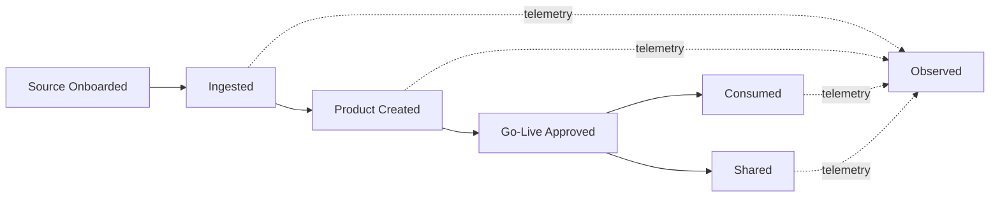

# Services Overview

Foundation services are reusable architecture capabilities. They reduce custom delivery work by giving teams standard ways to ingest, create, consume, share, and observe trusted data products.

## How the Services Fit

  

    User intent<i></i>Foundation services<i></i>Service outcome
  

  <section class="standards-map-lane lane-govern">
    
<small>Enter and manage</small><strong>Discover · Request · Produce</strong>
Start from a user goal and retain visible workflow state.

    
    
<a href="data-service-portal/"><strong>Data Service Portal</strong></a><a href="data-service-ai-assistant/"><strong>Data Service AI Assistant</strong></a>

    
    
<strong>One front door</strong>
Discovery, contracts, approvals, evidence, guidance, and task status.

  </section>
  <section class="standards-map-lane lane-build">
    
<small>Create value</small><strong>Connect · Build · Serve · Exchange</strong>
Move from governed source data to reusable product outcomes.

    
    
<a href="data-ingestion-service/"><strong>Ingestion</strong></a><a href="data-product-creation-service/"><strong>Product Creation</strong></a><a href="data-consumption-service/"><strong>Consumption</strong></a><a href="data-sharing-service/"><strong>Sharing</strong></a>

    
    
<strong>Live data products</strong>
Contracted, policy-controlled interfaces for internal and external use.

  </section>
  <section class="standards-map-lane lane-intelligence">
    
<small>Prove trust</small><strong>Observe · Explain · Improve</strong>
Measure technical operation and product behavior end to end.

    
    
<a href="data-observability-service/"><strong>Data Observability</strong></a>

    
    
<strong>Operational evidence</strong>
Health, quality, freshness, lineage, usage, incidents, and cost.

  </section>

## Service Portfolio

| Service | Owns | Does Not Own |
| --- | --- | --- |
| Data service portal | User entry point, discovery, requests, workflow tracking, product onboarding, and data contract management. | Replacing underlying catalog, policy, lineage, or observability systems. |
| Data ingestion service | Centrally managed source onboarding, transport, raw and validated source-aligned states, validation, source metadata, and operating evidence. | Domain business transformation into aggregate or consumer-aligned products. |
| Data product creation service | Shared product engineering capability, templates, controls, quality validation, go-live workflow, and publication automation. | Ownership of the domain, aggregate, or consumer-aligned products created by federated domain teams. |
| Data consumption service | Governed access for BI, applications, platforms, AI agents, and models. | Business misuse of data outside approved purpose. |
| Data sharing service | Governed internal and external exchange, recipient entitlement, sharing evidence. | Legal contract negotiation outside data usage controls. |
| Data observability service | Product telemetry, quality and freshness SLOs, usage insights, incident correlation, OpenTelemetry standards. | Domain ownership of product quality decisions. |

## Agentic Access

The [Data Service AI Assistant](data-service-ai-assistant.md) and [Agentic Data Foundation](../architecture/agentic-data-foundation.md) make these services accessible through governed agents and typed skills. Agentic access is cross-cutting; it does not create a parallel set of foundation services.

## Service Contract

Each foundation service must define:

- Service owner and support model.
- Standard onboarding process.
- Supported patterns and exceptions.
- Required metadata and evidence.
- Policy and security controls.
- Operational SLOs and observability.
- Integration points with catalog, lineage, identity, and governance.
- Portal experience and workflow entry points where users interact with the service.

For architecture delivery guidance, use:

- [Architecture Blueprint](../implementation/implementation-blueprint.md)
- [Architecture Patterns](../implementation/service-implementation-patterns.md)
- [Architecture Decisions](../implementation/architecture-decisions.md)

## End-to-End Product Flow

## Minimum Consistency Rules

- Every data product has an owner, steward, contract, classification, quality rules, and lifecycle state.
- Every user-facing workflow is exposed through the Data Service Portal.
- Every foundation service publishes operational and product-level telemetry.
- Every consumption and sharing path enforces access policy.
- Every live product is discoverable through the catalog.
- Every exception has an owner, expiry date, and migration path.
- Ingestion and source-aligned lifecycle remain centrally accountable to the foundation platform team; downstream product creation and ownership remain federated to domain data teams.

## Related Standards

- [Data Contract Standard](../standards/data-contract-standard.md)
- [OpenTelemetry Telemetry Standard](../standards/otel-telemetry-standard.md)
- [AI-Ready Data Standard](../standards/ai-ready-data-standard.md)
