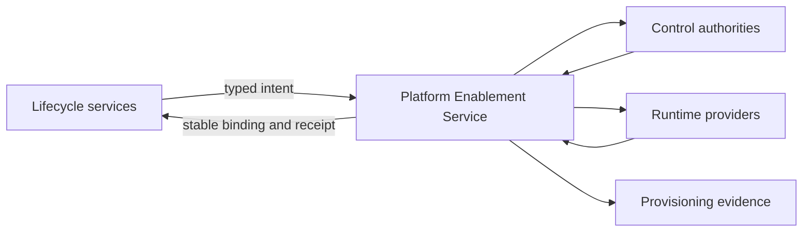

# Platform Enablement Service

<small>Use when</small><strong>Providing a shared control, resource, integration, or automation capability.</strong>

<small>Decision</small><strong>What should be provided once and reused by lifecycle services?</strong>

<small>Owner</small><strong>Foundation platform team with control authorities.</strong>

<small>Output</small><strong>Governed resource, binding, lifecycle, and evidence.</strong>

## Definition

The Platform Enablement Service provides reusable contract, catalog, storage, identity, security, integration, automation, and evidence capabilities to all foundation services. It provisions and governs shared resources but does not take lifecycle accountability from the service requesting them.

## Scope and Boundaries

| Owns | Does Not Own |
| --- | --- |
| Typed provisioning, control binding, provider adapters, lifecycle automation, drift reconciliation, retention, deletion, recovery, and deprovisioning. | Source onboarding, product meaning, access-purpose decisions, sharing approval, health interpretation, or incident command. |
| Shared contract system, technical catalog integration, storage lifecycle, identity and policy integration, secrets, gateways, events, and evidence routing. | Enterprise identity, security, privacy, risk, service-management, or cloud-provider authority. |
| Stable foundation identifiers mapped to provider resources. | Making provider objects the only record of products, contracts, policies, entitlements, or decisions. |

## Architecture Alignment

| Concern | Alignment |
| --- | --- |
| Primary planes | Control and Data |
| Supporting planes | Security and Observability |
| Shared capabilities | Contract and product management, catalog and storage, identity and security, integration, automation, and evidence and telemetry. |
| Integration flows | Provision, bind controls, reconcile, rotate, retain, recover, delete, rollback, and deprovision. |

## Service Architecture

Every request follows plan, authorize, apply, validate, reconcile, and return-receipt behavior. Provider-specific naming and paths stay behind adapters.

## Core Capabilities

| Category | Capability | Owned Outcome |
| --- | --- | --- |
| Contracts | Contract-system capability | Canonical artifacts, versions, validation, compatibility, decisions, lifecycle, and events are consistently available. |
| Catalog and storage | Governed technical assets | Catalog registration, Delta defaults, storage location, recovery, retention, deletion, and external bindings are controlled. |
| Identity and security | Reusable control bindings | Workload identities, federation, secrets, policy, entitlements, delegated scopes, audit, and rotation are provisioned consistently. |
| Integration | Common connectivity | Gateways, events, schema registry, connectors, callbacks, service discovery, and stable identifiers support service interactions. |
| Automation | Environment and resource lifecycle | Plan, provision, promote, roll back, reconcile, and deprovision operations are policy-controlled and repeatable. |
| Evidence | Resource and control proof | Ownership, state, drift, policy, cost, telemetry, recovery, retention, deletion, and deprovisioning evidence are retrievable. |

## Contracts and Interfaces

| Interface | Purpose | Required Contract |
| --- | --- | --- |
| Resource request API | Plan or provision a shared capability. | Requesting service, owner, purpose, resource type, environment, classification, lifecycle, SLO, policy context, and idempotency key. |
| Resource binding | Return stable foundation and provider mappings. | Foundation resource id, provider id, endpoint, identity, policies, contract and catalog links, lifecycle, and receipt. |
| Lifecycle API | Change, rotate, recover, retain, delete, or deprovision. | Current version, target state, authority, dependency impact, validation, rollback, and evidence requirements. |
| Reconciliation event | Report drift, expiry, orphan, failed control, or recovery state. | Resource, declared and observed state, severity, owner, due date, action, and correlation ids. |
| Provider adapter | Translate portable intent into provider operations. | Plan, apply, validate, rollback, reconcile, export, deprovision, errors, telemetry, and migration behavior. |

## Integrations and Dependencies

| Dependency | Platform Enablement Uses | Platform Enablement Provides |
| --- | --- | --- |
| Lifecycle services | Typed intent, owner, purpose, target environment, contract, policy context, SLO, lifecycle, and deprovisioning condition. | Stable resource binding, control state, lifecycle status, cost, telemetry, and immutable receipt. |
| Contract, catalog, identity, security, privacy, and risk authorities | Canonical ids, validation, decisions, approvals, classifications, obligations, and audit requirements. | Resource and provider mappings, enforcement state, reconciliation, exceptions, and evidence. |
| Cloud and data providers | Runtime APIs, resource state, health, cost, logs, and export capabilities. | Least-privilege operations, policy bindings, tags, lifecycle actions, and deprovisioning. |
| Observability and Operations | Health, drift, alert, incident, change, release, continuity, and evidence workflows. | Resource events, failed provisioning, policy drift, expiry, cost, rollback, recovery, and deletion signals. |

## Controls and Evidence

| Control | Required Evidence |
| --- | --- |
| No resource without owner, purpose, environment, classification, lifecycle, and deprovisioning condition. | Approved request and resource record. |
| Requesting services never receive unrestricted provider credentials. | Workload identity, scopes, policy, secret binding, rotation, and access audit. |
| Provisioning completes only after controls and telemetry are active. | Policy decisions, validation tests, catalog and contract bindings, telemetry signal, and receipt. |
| Declared and provider state are continuously reconciled. | Drift comparison, action, exception, owner, due date, and resolved state. |
| Deletion and deprovisioning require proof. | Dependency check, retention decision, deletion result, credential invalidation, provider absence, and retained evidence. |

## Action Checklist

| Engineer | Product Owner |
| --- | --- |
| Implement typed APIs, provider adapters, plan and validation, policy binding, stable ids, idempotency, reconciliation, rollback, telemetry, cost, export, deletion, and deprovisioning. | Define supported capabilities, service tiers, eligibility, quotas, cost model, lifecycle, support, provider strategy, exception policy, adoption measures, and retirement criteria. |
| Test duplicate requests, partial provisioning, provider outage, policy deny, drift, credential rotation, recovery, rollback, retention expiry, deletion, orphan detection, and provider migration. | Prioritize reusable paths by service demand; approve boundaries with control authorities; review reliability, adoption, toil, cost, exceptions, and exit readiness. |

## Reference Solutions

The [Shared Platform Capabilities](../architecture/platform-foundation-design.md) design defines the reusable technology-neutral capabilities. Provider selections require a [Technology Selection Record](../delivery-templates/technology-selection-template.md), capability proof, security and cost review, portability test, and exit plan.

## Done Criteria

- Every shared capability has a stable interface, owner, SLO, support route, provider adapter, lifecycle, and runbook.
- Lifecycle services provision and operate resources without manual control duplication or unrestricted credentials.
- Contract, catalog, identity, policy, provider, and telemetry state reconcile through stable identifiers.
- Provisioning, change, drift, rollback, recovery, retention, deletion, and deprovisioning paths are tested.
- Provider replacement does not redefine product, contract, policy, or service outcomes.
- Cost, reliability, adoption, exceptions, toil, and decommissioning evidence guide the platform backlog.
