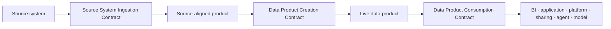

# Data Contract Standard

<small>Use when</small><strong>Onboarding a source, creating a product, or approving product use.</strong>

<small>Decision</small><strong>Which of the three contracts governs this boundary?</strong>

<small>Owner</small><strong>Contract owner for the active boundary.</strong>

<small>Output</small><strong>Approved, testable, published contract version.</strong>

The foundation uses only three data contract types:

1. **Source System Ingestion Contract**
2. **Data Product Creation Contract**
3. **Data Product Consumption Contract**

Sharing, AI use, APIs, events, semantic access, features, and retrieval are consumption profiles inside the Data Product Consumption Contract. They are not additional contract types. Contract decisions and lifecycle state also remain part of these three contracts rather than separate approval objects.

## Three-Contract Model

| Contract | Boundary | Core promise | Accountable owner |
| --- | --- | --- | --- |
| **Source System Ingestion Contract** | Source system to Data Ingestion Service. | What the source delivers, how it is received, and what the centrally managed raw and validated source-aligned states guarantee. | Source system owner with foundation ingestion owner. |
| **Data Product Creation Contract** | Accepted input products to one live data product. | How source-aligned or product inputs become an aggregate or consumer-aligned product with stable semantics, quality, SLOs, ports, and change behavior. | Data product owner. |
| **Data Product Consumption Contract** | One live product version to one approved consumer purpose. | Who may use or receive which product port, for what purpose, through which channel, with which scope, controls, SLOs, expiry, and revocation. | Consumer or recipient owner with product and consumption owners. |

The chain may branch and repeat. A Data Product Creation Contract can accept several published input contracts. A Data Product Consumption Contract always references one exact published product and contract version.

## Canonical Representation

Each contract is stored as a portable YAML artifact in version control and the contract registry. Use the [Open Data Contract Standard 3.1](https://bitol-io.github.io/open-data-contract-standard/latest/) as the canonical baseline and namespace enterprise extensions.

- Record the contract type as `source_system_ingestion`, `data_product_creation`, or `data_product_consumption`.
- Pin the ODCS schema version and preserve unknown extensions during import and export.
- Generate platform schemas, tests, policy inputs, and interface definitions from the canonical artifact.
- Use OpenAPI for API ports and AsyncAPI plus CloudEvents for event ports.
- Prove semantic equivalence after round-trip export and import.

## Common Fields

All three contracts require:

| Field group | Minimum content |
| --- | --- |
| Identity | Contract id, type, name, version, status, owner, domain, created time, effective time. |
| Purpose | Intended outcome, valid uses, prohibited uses, and accountable use-case owner. |
| Binding | Source, input product, output product, product port, consumer, or recipient identifiers applicable to the boundary. |
| Data | Schema, keys, grain, time meaning, semantic context, classification, and limitations. |
| Trust | Quality rules, freshness and availability SLOs, lineage, observability, support, and incident route. |
| Control | Identity types, policy, masking or minimization, retention, residency, approval, expiry, and revocation. |
| Change | Compatibility rules, notice period, migration, deprecation, retirement, and exception behavior. |
| Evidence | Tests, approvals, runtime binding, conformance result, observation time, and current health reference. |

## Contract-Specific Content

| Contract | Required additional content |
| --- | --- |
| Source System Ingestion Contract | Delivery pattern, endpoint or inbox, cadence, source schema and keys, source change notice, watermark or cursor, ordering, deduplication, replay, reconciliation, quarantine, raw retention, validated-state rules, and source support obligations. |
| Data Product Creation Contract | Accepted input product and contract versions, transformation and composition rules, output grain and semantics, quality thresholds, SLOs, stable ports, lineage, product go-live gates, compatibility, rollback, and support. |
| Data Product Consumption Contract | Consumer identity, use case, purpose, selected product and creation-contract version, port and channel, row and field scope, obligations, service level, duration, expiry, revocation, usage telemetry, and downstream dependency. |

### Consumption Profiles

The Data Product Consumption Contract adds only the clauses needed by the selected profile:

| Profile | Additional terms |
| --- | --- |
| BI or analytics | Metrics and dimensions, semantic model, row and column scope, query interface, freshness, export limits, and subscription. |
| Application or platform | API, event, table, or file behavior; workload identity; rate, latency, error, caching, and compatibility rules. |
| External sharing | Recipient identity, legal or approved purpose, minimized package, delivery protocol, geography, retention, onward use, expiry, and revocation. |
| AI use | Model, agent, skill, workload and delegated-user identities; retrieval, grounding, feature, training, or evaluation purpose; snapshot or index; prohibited use; evaluation; output and retention controls. |

These profiles do not create additional contract types or approval objects.

## Lifecycle

All three contracts use one state model:

| State | Meaning | Required transition evidence |
| --- | --- | --- |
| Draft | Contract is being authored. | Owner and contract type assigned. |
| In review | Required content is complete. | Review route and test plan. |
| Approved | Accountable owners accept the promise. | Approval and valid exceptions. |
| Published | Runtime binding matches and critical tests pass. | Immutable artifact, conformance results, and effective time. |
| Deprecated | No new dependency should start. | Replacement, notice, and migration plan. |
| Retired | The contract is no longer valid. | Dependencies closed, access removed, retention applied, and evidence archived. |
| Exception | A rule is temporarily unmet under accepted risk. | Risk owner, compensating control, expiry, and remediation plan. |

## Enforcement

| Boundary | Contract enforced | Required behavior |
| --- | --- | --- |
| Source onboarding and receipt | Source System Ingestion Contract | Block activation without approval; validate delivery, schema, provenance, reconciliation, quarantine, replay, and source changes. |
| Product build and go-live | Data Product Creation Contract | Pin input versions; test transformation, semantics, quality, SLOs, policy, lineage, ports, compatibility, and rollback; block go-live on critical failure. |
| Product access and use | Data Product Consumption Contract | Resolve consumer, purpose, product version, port, scope, policy, obligations, expiry, and revocation before releasing data. |
| Runtime and observability | Applicable contract | Compare actual behavior with the published promise and correlate breaches, consumers, incidents, and changes. |

## Compatibility and Versioning

| Version | Use when | Required action |
| --- | --- | --- |
| Patch | Documentation or non-behavioral metadata clarification. | Publish evidence; no consumer migration. |
| Minor | Backward-compatible addition or improvement. | Run compatibility tests and notify subscribers when relevant. |
| Major | Breaking schema, meaning, quality, SLO, access, delivery, purpose, or retention change. | Impact analysis, approval, coexistence or migration plan, notice, and consumer decision. |

Adding a required field, removing or renaming a field, changing meaning or type, reducing freshness or quality, tightening classification, changing delivery behavior, or widening permitted use is breaking unless executable evidence proves otherwise.

## Required Tests

| Contract | Minimum tests |
| --- | --- |
| Source System Ingestion Contract | Connectivity, identity, schema, keys, volume, cursor or watermark, ordering, duplicate, late data, corrupt input, quarantine, replay, reconciliation, and source-change compatibility. |
| Data Product Creation Contract | Input compatibility, transformation, schema, semantics, keys, quality, freshness, policy, lineage, stable ports, performance, resilience, rollback, and consumer-impact compatibility. |
| Data Product Consumption Contract | Identity, purpose, allow, deny, scope, masking, minimization, channel behavior, SLO, expiry, revocation, usage evidence, and profile-specific sharing or AI controls. |

## Approval

| Contract | Mandatory approval |
| --- | --- |
| Source System Ingestion Contract | Source system owner, foundation ingestion owner, steward, and applicable security or privacy owner. |
| Data Product Creation Contract | Data product owner, steward, technical owner, and applicable platform, security, privacy, or metric owner. |
| Data Product Consumption Contract | Consumer or recipient owner, product owner, consumption owner, and applicable policy, security, privacy, legal, sharing, or AI use-case owner. |

## Minimum Done Criteria

- The contract is one of the three approved types.
- Required common and type-specific fields are complete.
- Canonical artifact validates against the pinned open schema and portability profile.
- Owners, approvals, effective time, expiry, and exceptions are recorded.
- Contract-specific tests pass against the real runtime boundary.
- Runtime objects, policies, telemetry, catalog entries, lineage, and product ports reference the exact contract version.
- Breaking changes identify affected upstream or downstream contracts and include migration evidence.
- Consumers can see applicable terms and subscribe to changes.
