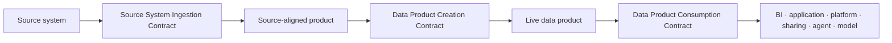

# Data Contract Standard

<small>Use when</small><strong>Onboarding a source, creating a product, or approving product use.</strong>

<small>Decision</small><strong>Which of the three contracts governs this boundary?</strong>

<small>Owner</small><strong>Contract owner for the active boundary.</strong>

<small>Output</small><strong>Approved, testable, published contract version.</strong>

## Definition

A **data contract is a versioned, machine-readable, and enforceable promise between accountable parties at a data boundary**. It defines what data or interface is provided, what it means, how well it must perform, how it may be used, how change is managed, and what evidence proves the promise is being met.

A data contract connects business expectations to technical enforcement. It is:

- **Business-readable:** owners and consumers can understand the purpose, meaning, obligations, and service promise.
- **Machine-readable:** platforms can generate schemas, tests, policy inputs, interfaces, alerts, and lifecycle automation.
- **Mutually accountable:** the provider accepts delivery or product obligations; the consumer accepts purpose, usage, and change obligations.
- **Operational:** actual quality, freshness, availability, access, and change behavior are measured against the published version.

A schema alone is not a data contract. A policy decision, catalog entry, technical share, pipeline configuration, or legal document may support a contract, but none replaces the complete promise.

## Core Elements

| Element | Business question | Required content | Evidence that makes it real |
| --- | --- | --- | --- |
| Parties and accountability | Who promises, who relies on it, and who responds when it fails? | Provider, owner, steward, consumer or recipient, technical owner, support and escalation route. | Active identities, ownership acceptance, support registration, and review record. |
| Purpose and value | Why does this boundary exist and which outcomes should it enable? | Intended outcome, use cases, value measure, valid uses, prohibited uses, and non-goals. | Approved purpose, linked use case, consumer adoption, and outcome measure. |
| Boundary and binding | Exactly which source, product, version, port, and consumer are connected? | Stable identifiers, contract type, source or product reference, runtime binding, interface, environment, and effective period. | Registry record reconciled with catalog and runtime objects. |
| Structure and meaning | What data is provided and how should it be interpreted? | Schema, keys, grain, time meaning, business definitions, semantic context, examples, and limitations. | Schema and semantic tests plus resolvable context references. |
| Trust and service promise | How good, fresh, available, and supportable must it be? | Quality rules, freshness, availability, volume, latency, lineage, recovery, support, and incident expectations. | Current SLO results, quality evidence, lineage, recovery test, and health view. |
| Access and use controls | Who may do what, for which purpose, under which obligations? | Identity, classification, purpose, policy, minimization, masking, retention, residency, expiry, revocation, and output controls. | Executed allow, deny, masking, expiry, revocation, and audit tests. |
| Change and lifecycle | How can the promise evolve without surprising dependent teams? | Version, compatibility, notice, impact, migration, deprecation, retirement, exceptions, and review date. | Compatibility report, affected consumers, notices, migration progress, and approved release. |
| Enforcement and evidence | How is the promise tested and observed continuously? | Enforcement points, test rules, severity, failure outcome, telemetry, conformance status, and evidence references. | CI results, runtime decisions, telemetry, incidents, exceptions, and immutable history. |

## Business Value

| Business value | How the contract creates it | Useful measure |
| --- | --- | --- |
| Fewer breaking changes | Versioning, compatibility tests, impact analysis, notice, and migration protect dependent products and consumers. | Change-failure rate, breaking incidents, emergency fixes, and consumers migrated on time. |
| Faster source and consumer onboarding | Standard, discoverable terms reduce repeated clarification, custom extraction, and manual approval. | Onboarding lead time, time to first successful use, and manual handoffs per request. |
| Clear accountability | Named providers, owners, consumers, support routes, and obligations remove ambiguity during delivery and incidents. | Unowned failures, routing time, response time, and overdue remediation. |
| Trusted decisions | Meaning, quality, freshness, lineage, and limitations are explicit and observable at the point of use. | SLO attainment, quality-related incidents, reconciliations, and consumer trust feedback. |
| Governed self-service | Machine-readable purpose, classification, scope, and policy terms allow safe automation without bypassing control owners. | Automated decision rate, approval lead time, exceptions, and revocation success. |
| Reuse without hidden coupling | Stable product identifiers and ports let consumers depend on a promise rather than a pipeline, table path, or implementation detail. | Reuse rate, duplicate products, direct-storage dependencies, and migration effort. |
| Safer sharing and AI adoption | External-recipient and AI-use clauses narrow the same Data Product Consumption Contract to the approved purpose and risk. | Approval lead time, prohibited-use violations, trace coverage, and expired access removed. |
| Better operations and investment | Contract health, usage, incidents, cost, and consumer impact make service improvement and portfolio decisions evidence-based. | Incident impact, product adoption, cost per consumer, SLO trends, and retirement completion. |
| Portability and negotiating power | Open canonical artifacts separate the durable promise from Unity Catalog, Delta, APIs, sharing tools, or other runtime bindings. | Export conformance, independent-client success, migration time, and unresolved vendor dependencies. |

Contracts create value only when the same published version drives design, tests, platform controls, runtime decisions, change communication, and observability. A document that is not enforced or measured is guidance, not an operational data contract.

The foundation uses only three data contract types:

1. **Source System Ingestion Contract**
2. **Data Product Creation Contract**
3. **Data Product Consumption Contract**

Sharing, AI use, APIs, events, semantic access, features, and retrieval are consumption profiles inside the Data Product Consumption Contract. They are not additional contract types. Contract decisions and lifecycle state also remain part of these three contracts rather than separate approval objects.

## Three-Contract Model

| Contract | Boundary | Core promise | Accountable owner |
| --- | --- | --- | --- |
| **Source System Ingestion Contract** | Source system to Data Ingestion Service. | What the source delivers, how it is received, and what the centrally managed raw and validated source-aligned states guarantee. | Source system owner with foundation ingestion owner. |
| **Data Product Creation Contract** | Accepted input products to one live data product. | How source-aligned or product inputs become an aggregate or consumer-aligned product with stable semantics, quality, SLOs, ports, and change behavior. | Data product owner. |
| **Data Product Consumption Contract** | One live product version to one approved consumer purpose. | Who may use or receive which product port, for what purpose, through which channel, with which scope, controls, SLOs, expiry, and revocation. | Consumer or recipient owner with product and consumption owners. |

The chain may branch and repeat. A Data Product Creation Contract can accept several published input contracts. A Data Product Consumption Contract always references one exact published product and contract version.

## Canonical Representation

Each contract is stored as a portable YAML artifact in version control and the contract registry. Use the [Open Data Contract Standard 3.1](https://bitol-io.github.io/open-data-contract-standard/latest/) as the canonical baseline and namespace enterprise extensions.

- Record the contract type as `source_system_ingestion`, `data_product_creation`, or `data_product_consumption`.
- Pin the ODCS schema version and preserve unknown extensions during import and export.
- Generate platform schemas, tests, policy inputs, and interface definitions from the canonical artifact.
- Use OpenAPI for API ports and AsyncAPI plus CloudEvents for event ports.
- Prove semantic equivalence after round-trip export and import.

## Common Fields

All three contracts require:

| Field group | Minimum content |
| --- | --- |
| Identity | Contract id, type, name, version, status, owner, domain, created time, effective time. |
| Purpose | Intended outcome, valid uses, prohibited uses, and accountable use-case owner. |
| Binding | Source, input product, output product, product port, consumer, or recipient identifiers applicable to the boundary. |
| Data | Schema, keys, grain, time meaning, semantic context, classification, and limitations. |
| Trust | Quality rules, freshness and availability SLOs, lineage, observability, support, and incident route. |
| Control | Identity types, policy, masking or minimization, retention, residency, approval, expiry, and revocation. |
| Change | Compatibility rules, notice period, migration, deprecation, retirement, and exception behavior. |
| Evidence | Tests, approvals, runtime binding, conformance result, observation time, and current health reference. |

## Contract-Specific Content

| Contract | Required additional content |
| --- | --- |
| Source System Ingestion Contract | Delivery pattern, endpoint or inbox, cadence, source schema and keys, source change notice, watermark or cursor, ordering, deduplication, replay, reconciliation, quarantine, raw retention, validated-state rules, and source support obligations. |
| Data Product Creation Contract | Accepted input product and contract versions, transformation and composition rules, output grain and semantics, quality thresholds, SLOs, stable ports, lineage, product go-live gates, compatibility, rollback, and support. |
| Data Product Consumption Contract | Consumer identity, use case, purpose, selected product and creation-contract version, port and channel, row and field scope, obligations, service level, duration, expiry, revocation, usage telemetry, and downstream dependency. |

### Consumption Profiles

The Data Product Consumption Contract adds only the clauses needed by the selected profile:

| Profile | Additional terms |
| --- | --- |
| BI or analytics | Metrics and dimensions, semantic model, row and column scope, query interface, freshness, export limits, and subscription. |
| Application or platform | API, event, table, or file behavior; workload identity; rate, latency, error, caching, and compatibility rules. |
| External sharing | Recipient identity, legal or approved purpose, minimized package, delivery protocol, geography, retention, onward use, expiry, and revocation. |
| AI use | Model, agent, skill, workload and delegated-user identities; retrieval, grounding, feature, training, or evaluation purpose; snapshot or index; prohibited use; evaluation; output and retention controls. |

These profiles do not create additional contract types or approval objects.

## Lifecycle

All three contracts use one state model:

| State | Meaning | Required transition evidence |
| --- | --- | --- |
| Draft | Contract is being authored. | Owner and contract type assigned. |
| In review | Required content is complete. | Review route and test plan. |
| Approved | Accountable owners accept the promise. | Approval and valid exceptions. |
| Published | Runtime binding matches and critical tests pass. | Immutable artifact, conformance results, and effective time. |
| Deprecated | No new dependency should start. | Replacement, notice, and migration plan. |
| Retired | The contract is no longer valid. | Dependencies closed, access removed, retention applied, and evidence archived. |
| Exception | A rule is temporarily unmet under accepted risk. | Risk owner, compensating control, expiry, and remediation plan. |

## Enforcement

| Boundary | Contract enforced | Required behavior |
| --- | --- | --- |
| Source onboarding and receipt | Source System Ingestion Contract | Block activation without approval; validate delivery, schema, provenance, reconciliation, quarantine, replay, and source changes. |
| Product build and go-live | Data Product Creation Contract | Pin input versions; test transformation, semantics, quality, SLOs, policy, lineage, ports, compatibility, and rollback; block go-live on critical failure. |
| Product access and use | Data Product Consumption Contract | Resolve consumer, purpose, product version, port, scope, policy, obligations, expiry, and revocation before releasing data. |
| Runtime and observability | Applicable contract | Compare actual behavior with the published promise and correlate breaches, consumers, incidents, and changes. |

## Compatibility and Versioning

| Version | Use when | Required action |
| --- | --- | --- |
| Patch | Documentation or non-behavioral metadata clarification. | Publish evidence; no consumer migration. |
| Minor | Backward-compatible addition or improvement. | Run compatibility tests and notify subscribers when relevant. |
| Major | Breaking schema, meaning, quality, SLO, access, delivery, purpose, or retention change. | Impact analysis, approval, coexistence or migration plan, notice, and consumer decision. |

Adding a required field, removing or renaming a field, changing meaning or type, reducing freshness or quality, tightening classification, changing delivery behavior, or widening permitted use is breaking unless executable evidence proves otherwise.

## Required Tests

| Contract | Minimum tests |
| --- | --- |
| Source System Ingestion Contract | Connectivity, identity, schema, keys, volume, cursor or watermark, ordering, duplicate, late data, corrupt input, quarantine, replay, reconciliation, and source-change compatibility. |
| Data Product Creation Contract | Input compatibility, transformation, schema, semantics, keys, quality, freshness, policy, lineage, stable ports, performance, resilience, rollback, and consumer-impact compatibility. |
| Data Product Consumption Contract | Identity, purpose, allow, deny, scope, masking, minimization, channel behavior, SLO, expiry, revocation, usage evidence, and profile-specific sharing or AI controls. |

## Approval

| Contract | Mandatory approval |
| --- | --- |
| Source System Ingestion Contract | Source system owner, foundation ingestion owner, steward, and applicable security or privacy owner. |
| Data Product Creation Contract | Data product owner, steward, technical owner, and applicable platform, security, privacy, or metric owner. |
| Data Product Consumption Contract | Consumer or recipient owner, product owner, consumption owner, and applicable policy, security, privacy, legal, sharing, or AI use-case owner. |

## Minimum Done Criteria

- The contract is one of the three approved types.
- Required common and type-specific fields are complete.
- Canonical artifact validates against the pinned open schema and portability profile.
- Owners, approvals, effective time, expiry, and exceptions are recorded.
- Contract-specific tests pass against the real runtime boundary.
- Runtime objects, policies, telemetry, catalog entries, lineage, and product ports reference the exact contract version.
- Breaking changes identify affected upstream or downstream contracts and include migration evidence.
- Consumers can see applicable terms and subscribe to changes.
