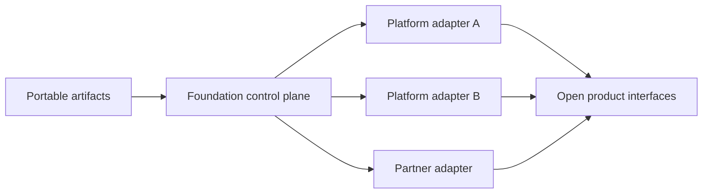

# Open Interoperability Standard

<small>Use when</small><strong>Designing an interface, artifact, exchange, or platform exit.</strong>

<small>Decision</small><strong>Can an independent implementation understand and use the boundary?</strong>

<small>Owner</small><strong>Architecture and interface owner.</strong>

<small>Output</small><strong>Profile, conformance result, exceptions, and exit evidence.</strong>

This standard defines how the data foundation remains open, reusable, and portable across domains, platforms, clouds, and partners.

Open does not mean public. Data, metadata, and interfaces remain protected by classification, identity, policy, and contractual controls. Open means that the architecture uses inspectable specifications, portable artifacts, and replaceable implementations.

## Design Rule

Every product must have a **portable control-plane representation** and at least one **open consumption interface**. Platform-native objects may be generated from these artifacts, but they must not be the only source of truth.

## Open Core Profile

| Concern | Required Open Baseline | Foundation Use |
| --- | --- | --- |
| Data contracts | [Open Data Contract Standard 3.1](https://bitol-io.github.io/open-data-contract-standard/latest/) | Canonical contract artifact, validation, and exchange. |
| Data products | [Open Data Product Standard 1.0](https://bitol.io/announcing-odps-v1-0-0-building-the-language-of-data-products/) | Portable product descriptor and product-port inventory. |
| Catalog exchange | [W3C DCAT 3](https://www.w3.org/TR/vocab-dcat-3/) | Federated discovery of datasets, distributions, and data services. |
| Batch lineage | [OpenLineage](https://openlineage.io/docs/next/) | Run, job, and dataset lineage events. |
| Provenance exchange | [W3C PROV-O](https://www.w3.org/TR/prov-o/) | Cross-organization provenance where RDF exchange is needed. |
| Service APIs | [OpenAPI](https://spec.openapis.org/oas/) | Machine-readable synchronous API contracts. |
| Event APIs | [AsyncAPI 3.0](https://www.asyncapi.com/docs/reference/specification/v3.0.0) and [CloudEvents](https://www.cncf.io/projects/cloudevents/) | Channel contracts and portable event envelopes. |
| Telemetry | [OpenTelemetry semantic conventions](https://opentelemetry.io/docs/specs/semconv/) and OTLP | Vendor-neutral traces, metrics, logs, and correlation. |
| Table catalog | [Apache Iceberg REST Catalog](https://iceberg.apache.org/rest-catalog-spec/) when Iceberg is used | Engine-neutral table discovery and catalog operations. |
| Bulk sharing | [Delta Sharing](https://docs.delta.io/delta-sharing/) when table sharing is required | Open, recipient-neutral large dataset sharing. |
| High-speed query | [Arrow Flight SQL](https://arrow.apache.org/docs/format/FlightSql.html) when needed | Portable, columnar SQL result transport. |
| Workload identity | OIDC/OAuth for users and APIs; [SPIFFE](https://spiffe.io/docs/latest/spiffe-specs/) where cross-platform workload identity is required | Federated authentication without platform-bound service identities. |
| Agent tools and context | [Model Context Protocol 2025-11-25](https://modelcontextprotocol.io/specification/2025-11-25/basic/index) when an agent interoperability adapter is required | Discover approved resources, prompts and tools without replacing service contracts. |
| Agent-to-agent | [A2A Protocol](https://a2a-protocol.org/latest/specification/) when independently operated agents must collaborate | Agent discovery, skills, durable tasks and artifacts. |

The baseline is a profile, not a requirement to deploy every listed technology. A selected interface must use its open specification and pass the applicable conformance tests.

## Canonical Identifiers

The same identifiers must survive export, import, telemetry, lineage, and platform migration:

| Identifier | Purpose |
| --- | --- |
| `data_product_id` | Stable identity of the product. |
| `contract_id` and `contract_version` | Exact contract in force. |
| `dataset_id` and `schema_version` | Product output and structure. |
| `source_id` | Originating source or upstream product. |
| `consumer_id` and `purpose_id` | Who uses the product and why. |
| `run_id` and `trace_id` | Runtime lineage and telemetry correlation. |

Identifiers are opaque, globally unique within the enterprise, immutable after publication, and never derived only from a vendor path.

## Extension Rules

1. Use the selected standard without changing its defined semantics.
2. Add enterprise metadata through the standard's extension mechanism.
3. Namespace extensions and publish their schema and owner.
4. Keep mandatory enterprise extensions small.
5. Preserve unknown extension fields during import and export.
6. Record the specification version and media type with every artifact.
7. Provide a migration rule before changing a canonical profile.

## Conformance Levels

| Level | Required Evidence |
| --- | --- |
| 1. Artifact portable | Contract and product descriptors validate against pinned schemas; metadata exports as DCAT; canonical identifiers survive round-trip export and import. |
| 2. Service interoperable | APIs or events validate against OpenAPI or AsyncAPI; CloudEvents is used for event envelopes; lineage and telemetry can be consumed by independent receivers. |
| 3. Ecosystem portable | Sharing works with an independent client; federated identity and revocation are tested; AI usage is traceable to product, contract, snapshot, identity, and purpose. |

Live products must meet Level 1. Shared platform services must meet Level 2. Products used across company or partner boundaries must meet Level 3 for the interfaces they expose.

## Conformance Tests

- Validate canonical artifacts against pinned public schemas.
- Export from one implementation and import into a clean reference implementation.
- Confirm semantic equivalence after contract and product round trips.
- Send lineage events to an independent OpenLineage-compatible endpoint.
- Send telemetry through OTLP to an independent collector.
- Validate API and event examples against their interface definitions.
- Read a shared table or query result with an independent client.
- Prove access expiry and revocation across the external interface.
- Trace an AI retrieval or feature request to product, contract, data snapshot, identity, purpose, and source lineage.

Record results with the [Interoperability Conformance Record](../delivery-templates/interoperability-conformance-template.md).

## Reuse Package

Each released profile must include:

- Pinned specification versions and compatibility policy.
- Canonical schemas plus enterprise extension schemas.
- Minimal valid examples and failure examples.
- Import, export, and conformance test fixtures.
- Adapter ownership and supported implementation matrix.
- Change log, deprecation notice, and migration guidance.

Profiles are versioned independently from platform releases. Breaking profile changes require a major version, impact analysis, migration period, and dual-read or dual-publish path where practical.

## AI Adapter Boundary

AI agents must consume governed products through the same policy and contract boundary as other consumers. Agent-specific adapters, including context or tool protocols, are optional edge adapters. They may expose approved product capabilities, but they must not become the product registry, policy authority, or only access path.

MCP and A2A adapters require the same authenticated identity, purpose policy, least privilege, approval, traceability and conformance testing as direct service APIs.

## Exception Rule

A proprietary interface is allowed only when it provides material value unavailable through the open profile. The decision record must include an open export path, adapter ownership, exit cost, review date, and tested migration route.
