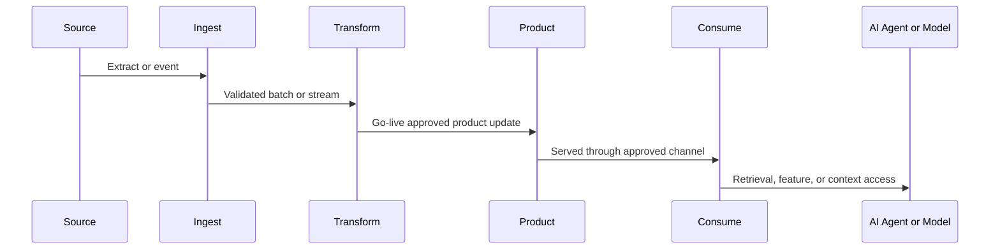

# OpenTelemetry Telemetry Standard

<small>Use when</small><strong>Instrumenting a service, product, workflow, or agent.</strong>

<small>Decision</small><strong>Which signals and identifiers make health actionable?</strong>

<small>Owner</small><strong>Telemetry owner and emitting service owner.</strong>

<small>Output</small><strong>Conformant, correlated, hygienic telemetry.</strong>

OpenTelemetry is the standard telemetry model for the data foundation. It must carry both system context and data product context.

Use published OpenTelemetry semantic conventions before defining enterprise attributes. The `data.*` attributes below form a versioned enterprise convention: each attribute must have an owner, stability level, cardinality guidance, data classification, and deprecation path.

## Required Attributes

| Attribute | Applies To | Description |
| --- | --- | --- |
| `data.product.id` | trace, metric, log, event | Stable data product identifier. |
| `data.product.version` | trace, metric, log, event | Product version. |
| `data.domain` | trace, metric, log, event | Business or data domain. |
| `data.contract.id` | trace, metric, event | Contract identifier. |
| `data.contract.version` | trace, metric, event | Contract version. |
| `data.semantic_context.id` | trace, log, event | Semantic context package identifier when context is served or used. |
| `data.semantic_context.version` | trace, log, event | Exact semantic context version used by the consumer, agent, or model. |
| `data.source.system` | trace, metric, event | Source system name. |
| `data.pipeline.id` | trace, metric, log | Pipeline or job identifier. |
| `data.pipeline.run_id` | trace, log, event | Runtime execution id. |
| `data.classification` | trace, metric, event | Sensitivity classification. |
| `data.consumer.id` | trace, metric, event | Consumer application, model, agent, or team. |
| `data.access.purpose` | trace, log, event | Approved usage purpose. |
| `enduser.id` or approved equivalent | trace, log | Named-user subject identifier where policy permits recording it. |
| `data.actor.id` | trace, log, event | Workload, application, service, or agent actor making the request. |
| `data.actor.type` | trace, log, event | Human, workload, delegated workload, agent, model, or external recipient. |
| `data.authz.decision_id` | trace, log, event | Correlation id for the service or data policy decision. |
| `data.entitlement.id` | trace, log, event | Entitlement used to authorize product access. |
| `data.quality.dimension` | metric, event | Completeness, validity, uniqueness, consistency, timeliness, or domain rule. |

## Agentic Correlation

Use applicable OpenTelemetry GenAI semantic conventions and add these stable enterprise bindings where no published equivalent exists:

| Binding | Purpose |
| --- | --- |
| Agent id and version | Identify the certified agent release. |
| Skill id and version | Identify the selected governed capability. |
| Conversation and task id | Correlate user interaction and durable execution. |
| Model profile | Identify enterprise routing policy without coupling to one provider. |
| Tool operation | Identify the typed foundation API action. |
| Policy decision and approval id | Prove authorization and human confirmation. |
| Product, contract and purpose | Connect the action to governed data context. |
| Outcome and cost | Measure success, latency, token use, tool use and spend. |

For AI consumption, use applicable OpenTelemetry GenAI attributes such as `gen_ai.data_source.id` and map the data source back to the canonical product and dataset identifiers. Do not duplicate a standard attribute with a differently named enterprise attribute.

## Core Metrics

| Metric | Description |
| --- | --- |
| `data_product_freshness_minutes` | Age of latest successful product update. |
| `data_product_quality_pass_rate` | Percentage of quality checks passing. |
| `data_product_records_processed_total` | Count of records processed by product or pipeline. |
| `data_product_invalid_records_total` | Count of invalid or quarantined records. |
| `data_product_consumer_requests_total` | Count of product access requests, queries, API calls, or retrieval calls. |
| `data_product_availability_slo` | Availability SLO state for product serving channel. |
| `data_contract_compatibility_failures_total` | Count of contract compatibility failures. |
| `data_ai_access_events_total` | Count of approved AI access events by purpose and consumer. |

## Trace Requirements

Traces should connect the full path from source to consumer:

## Telemetry Hygiene

- Do not put personal data or sensitive business values in trace names, metric labels, log messages, or event attributes.
- Prefer identifiers over values.
- Apply masking to diagnostic payloads.
- Restrict access to telemetry for sensitive products.
- Retain telemetry according to data classification and audit requirements.
- Export through OTLP and verify the signals with an independent OpenTelemetry collector.
- Emit runtime data lineage through OpenLineage; correlate it with traces using canonical run, job, dataset, and trace identifiers.

## Minimum Done Criteria

- Every production service and product port emits the required system and data product signals through OTLP-compatible paths.
- Required service, product, contract, run, actor, consumer, purpose, policy-decision, and trace identifiers correlate across applicable signals.
- End-to-end traces connect source receipt, product creation, product publication, consumption, sharing, and AI access where those stages apply.
- Product health views distinguish contract targets from measured freshness, quality, availability, usage, incidents, and cost.
- Telemetry loss, stale health, invalid attributes, exporter failure, and sensitive-payload leakage have tests, alerts, owners, and exercised recovery procedures.
- An independent OpenTelemetry collector accepts the exported signals without provider-specific translation of canonical identifiers.
